# Anima 直出参考图鉴

Anima 人物参考。**可以含画风 LoRA**（惊艳优先），但每条必须写清：底模、是否纯底模、LoRA 名称/权重/链接。`@画师` 是 prompt tag，不是 LoRA 文件。

下一批只扫新切片，用 `seen.json` 的 id 去重，不再重扒旧页。

## 怎么抄（短）

- **Aesthetic**：正向可以只写 `masterpiece, best quality, `（或不写质量词）；**不要用 `score_*`**，正负向都别带，容易把画面推向 slop。
- **Base**：可用 `masterpiece, best quality, score_7, safe, `；负向官方常用 `worst quality, low quality, score_1, score_2, score_3, artist name, blurry, jpeg artifacts, chromatic aberration`。
- **Turbo**：CFG **1**，步数 **8–12**，采样 `euler` + `simple` 即可。
- 画师 tag 必须带 **`@`**（如 `@shinkawa youji`）；tag 用空格不用下划线（`score_*` 例外）。
- 默认向：分辨率 512²–1536²；Aesthetic/Base 常用 `er_sde` / `simple`，30 步，CFG 4–6（Aesthetic 可到 3）。风景/厚涂可试调度 **`beta57`**。
- tag 顺序：`[质量/年份/safe] [1girl/1boy] [角色] [作品] [画师] [一般标签]`；可混自然语言。

## 底模 / LoRA 对照（先看这页）

共 **124** 条：**34** 纯底模，**90** 叠了画风 LoRA。`@画师` 是 prompt 里的训练 tag，不是 LoRA 文件。

### 叠了 LoRA（抄效果时底模和 LoRA 都要）

| 批 | 标题 | 底模 | LoRA | 来源 |
| --- | --- | --- | --- | --- |
| 03 | 水彩阶梯吉他少女 | `anima-base-v1.0` | UmeSky_AnimaV2 | [图](https://civitai.com/images/133891304) |
| 03 | 平涂小红帽与狼影 | `anima-base-v1.0` | Loika v1 | [图](https://civitai.com/images/133142985) |
| 03 | 日本画和服回眸 | `anima-aesthetic-v1.1` | A_classica_comfy:0.8 | [图](https://civitai.com/images/137551856) |
| 03 | 单色月神侧影 | `anima-base-v1.0` | WlopAnima | [图](https://civitai.com/images/132661863) |
| 03 | 半透明机械脊柱 | `anima-base-v1.0` | ArcaneViolet_mpt_64:1.15 | [图](https://civitai.com/images/131402031) |
| 03 | 网点铠甲与粉月 | `anima-base-v1.0` | ArcaneViolet_mpt_64:1.15 | [图](https://civitai.com/images/131402200) |
| 03 | 水彩斗笠剪影 | `anima-base-v1.0` | we_paint_anima_v1_0 | [图](https://civitai.com/images/136213733) |
| 04 | 水墨武士挥刀 | `anima-base-v1.0` | [A_classica_comfy:0.5; A_The-Look-Anima3-800:0.8; A_Fezat1:0.5](https://civitai.com/models/2641117) | [图](https://civitai.com/images/134244062) |
| 04 | 厚涂油画提灯人 | `anima-base-v1.0` | [ashima_v4:0.7](https://civitai.com/models/2701018) | [图](https://civitai.com/images/133951905) |
| 04 | 平涂持羊恶魔少女 | `anima-base-v1.0` | [pile_epoch_20:1.0](https://civitai.com/models/2702294?modelVersionId=3051927) | [图](https://civitai.com/images/134550289) |
| 04 | 故障碎裂蓝底少女 | `anima-base-v1.0` | [xiaoquandianer v1:1](https://civitai.com/models/2655668?modelVersionId=2981992) | [图](https://civitai.com/images/132173568) |
| 04 | Noct 高定轮廓光 | `anima-preview3-base` | [NoctAnimaV1](https://civitai.com/models/2570404?modelVersionId=2888105) | [图](https://civitai.com/images/129425125) |
| 05 | 工笔红伞艺伎背影 | `anima-base-v1.0` | [DagongrenBaozaiAnima:1](https://civitai.com/models/2178365?modelVersionId=2970799) | [图](https://civitai.com/images/132491058) |
| 05 | Haiz 自由女神与跪献机器人 | `anima-base-v1.0` | [Style_soph-HaizAI-ANIMA:1](https://civitai.com/models/2419327?modelVersionId=2951332) | [图](https://civitai.com/images/131258926) |
| 05 | p1ct01 花田举相机 | `anima-aesthetic-v1.0` | [p1ct01_v1_epoch20:1](https://civitai.com/models/2640938?modelVersionId=2965335) | [图](https://civitai.com/images/140112625) |
| 05 | Himmis 烟花拟人鹿 | `anima-base-v1.0` | [Himmis_v2:1](https://civitai.com/models/2749766?modelVersionId=3093321) | [图](https://civitai.com/images/135583080) |
| 06 | 网点漫画·搅拌机早餐 | `anima-preview2` | [anima_preview2_rdbt_finetuned_cfg_distilled_v0.23:1](https://civitai.com/models/2364703) | [图](https://civitai.com/images/126468970) |
| 06 | 印象派油画头像 Kuro | `anima-2.9b-preview-v1-int8-convrot` | [KiyamiKuro_ani_v2:1](https://civitai.com/models/2818914?modelVersionId=3182902) | [图](https://civitai.com/images/141344281) |
| 06 | Anima-3.8B 学兰赤发少女 | `anima-3.8b` | [kamigishi_akari-anima:1.0](https://civitai.com/models/2678447) | [图](https://civitai.com/images/140836817) |
| 06 | 限色 oekaki 阿卡多 | `anima-preview3-base` | [Anima Highres/Aesthetic Boost:1.0; Aesthetic Quality Modifiers - Masterpiece v5.0:1.0](https://civitai.com/models/2540444?modelVersionId=2855073) | [图](https://civitai.com/images/130290349) |
| 06 | 金绣屏风白发少女 | `anima-base-v1.0` | [anima-base-1-masterpiece-v51:1; gpt-image-2_anima-base1_v1-1:1; AnimaNSS4RE:1](https://civitai.com/models/2564225) | [图](https://civitai.com/images/137338268) |
| 06 | 哥特提灯伸手 | `anima-base-v1.0` | training_4768839-20260606010739081:1 | [图](https://civitai.com/images/133231698) |
| 06 | 厚涂蘑菇林小人 | `anima-preview2` | [@PLUV1UMGR4ND1S_Style:1](https://civitai.com/models/2587787) | [图](https://civitai.com/images/124112939) |
| 07 | 迷路鸟人快递员 | `anima-preview2` | [MeMaAni_P2_V1:0.3](https://civitai.com/models/2483826?modelVersionId=3142453) | [图](https://civitai.com/images/125373613) |
| 07 | 网点蒸汽波女人与猫 | `anima-base-v1.0` | [purple_tarot-step00003000:1](https://civitai.com/models/2678072) | [图](https://civitai.com/images/134155766) |
| 11 | 像素风橙发女巫持药瓶 | `anima-base-v1.0` | [ElinSprite_AnimaBaseV10_byKonan:1](https://civitai.com/models/2565918?modelVersionId=2948181) | [图](https://civitai.com/images/130807040) |
| 11 | 低模向日葵田黑肤少女 | `anima-base-v1.0` | [LowPolyPSX_AnimaBaseV10_byKonan:1](https://civitai.com/models/2485743?modelVersionId=2948208) | [图](https://civitai.com/images/132731147) |
| 11 | 暗色漫画面阳台与烟 | `anima-base-v1.0` | [Han-Black v1:0.7; anima-highres-aesthetic-boost:0.7](https://civitai.com/models/2221187?modelVersionId=2957460) | [图](https://civitai.com/images/131157213) |
| 11 | 霓虹诺尔墨镜精灵屋顶 | `anima-preview3-base` | [neon_noir_synthwave_000030_anima; dark_art_style_Anima-step00002750](https://civitai.com/models/2623688?modelVersionId=2945680) | [图](https://civitai.com/images/130712850) |
| 11 | 西漫粗线蜘蛛格温夜城 | `anima-base-v1.0` | [gwencomics:1](https://civitai.com/models/2705279?modelVersionId=3038195) | [图](https://civitai.com/images/133927779) |
| 11 | 少女漫软笔红皮鬼娘持巨玫 | `anima-base-v1.0` | [Aesthetic Quality Modifiers-anima-preview-3](https://civitai.com/models/929497?modelVersionId=2905490) | [图](https://civitai.com/images/130799632) |
| 11 | @sw33t 白底青红点缀单色半机械 | `anima-base-v1.0` | [anima-base-1-masterpiece-v51; gpt-image-2_anima-base1_v1-1; AnimaNSS4RE](https://civitai.com/models/2564225?modelVersionId=2998634) | [图](https://civitai.com/images/137338267) |
| 11 | 双格猫娘钞票与金枪鱼 | `anima-base-v1.0` | [Loika v1:0.6; Han-Black v1:0.5; shuangbatian v1-000007:0.6; midninght_lighting:0.8](https://civitai.com/models/2221187?modelVersionId=2957460) | [图](https://civitai.com/images/133703016) |
| 12 | LookDaal 选色蓝眼软单色肖像 | `anima-preview3-base` | [The-Look-Anima3-800:1](https://civitai.com/models/1882546?modelVersionId=2997490) | [图](https://civitai.com/images/132562691) |
| 12 | @sw33t 瓷娃娃红玫瑰洛丽塔 | `anima-base-v1.0` | [anima-base-1-masterpiece-v51; gpt-image-2_anima-base1_v1-1; AnimaNSS4RE](https://civitai.com/models/2564225?modelVersionId=2998634) | [图](https://civitai.com/images/136554510) |
| 12 | 双重曝光霓虹瘟疫医生 | `anima-base-v1.0` | [Double_Exposure_Anima_3_epoch_8:1](https://civitai.com/models/2681124?modelVersionId=3012122) | [图](https://civitai.com/images/133095718) |
| 12 | lofi 蒸汽波窗边黑猫 | `anima-base-v1.0` | [lofi_vibe_anima](https://civitai.com/models/2648766?modelVersionId=2974171) | [图](https://civitai.com/images/131721274) |
| 12 | @gpt-image-2 大气几何城市与猫 | `anima-base-v1.0` | [gpt-image-2_anima-base1_v1-1; atomsphere_style_v1.2-anima-e20](https://civitai.com/models/2564225?modelVersionId=2998634) | [图](https://civitai.com/images/135518845) |
| 12 | 蓝调单色星空荡秋千 | `anima-preview2` | [【Anima】Beudelb_epoch36:1.0; 【Anima】4x1Style_Ayori:0.3; 【Anima】kazutake_epoch70:0.5](https://civitai.com/models/2438038?modelVersionId=2741275) | [图](https://civitai.com/images/128655261) |
| 12 | Aesthetic v1.1 水中黄瞳倒影 | `anima-aesthetic-v1.1` | [AnimaMythSmo0thL1nes:1](https://civitai.com/models/599757?modelVersionId=3226360) | [图](https://civitai.com/images/139658658) |

| 08 | 海滩薄纱金饰 Mature | `anima-base-v1.0` | [rimixao5050:1](https://civitai.com/models/996220?modelVersionId=3011920) | [图](https://civitai.com/images/133089679) |
| 08 | Ashley 比基尼描线 | `anima-preview2` | [AshleyGravesPreview2_byKonan:1](https://civitai.com/models/2480629?modelVersionId=2788968) | [图](https://civitai.com/images/124812229) |
| 08 | Jester 舞娘金绣 | `anima-base-v1.0` | [@pxpcxrn-v1-animabase1-ty_lee:1.0](https://civitai.com/models/2745659?modelVersionId=3088308) | [图](https://civitai.com/images/135435796) |
| 08 | 室内冰棍热浪 | `anima-base-v1.0` | [eatsleepstyle-000014:1](https://civitai.com/models/2687472?modelVersionId=3184829) | [图](https://civitai.com/images/138341117) |
| 08 | 于贝尔水下 Shexyo | `anima-preview3-base` | [shexyo-guy90-Anima-Lorav1:1.0](https://civitai.com/models/2690961?modelVersionId=3021452) | [图](https://civitai.com/images/133405040) |
| 08 | 赫萝酒馆烛光 | `anima-aesthetic-v1.1` | [iterationiskey-silvana-smoll:1.0](https://civitai.com/models/2832675?modelVersionId=3196596) | [图](https://civitai.com/images/138703054) |
| 08 | 办公室裸背打字 | `anima-base-v1.0` | [rimixao5050:1](https://civitai.com/models/996220?modelVersionId=3011920) | [图](https://civitai.com/images/133090213) |
| 09 | 部落营火上身裸 | `anima-base-v1.0` | [rimixao5050:1](https://civitai.com/models/996220?modelVersionId=3011920) | [图](https://civitai.com/images/133089862) |
| 09 | 偷摸手活 Hintobento | `anima-base-v1.0` | [anima-turbo-lora-v0.2:1; Hintobento_Anima:1](https://civitai.com/models/2560840?modelVersionId=2979642) | [图](https://civitai.com/images/133480891) |
| 09 | 倒吊深喉 NTRMix | `anima-base-v1.0` | [ntrmix_style_anima_b1_v1:1](https://civitai.com/models/2393785?modelVersionId=2968967) | [图](https://civitai.com/images/130979319) |
| 09 | 稻荷巫女涉水 | `anima-preview3-base` | [AnimaMythD4rkL1nes:1](https://civitai.com/models/599757?modelVersionId=2918615) | [图](https://civitai.com/images/129621821) |
| 09 | 草地双人口交 Turbo | `anima-turbo-v1.1` | [anima-base-1-masterpiece-v51:1; Anima_NIJI_SWEET_SPOT_v5:0.4](https://civitai.com/models/929497?modelVersionId=2961717) | [图](https://civitai.com/images/141335807) |
| 09 | 芙莉莲池塘叠胸 | `anima-base-v1.0` | [gpt-image-2_anima-base1_v1:0.95; dark_art_style_Anima-step00002750:0.55](https://civitai.com/models/2564225?modelVersionId=2946878) | [图](https://civitai.com/images/135644408) |
| 09 | MoriiMee 黑丝内衣 | `anima-preview2` | [MoriiMee_AnimaPreview2_byKonan:1](https://civitai.com/models/2485109?modelVersionId=2793997) | [图](https://civitai.com/images/125008493) |
| 10 | 武士裸背拔刀 | `anima-base-v1.0` | [rimixao5050:1](https://civitai.com/models/996220?modelVersionId=3011920) | [图](https://civitai.com/images/133089941) |
| 10 | 芙莉莲黑丝后倾 | `anima-preview2` | [MeMaAni_P2_V1:1](https://civitai.com/models/2483826?modelVersionId=3142453) | [图](https://civitai.com/images/124955795) |
| 10 | 达克妮丝温泉 | `anima-base-v1.0` | [Aesthetic Quality Modifiers-anima-preview-3](https://civitai.com/models/929497?modelVersionId=2905490) | [图](https://civitai.com/images/130803769) |
| 10 | Meion 猫耳泳池霓虹 | `anima-base-v1.0` | [Meion_anima_style_2-000034:1.0](https://civitai.com/models/2533943?modelVersionId=3011314) | [图](https://civitai.com/images/133065456) |
| 10 | 水彩非人成熟女 | `anima-base-v1.0` | [watercolor_v1.1_base_step1250:0.5](https://civitai.com/models/2724298?modelVersionId=3085514) | [图](https://civitai.com/images/140493432) |
| 10 | 阿努比斯女祭司 | `anima-base-v1.0` | [AnubisCitronOC_ANIMAv1_v1:1.0](https://civitai.com/models/162089?modelVersionId=3229852) | [图](https://civitai.com/images/139736000) |
| 10 | Chel 丛林回眸 | `anima-preview2` | [Chel_AnimaPreview2_byKonan:1](https://civitai.com/models/2478961?modelVersionId=2787142) | [图](https://civitai.com/images/124740278) |
| 10 | SamDoesArts 羊角睡衣 | `anima-preview2` | [Samdoesarts_AnimaPreview2_byKonan:1](https://civitai.com/models/2490561?modelVersionId=2799892) | [图](https://civitai.com/images/125242086) |

### 纯底模但 prompt 带 `@画师`（不是 LoRA）

| 批 | 标题 | 底模 | 画师 tag |
| --- | --- | --- | --- |
| 01 | 初音重音·神川样式 | `anima-base-v1.0` | @shinkawa youji |
| 04 | 鸟山明风武斗少女 | `anima-2.9b-preview-v1` | @artbooktoriyama, @toriyama akira |
| 04 | 浮世绘浪边和服 | `anima-2.9b-v1.0` | @Hokusai |
| 04 | 吉卜力田园提篮少女 | `anima-2.9b-v1.0` | @Studio Ghibli |
| 04 | 胶片时尚粉羽卧姿 | `anima-preview3-base` | @junbuug, @bbybluemochi, @sainttufa, @neytirix |
| 04 | 花札卡面双人骑猪 | `anima-2.9b-v1.0` | @auko |
| 04 | 四格漫白底双手叉腰 | `anima-2.9b-preview-v1-int8-convrot` | @poco, @aoi tori |
| 04 | 魔理沙黑底星光 | `anima-base-v1.0` | @quasarcake, @sumiyao, @senapops, @kanzarin |
| 05 | esuthio 天使持花 | `anima-2.9b-preview-v1` | @esuthio |
| 05 | honnryou 教室逆光少年 | `anima-2.9b-preview-v1` | @honnryou hanaru |
| 05 | 漫画气泡黑猫吃黄瓜 | `anima-preview3-base` | @karasu raven, @kaamin |
| 06 | 铃兰三格赛车漫画页 | `anima-preview2` | @waonaolmao |
| 06 | 哥特洛丽塔色差网点 | `anima-2.9b-preview-v1-int8-convrot` | @koi (koisan), @neoki ohae |
| 07 | 3.8B Sparkle 抱自己Q版 | `anima-3.8b-base` | @gpt-image-2 |
| 07 | memuro Q版雷电将军平底锅 | `anima-2.9b-v1.0` | @memuro |
| 07 | luozhou pile 女仆初音 | `anima-2.9b-preview-v1` | @luozhou pile |
| 07 | frost fog 双人牵手 chibi | `anima-2.9b-v1.0` | @frost fog |

| 08 | 刷手机无表情做爱 | `anima-base-v1.0` | @dishwasher1910, @nixeu |
| 08 | 赫萝酒馆烛光 | `anima-aesthetic-v1.1` | @silvana, @IterL1nes |
| 08 | Jester 舞娘金绣 | `anima-base-v1.0` | @pxpcxrn |
| 08 | 室内冰棍热浪 | `anima-base-v1.0` | @eatsleepstyle |

## 批次索引

| 批次 | 日期 | 条数 | 切片 |
| --- | --- | --- | --- |
| 01 | 2026-09-03 | 12 | 官方 Civitai 卡面 showcase（Aesthetic v1.1 / Turbo v1.1 / Aesthetic v1.0 / Turbo v1.0 / Base v1.0）；prompt 均从 PNG ComfyUI workflow 抽出 |
| 02 | 2026-09-03 | 12 | 精美二次元人物：官方卡面剩余角色（Aesthetic/Turbo/Base）；不含风景/纯机甲/ye-pop |
| 03 | 2026-09-03 | 11 | 画风差异（人物）：官方 leftover 风格轴 + 用户 Anima UNET 介质/画师 tag |
| 04 | 2026-09-03 | 12 | 画风差异续：水墨/油画厚涂/@pile/鸟山明/浮世绘/吉卜力/故障碎裂/胶片时尚/花札/四格漫/@Noct/绘本轮廓光 |
| 05 | 2026-09-03 | 12 | 画风差异续二：截图/工笔/水墨剪影/ligne claire/胶片剧照/@esuthio/@haiz_ai/official art/@himmis/@honnryou/漫画气泡/仙侠 |
| 06 | 2026-09-03 | 9 | 画风目录缺口：漫画分镜/网点/印象派脸/3.8B/限色oekaki/金绣/哥特/水粉/哥特洛丽塔 |
| 07 | 2026-09-03 | 8 | 新画风轴：webtoon/单chibi/riso蒸汽波/3.8B@gpt-image-2/@memuro/kemono印象派/@luozhou pile/@frost fog |
| 08 | 2026-09-03 | 10 | **成人向 / NSFW 试目录**（与 01–07 正常向分开）：薄纱金饰/素子紧身衣/水墨纹身裸/比基尼描线/舞娘/居家暗示/明示 1boy；底模仍是 Anima UNET |
| 09 | 2026-09-04 | 9 | **成人向 / NSFW 试目录续**：衣着性交纯底/部族营火 Ri-mix/Hintobento 手活/NTRMix/Myth 线描巫女/Turbo 口交/芙莉莲池塘/MoriiMee/血祭魔女 |
| 10 | 2026-09-04 | 9 | **成人向 / NSFW 试目录续二**：武士裸背/MeMaAni 芙莉莲/达克妮丝温泉/蜜丝菈/Meion 霓虹/水彩成熟/阿努比斯/Chel/SamDoesArts |

## Batch 01

来源：[Civitai Anima 2458426](https://civitai.com/models/2458426/anima) · [Hugging Face circlestone-labs/Anima](https://huggingface.co/circlestone-labs/Anima)

列对应：图片 / 底模 / prompt / 画师tag / LoRA。

### 地狱单丁·阿卡多

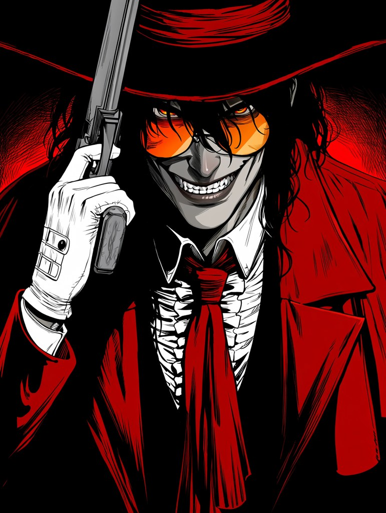

- **底模**：`anima-aesthetic-v1.1`
- **画师 tag**：（无）
- **LoRA**：（无）
- **采样**：er_sde / simple · steps 30 · CFG 4.0 · 976x1296
- **热度**：315 likes / 101 hearts
- **来源**：[civitai:136614294](https://civitai.com/images/136614294)
- **为何收录**：官方 Aesthetic v1.1 男性角色直出：黑红配色、墨镜与枪支道具齐全，适合对照 1boy/male focus。

**prompt**

```
masterpiece, best quality, safe, 1boy, alucard \(hellsing\), hellsing, male focus, white dress shirt, overcoat, black hat, black hair, glasses, orange tinted eyewear, evil smile, teeth, black theme, red theme, pale skin, vampire, white gloves, holding gun, handgun
```

**negative**

```
worst quality, low quality, artist name, blurry, jpeg artifacts, chromatic aberration
```

### 橙衣短发少女（自然语言）

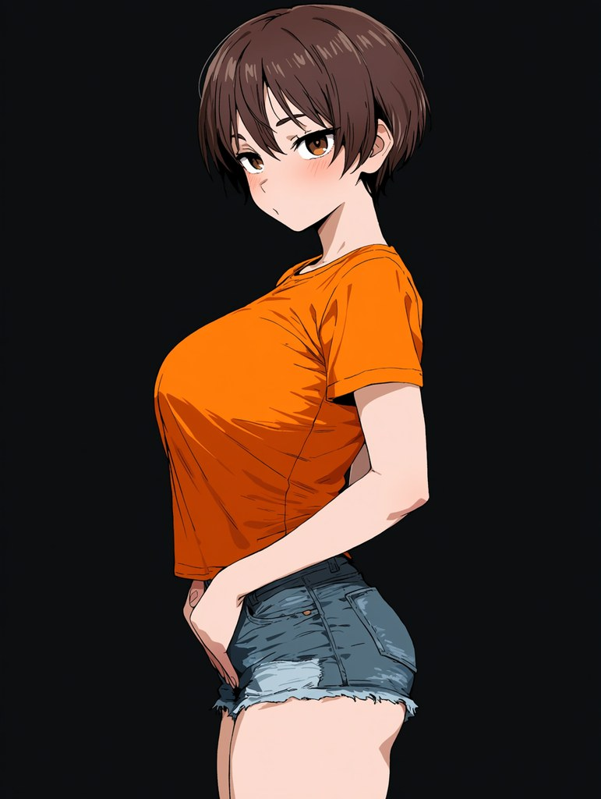

- **底模**：`anima-aesthetic-v1.1`
- **画师 tag**：（无）
- **LoRA**：（无）
- **采样**：er_sde / simple · steps 30 · CFG 4.0 · 976x1296
- **热度**：229 likes / 94 hearts
- **来源**：[civitai:136614290](https://civitai.com/images/136614290)
- **为何收录**：官方混用自然语言+tag：简单黑底半身，示范短 prompt 也能稳住身材比例与侧身构图。

**prompt**

```
masterpiece, best quality, safe. Anime girl with short brown hair, wearing an orange t-shirt and denim shorts, standing against a simple black background. from side, blush, looking at viewer
```

**negative**

```
worst quality, low quality, artist name, blurry, jpeg artifacts, chromatic aberration
```

### 森林河流风景

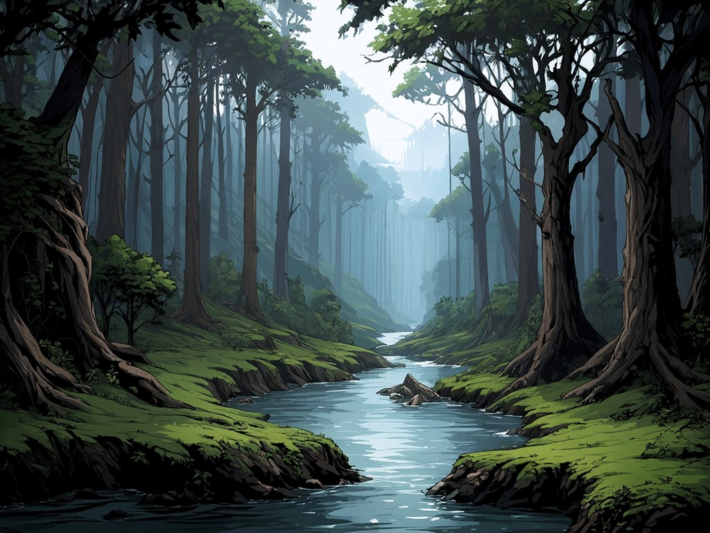

- **底模**：`anima-aesthetic-v1.1`
- **画师 tag**：（无）
- **LoRA**：（无）
- **采样**：er_sde / beta57 · steps 30 · CFG 6.0 · 1296x976
- **热度**：190 likes / 62 hearts
- **来源**：[civitai:136614296](https://civitai.com/images/136614296)
- **为何收录**：无人物风景；CFG 6 + beta57，对照官方说明里画家质感调度。

**prompt**

```
masterpiece, best quality, safe, no humans, landscape, nature, fantasy, river, forest
```

**negative**

```
worst quality, low quality, artist name, blurry, jpeg artifacts, chromatic aberration
```

### 山风夜祭全景

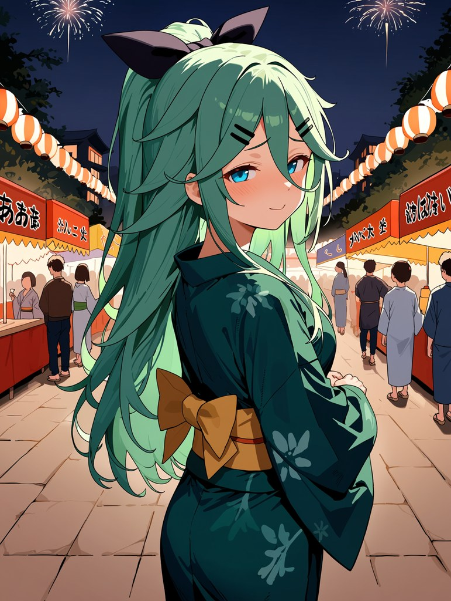

- **底模**：`anima-aesthetic-v1.1`
- **画师 tag**：（无）
- **LoRA**：（无）
- **采样**：er_sde / simple · steps 30 · CFG 4.0 · 976x1296
- **热度**：177 likes / 63 hearts
- **来源**：[civitai:136614293](https://civitai.com/images/136614293)
- **为何收录**：户外夜景+烟火+人群背景的全身立绘，检验角色与复杂场景同框。

**prompt**

```
masterpiece, best quality, safe, 1girl, yamakaze \(kancolle\), kantai collection, green hair, hairclip, outdoors, festival, night, buildings, tree, lanterns, night sky, fireworks, standing, crowd, people, kimono, looking at viewer, smile
```

**negative**

```
worst quality, low quality, artist name, blurry, jpeg artifacts, chromatic aberration
```

### RX-78-2 高达持盾

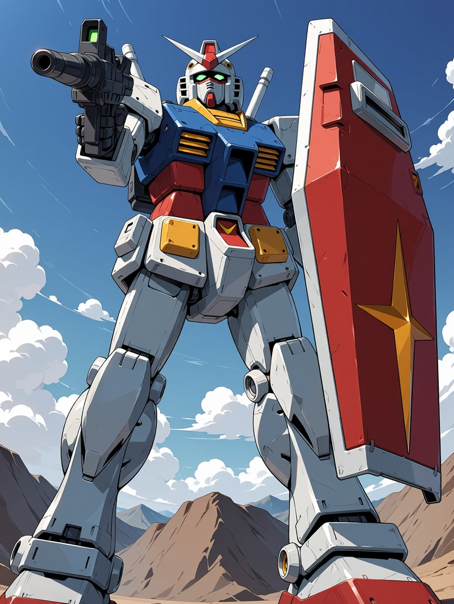

- **底模**：`anima-turbo-v1.1`
- **画师 tag**：（无）
- **LoRA**：（无）
- **采样**：euler / simple · steps 8 · CFG 1.0 · 976x1296
- **热度**：615 likes / 135 hearts
- **来源**：[civitai:140742447](https://civitai.com/images/140742447)
- **为何收录**：Turbo v1.1、CFG1/8步机甲全身，示范 no humans + 自然语言补动作。

**prompt**

```
masterpiece, best quality, safe, rx-78-2 gundam, gundam, no humans, outdoors, standing, mecha, mobile suit, holding gun, holding shield, detailed background, sky, clouds, mountain in the background, full body. The Gundam is holding a shield in front of it, aiming the gun forward from behind the shield.
```

**negative**

```
worst quality, low quality, artist name, blurry, jpeg artifacts, chromatic aberration
```

### 钢炼两兄弟对峙

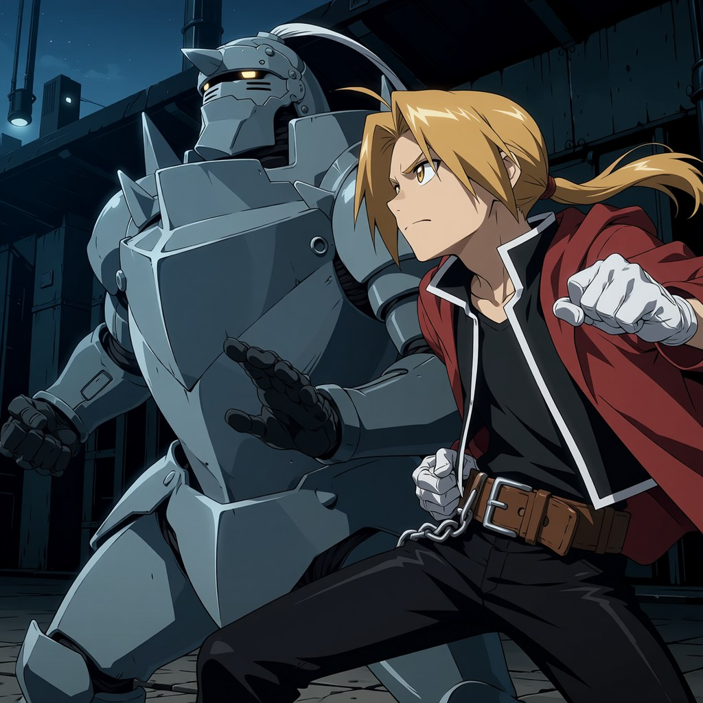

- **底模**：`anima-turbo-v1.1`
- **画师 tag**：（无）
- **LoRA**：（无）
- **采样**：euler / simple · steps 8 · CFG 1.0 · 1120x1120
- **热度**：297 likes / 58 hearts
- **来源**：[civitai:140742449](https://civitai.com/images/140742449)
- **为何收录**：2boys 动态姿势与夜景工业背景；阿尔全身铠甲结构清楚。

**prompt**

```
masterpiece, best quality, 2boys, edward elric, alphonse elric, armor, blonde hair, ponytail, black pants, black shirt, red jacket, single mechanical arm, dynamic pose, fighting stance, outdoors, night, industrial area
```

**negative**

```
worst quality, low quality, artist name, blurry, jpeg artifacts, chromatic aberration
```

### ye-pop 巨树蘑菇林

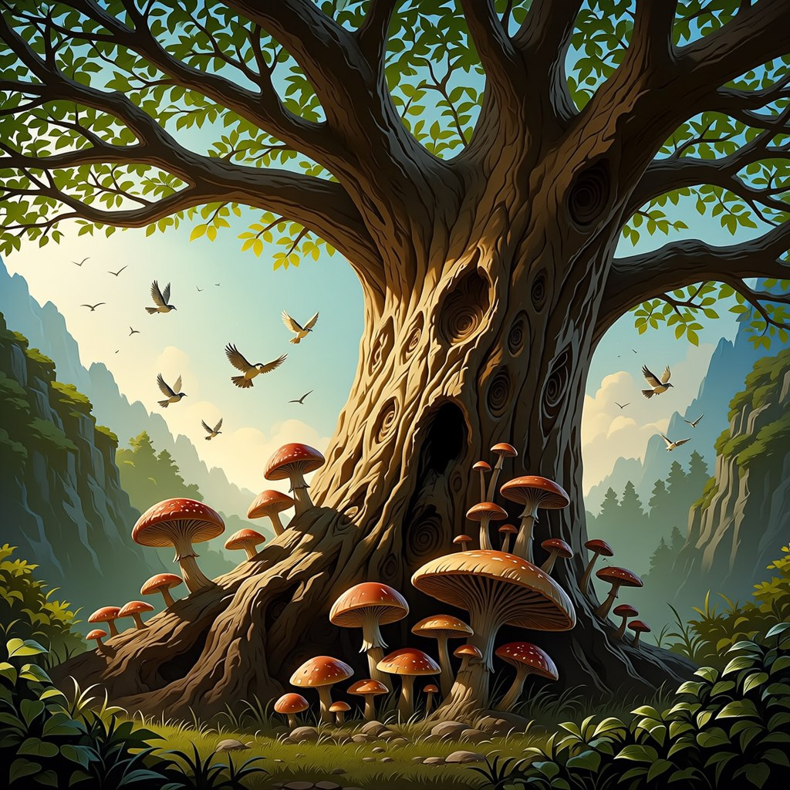

- **底模**：`anima-turbo-v1.1`
- **画师 tag**：（无）
- **LoRA**：（无）
- **采样**：euler / simple · steps 8 · CFG 1.0 · 1120x1120
- **热度**：210 likes / 40 hearts
- **来源**：[civitai:140742454](https://civitai.com/images/140742454)
- **为何收录**：官方 ye-pop 数据集标签示例：首行 ye-pop + 英文描述，非二次元插画也能直出。

**prompt**

```
ye-pop
Digital fantasy artwork depicting a massive, gnarled tree with sprawling branches and mushrooms of varying sizes. Birds and small insects fly among the mushrooms, which rise from the tree's base. Sunlight filters through dense green foliage, creating a magical, forest-like atmosphere. The background includes misty mountains.
```

**negative**

```
worst quality, low quality, artist name, blurry, jpeg artifacts, chromatic aberration
```

### 初音滑板半管

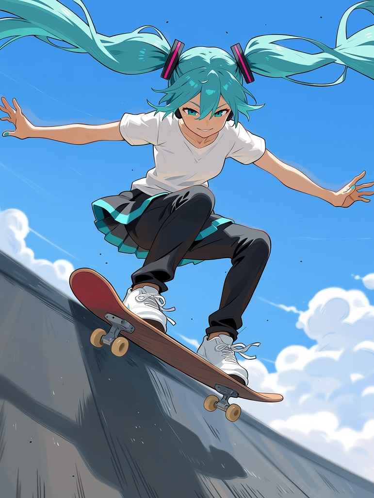

- **底模**：`anima-turbo-v1.0`
- **画师 tag**：（无）
- **LoRA**：（无）
- **采样**：euler / simple · steps 12 · CFG 1.0 · 976x1296
- **热度**：303 likes / 109 hearts
- **来源**：[civitai:136045878](https://civitai.com/images/136045878)
- **为何收录**：Turbo v1.0 纯自然语言动作戏：滑板+半管+蓝天，适合对照动作透视。

**prompt**

```
masterpiece, best quality, safe. Hatsune Miku skateboarding on a halfpipe. Blue sky and clouds in the background.
```

**negative**

```
worst quality, low quality, score_1, score_2, score_3, artist name, blurry, jpeg artifacts, chromatic aberration
```

### 善逸拔刀室内

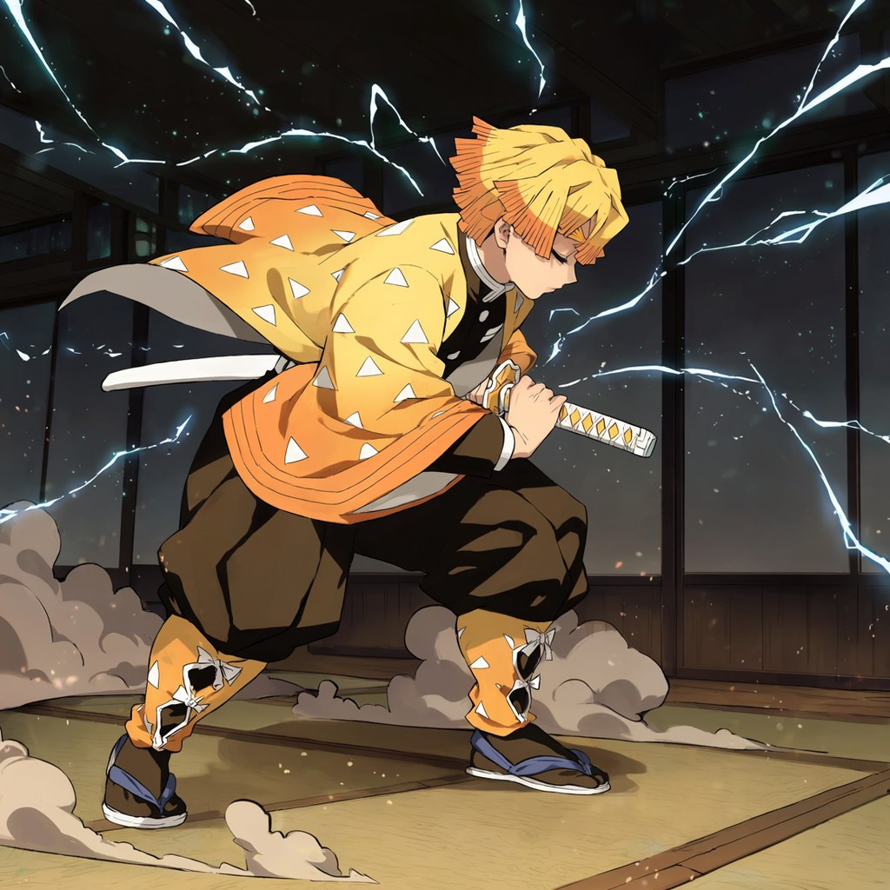

- **底模**：`anima-aesthetic-v1.0`
- **画师 tag**：（无）
- **LoRA**：（无）
- **采样**：er_sde / simple · steps 30 · CFG 3.0 · 1120x1120
- **热度**：149 likes / 35 hearts
- **来源**：[civitai:136045464](https://civitai.com/images/136045464)
- **为何收录**：Aesthetic v1.0 男性全身、室内侧身战斗姿势，CFG 3（官方称 Aesthetic 可更低 CFG）。

**prompt**

```
masterpiece, best quality, safe, 1boy, agatsuma zenitsu, kimetsu no yaiba, solo, standing, indoors, baggy pants, haori, japanese clothes, blonde hair, demon slayer uniform, katana, sandals, holding sword, electricity, closed eyes, fighting stance, scabbard, unsheathing, dark, light particles, dust, leaning forward, from side
```

**negative**

```
worst quality, low quality, score_1, score_2, score_3, artist name, blurry, jpeg artifacts, chromatic aberration
```

### 初音重音·神川样式

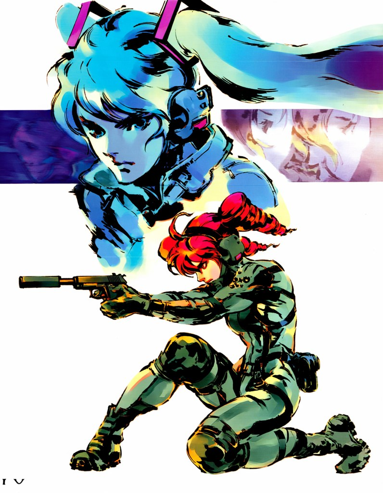

- **底模**：`anima-base-v1.0`
- **画师 tag**：`@shinkawa youji`
- **LoRA**：（无）
- **采样**：er_sde / beta57 · steps 30 · CFG 5.0 · 1120x1440
- **热度**：370 likes / 188 hearts / 1 comments
- **来源**：[civitai:130697920](https://civitai.com/images/130697920)
- **为何收录**：Base + 画师 @shinkawa youji + Metal Gear 交叉，双人构图与官方艺术风。

**prompt**

```
official art, 2girls, hatsune miku, kasane teto, metal gear \(series\), @shinkawa youji, twintails, blue hair, drill hair, red hair, fighting stance, kneeling, aiming, handgun, holding gun, suppressor, sneaking suit, profile, projected inset
```

**negative**

```
worst quality, low quality, score_1, score_2, score_3, artist name
```

### 夏亚与扎古同框

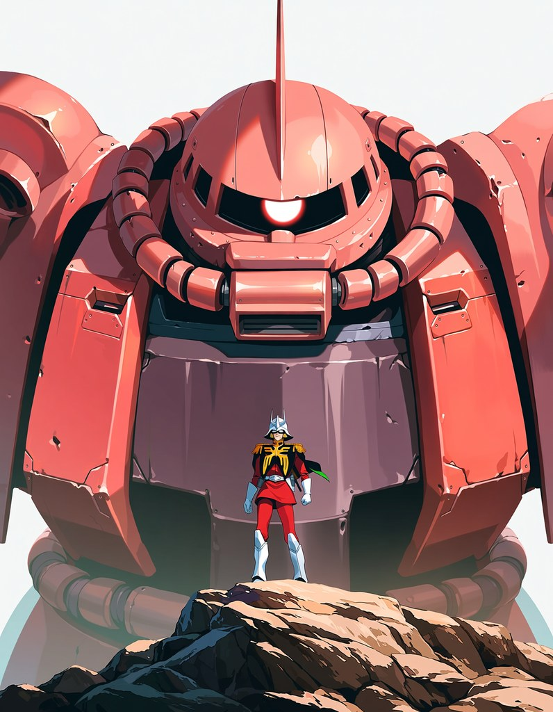

- **底模**：`anima-base-v1.0`
- **画师 tag**：（无）
- **LoRA**：（无）
- **采样**：er_sde / simple · steps 30 · CFG 5.0 · 1120x1440
- **热度**：258 likes / 109 hearts
- **来源**：[civitai:130697924](https://civitai.com/images/130697924)
- **为何收录**：人物+机体同框（人站机甲前），Base 默认 sampler 对照。

**prompt**

```
masterpiece, best quality, score_7, safe, 1boy, char aznable, zaku ii s char custom, mecha, mobile suit, robot, one-eyed mecha, helmet, jacket, military uniform, mask, zeon, outdoors, standing, rocky cliff. Char is standing in front of the mecha.
```

**negative**

```
worst quality, low quality, score_1, score_2, score_3, artist name
```

### 水彩河边风景

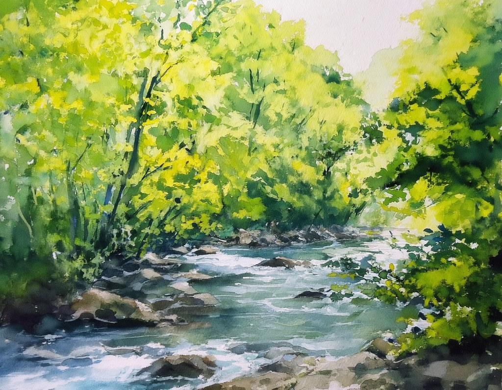

- **底模**：`anima-base-v1.0`
- **画师 tag**：（无）
- **LoRA**：（无）
- **采样**：euler / beta57 · steps 30 · CFG 5.0 · 1440x1120
- **热度**：158 likes / 71 hearts
- **来源**：[civitai:130697929](https://civitai.com/images/130697929)
- **为何收录**：Base 用 traditional media / watercolor 介质 tag + euler/beta57，风景偏手绘。

**prompt**

```
traditional media, watercolor \(medium\), painting \(medium\), no humans, landscape, scenery, outdoors, trees, river, nature
```

**negative**

```
worst quality, low quality, score_1, score_2, score_3, artist name
```

## Batch 02

主题：**精美二次元人物**（风景 / 纯机甲 / ye-pop 非二次元 / 水彩风景本轮不收）。

来源：官方 Civitai 卡面剩余角色图（model 2458426 各 version 未进 batch 01 的条目）。prompt 均从 PNG ComfyUI workflow 抽出。

列对应：图片 / 底模 / prompt / 画师tag / LoRA。

### 尤菲·克萨莱吉

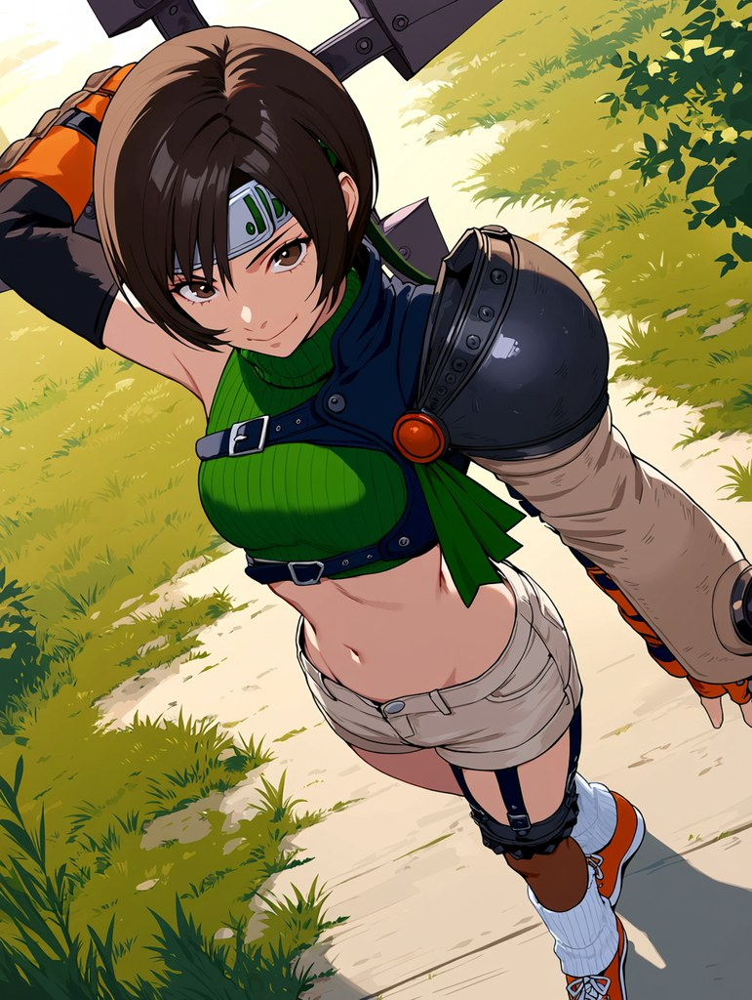

- **底模**：`anima-aesthetic-v1.1`
- **画师 tag**：（无）
- **LoRA**：（无）
- **采样**：er_sde / beta57 · steps 30 · CFG 4.0 · 976x1296
- **热度**：268 likes / 127 hearts / 2 comments
- **来源**：[civitai:136614297](https://civitai.com/images/136614297)
- **为何收录**：官方 Aesthetic v1.1 动态全身：绿毛衣露腰+手里剑，户外站姿示范角色识别与动作。

**prompt**

```
masterpiece, best quality, safe, 1girl, yuffie kisaragi, final fantasy, final fantasy vii, solo, standing, outdoors, brown hair, short hair, green turtleneck sweater, cropped sweater, crop top, shorts, socks, single shoulder pad, midriff, shuriken, holding weapon, dynamic pose
```

**negative**

```
worst quality, low quality, artist name, blurry, jpeg artifacts, chromatic aberration
```

### 缠流子坐长椅

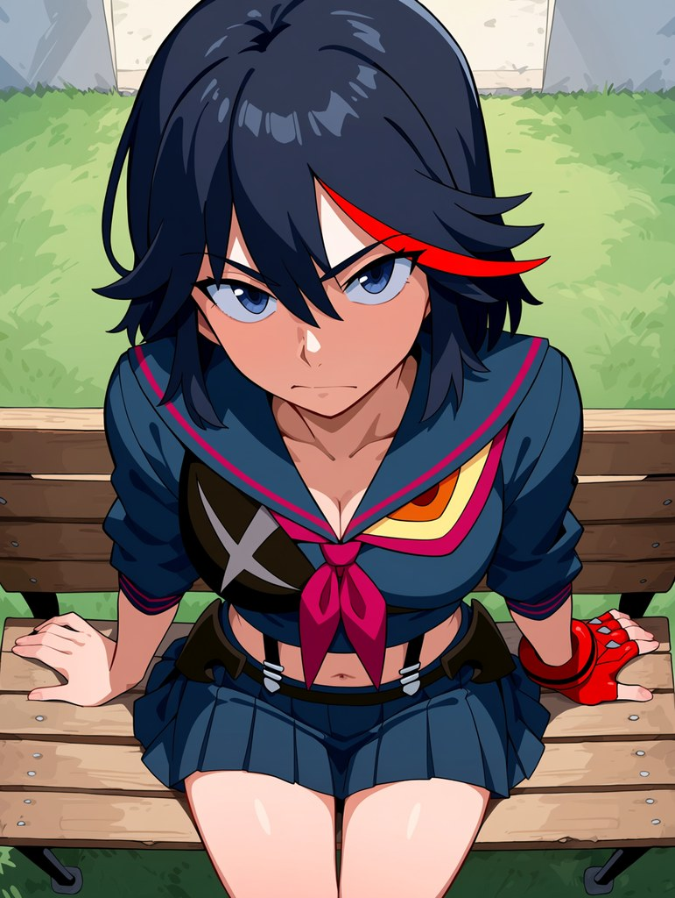

- **底模**：`anima-aesthetic-v1.1`
- **画师 tag**：（无）
- **LoRA**：（无）
- **采样**：er_sde / simple · steps 30 · CFG 4.0 · 976x1296
- **热度**：160 likes / 74 hearts
- **来源**：[civitai:136614291](https://civitai.com/images/136614291)
- **为何收录**：Aesthetic v1.1 学兰坐姿半身偏全身：蓝红配色与露腰，户外长椅对视。

**prompt**

```
masterpiece, best quality, safe, 1girl, matoi ryuuko, kill la kill, blue hair, multicolored hair, blue shirt, blue skirt, serafuku, red neckerchief, midriff, red gloves, outdoors, bench, sitting, looking at viewer
```

**negative**

```
worst quality, low quality, artist name, blurry, jpeg artifacts, chromatic aberration
```

### 紫发被窝少女

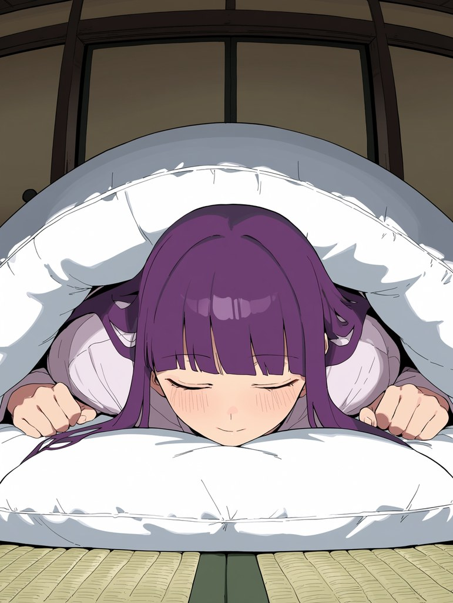

- **底模**：`anima-aesthetic-v1.1`
- **画师 tag**：（无）
- **LoRA**：（无）
- **采样**：er_sde / simple · steps 30 · CFG 4.0 · 976x1296
- **热度**：202 likes / 63 hearts
- **来源**：[civitai:136614292](https://civitai.com/images/136614292)
- **为何收录**：Aesthetic v1.1 自然语言室内躺姿：从下往上、日式房间+被子，构图与 batch01 站姿拉开。

**prompt**

```
masterpiece, best quality, safe. An anime girl with purple hair is lying on her stomach on a futon, rolled up in a blanket. The background is a Japanese-style room. from below, closed eyes, blush, relaxed, smile
```

**negative**

```
worst quality, low quality, artist name, blurry, jpeg artifacts, chromatic aberration
```

### 日奈礼服侧身

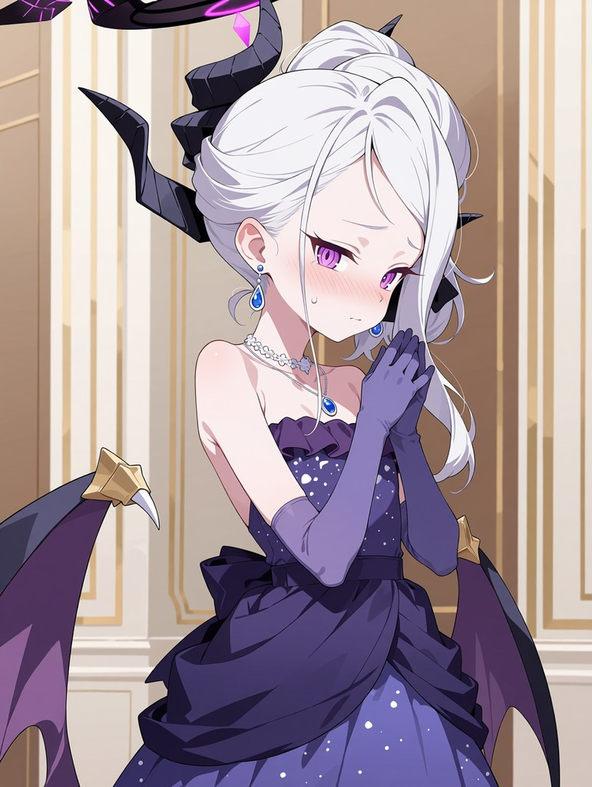

- **底模**：`anima-turbo-v1.1`
- **画师 tag**：（无）
- **LoRA**：（无）
- **采样**：euler / simple · steps 8 · CFG 1.0 · 976x1296
- **热度**：0 likes / 0 hearts
- **来源**：[civitai:140742443](https://civitai.com/images/140742443)
- **为何收录**：Turbo v1.1 礼服室内侧身：角、光环、恶魔翼与害羞表情，CFG1/8步角色直出。

**prompt**

```
masterpiece, best quality, 1girl, hina \(dress\) \(blue archive\), blue archive, horns, white hair, purple eyes, purple dress, strapless dress, earrings, necklace, jewelry, elbow gloves, halo, demon wings, standing, indoors, from side, blush, shy
```

**negative**

```
worst quality, low quality, artist name, blurry, jpeg artifacts, chromatic aberration
```

### 韩蛛俐吹风扇

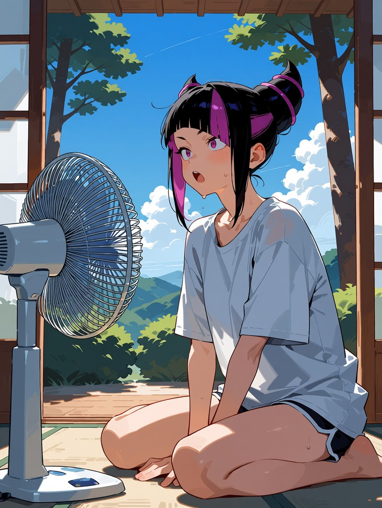

- **底模**：`anima-turbo-v1.1`
- **画师 tag**：（无）
- **LoRA**：（无）
- **采样**：euler / simple · steps 8 · CFG 1.0 · 976x1296
- **热度**：248 likes / 68 hearts
- **来源**：[civitai:140742445](https://civitai.com/images/140742445)
- **为何收录**：Turbo v1.1 室内坐地纳凉：oversize 衫+热气，滑动门透出户外，生活向半身。

**prompt**

```
masterpiece, best quality, safe, 1girl, han juri, street fighter, black hair, purple hair, multicolored hair, hair horns, oversized t-shirt, dolphin shorts, sitting, indoors, fan, sweat, open mouth, blush. Juri is sitting on the floor in front of a fan on a hot summer day. Trees, bushes, and blue sky visible in the background through an open sliding door.
```

**negative**

```
worst quality, low quality, artist name, blurry, jpeg artifacts, chromatic aberration
```

### 惠惠掌心甲虫

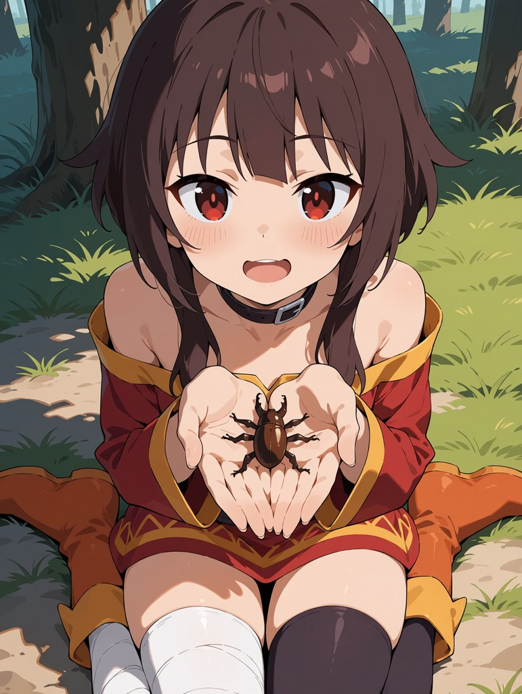

- **底模**：`anima-turbo-v1.1`
- **画师 tag**：（无）
- **LoRA**：（无）
- **采样**：euler / simple · steps 8 · CFG 1.0 · 976x1296
- **热度**：0 likes / 0 hearts
- **来源**：[civitai:140742456](https://civitai.com/images/140742456)
- **为何收录**：Turbo v1.1 户外坐姿：红裙绷带与掌心甲虫互动，开口看镜头。

**prompt**

```
masterpiece, best quality, 1girl, megumin, kono subarashii sekai ni shukufuku wo!, solo, brown hair, red eyes, red dress, off-shoulder dress, collar, bandages, asymmetrical legwear, sitting, wariza, outdoors, tree, dirt, blush, open mouth, looking at viewer, open hand, in palm. Megumin is holding out her hands with her palms up, a beetle is in her hands.
```

**negative**

```
worst quality, low quality, artist name, blurry, jpeg artifacts, chromatic aberration
```

### 莉格露夜虫全身

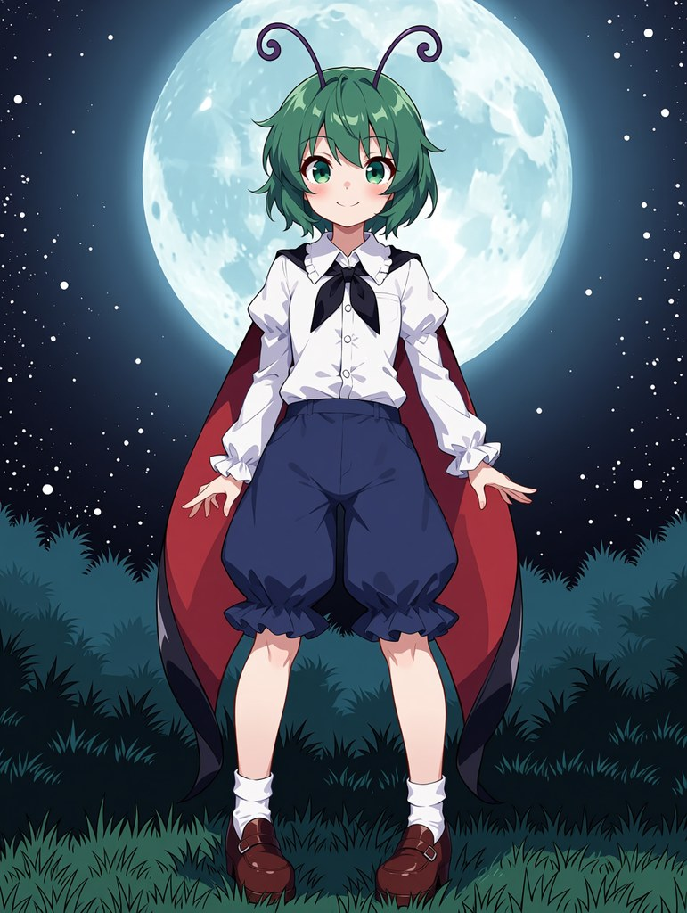

- **底模**：`anima-turbo-v1.1`
- **画师 tag**：（无）
- **LoRA**：（无）
- **采样**：euler / simple · steps 8 · CFG 1.0 · 976x1296
- **热度**：0 likes / 0 hearts
- **来源**：[civitai:140742451](https://civitai.com/images/140742451)
- **为何收录**：Turbo v1.1 极短 tag 全身夜景：东方角色、触角披风，示范少 tag 也能站住。

**prompt**

```
1girl, wriggle nightbug, touhou, white shirt, cape, green hair, antennae, shorts, full body, outdoors, night, blush, looking at viewer
```

**negative**

```
worst quality, low quality, artist name, blurry, jpeg artifacts, chromatic aberration
```

### 雾子狐面室内

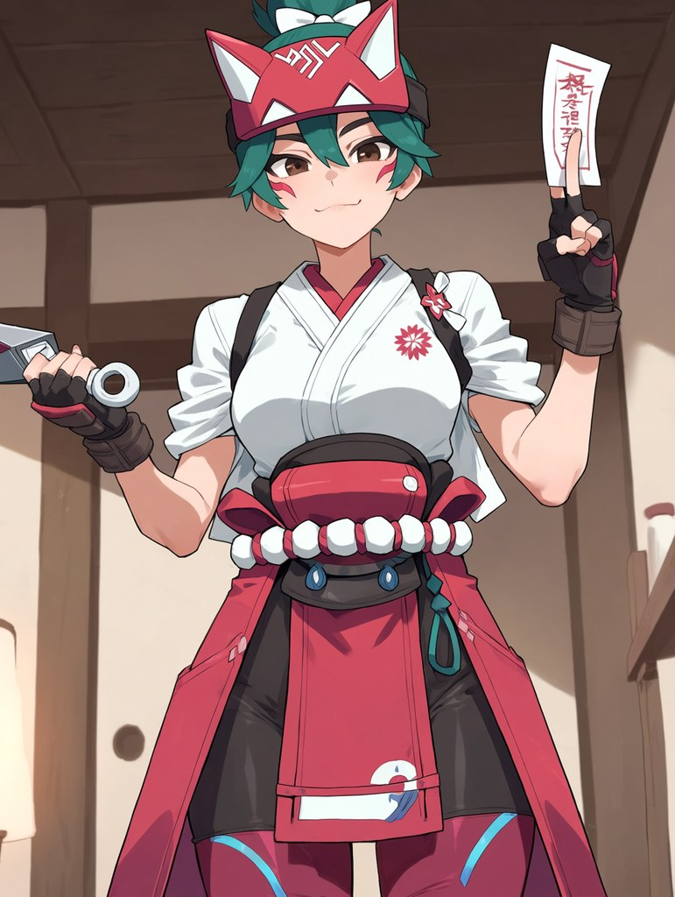

- **底模**：`anima-aesthetic-v1.0`
- **画师 tag**：（无）
- **LoRA**：（无）
- **采样**：euler / simple · steps 30 · CFG 4.0 · 976x1296
- **热度**：47 likes / 14 hearts
- **来源**：[civitai:136045482](https://civitai.com/images/136045482)
- **为何收录**：Aesthetic v1.0 和服立绘：狐面、红袴、符咒苦无，室内全身（euler 30 步对照 er_sde）。

**prompt**

```
masterpiece, best quality, safe, 1girl, kiriko \(overwatch\), overwatch, red hakama, rope belt, green hair, fox mask, white kimono, japanese clothes, standing, indoors, solo, ponytail, holding kunai, ofuda
```

**negative**

```
worst quality, low quality, score_1, score_2, score_3, artist name, blurry, jpeg artifacts, chromatic aberration
```

### 小叮当看瓢虫

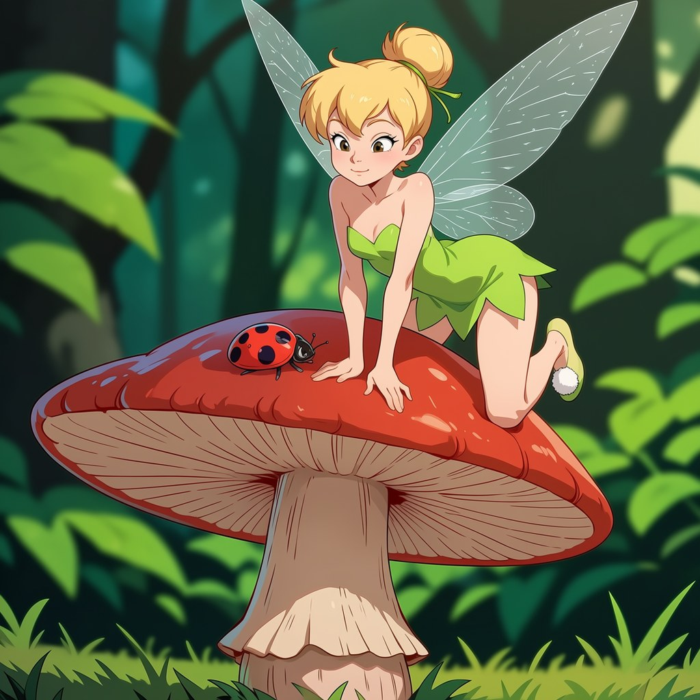

- **底模**：`anima-turbo-v1.0`
- **画师 tag**：（无）
- **LoRA**：（无）
- **采样**：euler / simple · steps 12 · CFG 1.0 · 1120x1120
- **热度**：451 likes / 162 hearts
- **来源**：[civitai:136045873](https://civitai.com/images/136045873)
- **为何收录**：Turbo v1.0 迷你妖精全身：森林蘑菇+自然语言补动作，高热度角色小品。

**prompt**

```
Digital anime-style illustration. masterpiece, best quality, 1girl, tinker bell \(disney\), walt disney's peter pan, blonde hair, fairy wings, green dress, outdoors, minigirl, floating, forest, mushroom. A ladybug is on top of a mushroom. Tinker Bell is floating above it, looking at the bug with a curious expression.
```

**negative**

```
worst quality, low quality, score_1, score_2, score_3, artist name, blurry, jpeg artifacts, chromatic aberration
```

### 红发白裙与蓝蝶

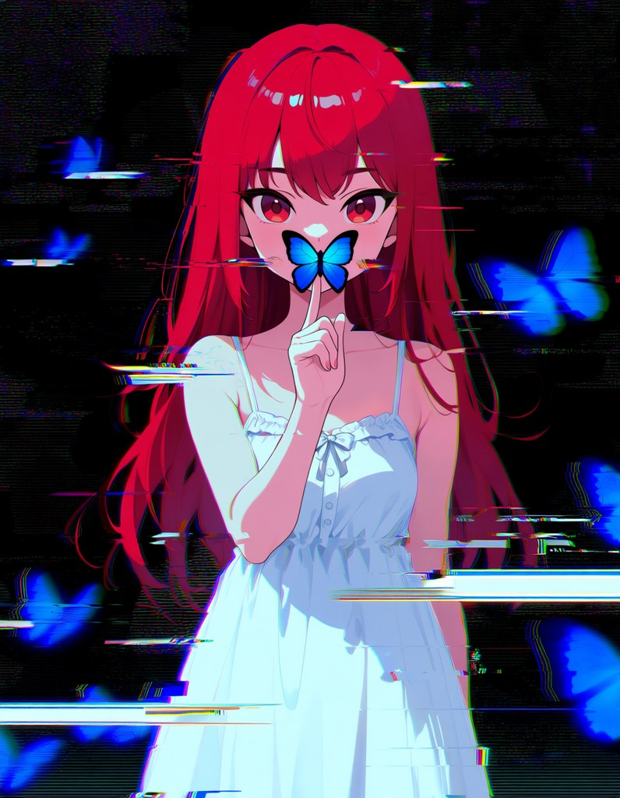

- **底模**：`anima-base-v1.0`
- **画师 tag**：（无）
- **LoRA**：（无）
- **采样**：er_sde / simple · steps 30 · CFG 5.0 · 896x1152
- **热度**：395 likes / 186 hearts / 1 comments
- **来源**：[civitai:130697922](https://civitai.com/images/130697922)
- **为何收录**：Base v1.0 站姿+手指蝴蝶，(glitch:2) 权重示范；高热度简洁构图。

**prompt**

```
masterpiece, best quality, score_7, safe, 1girl, standing, white dress, red hair, a blue butterfly is on her finger, (glitch:2)
```

**negative**

```
worst quality, low quality, score_1, score_2, score_3, artist name
```

### 半藏室内拉弓

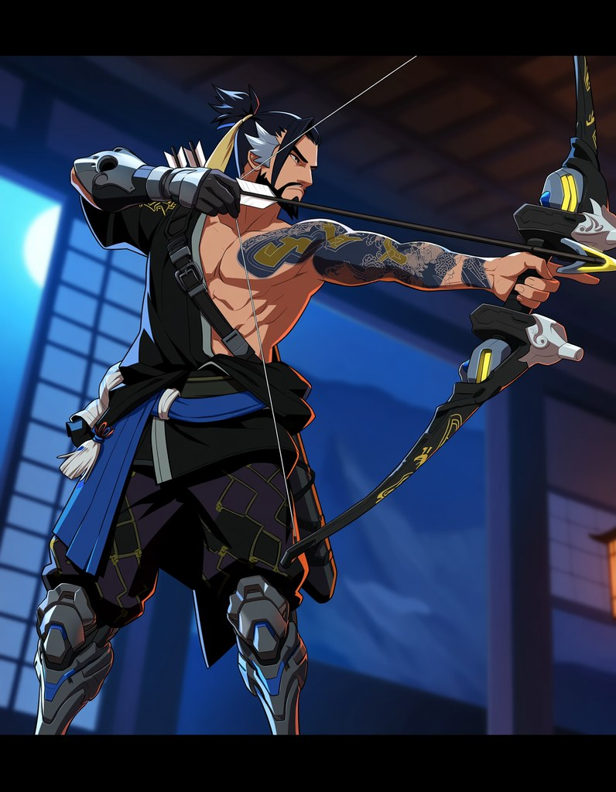

- **底模**：`anima-base-v1.0`
- **画师 tag**：（无）
- **LoRA**：（无）
- **采样**：er_sde / simple · steps 30 · CFG 5.0 · 1344x1728
- **热度**：134 likes / 67 hearts
- **来源**：[civitai:130697935](https://civitai.com/images/130697935)
- **为何收录**：Base v1.0 男性全身：anime coloring + 持弓瞄准、义肢纹身，室内夜景日式建筑。

**prompt**

```
masterpiece, best quality, score_7, safe, anime coloring, 1boy, hanzo \(overwatch\), overwatch, solo, male focus, muscular male, black hair, beard, arm tattoo, prosthetic legs, holding bow \(weapon\), aiming, arrow \(projectile\), quiver of arrows on his back, indoors, standing, night, japanese architecture
```

**negative**

```
worst quality, low quality, score_1, score_2, score_3, artist name, letterboxed, facing away
```

### 摇曳百合四人合影


- **底模**：`anima-base-v1.0`
- **画师 tag**：（无）
- **LoRA**：（无）
- **采样**：er_sde / simple · steps 30 · CFG 5.0 · 1536x1536
- **热度**：162 likes / 97 hearts
- **来源**：[civitai:130697933](https://civitai.com/images/130697933)
- **为何收录**：Base v1.0 4girls 校园合影：多角色站位与发色区分，对照群体构图。

**prompt**

```
masterpiece, best quality, score_7, safe, 4girls, akaza akari, funami yui, toshinou kyouko, yoshikawa chinatsu, yuru yuri, school uniform, red hair, blonde hair, black hair, pink hair, outdoors, building, school. Four girls from YuruYuri are posing in front of a school.
```

**negative**

```
worst quality, low quality, score_1, score_2, score_3, artist name
```

## Batch 03
主题：**画风差异（人物）**。避免再堆默认 Aesthetic 站姿美型，优先 `@artist`、介质 tag、官方非默认作画。

来源：官方卡面剩余风格轴（Neferpitou / anime coloring / chibi / preview2 线稿）+ Civitai 用户原图 PNG workflow 确认 UNET 含 Anima。跳过无 metadata、WAI/Nova 主模、风景/ye-pop/Among Us。

列对应：图片 / 底模 / prompt / 画师tag / LoRA。

### 尼肥皮托乌夜蹲

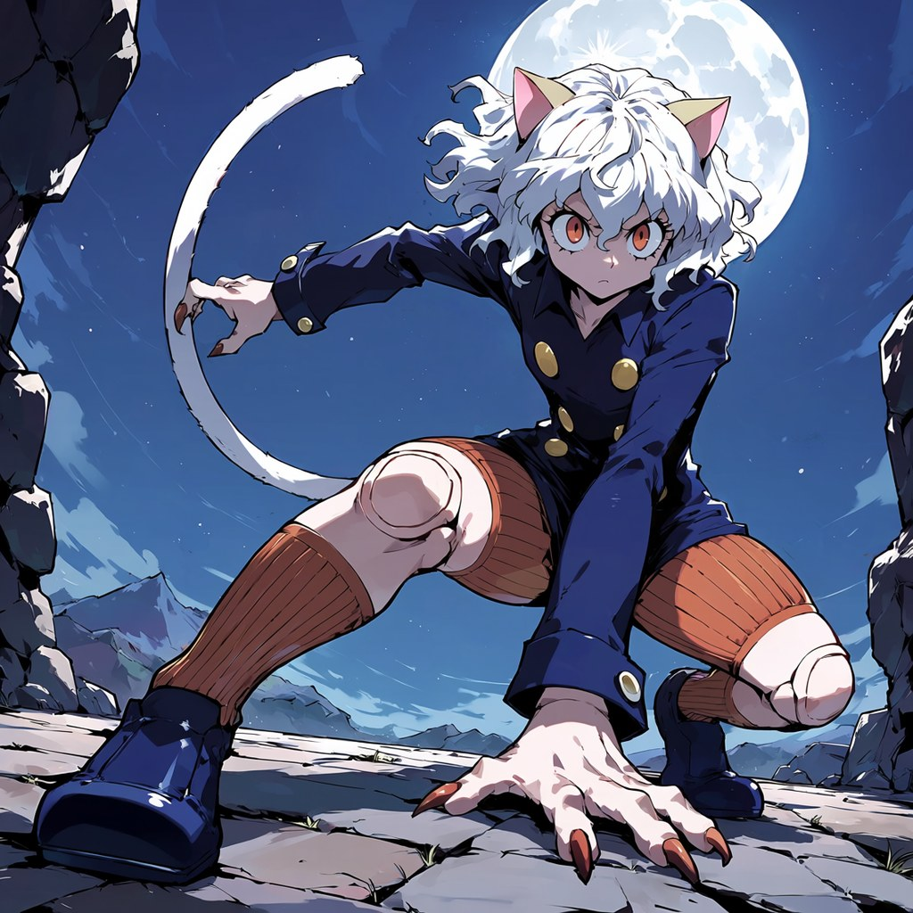

- **底模**：`anima-aesthetic-v1.0`
- **画师 tag**：（无）
- **LoRA**：（无）
- **采样**：er_sde / simple · steps 30 · CFG 3.0 · 1120x1120
- **热度**：59 likes / 16 hearts
- **来源**：[civitai:136045465](https://civitai.com/images/136045465)
- **为何收录**：暗色高对比/异形关节：官方 Aesthetic v1.0 1other 夜景蹲姿，月背光+娃娃关节与利爪，和默认美型站姿拉开。

**prompt**

```
masterpiece, best quality, safe, 1other, neferpitou, hunter x hunter, solo, outdoors, crouching, blue shirt, orange shorts, doll joints, white hair, cat ears, tail, (fewer digits:2), dynamic pose, serious, night, moon, sharp fingernails, rocky terrain
```

**negative**

```
worst quality, low quality, score_1, score_2, score_3, artist name, blurry, jpeg artifacts, chromatic aberration
```

### 御坂美琴·动画上色

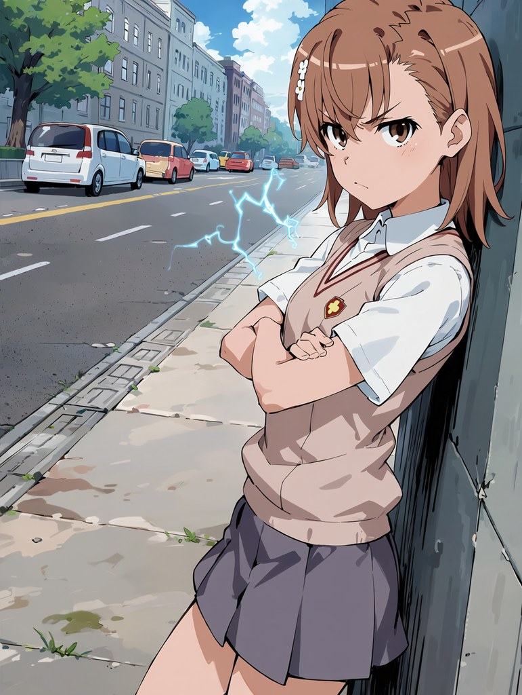

- **底模**：`anima-aesthetic-v1.0`
- **画师 tag**：（无）
- **LoRA**：（无）
- **采样**：er_sde / simple · steps 30 · CFG 4.0 · 976x1296
- **热度**：138 likes / 56 hearts
- **来源**：[civitai:136045474](https://civitai.com/images/136045474)
- **为何收录**：赛璐璐平涂：官方 Aesthetic 带 anime coloring，学兰侧靠街景，TV 作画块面阴影（对照 batch02 半藏同 tag）。

**prompt**

```
masterpiece, best quality, 1girl, misaka mikoto, toaru majutsu no railgun, anime coloring, brown hair, short hair, hair ornament, standing, from side, outdoors, building, sidewalk, parked cars, leaning, tokiwadai school uniform, crossed arms, annoyed, tsundere, electrokinesis, looking at viewer
```

**negative**

```
worst quality, low quality, score_1, score_2, score_3, artist name, blurry, jpeg artifacts, chromatic aberration
```

### Q版初音堆成山

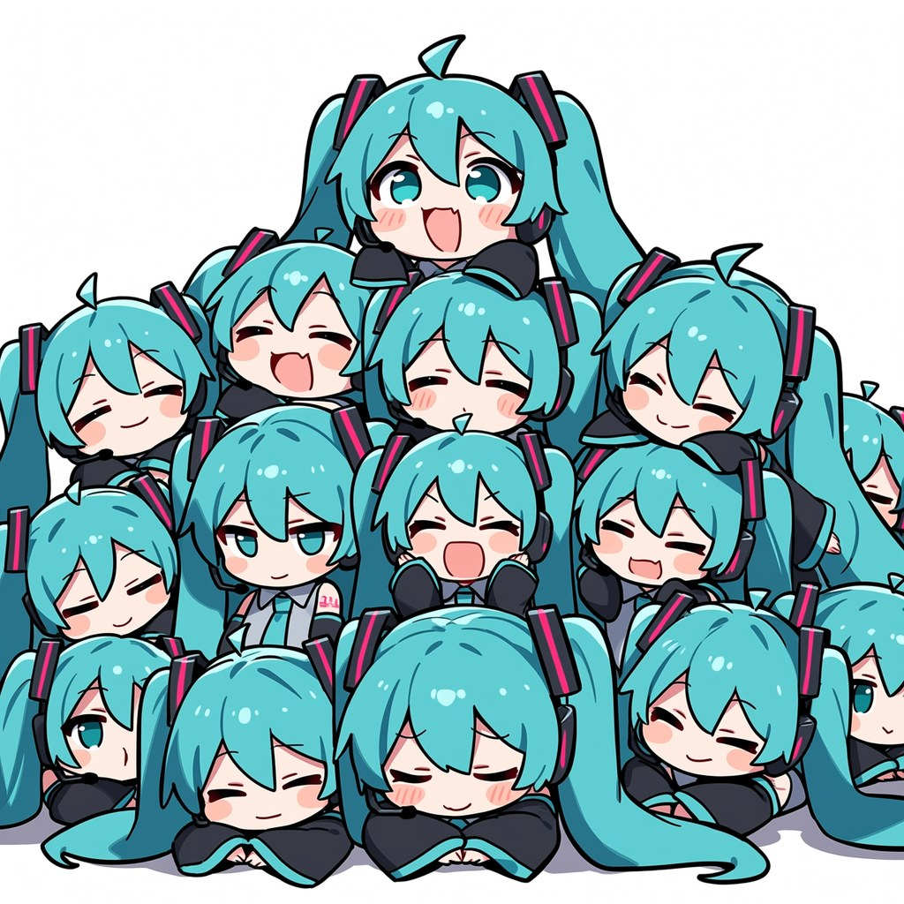

- **底模**：`anima-turbo-v1.0`
- **画师 tag**：（无）
- **LoRA**：（无）
- **采样**：euler / simple · steps 12 · CFG 1.0 · 1248x1248
- **热度**：308 likes / 96 hearts
- **来源**：[civitai:136045875](https://civitai.com/images/136045875)
- **为何收录**：Q版：Turbo v1.0 自然语言 chibi 堆叠，头身比与白底贴纸感，示范 6+girls 变形体。

**prompt**

```
masterpiece, best quality, safe, 6+girls. a very large number of chibi Hatsune Miku in a pile. so many miku
```

**negative**

```
worst quality, low quality, score_1, score_2, score_3, artist name, blurry, jpeg artifacts, chromatic aberration
```

### 线稿少女戳乌龟

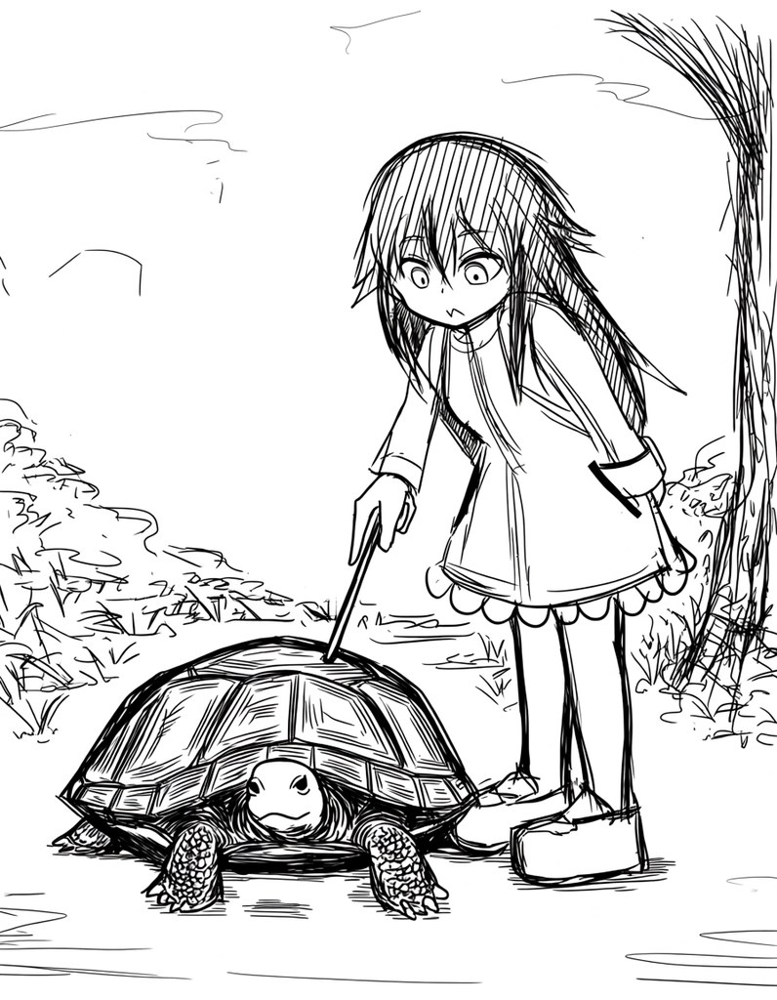

- **底模**：`anima-preview2`
- **画师 tag**：（无）
- **LoRA**：（无）
- **采样**：er_sde / simple · steps 30 · CFG 5.0 · 896x1152
- **热度**：（官方卡面，热度未从 API 拉到）
- **来源**：[civitai:123853911](https://civitai.com/images/123853911)
- **为何收录**：线稿/速写：官方 preview2 纯英文 rough sketch，单色排线无上色，对照彩色直出。

**prompt**

```
rough black-and-white sketch of an anime girl standing outdoors, poking a turtle with a stick
```

**negative**

```
（空）
```

### 水彩阶梯吉他少女

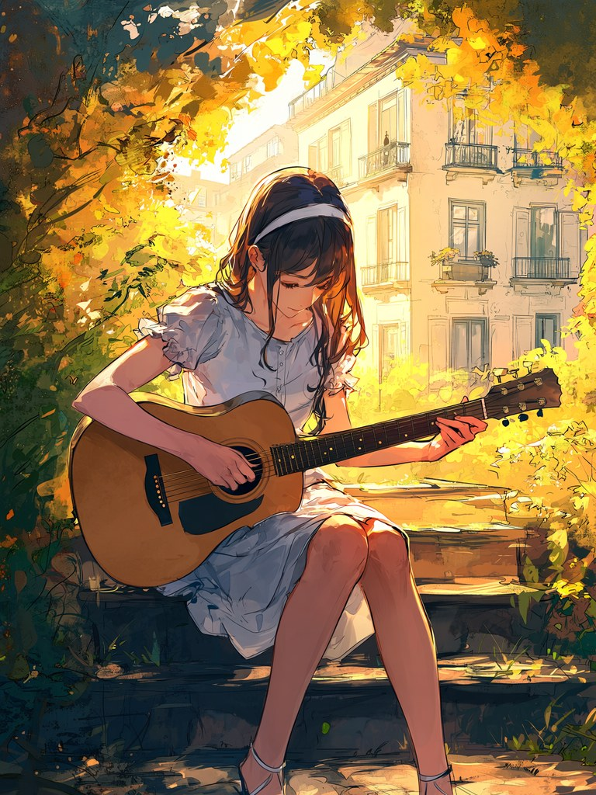

- **底模**：`anima-base-v1.0`
- **画师 tag**：（无）
- **LoRA**：`UmeSky_AnimaV2`
- **采样**：er_sde / simple · steps 50 · CFG 4.5 · 1152x1536
- **热度**：567 likes / 190 hearts / 1 comments
- **来源**：[civitai:133891304](https://civitai.com/images/133891304)
- **为何收录**：水彩人物：Base + Watercolor/impressionism（umesky LoRA），光斑树叶与 batch01 无人物水彩风景对照。

**prompt**

```
masterpiece, best quality, score_7, safe, umesky, Watercolor style painting, thick color, (gradation grading), impressionism, 1 girl, white casual dress, white hairband, playing small guitar, sitting on Stairs in front of the apartment, France, warm sunlight illuminate her, softlighiting
```

**negative**

```
worst quality, low quality, score_1, score_2, score_3, artist name, blurry, jpeg artifacts
```

### 平涂小红帽与狼影

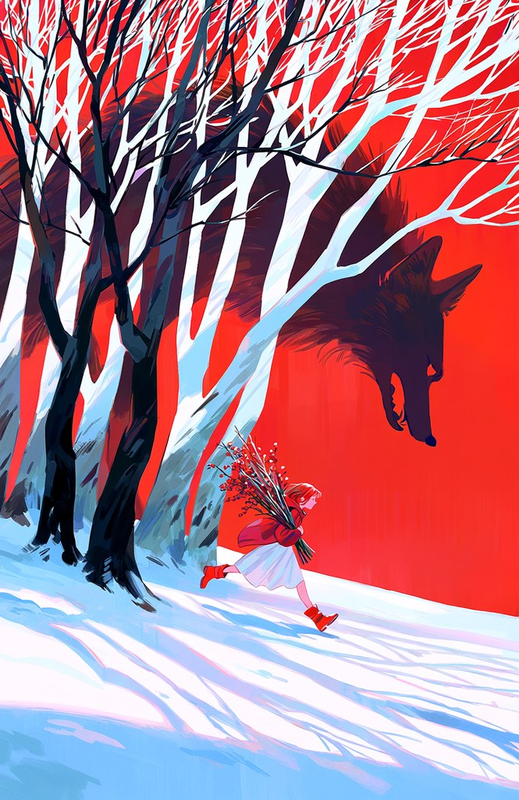

- **底模**：`anima-base-v1.0`
- **画师 tag**：`@loika`
- **LoRA**：`Loika v1`
- **采样**：er_sde / beta · steps 35 · CFG 4.5 · 832x1280
- **热度**：1430 likes / 516 hearts / 3 comments
- **来源**：[civitai:133142985](https://civitai.com/images/133142985)
- **为何收录**：高对比平涂插画/@loika：红白黑限色绘本构图，flat color 叙事，画师 tag+LoRA 同时生效。

**prompt**

```
masterpiece, very aesthetic, best quality, newest, year 2025, year 2024, absurdres, intricate details,
1girl, short red hair wearing a red hooded coat,  white dress,  and red boots runs across a snow-covered ground while carrying a bundle of sticks with red berries. Surrounding her are thick,  winding tree trunks in shades of white,  black,  and grey,  set against a solid red background. An ominous shadow of a huge wolf is cast over the trees. The scene has flat color surfaces and sharp edges without fine skin or fabric textures,  viewed from a side-profile camera angle with even,  non-directional lighting.
dynamic angle, dramatic lighting, narrative storytelling, ultra high resolution, soft lighting, perfect face, high-res illustration, soft brush aesthetic, smooth finish, professional quality,  <lora:Loika v1:1> @loika
```

**negative**

```
worst quality, low quality, score_1, score_2, score_3, bad hands, jpeg artifacts, patreon logo, patreon username, web address, signature, watermark, logo, artist name, censored, facial hair, stubble, blurry eyes, bad face, long neck, short neck, blurry eyes, extra fingers, compression artifacts, uncanny valley, early, old, extra limbs, too many fingers, poorly drawn hands, malformed hands, poorly drawn face, poorly drawn asymmetrical eyes, mutated face, deformed leg, malformed, weibo username, too many watermarks
```

### 日本画和服回眸

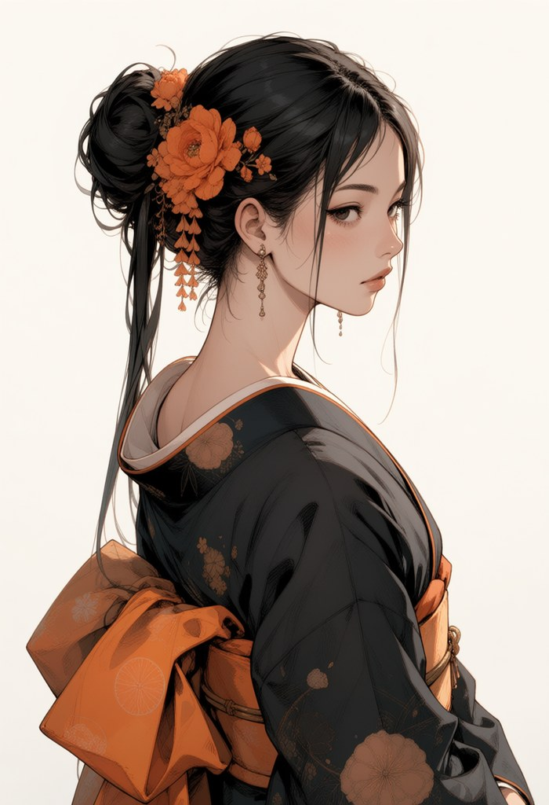

- **底模**：`anima-aesthetic-v1.1`
- **画师 tag**：（无）
- **LoRA**：`A_classica_comfy:0.8`
- **采样**：euler_ancestral / simple · steps 32 · CFG 4.0 · 832x1216
- **热度**：45 likes / 23 hearts / 1 comments
- **来源**：[civitai:137551856](https://civitai.com/images/137551856)
- **为何收录**：日本画：Aesthetic v1.1 + nihonga/wabisabi 自然语言，白底半写实和服回眸（classica LoRA 0.8）。

**prompt**

```
masterpiece, best quality, high quality, score_9, score_8_up, score_7_up, stylized, nihonga, flowing blush stroke turning into a one japanese girl.  wabisabi, japan, A digital illustration shoot from a profile angle about a young woman with long black hair styled in a traditional japanese hairstyle, adorned with orange flowers, wearing a black kimono with an orange sash, looking over her shoulder with a contemplative expression. the subject, a young woman with fair skin and long black hair tied in a single hair bun, is positioned in the middle of the image, with her upper body facing the viewer and her eyes looking to the side. she appears to be in her late teens or early twenties, with a slender physique and a delicate expression. her hair is styled in a single hair bun, and she is wearing a traditional japanese kimono with an orange sash, which is draped elegantly over her shoulders. the kimono is adorned with intricate floral patterns, and she is accessorized with a pair of dangling earrings. the background of the image is a plain white, which provides a subtle contrast to the subject's delicate features. the style of the image is reminiscent of anime, with a focus on soft shading and delicate lines, making it a timeless piece of art.
```

**negative**

```
worst quality, low quality, score_1, score_2, score_3, blurry, jpeg artifacts, split view,
```

### 单色月神侧影

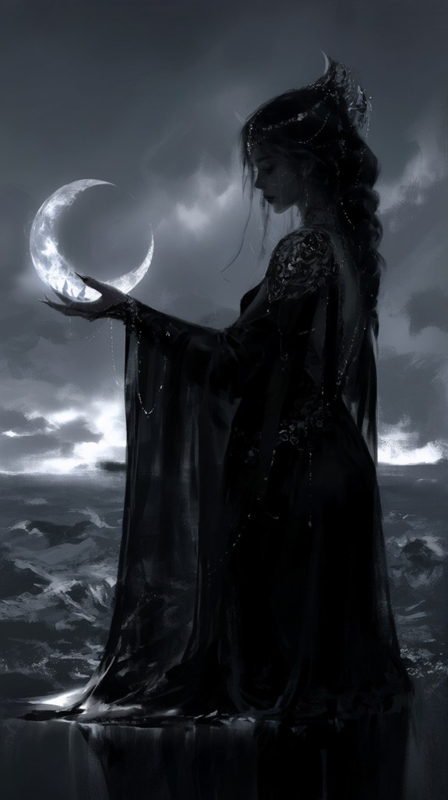

- **底模**：`anima-base-v1.0`
- **画师 tag**：（无）
- **LoRA**：`WlopAnima`
- **采样**：euler / simple · steps 30 · CFG 4.0 · 728x1296
- **热度**：1357 likes / 439 hearts / 6 comments
- **来源**：[civitai:132661863](https://civitai.com/images/132661863)
- **为何收录**：单色高对比/暗黑厚涂：Base + Wlop LoRA，传统媒介关键词，月光剪影而非赛璐璐。

**prompt**

```
Create a high-contrast black and white image depicting a silhouetted female figure against a stormy, overcast sky. The figure is robed in a flowing, tattered gown and wears a decorative headpiece with crescent moon elements. One hand is outstretched, cradling a luminous crescent moon, as if bestowing it. The aesthetic should be gothic, ethereal, and subtly melancholic, evoking a sense of ancient mystery and celestial influence. Focus on the interplay of light and shadow to enhance the drama and evoke a sense of the unseen. The atmosphere should be one of quiet power and otherworldly beauty.

<lora:WlopAnima:1>Wlop, painterly, impressionism, traditional media, painting /(medium/),
```

**negative**

```
worst quality, low quality, score_1, score_2, score_3, blurry, jpeg artifacts, sepia, signature, artist name
```

### 半透明机械脊柱

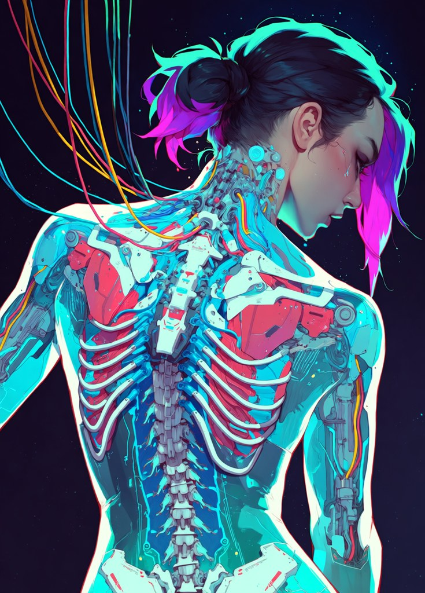

- **底模**：`anima-base-v1.0`
- **画师 tag**：（无）
- **LoRA**：`ArcaneViolet_mpt_64:1.15`
- **采样**：dpmpp_2m / simple · steps 20 · CFG 5.0 · 896x1248
- **热度**：1874 likes / 660 hearts / 18 comments
- **来源**：[civitai:131402031](https://civitai.com/images/131402031)
- **为何收录**：赛博暗色/半透明内构：Base 背影透视机械骨架，霓虹暗底，远离默认脸模。

**prompt**

```
woman, solo,glowing mechanical spine, translucent body, biomechanical anatomy, neon blue circuits, black and purple hair in messy style, missing one arm, futuristic gas mask, wires connected to body, sci-fi cybernetics, digital augmentation, dark background, soft moody lighting, back view, sleek techwear, synthetic skin, futuristic medical experiment, high detail, anime cyberpunk art style, emotionally intense, surreal sci-fi   <lora:ArcaneViolet_mpt_64:1.15>
```

**negative**

```
score_1, score_2, score_3, blurry, jpeg artifacts, sepia, artist signature, signature, artist name, watermark, text, logos, logos, score_1, score_2, score_3, jpeg artifacts, logo, watermark, signature, shinny skin
```

### 网点铠甲与粉月

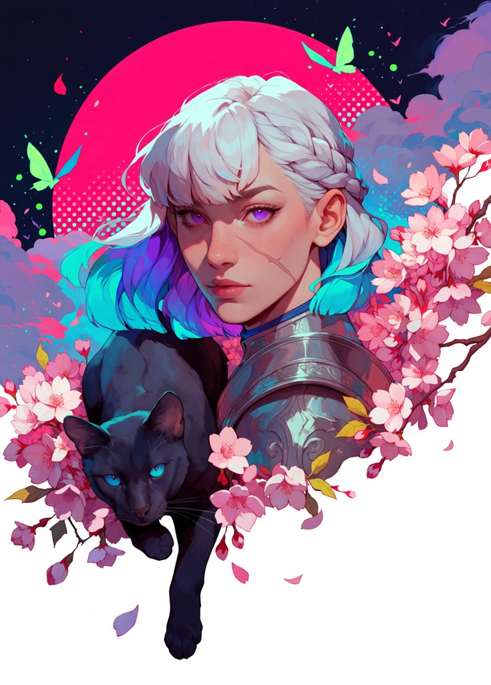

- **底模**：`anima-base-v1.0`
- **画师 tag**：（无）
- **LoRA**：`ArcaneViolet_mpt_64:1.15`
- **采样**：dpmpp_2m / simple · steps 20 · CFG 5.0 · 896x1248
- **热度**：1559 likes / 540 hearts / 10 comments
- **来源**：[civitai:131402200](https://civitai.com/images/131402200)
- **为何收录**：网点/波普负空间：halftone + 粉青高对比海报构图，与同作者赛博内构图成一套风格对照。

**prompt**

```
digital painting, woman , white hair, purple hair, thick braid, one purple eye, one blue eye,  two tone hair,   halftone, red, purple and pink theme, with white and black negative space background effect, celebelian,   floating petals, fallen petals, cherry blossoms, fireflies, delicate butterflies,  pink moon, clouds, scenery, from the side, full body image, metallic reflective dark armor, black cat, teal python. scar, looking towards viewer  <lora:ArcaneViolet_mpt_64:1.15>
```

**negative**

```
score_1, score_2, score_3, blurry, jpeg artifacts, sepia, artist signature, signature, artist name, watermark, text, logos, logos, score_1, score_2, score_3, jpeg artifacts, logo, watermark, signature, shinny skin
```

### 水彩斗笠剪影

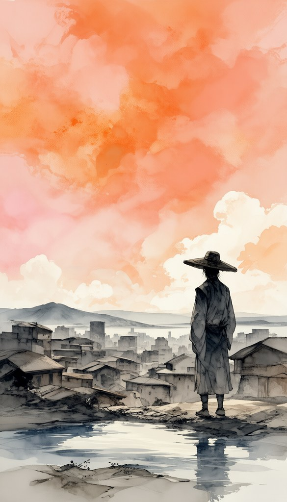

- **底模**：`anima-base-v1.0`
- **画师 tag**：（无）
- **LoRA**：`we_paint_anima_v1_0`
- **采样**：euler / simple · steps 30 · CFG 2.5 · 768x1344
- **热度**：1175 likes / 409 hearts / 6 comments
- **来源**：[civitai:136213733](https://civitai.com/images/136213733)
- **为何收录**：水彩剪影/纸纹：背影斗笠+橙粉天空渗化，人物减到剪影，示范介质 tag 压过脸模。

**prompt**

```
masterpiece,best quality,newest,(score_9,score_8,score_7:0.25),A digital watercolor illustration in an anime style featuring a silhouetted figure wearing a wide-brimmed hat standing before a simplified cityscape on a distant horizon line. In the foreground,a layer of still liquid reflects the colors above. The color palette utilizes a contrast between vibrant orange and pink tones in the sky and muted brown and grey tones for the buildings and ground. The image features soft-edged brushstrokes,translucent paint layers,and watercolor textures over paper grain.
```

**negative**

```
error,bad anatomy,bad hands,ugly,distorted,lowres,watermark,signature,scanlines
```

## Batch 04
主题：**画风差异续（人物）**。避开 batch 03 已覆盖轴（暗色皮托乌 / 赛璐璐 / Q版堆 / 线稿 / 水彩吉他 / @loika / 日本画 / Wlop 单色 / 赛博脊柱 / 网点铠甲 / 水彩剪影）。

来源：Civitai 各 Anima versionId（Newest + Most Reactions）PNG workflow；含 Gazingstars Anima-2.9B 且画风非默认 Aesthetic 克隆的条目。prompt 均从 original PNG 抽出，未编造。

每条含：画风轴、抄什么、底模、LoRA(+链接)、纯底模与否、prompt、negative、采样、来源。

### 水墨武士挥刀

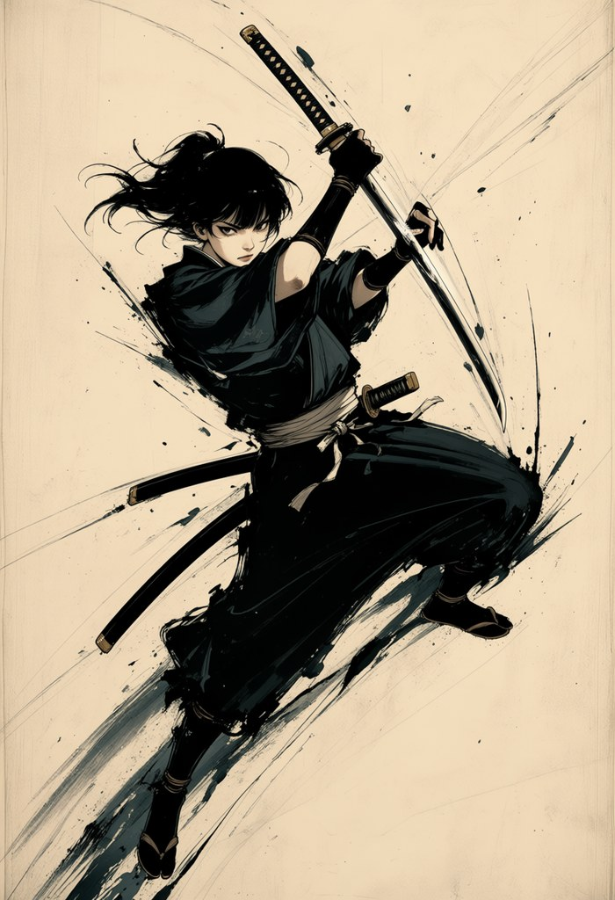

- **画风轴**：水墨人物
- **抄什么**：正向抄 sumi-e / wabisabi / big long brushstrokes；触发词 LookDaal、fezat1。三枚风格 LoRA 权重约 0.5/0.8/0.5，采样 er_sde+simple、CFG 4。
- **底模**：`anima-base-v1.0`
- **LoRA**：`A_classica_comfy:0.5; A_The-Look-Anima3-800:0.8; A_Fezat1:0.5`
- **LoRA 链接**：https://civitai.com/models/2641117 | https://civitai.com/models/1882546?modelVersionId=2997490 | https://civitai.com/models/1733125?modelVersionId=3004820
- **纯底模与否**：否
- **画师 tag**：（无）
- **采样**：er_sde / simple · steps 30 · CFG 4.0 · 832x1216
- **热度**：1562 likes / 597 hearts / 7 comments
- **来源**：[civitai:134244062](https://civitai.com/images/134244062)
- **为何收录**：水墨轴：Base 直出人物武士，阔笔飞白与溅墨，对照 batch03 日本画和服（nihonga LoRA）与水彩剪影。

**prompt**

```
big long brushstrokes of deep black sumi-e turning into symbolic painting of wabisabi, japan. msamurai, fighting with katana, holding katana with both hands, dynamic pose, aster level raw art. best quality, high resolution, LookDaal,fezat1
```

**negative**

```
worst quality, low quality, score_1, score_2, score_3, blurry, jpeg artifacts, split view,
```

### 厚涂油画提灯人

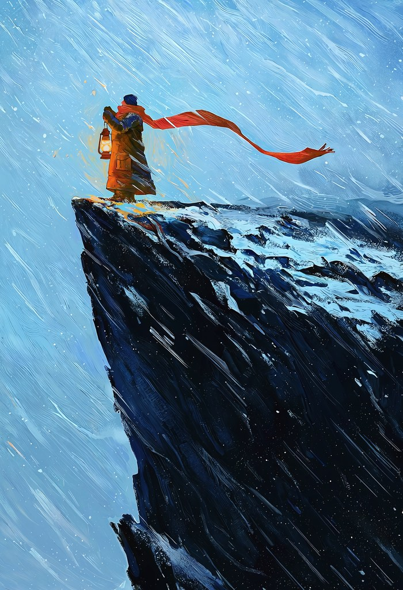

- **画风轴**：油画厚涂人物
- **抄什么**：必带 @k4asty1e 与 Impasto oil painting / palette knife / thick texture；LoRA ashima_v4≈0.7。调度用 dpmpp_2m_sde + beta57。
- **底模**：`anima-base-v1.0`
- **LoRA**：`ashima_v4:0.7`
- **LoRA 链接**：https://civitai.com/models/2701018 (Anima ashima 风格；工作流文件名为 ashima_v4.safetensors)
- **纯底模与否**：否
- **画师 tag**：`@k4asty1e`
- **采样**：dpmpp_2m_sde / beta57 · steps 25 · CFG 4.0 · 1664x2432
- **热度**：1711 likes / 601 hearts / 9 comments
- **来源**：[civitai:133951905](https://civitai.com/images/133951905)
- **为何收录**：油画人物轴：暴风雪悬崖+红围巾提灯，刀刮厚涂，不是 batch03 水彩/Wlop 单色。

**prompt**

```
masterpiece, best quality, score_7, safe, @k4asty1e, 
Impasto oil painting, heavy texture, thick palette knife strokes, deep icy blue and contrasting warm bright orange. A heavy snowstorm howling over a dark rocky cliff. A lone human figure wrapped tightly in a thick coat and a flying bright red scarf, holding up a glowing orange vintage lantern against the harsh wind. Swirling snowflakes, freezing winter wonderland atmosphere, emotional, cinematic solitude
```

**negative**

```
worst quality, low quality, score_1, score_2, score_3, artist name, blurry, jpeg artifacts, lowres, censor,
```

### 平涂持羊恶魔少女

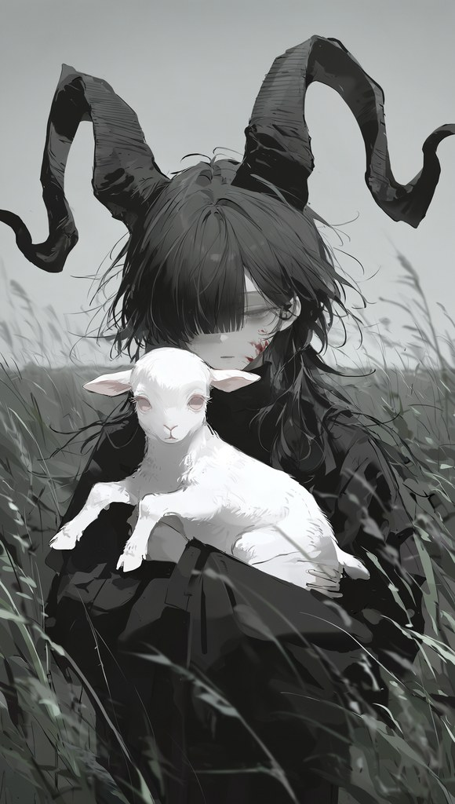

- **画风轴**：@pile 平涂阴郁
- **抄什么**：画师 tag @pile + LoRA pile_epoch_20:1。抄 muted color / grey background / hollow gaze；负向里已有 flat color，正向靠 LoRA 压平光影。er_sde+beta57。
- **底模**：`anima-base-v1.0`
- **LoRA**：`pile_epoch_20:1.0`
- **LoRA 链接**：https://civitai.com/models/2702294?modelVersionId=3051927
- **纯底模与否**：否
- **画师 tag**：`@pile`
- **采样**：er_sde / beta57 · steps 30 · CFG 4.0 · 2176x3840
- **热度**：439 likes / 147 hearts / 1 comments
- **来源**：[civitai:134550289](https://civitai.com/images/134550289)
- **为何收录**：@pile 画师轴：限色阴郁平涂持羊，与 batch03 @loika 红白绘本不同作者。

**prompt**

```
masterpiece, best quality, good quality, absurdres, newest, highres, @pile, solo, 1girl, black hair, messy hair, long hair, covering one eye, pale skin, bags under eyes, half-closed eyes, empty eyes, depressed, demon horns, huge horns, curved horns, black horns, blood on cheek, dried blood, black sleeves, dark, lamb, holding animal, baby animal, tall grass, grey background, muted color, dark background, wasteland, horror \(theme\), lonely, gloomy, blurry foreground, blurry

hollow gaze, holding a lamb close, both with vacant expressions, eerie stillness

The composition is a medium shot portrait of a pale girl with disheveled black hair partially covering her face. She stands in a desolate grey landscape with faded dark green tall grass blurring in the foreground and background. A soft, diffused grey light casts no strong shadows, flattening the scene into muted tones of grey, black, white, and faded green. The girl holds a pure white lamb tightly in her arms; both share the same hollow, empty stare, creating an unsettling emotional resonance. The lamb's eyes have a faint pinkish tint, contrasting with its white wool. The girl's large curved horns rise prominently against the gloomy sky, their rough ridged texture subtly catching the dim light., 
<lora:pile_epoch_20:1.0>
```

**negative**

```
worst quality, low quality, score_1, score_2, score_3, watermark, signature, bad hands, bad anatomy, jpeg artifacts, ugly, poorly drawn, censored, flat color, bad lighting, poor lighting
```

### 鸟山明风武斗少女

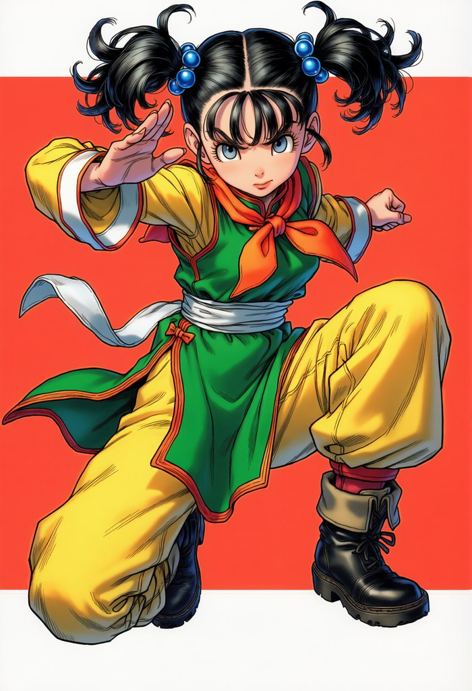

- **画风轴**：官方/鸟山明人设
- **抄什么**：纯 Anima-2.9B preview。抄 @artbooktoriyama 与 (@toriyama akira:0.8)、minimal outlines；角色用 fighter (dq3)。euler + ddim_uniform、CFG 2.5、约 20 步。
- **底模**：`anima-2.9b-preview-v1`
- **LoRA**：（无）
- **LoRA 链接**：（无）
- **纯底模与否**：是
- **画师 tag**：`@artbooktoriyama, @toriyama akira`
- **采样**：euler / ddim_uniform · steps 20 · CFG 2.5 · 832x1216
- **热度**：1 likes / 0 hearts
- **来源**：[civitai:140480665](https://civitai.com/images/140480665)
- **为何收录**：官方人设轴（非神川）：2.9B + 鸟山明 tag，DQ 武斗服动态蹲姿。工作流另有未接入 NSFW 节点，本条只用 parameters 里实际生效的 prompt。

**prompt**

```
art_style: masterpiece, best quality, score_9, score_8, very aesthetic, high detailed, absurdres, @artbooktoriyama, minimal outlines, (@toriyama akira:0.8)
person_a:  - fighter \(dq3\), dragon quest, black hair, short hair, twintails, short twintails,
  smallbreasts,blue hair ornament,
- neckerchief, chinese clothes, green dress, yellow sleeves, long sleeves, yellow
  pants, boots,
Dynamic pose
```

**negative**

```
worst quality, low quality, lowres, score_1, score_2, score_3, bad anatomy, bad hands, missing limb, extra limb,sepia, censor, censored, crop, jpeg artifacts,logo, artist name, signature,
```

### 浮世绘浪边和服

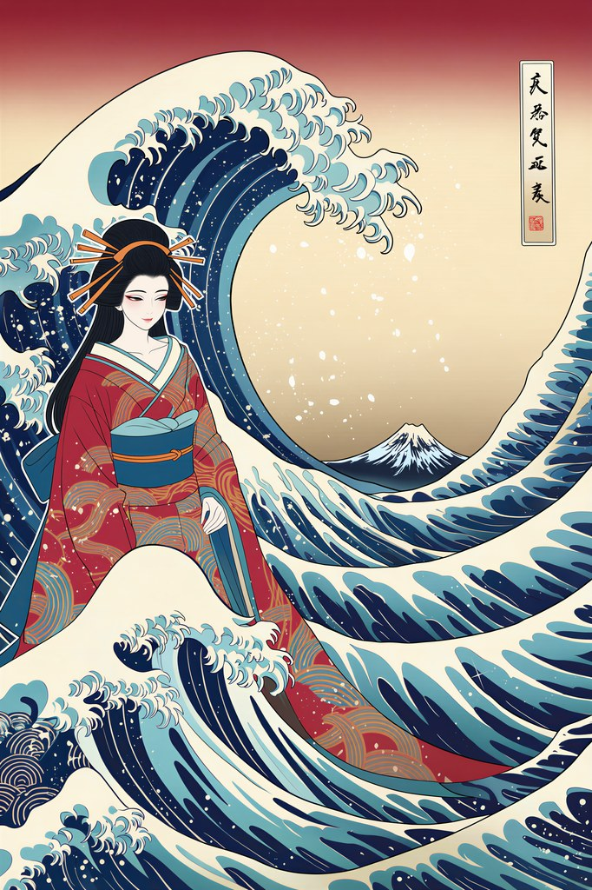

- **画风轴**：浮世绘人物
- **抄什么**：纯 2.9B。核心 @Hokusai, ukiyo-e, traditional japanese woodblock print style, flat bold color blocks。er_sde+beta57、50 步、CFG 4。工作流里 Illustrious/Flux 加载器是关着的。
- **底模**：`anima-2.9b-v1.0`
- **LoRA**：（无）
- **LoRA 链接**：（无）
- **纯底模与否**：是
- **画师 tag**：`@Hokusai`
- **采样**：er_sde / beta57 · steps 50 · CFG 4.0 · 2560x3840
- **热度**：5 likes / 3 hearts
- **来源**：[civitai:139621105](https://civitai.com/images/139621105)
- **为何收录**：浮世绘人物：北斋浪纹+和服，色块版画，区别于 batch03 nihonga。

**prompt**

```
masterpiece, best quality, score_9, score_8, score_7, year 2026, newest, highres, absurdres, very aesthetic, scenery, 1girl, solo, @Hokusai, ukiyo-e, traditional japanese woodblock print style, fair skin, long black hair styled traditionally with ornate hairpins, serene composed expression, standing gracefully beside a cresting wave, elegant traditional kimono with wave patterns, stylized great wave in the background, flat bold color blocks, traditional woodblock texture, muted indigo and cream color palette, elegant flowing linework, traditional japanese aesthetic
```

**negative**

```
worst quality, low quality, early, old, score_1, score_2, score_3, glitch, deformed, mutated, ugly, disfigured, long body, bad anatomy, bad hands, missing fingers, extra fingers, extra digits, fewer digits, cropped, very displeasing, artist name, blurry, jpeg artifacts, lowres, censor, visible abs, athletic body, toned, muscular, skinny
```

### 吉卜力田园提篮少女

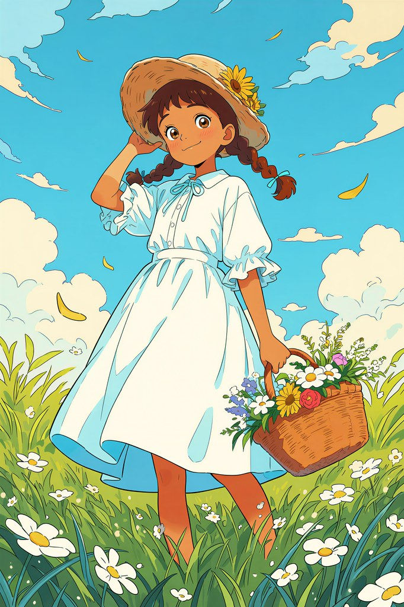

- **画风轴**：吉卜力/故事绘
- **抄什么**：纯 2.9B。抄 @Studio Ghibli 与 storybook illustration / soft painted clouds / gentle painterly style。同作者浮世绘条同一套采样：er_sde+beta57、50 步。
- **底模**：`anima-2.9b-v1.0`
- **LoRA**：（无）
- **LoRA 链接**：（无）
- **纯底模与否**：是
- **画师 tag**：`@Studio Ghibli`
- **采样**：er_sde / beta57 · steps 50 · CFG 4.0 · 2560x3840
- **热度**：7 likes / 3 hearts
- **来源**：[civitai:139621058](https://civitai.com/images/139621058)
- **为何收录**：90s/吉卜力故事绘：麦田草帽向，非赛璐璐 TV、非默认 Aesthetic 站姿。

**prompt**

```
masterpiece, best quality, score_9, score_8, score_7, year 2026, newest, highres, absurdres, very aesthetic, scenery, 1girl, solo, @Studio Ghibli, storybook illustration, warm tan skin, twin braided brown hair, big round warm brown eyes, cheerful gentle smile, standing in a sunlit meadow surrounded by tall grass, simple flowing cotton dress, wicker basket filled with flowers, whimsical countryside background, soft painted clouds, warm natural sunlight, cozy peaceful atmosphere, soft color palette, storybook charm, gentle painterly style
```

**negative**

```
worst quality, low quality, early, old, score_1, score_2, score_3, glitch, deformed, mutated, ugly, disfigured, long body, bad anatomy, bad hands, missing fingers, extra fingers, extra digits, fewer digits, cropped, very displeasing, artist name, blurry, jpeg artifacts, lowres, censor, visible abs, athletic body, toned, muscular, skinny
```

### 故障碎裂蓝底少女

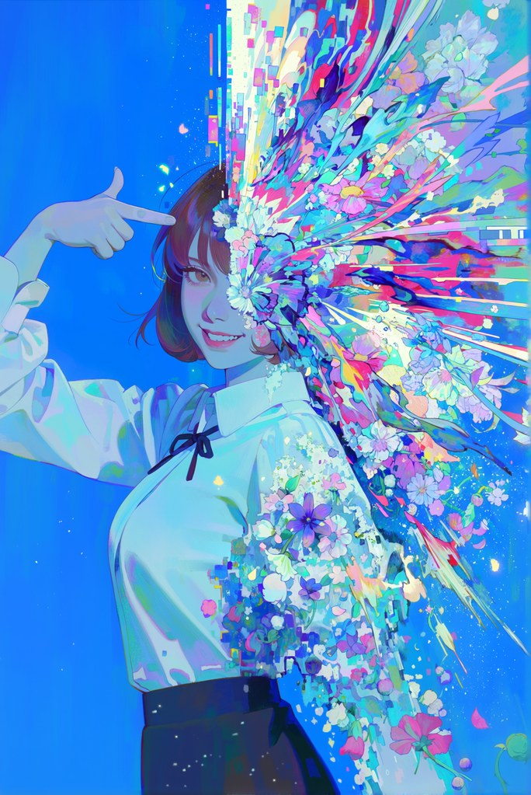

- **画风轴**：@xiaoquandianer 故障碎裂
- **抄什么**：画师 tag + LoRA 都要：@xiaoquandianer <lora:xiaoquandianer v1:1>。抄 chromatic aberration / databending / pixelated flowers。采样 Euler a CFG++、KL Optimal、CFG 1.5。
- **底模**：`anima-base-v1.0`
- **LoRA**：`xiaoquandianer v1:1`
- **LoRA 链接**：https://civitai.com/models/2655668?modelVersionId=2981992
- **纯底模与否**：否
- **画师 tag**：`@xiaoquandianer`
- **采样**：Euler a CFG++ / KL Optimal · steps 40 · CFG 1.5 · 1000x1500
- **热度**：531 likes / 155 hearts / 4 comments
- **来源**：[civitai:132173568](https://civitai.com/images/132173568)
- **为何收录**：画师+故障轴：蓝底碎裂像素花，不是赛博半透明内构。

**prompt**

```
masterpiece, best quality, score_7, score_9, score_8, newest, year 2025, absurdres, intricate details, waist up portrait, side view, A close-up A striking, surreal illustration of a woman against a solid, bright blue background reminiscent of a computer error screen. She has short brown hair and is wearing a white collared shirt with a small black ribbon tie and dark clothing on her lower half. She has a confident, slightly eerie smile and is pointing her right hand at her head in a playful finger-gun gesture. The entire right side of her head and the space immediately behind her are violently tearing apart into intense, colorful digital glitch art. The glitch effect features vibrant, chaotic streaks and pixelated flowers, appearing as if she and the reality around her are becoming corrupted data. Heavy chromatic aberration, databending effects, and visual distortion blur the lines of her form, creating a chaotic, cyberpunk aesthetic that contrasts sharply with the stark, solid blue background. Complimentary-Colors, dynamic angle, dramatic lighting, narrative storytelling, ultra high resolution, soft lighting, perfect face, high-res illustration, soft brush aesthetic, smooth finish, professional quality, @xiaoquandianer, <lora:xiaoquandianer v1:1>,
```

**negative**

```
worst quality, low quality, score_1, score_2, score_3, bad hands, jpeg artifacts, patreon logo, patreon username, web address, signature, watermark, logo, artist name, censored, facial hair, stubble, blurry eyes, bad face, long neck, short neck, blurry eyes, extra fingers, compression artifacts, uncanny valley, early, old, extra limbs, too many fingers, poorly drawn hands, malformed hands, poorly drawn face, poorly drawn asymmetrical eyes, mutated face, deformed leg, malformed, weibo username, too many watermarks
```

### 胶片时尚粉羽卧姿

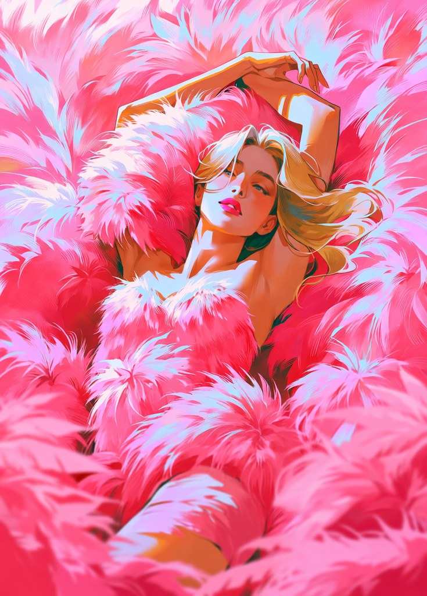

- **画风轴**：胶片时尚大片
- **抄什么**：无风格 LoRA。堆 @neytirix Candid Analog Photo 与 impressionism:1.5、Cinematic Lighting、western comics (style)。负向要 ban photo/photorealistic 才能保住插画。preview3，dpmpp_2m/simple、CFG 5、20 步。
- **底模**：`anima-preview3-base`
- **LoRA**：（无）
- **LoRA 链接**：（无）
- **纯底模与否**：是
- **画师 tag**：`@junbuug, @bbybluemochi, @sainttufa, @neytirix`
- **采样**：dpmpp_2m / simple · steps 20 · CFG 5.0 · 896x1248
- **热度**：441 likes / 186 hearts / 9 comments
- **来源**：[civitai:127126595](https://civitai.com/images/127126595)
- **为何收录**：胶片/时尚大片：多画师 tag 无 LoRA，粉羽卧姿，对照默认二次元站姿。

**prompt**

```
score_9, score_8,masterpiece, best_quality, highres, muted colors tone,     @junbuug  @bbybluemochi @sainttufa @neytirix Candid Analog Photo. Ultra-realistic, cinematic, realistic  this is a highly detailed,   Cinematic Lighting,newest,  masterpiece, best quality, amazing quality, very aesthetic, absurdres, (((detailed background, rich, immersive, dynamic, intricate,  shallow depth of field, gimbal)))  ,western comics \(style\),    1girl, strikingly beautiful, 25yo,  solo, ,  ((masterpiece)), (( best quality)), (ultra detailed), amazing quality, (impressionism:1.5), very aesthetic, newest, (ultra-HD, 8k:1.2), realistic, This photograph features a blonde woman lying on her back amidst a sea of bright pink, fluffy feathers. The feathers are voluminous and soft, creating a textured, almost cloud-like appearance that covers the entire background. The woman is positioned centrally in the image, her head tilted slightly to the right, with her arms gracefully crossed above her head. Her hair is loose and spreads out around her head, blending slightly with the feathers. She has fair skin and is wearing a strapless, pink feathered top that matches the feathers around her. Her lips are painted a bold pink, complementing the vibrant color of the feathers. The overall composition is visually striking, with the intense pink color dominating the image and creating a sense of warmth and energy. The feathers have a delicate, translucent quality, adding depth and dimension to the photograph. The lighting is soft, highlighting the textures of the feathers and the smoothness of the woman's skin. The image exudes a sense of playful elegance and surreal beauty, with the bright pink feathers creating a dreamlike, almost otherworldly atmosphere.
```

**negative**

```
worst quality, low quality, score_1, score_2, score_3, blurry, jpeg artifacts, sepia, artist signature, signature, artist name, watermark, text, logos, logos, photo, photorealistic, realism, ugly, worst quality, low quality, score_1, score_2, score_3, jpeg artifacts, logo, watermark, signature
```

### 花札卡面双人骑猪

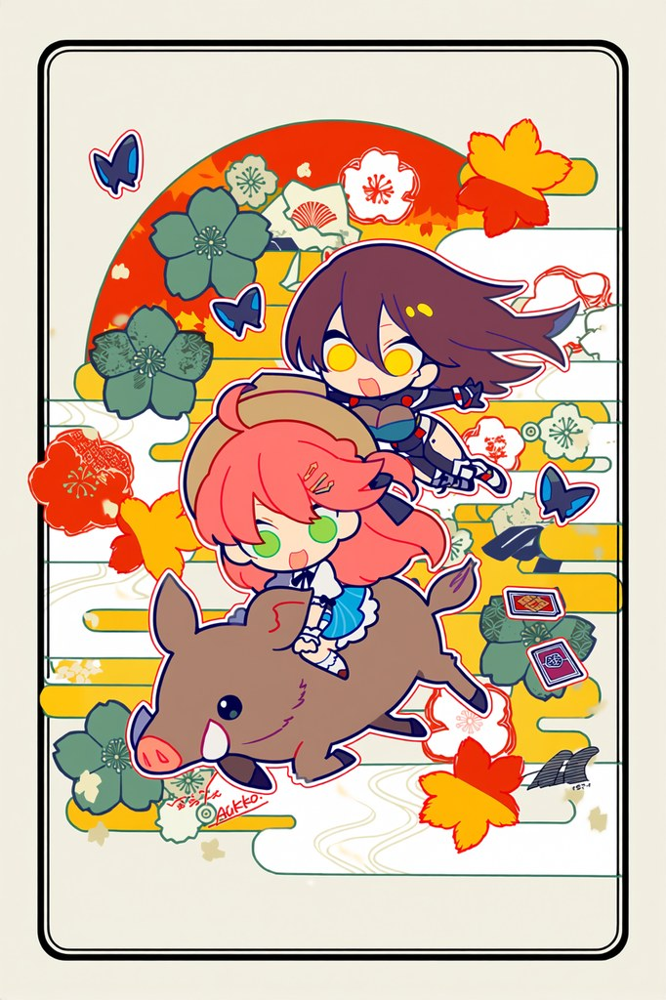

- **画风轴**：花札/粗线平涂
- **抄什么**：纯 2.9B。@auko + hanafuda-inspired card design + clean and thick outlines + minimal shading + (chibi style:2)。res_multistep、CFG 5。
- **底模**：`anima-2.9b-v1.0`
- **LoRA**：（无）
- **LoRA 链接**：（无）
- **纯底模与否**：是
- **画师 tag**：`@auko`
- **采样**：res_multistep / linear_quadratic · steps 30 · CFG 5.0 · 1024x1536
- **热度**：37 likes / 12 hearts / 4 comments
- **来源**：[civitai:141202521](https://civitai.com/images/141202521)
- **为何收录**：花札图形/粗线平涂：卡面边框与猪鹿蝶，不是 batch03 平涂小红帽。

**prompt**

```
@auko.
 newest, best quality, masterpiece, score_7, flat color illustration, safe, (chibi style:2), chibi,  
 2girls riding animal, riding boar, 
 2girls are roboco-san and sakura miko, happy and exxited expression,
 roboco-san \(high-spec t-shirt\) with yellow eyes,
 sakura miko \(street\) with green eyes,
 hanafuda-inspired card design, Ino-Shika-Chō motif, wild boar, graceful Japanese deer, butterflies, vibrant autumn maple leaves, traditional Japanese floral patterns, scattered hanafuda cards, black line decorative border, flat color style, bold shapes, clean and thick outlines, minimal shading, Japanese graphic design, minimalism composition, black and gold accents, washi paper texture,
```

**negative**

```
score_1, score_2, score_3, worst quality, low quality,
```

### 四格漫白底双手叉腰

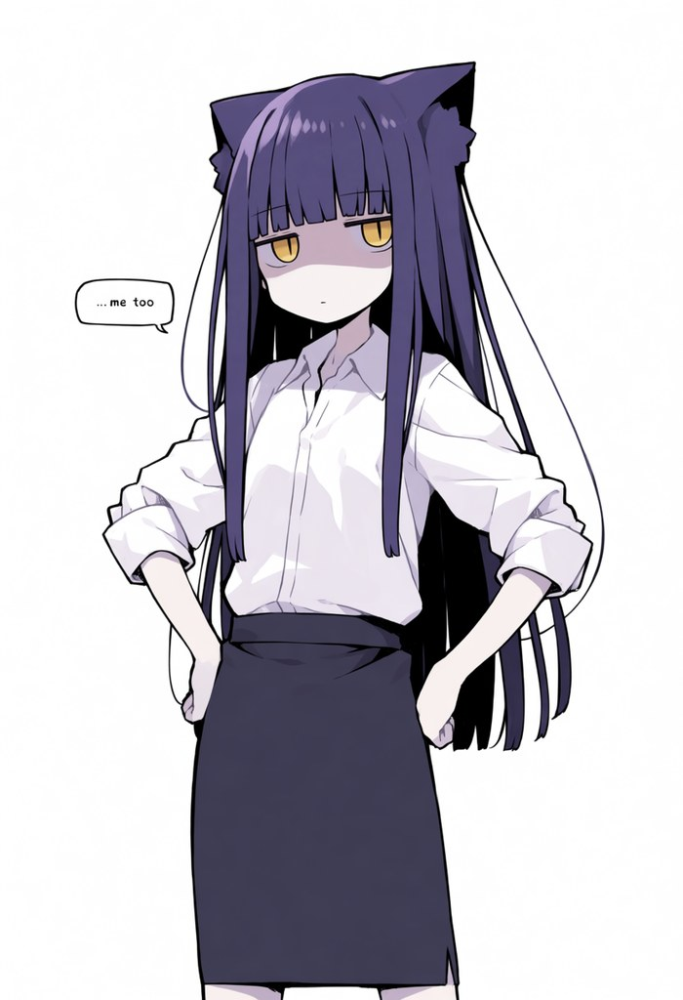

- **画风轴**：四格漫/粗线白底
- **抄什么**：纯 2.9B preview（int8 convrot 量化，需标注）。抄 @poco (asahi age), @aoi tori, jitome, speech bubble, white background。Euler + SGM Uniform、28 步、CFG 4。
- **底模**：`anima-2.9b-preview-v1-int8-convrot`
- **LoRA**：（无）
- **LoRA 链接**：（无）
- **纯底模与否**：是
- **画师 tag**：`@poco, @aoi tori`
- **采样**：Euler / SGM Uniform · steps 28 · CFG 4.0 · 832x1216
- **热度**：4 likes / 5 hearts
- **来源**：[civitai:139696184](https://civitai.com/images/139696184)
- **为何收录**：四格漫轴：对白气泡+死鱼眼白底，区别于 batch03 Q版堆叠。checkpoint 是 Gazingstars 2.9B 的 int8 量化预览。

**prompt**

```
masterpiece, best quality, score_7, safe, 1girl, chibi, cowboy shot, white background, @poco \(asahi age\), @aoi tori, 1girl, solo, cat ears, deep purple hair, long hair, straight hair, pointy hair, blunt bangs, yellow eyes, (slit pupils:0.8), jitome, white shirt, collared shirt, black collar, pale skin, expressionless, pencil skirt, hands on own hips, shaded face, looking away. 

A speech bubble says: "...me too."
```

**negative**

```
worst quality, low quality, score_1, score_2, score_3, artist name, sketch, unfinished, chromatic aberration, thick eyebrows, head out of frame, paw print, neck bell, colored inner hair, gradient hair, big breasts, hime cut, neck bell, chibi inset
```

### Noct 高定轮廓光

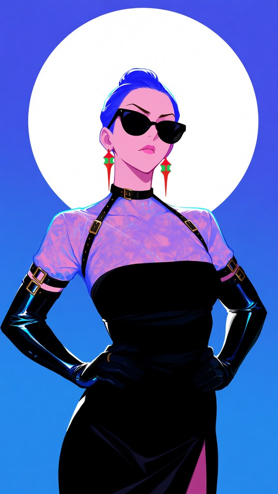

- **画风轴**：@Noct 高定图形
- **抄什么**：preview3 + @Noct + NoctAnima v1。正向极短 haute_couture / sunglasses / moon。负向故意写 anime, manga, vector——用来把画风推向时装插画。res_2s+beta57、CFG 7。
- **底模**：`anima-preview3-base`
- **LoRA**：`NoctAnimaV1`
- **LoRA 链接**：https://civitai.com/models/2570404?modelVersionId=2888105
- **纯底模与否**：否
- **画师 tag**：`@Noct`
- **采样**：res_2s / beta57 · steps 20 · CFG 7.0 · 864x1536
- **热度**：262 likes / 106 hearts / 2 comments
- **来源**：[civitai:129425125](https://civitai.com/images/129425125)
- **为何收录**：时装轮廓光图形：蓝底白圆+墨镜高定，@Noct LoRA，非赛博脊柱。

**prompt**

```
masterpiece, best quality, absurdres,  
@Noct,
1girl, haute_couture, asymmetrical_dress, structured_shoulders, leather_gloves, stiletto_heels, sunglasses, standing, one_hand_on_hip, looking_down, arrogant_smile, portrait, fantasy, upper body, moon
```

**negative**

```
unknownugly, bad, wrong, low quality, blurry, bw, grayscale, black and white, monochrome, anime, manga, vector, drawing, comix
```

### 魔理沙黑底星光

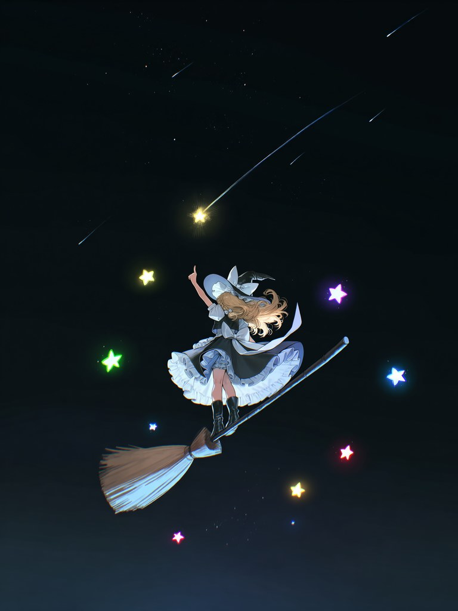

- **画风轴**：绘本轮廓光
- **抄什么**：纯 Base。多画师加权 (@quasarcake:1.1)(@kanzarin:1.1) 等 + black background + 分色 light tag（blue/green/purple/red/yellow light）。euler_ancestral/simple、CFG 5。
- **底模**：`anima-base-v1.0`
- **LoRA**：（无）
- **LoRA 链接**：（无）
- **纯底模与否**：是
- **画师 tag**：`@quasarcake, @sumiyao, @senapops, @kanzarin`
- **采样**：euler_ancestral / simple · steps 30 · CFG 5.0 · 3072x4096
- **热度**：459 likes / 131 hearts / 1 comments
- **来源**：[civitai:130798367](https://civitai.com/images/130798367)
- **为何收录**：绘本轮廓光：黑底彩星、多 @artist 无 LoRA，示范画师加权压过默认脸。

**prompt**

```
This anime illustration has excellent quality, and is a clean drawing hand-drawn by a human. year 2025, Exceptional quality that stands out as a truly outstanding illustration. (score_9, score_8, score_7:1.2), (masterpiece, best quality, good quality, highres, absurdres:1.2), (masterpiece, best quality, good quality, highres, absurdres:1.2), (@quasarcake:1.1), (@sumiyao \(amam\):0.5):, (poruserin:0.5), (@senapops:0.5), (@kanzarin:1.1), touhou, kirisame marisa, 1girl, arm up, black background, black boots, black dress, black hat, blue light, boots, bow, braid, broom, broom surfing, curly hair, danmaku, dress, falling star, from behind, from below, green light, hat, hat bow, hat ribbon, index finger raised, long hair, magic, night, night sky, petticoat, yellow hair, puffy short sleeves, puffy sleeves, purple light, red light, ribbon, short sleeves, side braid, sky, solo, star \(sky\), waist bow, white bow, white ribbon, wide shot, witch hat, yellow light,
```

**negative**

```
This anime illustration is unnatural and strange, and is an ugly and subpar illustration. worst quality, (worst aesthetic:1.1), bad quality, (score_1, score_2, score_3, score_4, score_5:1.2), lowres, bad anatomy, (artistic error:1.2), (bad:1.2), off-topic, multiple views, comic, extra digits, fewer digits, fewer, error, missing, jpeg artifacts, artist name, signature, twitter username, username, logo, watermark, scan, unfinished, variations, bad hands,
```

## Batch 05
主题：**画风差异续二（人物）**。避开 batch 03–04 已覆盖轴（赛璐璐/Q版堆/线稿/水彩/@loika/日本画/Wlop/赛博/网点/水墨武士/油画厚涂/@pile/鸟山明/浮世绘浪/吉卜力麦田/故障/胶片卧姿/花札/白底四格/@Noct/轮廓光）。

来源：Civitai Anima versionId（Newest + Most Reactions）及 Anima-2.9B（model 2855007）PNG workflow；prompt 均从 original PNG 抽出，未编造。

每条含：画风轴、抄什么、底模、LoRA(+链接)、纯底模与否、prompt、negative、采样、来源。

### 辉夜动画截图全身

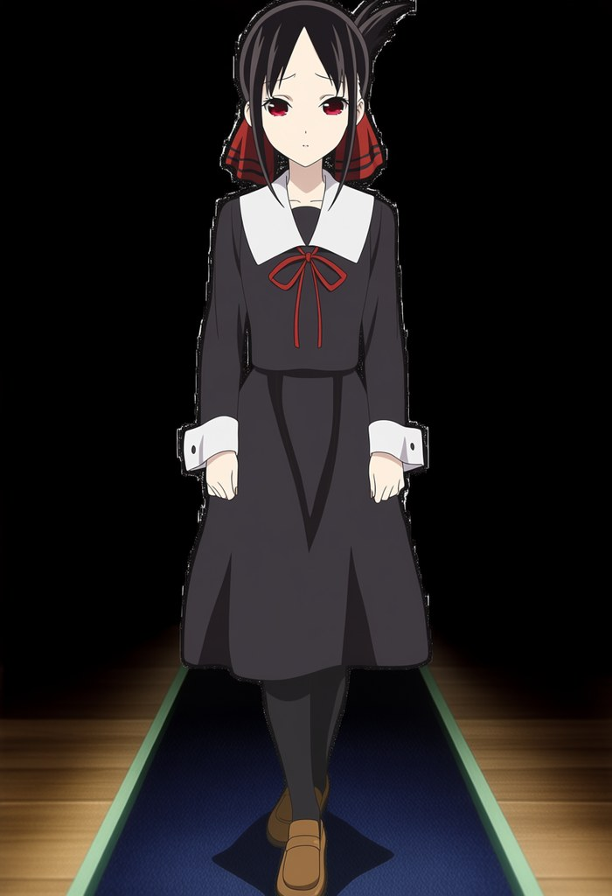

- **画风轴**：动画截图/TV 作画
- **抄什么**：纯 2.9B preview。正向极短：1girl, shinomiya kaguya, anime screencap。Euler a + Normal、25 步、CFG 5.5。不要叠 Illustrious。
- **底模**：`anima-2.9b-preview-v1`
- **LoRA**：（无）
- **LoRA 链接**：（无）
- **纯底模与否**：是
- **画师 tag**：（无）
- **采样**：euler_ancestral / normal · steps 25 · CFG 5.5 · 832x1216
- **热度**：4 likes / 2 hearts
- **来源**：[civitai:141346334](https://civitai.com/images/141346334)
- **为何收录**：90s/TV 作画与官方截图轴：纯 Anima-2.9B + anime screencap，赛璐璐硬阴影学兰全身，无 Illustrious 混模。对照 batch03 anime coloring 美琴与 batch04 鸟山明。

**prompt**

```
1girl, shinomiya kaguya, anime screencap,
```

**negative**

```
worst quality, sketch, cropped,
```

### 工笔红伞艺伎背影

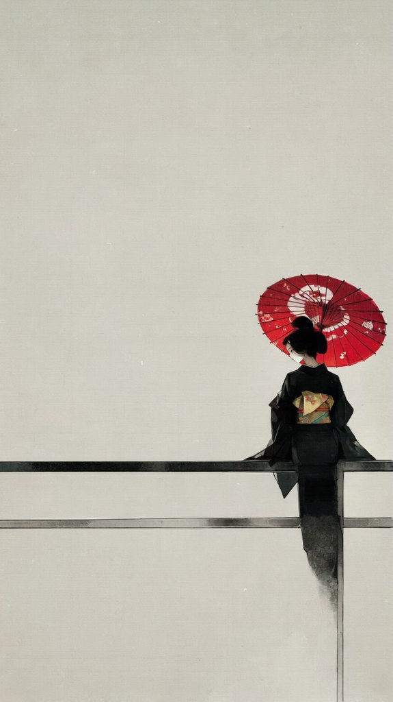

- **画风轴**：工笔/限色水墨人物
- **抄什么**：触发词 Dagongren Baozai + LoRA 1.0。抄 minimalist high-contrast / InkWatercolor style sketch / seen from behind。er_sde+beta、30 步、CFG 4。
- **底模**：`anima-base-v1.0`
- **LoRA**：`DagongrenBaozaiAnima:1`
- **LoRA 链接**：https://civitai.com/models/2178365?modelVersionId=2970799
- **纯底模与否**：否
- **画师 tag**：（无）
- **采样**：er_sde / beta · steps 30 · CFG 4.0 · 728x1296
- **热度**：894 likes / 276 hearts / 2 comments
- **来源**：[civitai:132491058](https://civitai.com/images/132491058)
- **为何收录**：水墨/工笔肖像轴：红伞艺伎背影+留白横线，比 batch04 挥刀武士更靠近工笔人物，不是风景。

**prompt**

```
score_9, score_8_up, score_8, bokeh, ultra-detailed, realistic,
<lora:DagongrenBaozaiAnima:1> Dagongren Baozai,


Create an image of a minimalist, high-contrast illustration of a solitary geisha, seen from behind. She stands precisely at the right edge of a thin, black, horizontal line that extends from the left edge of the image across the lower quarter. Positioned slightly to the right of the center and very low, she creates a vast, empty, textured gray background above her. Her body forms a small, black silhouette with a straight, elegant posture, long kimono sleeves, a close-fitting obi, and a neat, traditional updo. One foot rests at the edge of the line, the other slightly behind it, creating a serene, graceful pose. Above her head, she holds a red, flower-adorned Chinese parasol, tilted slightly to the right. The dark ribs and delicate, painted blossoms are visible. Flat colors, black outlines, intense shadows, clear graphic forms, subtle sheen, quiet solitude, refined, cinematic composition, award-winning, a masterpiece. In the style of ff-td, Nistyle, a masterpiece, award-winning, pingtu style, illustration-fen, InkWatercolor style sketch., InkWatercolor style sketch with accentuated linework
```

**negative**

```
worst quality, low quality, score_1, score_2, score_3,watermark, text, signature, artist name, logo, web address, bad hands, mutated hands, extra fingers, missing fingers, extra digits, fewer digits, fused fingers, deformed hands, poorly drawn hands, bad anatomy, deformed fingers, hands with too many fingers, chromatic aberration
```

### 星空水墨剪影长发

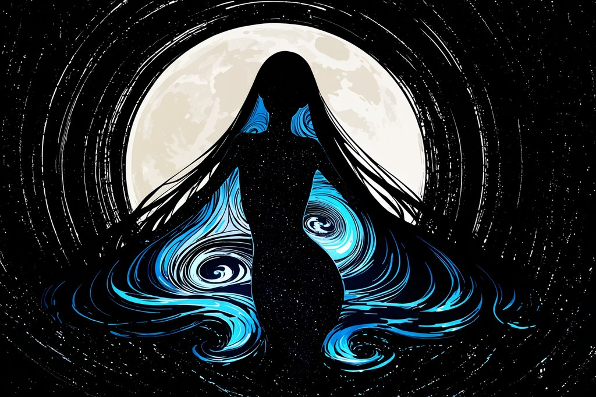

- **画风轴**：水墨剪影/图形版画
- **抄什么**：纯 Aesthetic v1.1。抄 Ink wash painting style, InkWatercolor style, vector art, swirling brushstroke, cosmic hair, full moon。er_sde+beta、32 步、CFG 4。
- **底模**：`anima-aesthetic-v1.1`
- **LoRA**：（无）
- **LoRA 链接**：（无）
- **纯底模与否**：是
- **画师 tag**：（无）
- **采样**：er_sde / beta · steps 32 · CFG 4.0 · 1344x896
- **热度**：92 likes / 30 hearts / 2 comments
- **来源**：[civitai:140705665](https://civitai.com/images/140705665)
- **为何收录**：水墨肖像+图形版画：星月剪影与漩涡线，比武士更近肖像；prompt 是水墨/vector 而非彩色教堂玻璃。

**prompt**

```
masterpiece, very aesthetic, best quality, absurdres , 
, minimalist composition , Ink wash painting style,InkWatercolor style , vector art , swirling brushstroke , abstract , solo ,
 1 girl , swirling starry sky , cosmic hair , double exposer , very long hair , tentacle moon , full moon , eldritch
```

**negative**

```
lowres, worst quality, bad quality, bad anatomy, sketch, jpeg artifacts, signature, watermark, artist name, old, oldest, sparkles, speech bubble, bad hands, text, words,
```

### 但丁ligne claire 背影

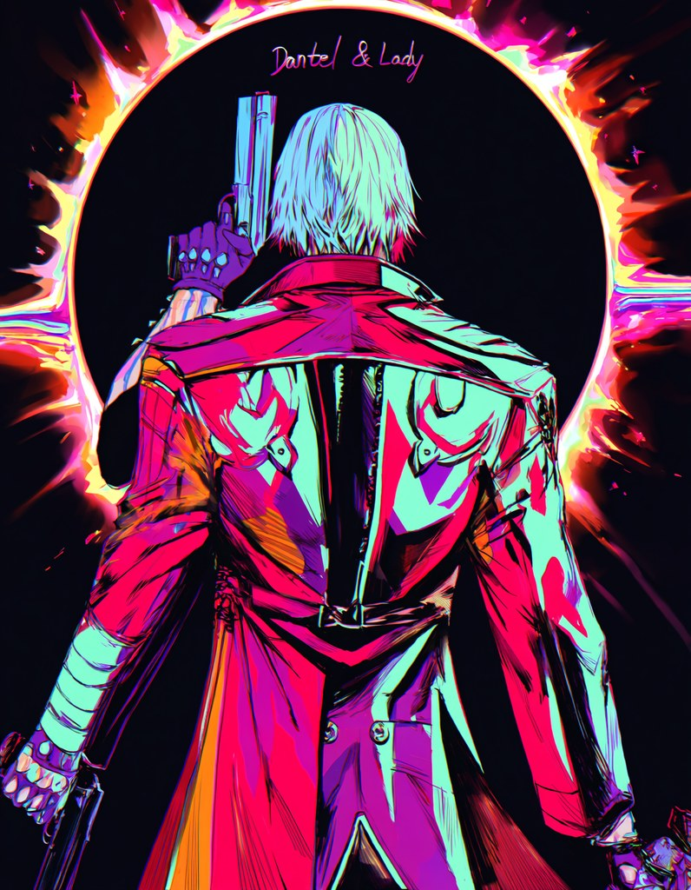

- **画风轴**：ligne claire / 西漫粗线
- **抄什么**：纯 2.9B preview。必带 ligne claire；角色 dante (devil may cry) + solar eclipse + back-to-back/holding gun。er_sde+beta、30 步、CFG 3.5。无 Illustrious。
- **底模**：`anima-2.9b-preview-v1`
- **LoRA**：（无）
- **LoRA 链接**：（无）
- **纯底模与否**：是
- **画师 tag**：（无）
- **采样**：er_sde / beta · steps 30 · CFG 3.5 · 1120x1440
- **热度**：4 likes / 4 hearts
- **来源**：[civitai:139549884](https://civitai.com/images/139549884)
- **为何收录**：西漫/ligne claire 轴：纯 Anima UNET，prompt 写明 ligne claire，高对比霓虹背影持枪，非 Illustrious 双模。

**prompt**

```
masterpiece, best quality, highres, absurdres, newest, year 2025, dante \(devil may cry\), lady \(devil may cry\), devil may cry \(series\), title "Dante & Lady", solar eclipse, crescent solar eclipse, solar flare, ligne claire, back-to-back, hand up, holding gun, colorful,
```

**negative**

```
lowres, bad quality, worst quality, score_1, score_2, score_3, jpeg artifacts, signature, watermark, english text
```

### 35mm 街灯学兰回眸

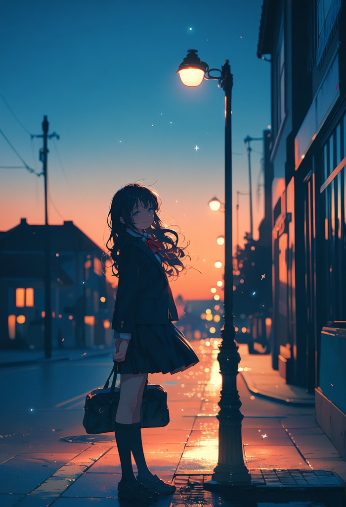

- **画风轴**：胶片剧照/电影感人物
- **抄什么**：纯 preview2。抄 cinematic photo, 35mm photograph, film, bokeh, cinematic lighting + 站姿学兰街灯，不要卧姿时尚大片。res_multistep + SGM Uniform、30 步、CFG 4。
- **底模**：`anima-preview2`
- **LoRA**：（无）
- **LoRA 链接**：（无）
- **纯底模与否**：是
- **画师 tag**：（无）
- **采样**：res_multistep / sgm_uniform · steps 30 · CFG 4.0 · 832x1216
- **热度**：77 likes / 41 hearts / 1 comments
- **来源**：[civitai:124905892](https://civitai.com/images/124905892)
- **为何收录**：胶片剧照轴：35mm photograph + 站姿回眸，不是 batch04 粉羽卧姿时尚大片。

**prompt**

```
masterpiece, best quality,very aesthetic, disheveled hair, perfect composition, intricate details, cinematic photo, 35mm photograph, film, bokeh, professional, highly detailed, 1girl, solo, full body, side view, long wavy dark blue hair, blue eyes, soft narrowed eyes, gentle smile, light blush, navy school blazer, white shirt, red ribbon, pleated skirt, black knee socks, loafers, school bag in one hand, standing beneath a glowing streetlamp on a quiet residential street at twilight, warm orange sunset light fading into deep blue evening tones, soft reflections shimmering across the pavement and glass windows, a faint breeze lifting her hair and ribbon, scattered floating dust motes and tiny sparkles catching the last light, calm atmosphere, cinematic lighting, subtle glow, detailed background
```

**negative**

```
worst quality, low quality, score_1, score_2, score_3,
```

### esuthio 天使持花

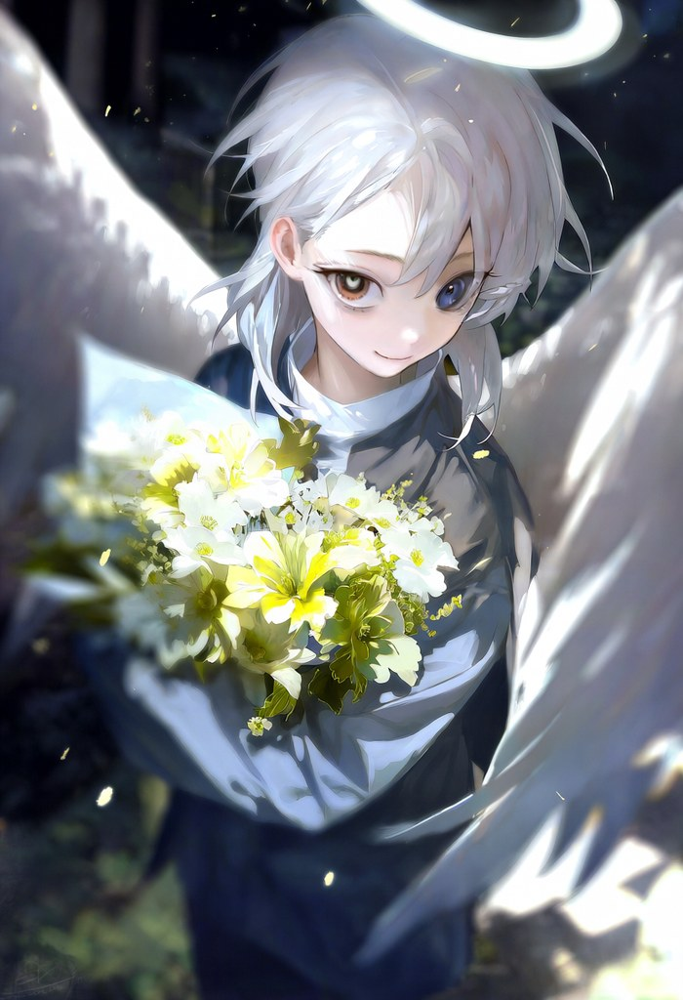

- **画风轴**：@esuthio 电影感肖像
- **抄什么**：纯 2.9B preview。画师 tag @esuthio；抄 mismatched pupils / angel wings / holding bouquet / blurry edges / portrait。res_multistep+beta57、50 步、CFG 4。负向原图为空。
- **底模**：`anima-2.9b-preview-v1`
- **LoRA**：（无）
- **LoRA 链接**：（无）
- **纯底模与否**：是
- **画师 tag**：`@esuthio`
- **采样**：res_multistep / beta57 · steps 50 · CFG 4.0 · 832x1216
- **热度**：7 likes / 3 hearts
- **来源**：[civitai:139608964](https://civitai.com/images/139608964)
- **为何收录**：画师肖像轴：@esuthio 浅景深持花天使，电影光，非默认 Aesthetic 1girl 站姿。

**prompt**

```
masterpiece, best quality, score_7,
@esuthio,
1boy, solo, bishounen, androgynous, angel, angel wings, mismatched pupils, smile, holding bouquet, 
particles floating as if about to vanish. graveyard, blurry edges, three quarter view, portrait,
```

**negative**

```
（空）
```

### Haiz 自由女神与跪献机器人

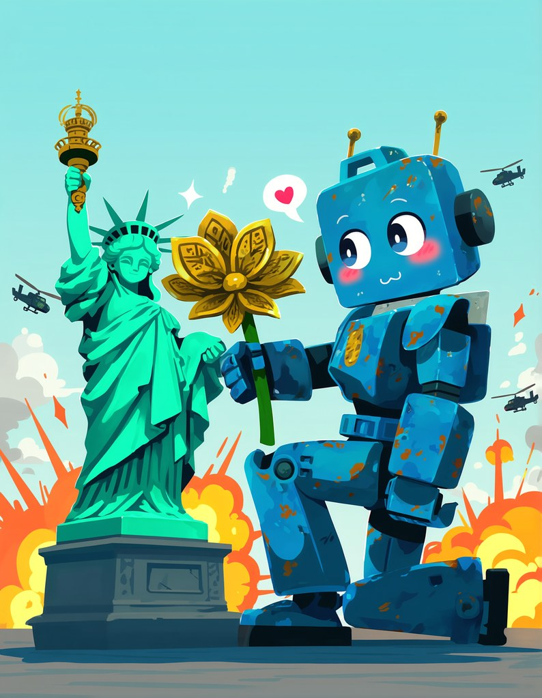

- **画风轴**：@haiz_ai 无线稿西式卡通
- **抄什么**：画师 tag @haiz_ai + LoRA 1.0。抄 no lineart, large eyes, tareme。euler+beta、30 步、CFG 5。负向 ban photo/realistic。
- **底模**：`anima-base-v1.0`
- **LoRA**：`Style_soph-HaizAI-ANIMA:1`
- **LoRA 链接**：https://civitai.com/models/2419327?modelVersionId=2951332
- **纯底模与否**：否
- **画师 tag**：`@haiz_ai`
- **采样**：euler / beta · steps 30 · CFG 5.0 · 1160x1496
- **热度**：706 likes / 230 hearts / 3 comments
- **来源**：[civitai:131258926](https://civitai.com/images/131258926)
- **为何收录**：西式卡通/无线稿：自由女神与跪献机器人，粗色块无线，Anima Base + Haiz LoRA，非双 Illustrious。

**prompt**

```
absurdres, masterpiece, score_7  <lora:Style_soph-HaizAI-ANIMA:1> @haiz_ai, large eyes, no lineart, tareme, a scene where on the left is the statue of liberty with green skin. On the right is a large rusty blue robot presenting a large gold metal flower to the statue, blushing and averting gaze on one knee. The robot has a :3 face and spoken heart coming out of it's face. In the background are explosions and helicopters
```

**negative**

```
(photo, realistic), score_1, score_2, score_3, blurry, jpeg artifacts, sepia, blurry, bad anatomy, extra limbs, deformed, watermark, text, signature, artifacts,  copyrights name, jpeg_artifacts, scan_artifacts, bad hands, missing fingers, extra digit, fewer digits, artistic error, ye-pop, deviantart, logo, patreon logo, child, loli, aged_down
```

### p1ct01 花田举相机

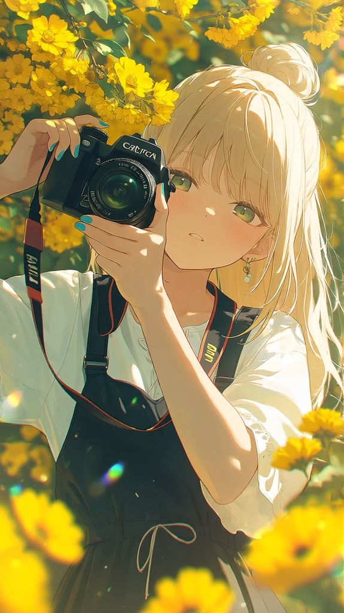

- **画风轴**：official art / 宣传卡面
- **抄什么**：official art + @p1ct01 + LoRA p1ct01_v1_epoch20:1。抄 film grain / prism light / shallow depth of field。euler+simple、24 步、CFG 6。非鸟山明。
- **底模**：`anima-aesthetic-v1.0`
- **LoRA**：`p1ct01_v1_epoch20:1`
- **LoRA 链接**：https://civitai.com/models/2640938?modelVersionId=2965335
- **纯底模与否**：否
- **画师 tag**：`@p1ct01`
- **采样**：euler / simple · steps 24 · CFG 6.0 · 728x1296
- **热度**：70 likes / 17 hearts
- **来源**：[civitai:140112625](https://civitai.com/images/140112625)
- **为何收录**：官方卡面轴（非鸟山明）：prompt 带 official art + @p1ct01，花田举相机，浅景深宣传插画。

**prompt**

```
masterpiece,best quality,very aesthetic,absurdres,score_9,score_8,year 2025,newest,highres,official art,depth of field,
1girl,solo,blonde hair,long hair,hair bun,messy hair,bangs,sidelocks,earrings,necklace,blue nails,nail polish,white shirt,collared shirt,short sleeves,black dress,pinafore dress,camera,compact camera,holding camera,camera strap,raised arm,looking at viewer,parted lips,upper body,close-up,tilted angle,dynamic angle,depth of field,shallow depth of field,blurry foreground,bokeh,yellow flower,flowers,flower field,outdoors,spring,sunlight,dappled sunlight,warm light,lens flare,chromatic aberration,prism light,film grain,soft focus,
A blonde girl in a white shirt and black pinafore raises a compact film camera near her face while yellow flowers fill the frame around her. Her green gaze meets the viewer through warm spring sunlight,with foreground blossoms melting into soft bokeh and small prismatic flares scattered across the image.,
strong rim light,Cinematic Lighting,available light,background light,moody lighting,
<lora:p1ct01_v1_epoch20:1>@p1ct01,
```

**negative**

```
score_1, score_2, score_3, blurry, worst quality, low quality, jpeg artifacts, signature, watermark, username, error, deformed hands, bad anatomy, extra limbs, poorly drawn hands, poorly drawn face, mutation, deformed, extra eyes, extra arms, extra legs, malformed limbs, fused fingers, too many fingers, long neck, cross-eyed, bad proportions, missing arms, missing legs, extra digit, fewer digits,
```

### Himmis 烟花拟人鹿

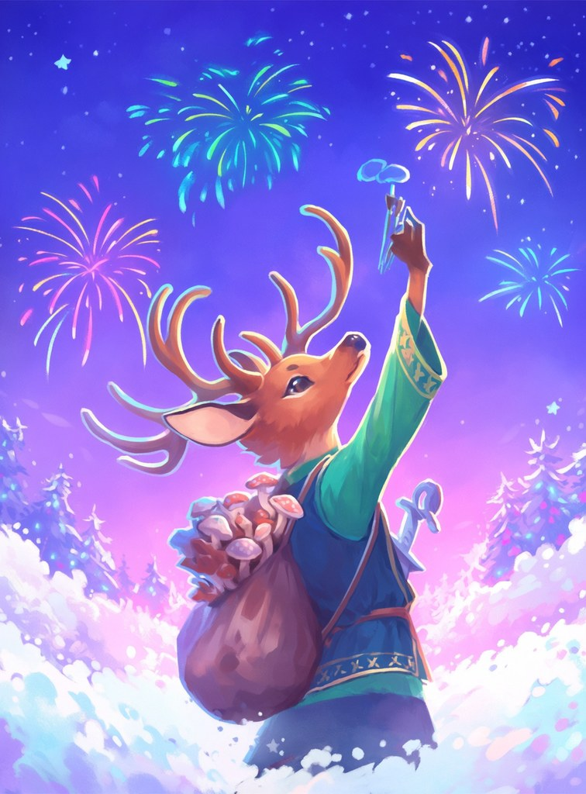

- **画风轴**：@himmis 绘本拟人
- **抄什么**：画师 tag @himmis + LoRA Himmis_v2:1。正向是一长串名词堆（peafowl/deer/fireworks/mushroom…），靠 LoRA 压成绘本拟人。er_sde+beta、32 步、CFG 4。
- **底模**：`anima-base-v1.0`
- **LoRA**：`Himmis_v2:1`
- **LoRA 链接**：https://civitai.com/models/2749766?modelVersionId=3093321
- **纯底模与否**：否
- **画师 tag**：`@himmis`
- **采样**：er_sde / beta · steps 32 · CFG 4.0 · 1088x1472
- **热度**：782 likes / 274 hearts / 1 comments
- **来源**：[civitai:135583080](https://civitai.com/images/135583080)
- **为何收录**：@himmis 绘本拟人：烟花雪地持菇鹿人，厚涂故事书，不是吉卜力麦田也不是 Q 版堆。

**prompt**

```
@himmis, with peafowl manipulation deer coffee crow fireworks fur pince-nez drinking deity doughnut smile pantherine star lighting open robe guardian knife reins tuft bag tree bust multicolored webbed shiny stripes barbell runes vest puddle plant flora hand paws border new bubble night sandwing genus partially finger unguligrade cocktail brass basket library up own fungus vehicle teal role-playing horn string blush mushroom spread mustelid mythological goggles pumpkin antlers machine
<lora:Himmis_v2:1>
```

**negative**

```
worst quality, low quality, score_1, score_2, score_3, jpeg artifacts, sepia, artist signature, signature, artist name, watermark,
```

### honnryou 教室逆光少年

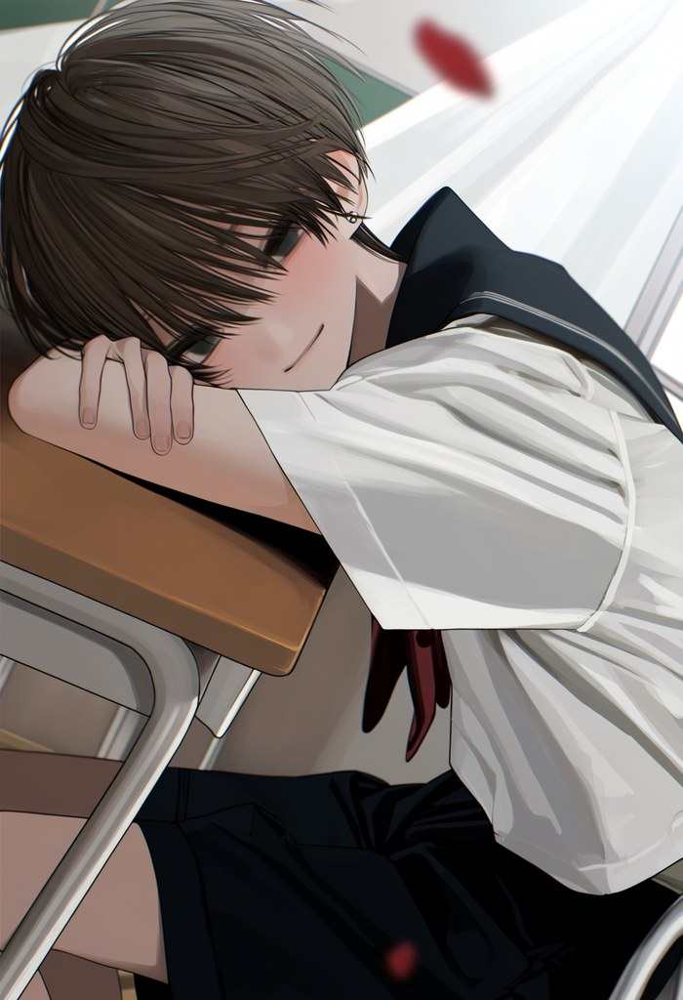

- **画风轴**：@honnryou 逆光少年
- **抄什么**：纯 2.9B preview。@honnryou hanaru + serafuku 1boy + sunbeam / depth of field / diagonal angle。res_multistep + linear_quadratic、50 步、CFG 4。负向原图为空。
- **底模**：`anima-2.9b-preview-v1`
- **LoRA**：（无）
- **LoRA 链接**：（无）
- **纯底模与否**：是
- **画师 tag**：`@honnryou hanaru`
- **采样**：res_multistep / linear_quadratic · steps 50 · CFG 4.0 · 832x1216
- **热度**：9 likes / 3 hearts
- **来源**：[civitai:139609716](https://civitai.com/images/139609716)
- **为何收录**：画师+电影光：教室窗光 1boy，纯底模无 LoRA，对照默认女立绘。

**prompt**

```
masterpiece, best quality, score_7,
@honnryou hanaru,
1boy, solo, bishounen, smile, looking at viewer, light blush,
baggy shorts, serafuku, short sleeves, stud earrings,
(against desk), on chair,
(perspective:1.2), (close-up), diagonal angle, from side, vanishing point, blurry,
classroom, indoors, curtains, wind, petals, depth of field, sunbeam,
```

**negative**

```
（空）
```

### 漫画气泡黑猫吃黄瓜

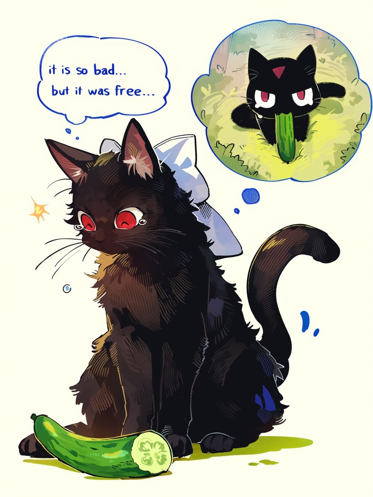

- **画风轴**：漫画气泡单格
- **抄什么**：纯 preview3。抄 thought bubble 台词 + @karasu raven / @kaamin。er_sde+simple、30 步、CFG 5。这是单格对白，不是四格分镜。
- **底模**：`anima-preview3-base`
- **LoRA**：（无）
- **LoRA 链接**：（无）
- **纯底模与否**：是
- **画师 tag**：`@karasu raven, @kaamin`
- **采样**：er_sde / simple · steps 30 · CFG 5.0 · 960x1280
- **热度**：808 likes / 262 hearts
- **来源**：[civitai:127584865](https://civitai.com/images/127584865)
- **为何收录**：漫画面板替代轴：思想气泡+排线，不是 batch04 白底粗线四格，也还不是真 4koma 分镜。

**prompt**

```
year_2025, newest, score_9, score_8, best_quality, masterpiece, highres, absurdres

len \(tsukihime\), bow, white bow, black cat, cat, feral cat, sitting, she is eating cucumber

in thought bubble there are her thoughts "it is so bad... but it was free..."

Cat is crying but eating cucumber
[@karasu raven | realistic | @kaamin \(mariarose753\)]
4toes, digitigrade, quadruped
```

**negative**

```
worst quality, low quality, score_1, score_2, score_3, blurry, jpeg artifacts, monochrome,erotic, questionable, anthro, explicit
```

### 仙侠护体气刃与龙

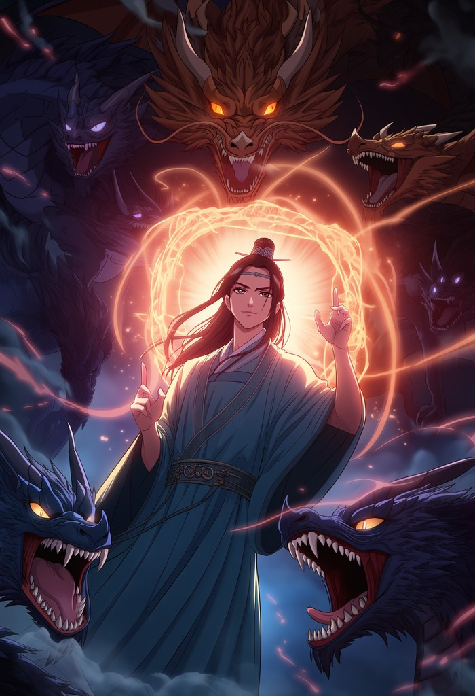

- **画风轴**：仙侠/动画上色男性
- **抄什么**：纯 2.9B v1.0。抄 anime coloring + xianxia/wuxia + chinese dragon demons + cinematic lighting。res_multistep + linear_quadratic、50 步、CFG 4。
- **底模**：`anima-2.9b-v1.0`
- **LoRA**：（无）
- **LoRA 链接**：（无）
- **纯底模与否**：是
- **画师 tag**：（无）
- **采样**：res_multistep / linear_quadratic · steps 50 · CFG 4.0 · 1872x2736
- **热度**：2 likes / 1 hearts
- **来源**：[civitai:139786798](https://civitai.com/images/139786798)
- **为何收录**：国风仙侠动画上色：2.9B 纯底模男性护体+群龙，非默认美型站姿，也非鸟山明。

**prompt**

```
highres, absurdres, masterpiece, best quality, newest, score_9, score_7, year 2025, anime coloring,

chinese fantasy, xianxia, wuxia, cultivation, wise and compassionate elder, calm protective stance, standing upright, arms raised in defensive gesture, protective Ki barrier, shielding pose, defiant but peaceful expression, determined eyes, guardian stance, channeling glowing Ki energy, self-confident expression, undisturbed and fearless, surrounded by ominous dark mist, (demonic creatures attacking from behind:1.2), monsters closing in, threatening creatures surrounding him, danger approaching, defensive situation, (chinese dragon demons:1.2), sharp claws, fangs, glowing eyes, dark silhouettes, clearly defined monster shapes, energy shield of softly glowing Ki radiating outward, swirling magical particles, taoist robes flowing in the air, cinematic lighting, mystical atmosphere, ethereal tones, battle-ready tension in the scene, nightmarish energy around but warrior is calm,
(detailed hands:1.2),

dutch angle, bust shot, face and chest focus, looking up at viewer, dynamic pose, dramatic lighting, cowboy shot,

deep shadows, rich colors, soft shading, natural colors, warm tones,
```

**negative**

```
blurry face, obscured face, faceless, bad hands, extra fingers, fused fingers, deformed hands, overexposed, blown out highlights, white blob, muddy background, blurry background, undefined shapes, amorphous background, brown soup,
```

## Batch 06
主题：**画风目录缺口（人物）**。避开 01–05 已覆盖轴。优先填 4koma/gutter、网点、印象派脸、3.8B；像素/year 199x 无 Illustrious/彩绘玻璃无诚实 PNG 则跳过另选轴。

来源：Civitai Anima UNET PNG workflow（Newest + Most Reactions）。prompt 均从 original PNG 抽出，未编造。

每条含：画风轴、抄什么、底模、LoRA(+链接)、纯底模与否、prompt、negative、采样、来源。

### 铃兰三格赛车漫画页

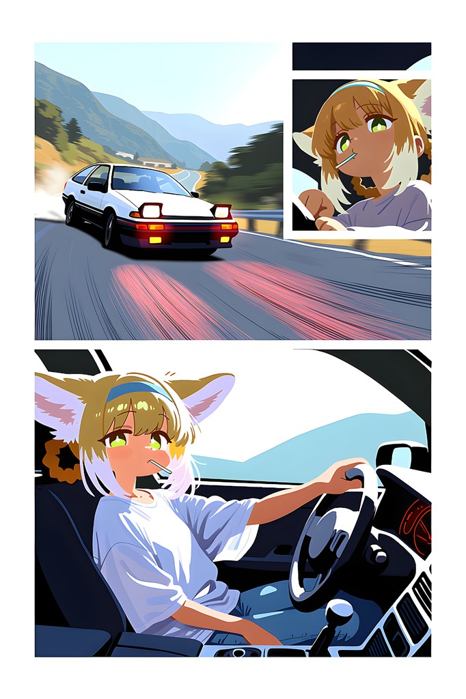

- **画风轴**：漫画分镜/gutter 多格
- **抄什么**：纯 preview2。抄 multiple views, manga page, motion lines + @waonaolmao。er_sde+simple、30 步、CFG 6。三格分镜不是四格。
- **底模**：`anima-preview2`
- **LoRA**：（无）
- **LoRA 链接**：（无）
- **纯底模与否**：是
- **画师 tag**：`@waonaolmao`
- **采样**：er_sde / simple · steps 30 · CFG 6.0 · 1600x2400
- **热度**：55 likes / 22 hearts
- **来源**：[civitai:124115804](https://civitai.com/images/124115804)
- **为何收录**：真漫画分镜轴：白 gutter 三格（漂移/脸/车内），不是 batch04 白底单格四格也不是 batch05 思想气泡。

**prompt**

```
@waonaolmao
full color, solo
newest, highres, absurdres
score_9, score_8
newest, masterpiece, best quality
white shirt, oversized shirt, drifting
suzuran \(arknights\) driving toyota sprinter trueno in the mountain road drifting, motion lines, speed lines, red car lights, green eyes, multiple views, manga page, realistic car.

There is a main view of a car drifting fastly and a  view (in the right top corner) of a car interior with suzuran sitting there with her hand on stirring wheel and hand on handle, she looks absolutely calm with lollipop in her mouth. She is aged up, slim, and She also wears jeans. She is unimpressed with slight smirk.

toyota sprinter trueno, AE85
initial d
```

**negative**

```
（空）
```

### 网点漫画·搅拌机早餐

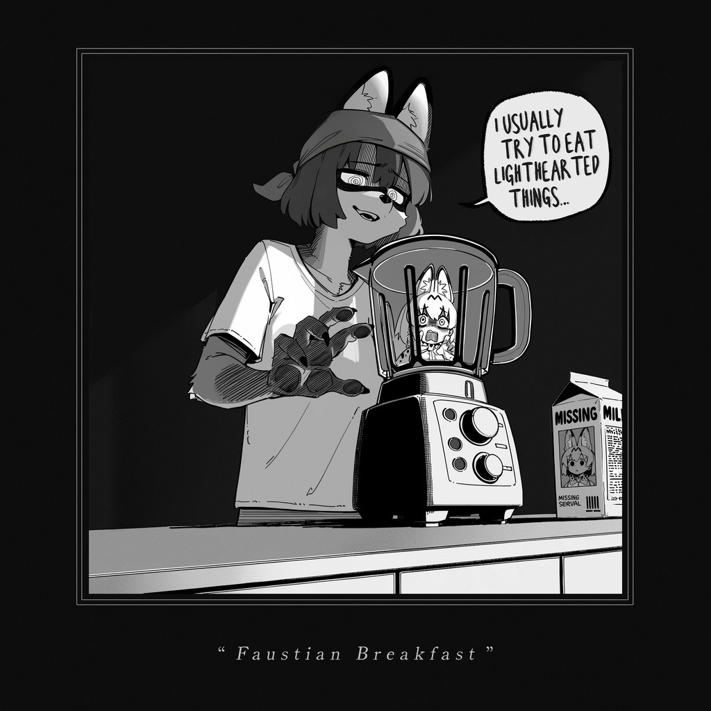

- **画风轴**：漫画网点/screentone 单格
- **抄什么**：抄 comic, lineart, half-tone, hatching + @machuuu68 / @num。LoRA RDBT preview2 ≈1。DPM++ 2M SDE + Beta、40 步、CFG 3。
- **底模**：`anima-preview2`
- **LoRA**：`anima_preview2_rdbt_finetuned_cfg_distilled_v0.23:1`
- **LoRA 链接**：https://civitai.com/models/2364703
- **纯底模与否**：否
- **画师 tag**：`@machuuu68, @num`
- **采样**：dpmpp_2m_sde / beta · steps 40 · CFG 3.0 · 2560x2560
- **热度**：87 likes / 41 hearts / 6 comments
- **来源**：[civitai:126468970](https://civitai.com/images/126468970)
- **为何收录**：网点/screentone 轴：单格黑白漫画半色调，不是四格，也不是 batch03 彩色网点铠甲。

**prompt**

```
2girls
score_7,  highres, absurdres,

female furry, raccoon girl, medium hair, head bandana, bedhair, white t-shirt, standing, stern, finger raised, about to use blender, jitome, furrowed brow, talking, ringed eyes,

serval \(kemono friends\), scary, pleading, hands against glass, inside blender, kitchen,

@machuuu68, @num \(angrynum\), 2d, black and white, digital art, comic, lineart, half-tone, perspective, hatching, simple background, dark background, wide shot, from side, horror \(theme\),

on one side is a furry raccoon girl is standing over a kitchen counter with a serious, frightening look on her face. she is looking at a glass blender with her hand raised and about to turn on a blender on the counter. we see her from the front at a skewed angle. the raccoon girl has a partially shaded face, giving her an evil look. creepy light smile curl to her mouth.

 the raccoon girl is physically larger than the blender due to the camera perspective. her hand is reaching down towards the blender,

on the other side is a kitchen counter with a blender and a carton of milk,  inside the blender is Serval from Kemono Friends, scared and pleading. we see the blender from behind,

there is a comic dialogue bubble coming from the raccoon girl's mouth. the raccoon girl is saying "I usually try to eat lighthearted things." the font of the text is newspaper comic font, sketchy and loose, 

the perspective is at a rotate angle, leading to asymmetrical separation between the raccoon girl and the blender

 <lora:anima_preview2_rdbt_finetuned_cfg_distilled_v0.23:1>
```

**negative**

```
gradient, smooth colors, 3d, spot light, two-panel layout, multiple views, split view, vignette, POV, both hands raised,
```

### 印象派油画头像 Kuro

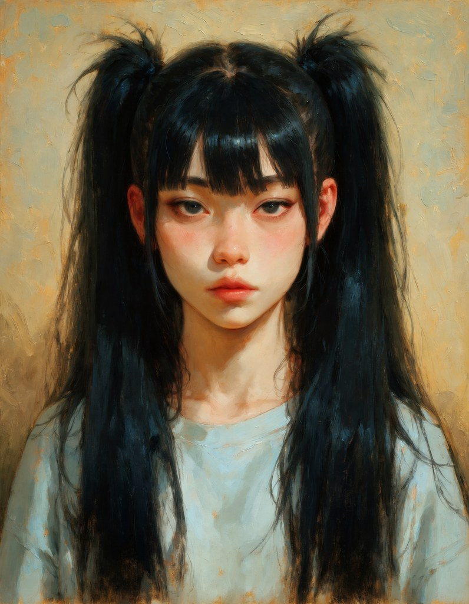

- **画风轴**：印象派人物脸
- **抄什么**：抄 An impressionist oil painting / traditional media, impressionism, portrait。角色 LoRA KiyamiKuro_ani_v2:1。ER SDE+Beta、30 步、CFG 3.5。不要叠 Illustrious。
- **底模**：`anima-2.9b-preview-v1-int8-convrot`
- **LoRA**：`KiyamiKuro_ani_v2:1`
- **LoRA 链接**：https://civitai.com/models/2818914?modelVersionId=3182902
- **纯底模与否**：否
- **画师 tag**：（无）
- **采样**：er_sde / beta · steps 30 · CFG 3.5 · 1344x1728
- **热度**：12 likes / 2 hearts
- **来源**：[civitai:141344281](https://civitai.com/images/141344281)
- **为何收录**：印象派脸：可见笔触头肩像，不是 batch04 刀刮厚涂提灯全身，也不是水彩。

**prompt**

```
masterpiece, best quality, highres, absurdres, newest, year 2025, An impressionist oil painting of Kuro. 1girl, kuro, black hair, long hair, twintails, oversized shirt, traditional media, impressionism, portrait, <lora:KiyamiKuro_ani_v2:1>
```

**negative**

```
lowres, bad quality, worst quality, score_1, score_2, score_3, jpeg artifacts, signature, watermark,
```

### Anima-3.8B 学兰赤发少女

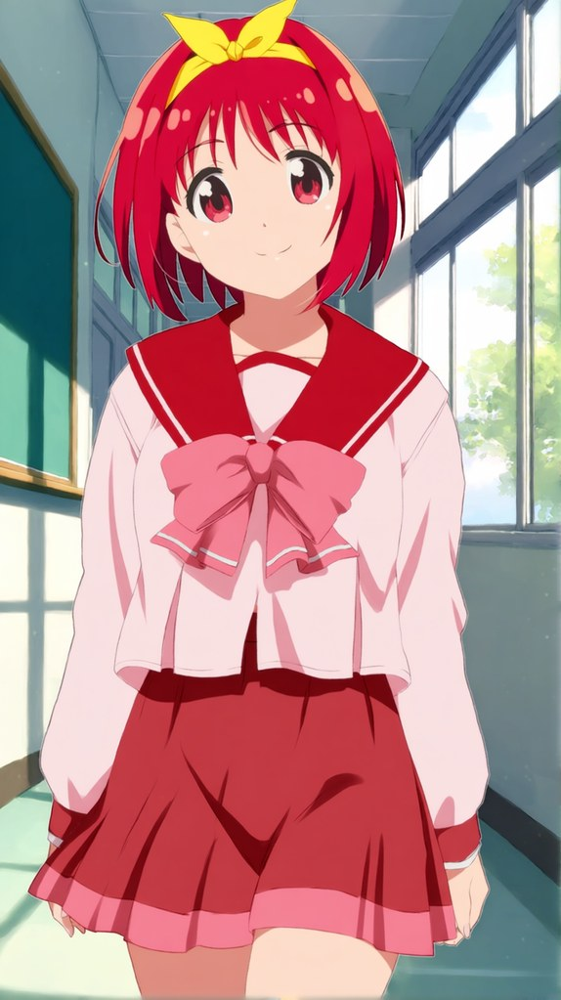

- **画风轴**：Anima-3.8B 人物
- **抄什么**：UNET Anima-3.8B.safetensors + Qwen adapter。角色 LoRA kamigishi_akari-anima:1。res_multistep+beta、40 步、CFG 8。prompt 写 year 2025，不要当成 year 199x。
- **底模**：`anima-3.8b`
- **LoRA**：`kamigishi_akari-anima:1.0`
- **LoRA 链接**：https://civitai.com/models/2678447
- **纯底模与否**：否
- **画师 tag**：（无）
- **采样**：res_multistep / beta · steps 40 · CFG 8.0 · 840x1496
- **热度**：3 likes / 4 hearts
- **来源**：[civitai:140836817](https://civitai.com/images/140836817)
- **为何收录**：3.8B 人物轴：走廊学兰，底模是 Anima-3.8B 不是 Aesthetic/Turbo。视觉像 90s 但原 prompt 是 year 2025。

**prompt**

```
masterpiece, best quality, high quality, newest, year 2025, year 2024, 
Description:
kamigishi akari, a girl with red short hair, yellow hairband with a knot and red eyes. She is standing in cowboy shot, in the school corridor, smiling and facing the viewer. She wears pink serafuku with red sailor collars, pink bowtie, red pleated miniskirt with pink trim. sunlight comes from the window on the right side. Best quality, masterpiece.
```

**negative**

```
worst quality, low quality, score_1, score_2, score_3, blurry, jpeg artifacts, sepia,
```

### 限色 oekaki 阿卡多

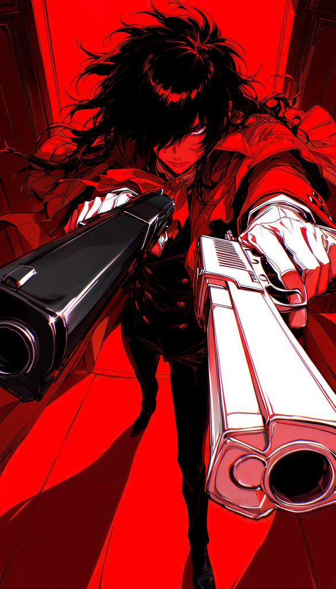

- **画风轴**：限色 oekaki / 高对比
- **抄什么**：抄 oekaki, limited palette, red theme, rough sketch。两枚质量 LoRA 各 1.0。res_3m_ode_beta、30 步、CFG 4.5。
- **底模**：`anima-preview3-base`
- **LoRA**：`Anima Highres/Aesthetic Boost:1.0; Aesthetic Quality Modifiers - Masterpiece v5.0:1.0`
- **LoRA 链接**：https://civitai.com/models/2540444?modelVersionId=2855073 | https://civitai.com/models/929497?modelVersionId=2905490
- **纯底模与否**：否
- **画师 tag**：（无）
- **采样**：res_3m_ode_beta · steps 30 · CFG 4.5 · 1536x2688
- **热度**：421 likes / 129 hearts / 8 comments
- **来源**：[civitai:130290349](https://civitai.com/images/130290349)
- **为何收录**：限色 oekaki：红黑白三色低角度双枪，对照 batch01 默认 Aesthetic 阿卡多与 batch03 线稿。

**prompt**

```
(masterpiece, best quality, amazing quality, very aesthetic, extremely detailed, very detailed, absurdres, newest, highres, score_9, score_8), 

1boy, solo, long hair, black hair, holding, weapon, holding weapon, white gun, black gun, holding gun, handgun, red theme, aiming at viewer, hair over one eye, dual wielding, oekaki, limited palette, red theme, rough sketch, alucard\ (hellsing\), door,

depth of field, weapon perspective, dynamic angle, foreshortening,,
```

**negative**

```
score_4, score_5, score_6, recent, glitch, deformed, mutated, ugly, disfigured, sketch, poorly drawn, lowres, low detail, bad anatomy, bad proportions, deformed anatomy, deformed face, deformed eyes, anatomically incorrect hands, missing fingers, extra digits, fewer digits, bad eye, multiple fingers, blurry eyes, extra legs, conjoined, stubble, ugly face, ugly eyes, letterbox, deformed, distorted hands, deformed hands, deformed fingers, 6 fingers, 4 fingers,
```

### 金绣屏风白发少女

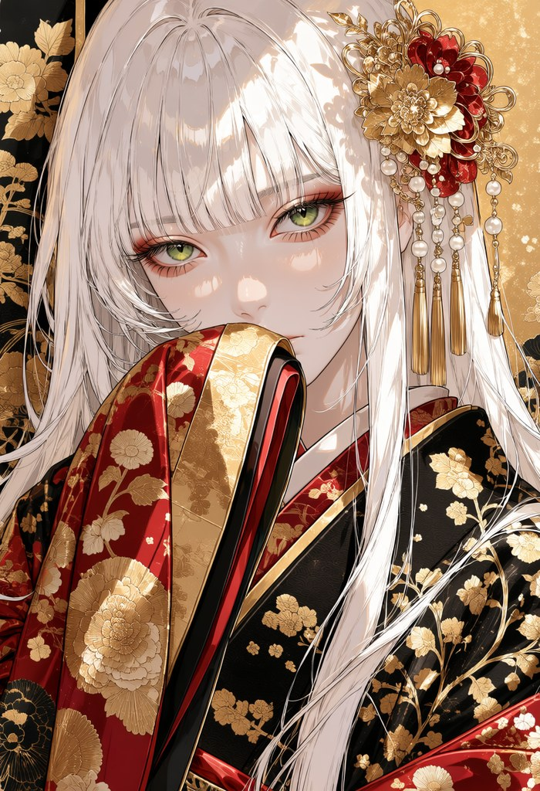

- **画风轴**：金箔刺绣/屏风装饰人物
- **抄什么**：抄 @sw33t + gold embroidery / gold leaf / byobu。三枚 LoRA 各 1.0（仅 gpt-image-2 查到 Civitai 页）。er_sde+simple、35 步、CFG 4.5。
- **底模**：`anima-base-v1.0`
- **LoRA**：`anima-base-1-masterpiece-v51:1; gpt-image-2_anima-base1_v1-1:1; AnimaNSS4RE:1`
- **LoRA 链接**：https://civitai.com/models/2564225
- **纯底模与否**：否
- **画师 tag**：`@sw33t`
- **采样**：er_sde / simple · steps 35 · CFG 4.5 · 832x1216
- **热度**：463 likes / 165 hearts / 1 comments
- **来源**：[civitai:137338268](https://civitai.com/images/137338268)
- **为何收录**：刺绣/金箔人物：屏风金地+金银丝和服，不是工笔背影也不是日本画 LoRA。

**prompt**

```
score_9, score_8_up, score_7_up, very aesthetic, masterpiece, best quality, absurdres, highres, extremely detailed, intricate details,
1girl, solo, @sw33t,
upper body, three-quarter view, looking at viewer, head tilt,
white hair, platinum hair, very long hair, blunt bangs, sidelocks,
(green eyes:1.3), beautiful detailed eyes, long eyelashes, eyeliner, pale skin,
expressionless, sleeve to mouth, covering mouth, hand up, long sleeves,
(ornate hair ornament:1.3), kanzashi, pearl hair ornament, golden hair ornament, hair beads, hanging pearls, gem,
japanese clothes, (red kimono:1.2), black kimono, layered kimono, (gold embroidery:1.3), floral print, brocade, wide sleeves, high collar,
(gold background:1.3), gold leaf, byobu, folding screen, patterned background, japanese art, fine art parody, art nouveau,
flat color, intricate pattern, ornate details, luxurious
```

**negative**

```
worst quality, low quality, score_1, score_2, score_3, artist name, (bad hands:1.3), (extra fingers:1.3), (six fingers:1.4), fused fingers, missing fingers, deformed hands, mutated hands, bad anatomy, (fused bodies:1.2), merged faces, conjoined, (3girls:1.3), (1girl:1.3)
```

### 哥特提灯伸手

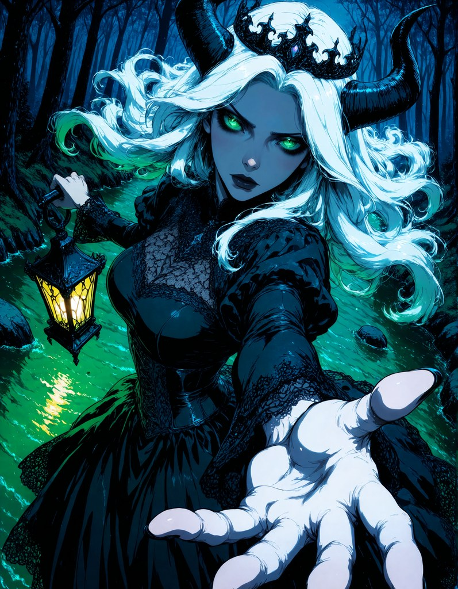

- **画风轴**：哥特暗黑人物
- **抄什么**：抄 gothic, gothic clothing, dark fantasy, glowing lantern。LoRA 文件名 training_4768839…:1，Civitai 页未找到故链接留空。ER SDE+Beta、32 步、CFG 4。
- **底模**：`anima-base-v1.0`
- **LoRA**：`training_4768839-20260606010739081:1`
- **LoRA 链接**：（无）
- **纯底模与否**：否
- **画师 tag**：（无）
- **采样**：er_sde / beta · steps 32 · CFG 4.0 · 1496x1920
- **热度**：852 likes / 308 hearts / 2 comments
- **来源**：[civitai:133231698](https://civitai.com/images/133231698)
- **为何收录**：哥特人物：夜林绿水+蕾丝黑裙与提灯透视，不是 Noct 高定轮廓光。

**prompt**

```
masterpiece, best quality,high quality, newest, highres,8K,HDR,absurdres, 1girl, view from above, dutch angle, close up, dark fantasy, water, river, green water, glowing lantern, gothic, gothic clothing, black dress, long sleeves, corset, lace, crown, horns, long hair, wavy hair, pale skin, green eyes, full lips, serious expression, reaching hands, reaching arms, eerie, creepy, detailed background, forest, night, shadows, mysterious, detailed textures, dark atmosphere, glowing light, medieval, horror, eerie ambiance, intricate design, high contrast, dark green, mysterious figure, fantasy art, surreal, ethereal, otherworldly, <lora:training_4768839-20260606010739081:1>
```

**negative**

```
worst quality, low quality, score_1, score_2, score_3, artist name,blurry, jpeg artifacts, worst quality, normal quality, anatomical nonsense, bad anatomy,interlocked fingers, extra fingers,watermark,simple background, loli,
```

### 厚涂蘑菇林小人

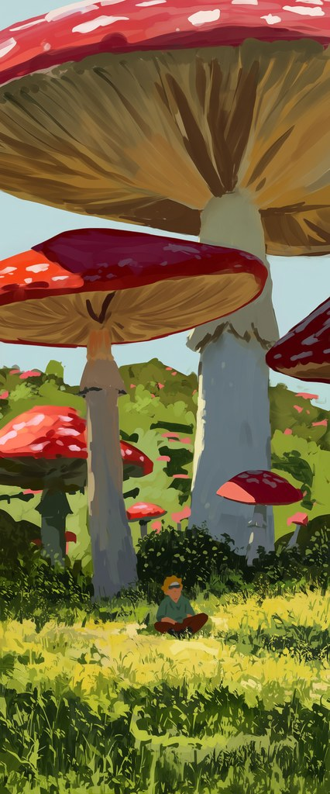

- **画风轴**：数字水粉/厚涂概念人物
- **抄什么**：抄 painterly / ye-pop / @PLUV1UMGR4ND1S + LoRA :1。ER SDE + SGM Uniform、30 步、CFG 4。
- **底模**：`anima-preview2`
- **LoRA**：`@PLUV1UMGR4ND1S_Style:1`
- **LoRA 链接**：https://civitai.com/models/2587787
- **纯底模与否**：否
- **画师 tag**：`@PLUV1UMGR4ND1S`
- **采样**：er_sde / sgm_uniform · steps 30 · CFG 4.0 · 1280x3072
- **热度**：56 likes / 21 hearts / 1 comments
- **来源**：[civitai:124112939](https://civitai.com/images/124112939)
- **为何收录**：水粉/概念厚涂：小人坐在巨型红伞菌下，对照 batch01 ye-pop 树景与 batch04 浮世绘。

**prompt**

```
ye-pop, digital illustration,


1boy, original, blonde hair, brown pants, bush, giant mushroom, goggles, grass, green shirt, landscape,  mushroom, outdoors, painterly, pants, scenery, shirt, sitting, solo, sunlight.

A fantasy painting from a concept artist. 
flat color, a beautiful environment,
(photo background, mixed media:1.1), detailed background, amazing background, (photo \(medium\):0.8)
<lora:@PLUV1UMGR4ND1S_Style:1> @PLUV1UMGR4ND1S, painterly style.
Abstract, oil painting with Bold, textured colors.
ukiyo-e, traditional media, print media.
```

**negative**

```
bow.

worst quality, low quality, score_1, score_2, score_3.

film grain, scan artifacts, jpeg artifacts, dithering, halftone, screentone.

cropped, signature, watermark, logo, text, english text, japanese text, sound effects, speech bubble, patreon username, web address, dated, artist name.

bad hands, missing finger, bad anatomy, fused fingers, extra arms, extra legs, disembodied limb, amputee, mutation.

muscular female, abs, ribs, crazy eyes, @_@, mismatched pupils.
```

### 哥特洛丽塔色差网点

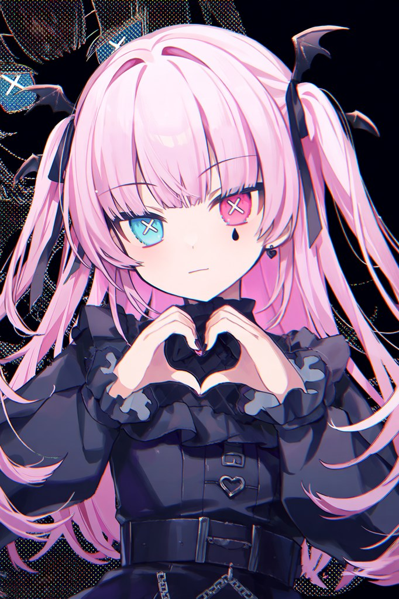

- **画风轴**：哥特洛丽塔/局部网点+色差
- **抄什么**：纯 2.9B int8 convrot。抄 gothic_lolita, chromatic aberration, partial color halftone + @koi / @neoki ohae。Euler + SGM Uniform、32 步、CFG 4。
- **底模**：`anima-2.9b-preview-v1-int8-convrot`
- **LoRA**：（无）
- **LoRA 链接**：（无）
- **纯底模与否**：是
- **画师 tag**：`@koi (koisan), @neoki ohae`
- **采样**：euler / sgm_uniform · steps 32 · CFG 4.0 · 1024x1536
- **热度**：1 likes / 1 hearts
- **来源**：[civitai:139693572](https://civitai.com/images/139693572)
- **为何收录**：图形哥特洛丽塔：局部彩色网点+色差线稿层，不是故障碎裂 LoRA，也不是暗黑森林哥特。

**prompt**

```
best quality, score_7, safe, @koi \(koisan\), @neoki ohae, 1girl, solo, light pink hair, pink left eye, light blue right eye, white x-shaped pupils, two side up, gothic_lolita, heart hands, upper body, black background, chromatic aberration, glitch, partial color halftone, teardrop facial mark, white lineart zoom layer
```

**negative**

```
worst quality, low quality, score_1, score_2, score_3, artist name, thick eyebrows, head out of frame, eyes visible through hair, sketch, unfinished, lineart, realistic teeth, 2koma, shadow, loli, breasts, belly, monochrome, color halftone
```

## Batch 07
主题：**新画风轴（人物）**。与 01–06 不重复：webtoon、单只 chibi、riso/蒸汽波网点、3.8B+@gpt-image-2、@memuro chibi、kemono 印象派、@luozhou pile、@frost fog。

来源：同上。prompt 均从 original PNG 抽出。

### 迷路鸟人快递员

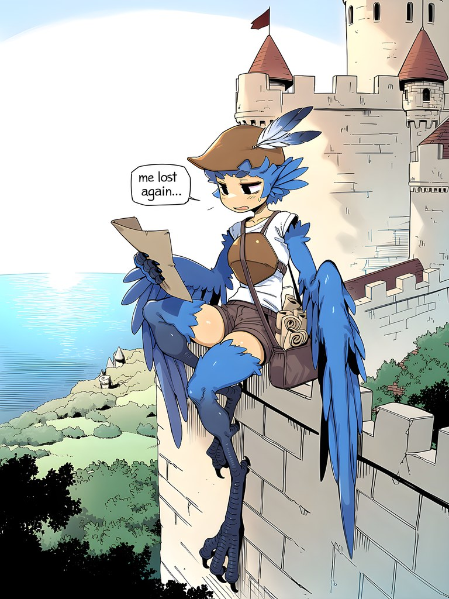

- **画风轴**：webtoon/漫画会话框+kemono
- **抄什么**：抄 harpy courier 自然语言 + speech bubble + @karasu raven / @waonaolmao。LoRA MeMaAni_P2_V1≈0.3。er_sde+simple、30 步、CFG 5。
- **底模**：`anima-preview2`
- **LoRA**：`MeMaAni_P2_V1:0.3`
- **LoRA 链接**：https://civitai.com/models/2483826?modelVersionId=3142453
- **纯底模与否**：否
- **画师 tag**：`@karasu raven, @waonaolmao`
- **采样**：er_sde / simple · steps 30 · CFG 5.0 · 1920x2560
- **热度**：120 likes / 34 hearts / 1 comments
- **来源**：[civitai:125373613](https://civitai.com/images/125373613)
- **为何收录**：webtoon/会话框轴：鸟人坐城墙看地图，彩色网点排线，不是黑白搅拌机格，也不是气泡猫。

**prompt**

```
masterpiece, best quality, amazing quality, highres, absurdres, newest, score 9, score 8

Harpy courier in a medieval world wears a lightweight leather armor (basically just a triangular breastplate made of leather and that's it) sitting on a high wall of castle. On her head there is a feathered hat. Her hands are blue and have wings, blue winged arms. Her legs are blue also (at thighs) but then turns to black going to her bird feet. She is  sitting on a battlement of the stone wall and holding a map trying to understand where she should go next. She carries a small bag over shoulder, with some letters and scrolls.

Castle at summer, with sea on the left, sun blocked by one of towers. It is summer, so trees are green. Scenery.

SHe wears white shirt and brown shorts. She is cute. She is saying in a speech bubble "me lost again...", agitated, and clearly slightly angry. Her eyes are big, hair - short. Also her ears are pointy and covered in small feathers. Her talons are black.

Black eyes, tomboy, slim. Digitigrade. 

((@karasu raven))
[[[ | | | @waonaolmao]]]
hatching \(texture\)
```

**negative**

```
bad quality, low quality, questionable,comic, multiple views, simple background, white background
```

### Q版サーバル巨型寿司

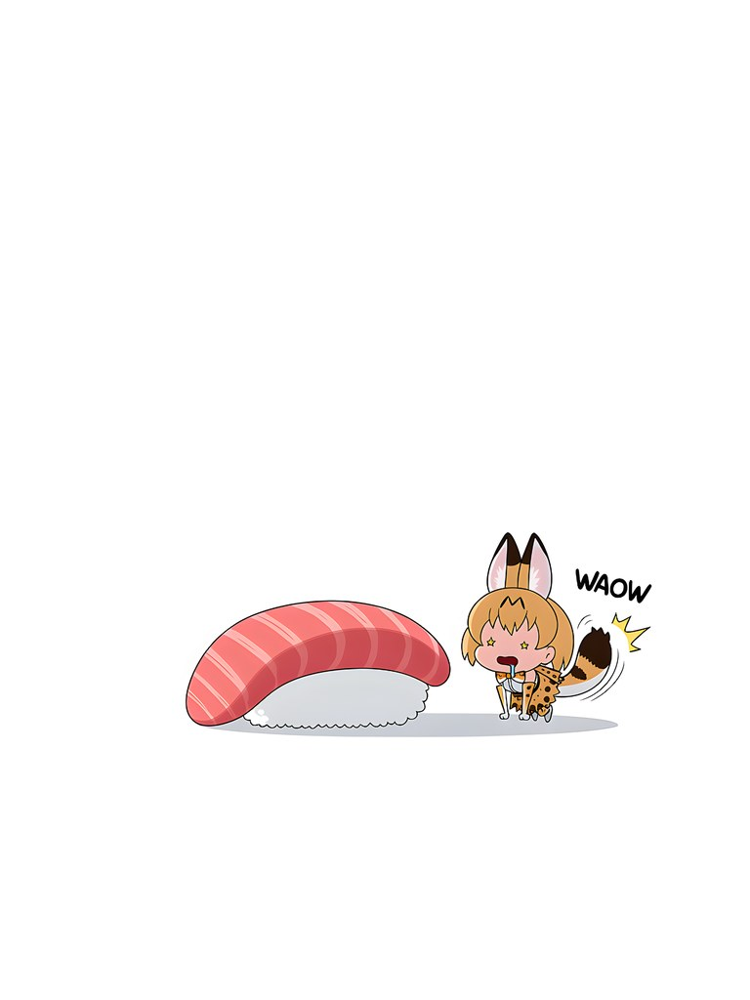

- **画风轴**：单只 SD chibi（非堆叠）
- **抄什么**：纯 preview2。抄 cute doodle style, chibi, tiny figure, lots of negative space。er_sde+simple、30 步、CFG 5。工作流 LoRA 槽是 None。
- **底模**：`anima-preview2`
- **LoRA**：（无）
- **LoRA 链接**：（无）
- **纯底模与否**：是
- **画师 tag**：（无）
- **采样**：er_sde / simple · steps 30 · CFG 5.0 · 1920x2560
- **热度**：86 likes / 21 hearts / 1 comments
- **来源**：[civitai:125580529](https://civitai.com/images/125580529)
- **为何收录**：单只 chibi：白底迷你サーバル对巨大寿司喊 WAOW，不是 batch03 Q版堆山。

**prompt**

```
masterpiece, best quality, amazing quality, highres, absurdres, newest, score 9, score 8

minimalist illustration, simple background, white background, clean lineart, flat color, soft shading, high-key lighting, lots of negative space, cute doodle style full body, chibi, tiny figure
serval \(kemono friends\) is standing next to giant sushi(it is only one sushi). She is standing on all fours next to it and says "WAOW" at it with her tail bushing up with starry eyes. Drooling, mouth drool
```

**negative**

```
bad quality, low quality, questionable,comic, multiple views, simple background, white background
```

### 网点蒸汽波女人与猫

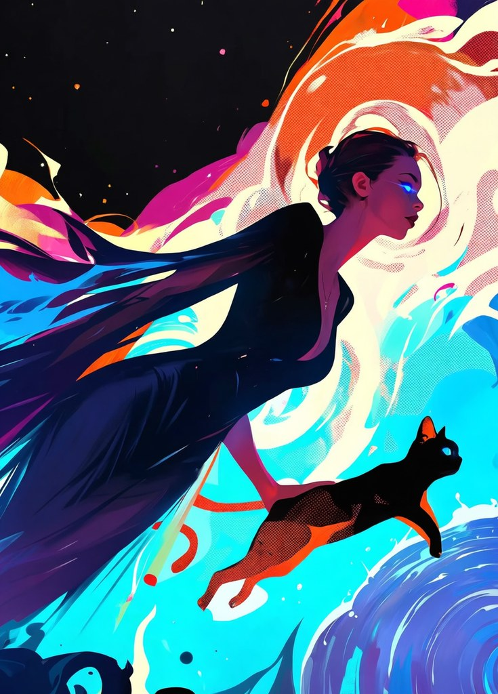

- **画风轴**：riso/halftone 蒸汽波
- **抄什么**：抄 halftone effect, vaporwave_colors, cosmic background。LoRA purple_tarot ≈1。multistep/dpmpp_2m simple、20 步、CFG 5。
- **底模**：`anima-base-v1.0`
- **LoRA**：`purple_tarot-step00003000:1`
- **LoRA 链接**：https://civitai.com/models/2678072
- **纯底模与否**：否
- **画师 tag**：（无）
- **采样**：multistep/dpmpp_2m / simple · steps 20 · CFG 5.0 · 896x1248
- **热度**：1270 likes / 458 hearts / 18 comments
- **来源**：[civitai:134155766](https://civitai.com/images/134155766)
- **为何收录**：riso/蒸汽波网点：品红青霓虹+猫剪影半色调，不是 batch03 铠甲网点，也不是故障碎裂。

**prompt**

```
detailed image of   in profile very high detail,   halftone effect, rough painting texture.   dutch angle, dynamic shot  This digital painting realism   stylized, abstract art style.    realistic_body, solo, vaporwave_colors, woman,   strikingly beautiful, 25 year old female, adult, is black dress with her cat, black cat,, glowing, blue eyes, animal, fire, water, glowing eyes, ripples, flowing colors adventure setting, black negative space, cosmic background  stylish, accurate, immaculate anatomy, masterpiece, best quality, amazing quality.      <lora:purple_tarot-step00003000:1>
```

**negative**

```
artist signature, signature, artist name, watermark, text, logos, logos, score_1,   logo, watermark, signature,
```

### 3.8B Sparkle 抱自己Q版

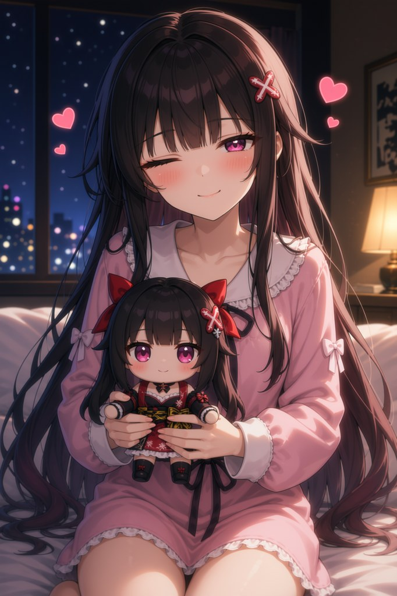

- **画风轴**：Anima-3.8B + @gpt-image-2 人偶
- **抄什么**：纯 3.8B base（无风格 LoRA）。抄 @gpt-image-2 + 抱 chibi doll。er_sde+beta、15 步、CFG 1.2。
- **底模**：`anima-3.8b-base`
- **LoRA**：（无）
- **LoRA 链接**：（无）
- **纯底模与否**：是
- **画师 tag**：`@gpt-image-2`
- **采样**：er_sde / beta · steps 15 · CFG 1.2 · 1024x1536
- **热度**：1 likes / 3 hearts
- **来源**：[civitai:141002118](https://civitai.com/images/141002118)
- **为何收录**：3.8B 画师 tag：睡衣 Sparkle 抱迷你人偶，对照 batch06 学兰 3.8B 无 @tag。

**prompt**

```
masterpiece, best quality, high quality, very aesthetic, newest, year 2025, year 2024, dark atmosphere, at night, indoor, @gpt-image-2,
Description:
A medium portrait of sparkle from honkai: star rail. She is winking playfully at the viewer, cheeks flushed from affection or mischief. She is wearing a cute pyjama. In her hands, she gently holds an adorable chibi doll of herself, romantic gaze
```

**negative**

```
worst quality, low quality, score_1, score_2, score_3,  adversarial noise, jpeg artifacts, deviantart,  (signature, patreon username, artist name, text, english text:1.2)
```

### memuro Q版雷电将军平底锅

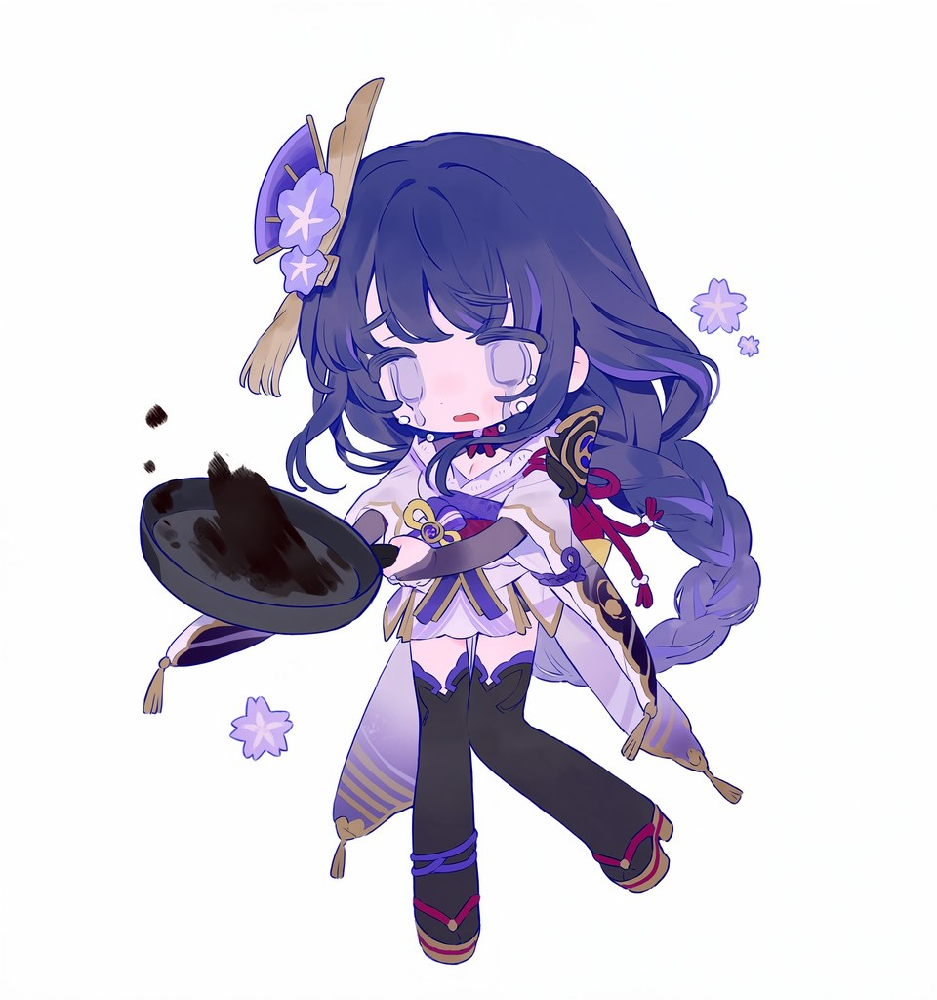

- **画风轴**：@memuro 单只 chibi
- **抄什么**：纯 2.9B。抄 @memuro, chibi, white background。er_sde+sgm_uniform、28 步、CFG 4。
- **底模**：`anima-2.9b-v1.0`
- **LoRA**：（无）
- **LoRA 链接**：（无）
- **纯底模与否**：是
- **画师 tag**：`@memuro`
- **采样**：er_sde / sgm_uniform · steps 28 · CFG 4.0 · 2880x3072
- **热度**：2 likes / 0 hearts
- **来源**：[civitai:141231346](https://civitai.com/images/141231346)
- **为何收录**：@memuro SD 贴纸 chibi：白底哭着平底锅，对照寿司涂鸦 chibi 与 @poco 四格。

**prompt**

```
@memuro,

1girl, raiden shogun, chibi, holding, frying pan, white background, crying, burnt food, knees together feet apart,

absurdres, highres, year 2025, year 2026, absurdres,
```

**negative**

```
worst quality, jpeg artifacts, low quality, bad anatomy, watermark, text, signature, artist name, artist logo, text, english text, loli, shota, child, cropped, head out of frame, comic, doodle inset, flat color, score_1, score_2, score_3,
```

### 印象派月下兽人 Carrot

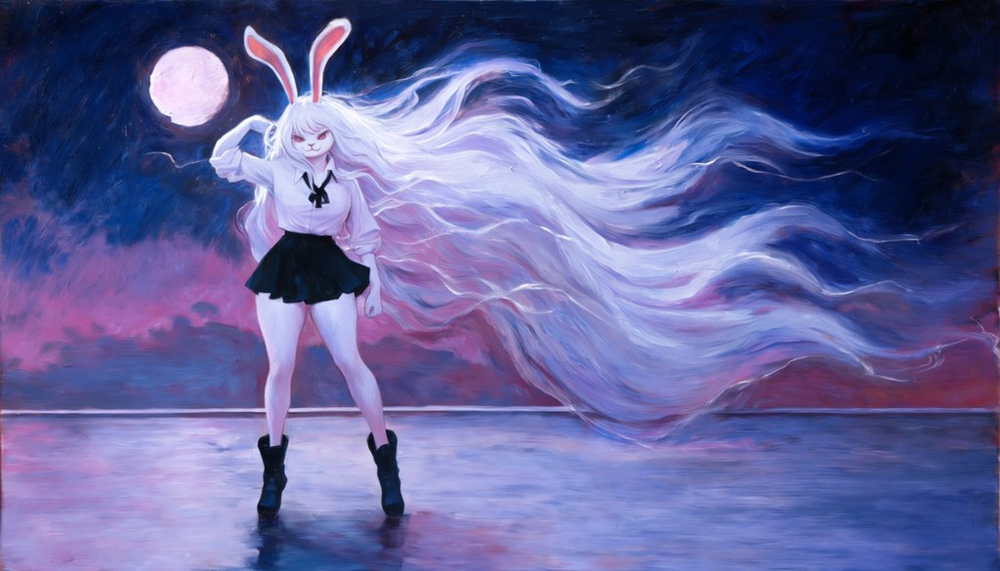

- **画风轴**：kemono 印象派全身
- **抄什么**：纯 2.9B int8。抄 An impressionist oil painting of Carrot / furry female / brush strokes。ER SDE+Beta、30 步、CFG 3.5。
- **底模**：`anima-2.9b-preview-v1-int8-convrot`
- **LoRA**：（无）
- **LoRA 链接**：（无）
- **纯底模与否**：是
- **画师 tag**：（无）
- **采样**：er_sde / beta · steps 30 · CFG 3.5 · 2016x1152
- **热度**：13 likes / 0 hearts
- **来源**：[civitai:141359726](https://civitai.com/images/141359726)
- **为何收录**：kemono+印象派：月下兔人全身阔笔，不是 batch06 印象派人脸，也不是纯平涂兽人。

**prompt**

```
An impressionist oil painting of Carrot from One Piece. 1girl, carrot \(one piece\), one piece, furry female, white fur, rabbit ears, black skirt, white shirt, very long hair, floating hair, full moon, sulong form, full body, electricity, traditional media, impressionism, brush strokes, very wide shot,
```

**negative**

```
lowres, bad quality, worst quality, score_1, score_2, score_3, jpeg artifacts, signature, watermark,
```

### luozhou pile 女仆初音

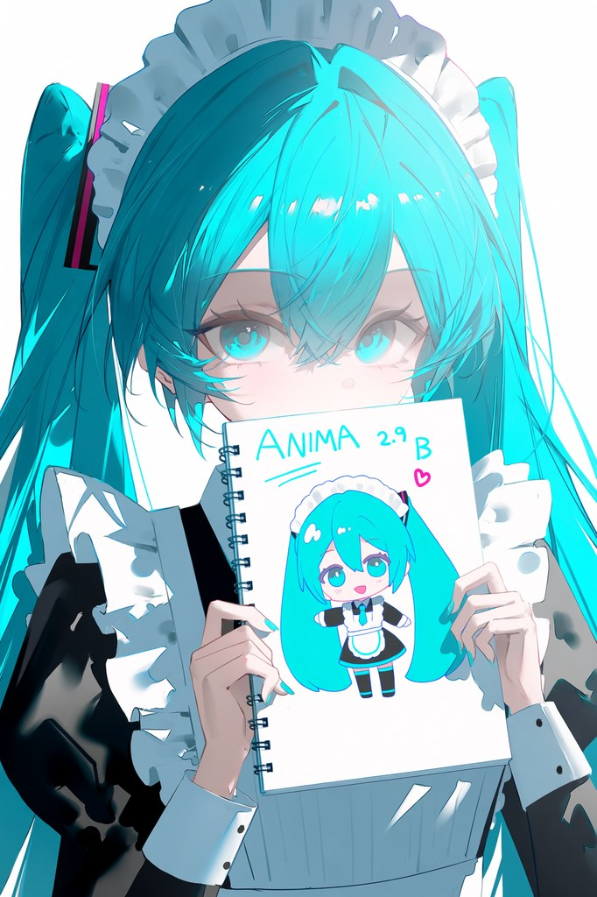

- **画风轴**：@luozhou pile official art
- **抄什么**：纯 2.9B preview。抄 @luozhou pile, official art, portrait。euler+sgm_uniform、50 步、CFG 5。不是 @pile LoRA。
- **底模**：`anima-2.9b-preview-v1`
- **LoRA**：（无）
- **LoRA 链接**：（无）
- **纯底模与否**：是
- **画师 tag**：`@luozhou pile`
- **采样**：euler / sgm_uniform · steps 50 · CFG 5.0 · 1152x1728
- **热度**：16 likes / 3 hearts
- **来源**：[civitai:139583632](https://civitai.com/images/139583632)
- **为何收录**：画师 official art：捂脸笔记本上写 ANIMA 2.9B，@luozhou pile 不是 batch04 @pile 平涂 LoRA。

**prompt**

```
highres, absurdres, masterpiece, high quality, score_8, score_9, year 2026, @luozhou pile, official art, 1girl, solo, Hatsune Miku, maid uniform, apron, portrait, holding notebook covering face, holding, notebook, sketchbook writing text "ANIMA 2.9B" and chibi ,
```

**negative**

```
worst quality, old, ancient, low quality, score_1, score_2, score_3, blurry, jpeg artifacts, low quality, worst quality, blurry, bad anatomy, extra limbs, deformed, watermark, text, signature, bareness, artifacts, hands, copyrights name, scan artifacts, bad hands, missing fingers, artist name, artist signature, text, english text, deviantart, ye-pop, dataset
```

### frost fog 双人牵手 chibi

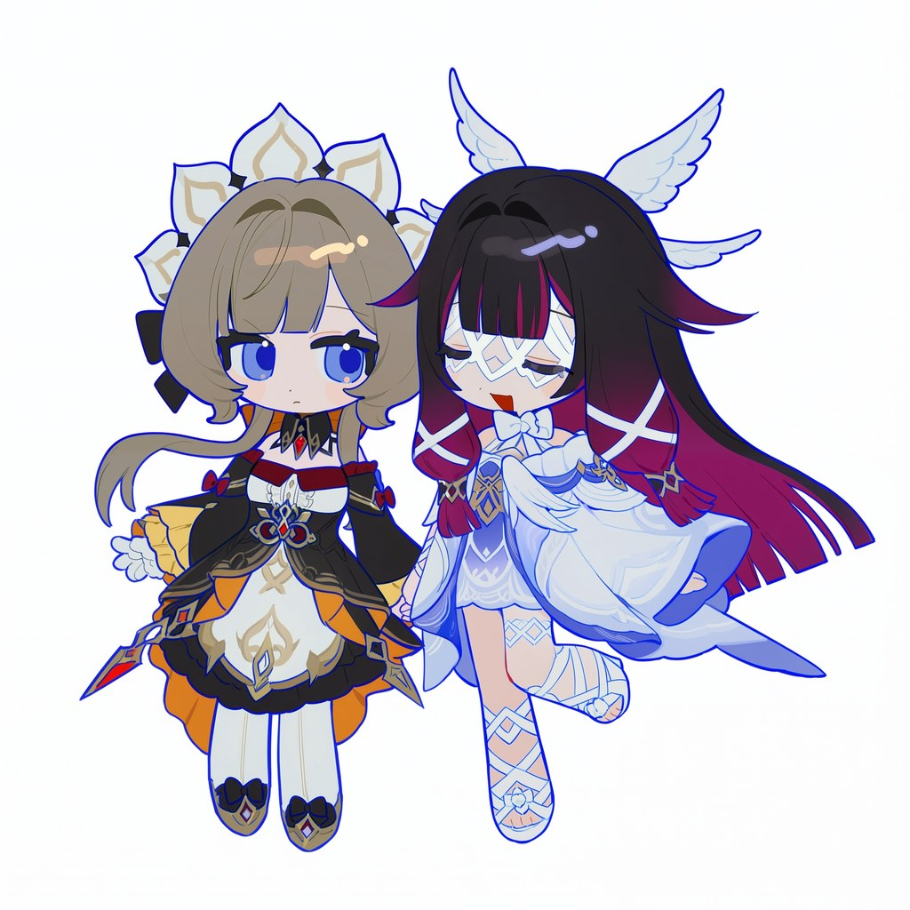

- **画风轴**：@frost fog 双人 chibi
- **抄什么**：纯 2.9B。抄 @frost fog, chibi only, white background, holding hands。euler+sgm_uniform、28 步、CFG 4。
- **底模**：`anima-2.9b-v1.0`
- **LoRA**：（无）
- **LoRA 链接**：（无）
- **纯底模与否**：是
- **画师 tag**：`@frost fog`
- **采样**：euler / sgm_uniform · steps 28 · CFG 4.0 · 2048x2048
- **热度**：4 likes / 3 hearts
- **来源**：[civitai:140001152](https://civitai.com/images/140001152)
- **为何收录**：双人 chibi 贴纸：白底牵手，对照单只寿司 chibi 与 memuro 单人。

**prompt**

```
highres, absurdres, score_8, score_9, year 2026,

2girls, sandrone \(genshin impact\), columbina \(genshin impact\), chibi only, white background, holding hands, simple background,

eye mask, head wings, 
@frost fog
```

**negative**

```
worst quality, old, score_1, score_2, score_3, blurry, jpeg artifacts, low quality, bad anatomy, watermark, text, signature, artist name, artist signature, text, english text, loli, shota, child, cropped, head out of frame, comic, doodle inset, doodled object
```

## Batch 11
主题：**正常向新画风轴（人物）**。与 01–07 不重复，也不放 NSFW 08–10 区：pixel 精灵、linocut/90s 印刷、low-poly、manhwa 暗色、neon noir、西漫粗线、@kaamin 人设表、shoujo 软笔、白底软单色、2koma。

来源：同上。prompt 均从 original PNG 抽出。

### 像素风橙发女巫持药瓶

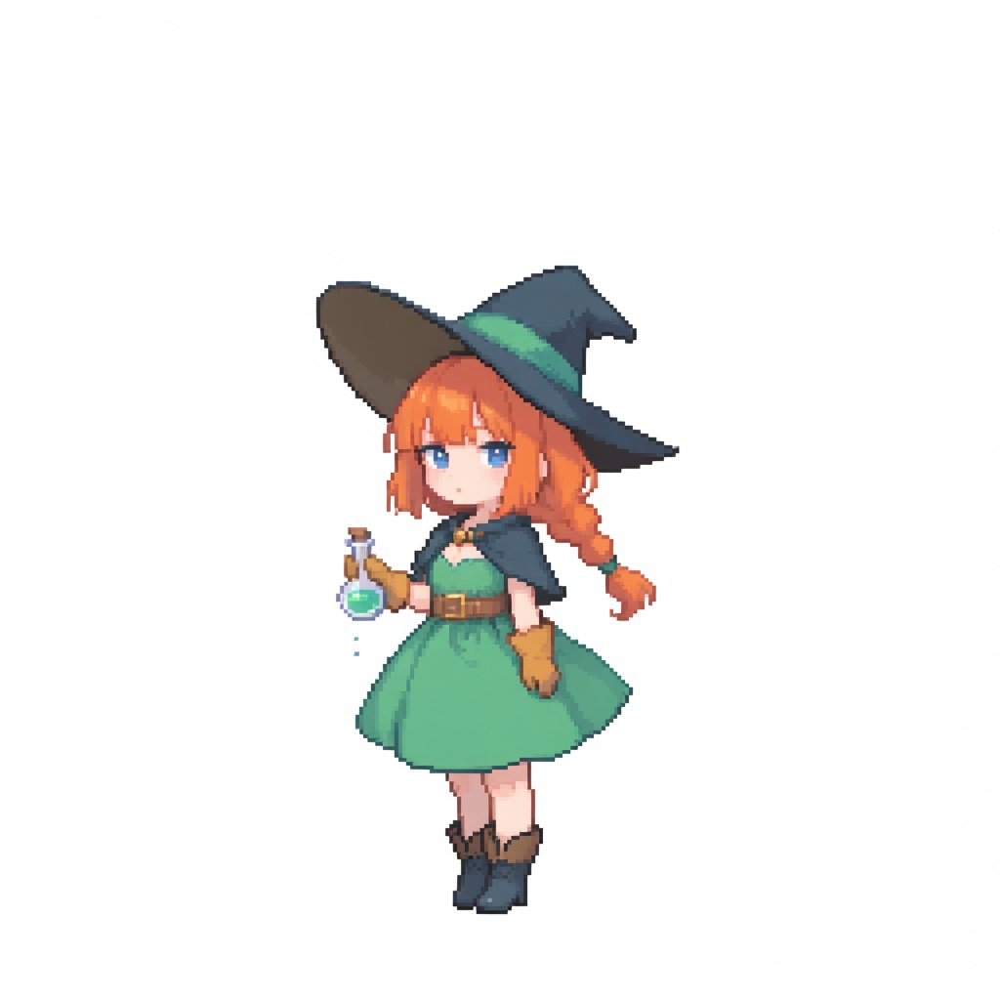

- **画风轴**：pixel-art 人物精灵
- **抄什么**：抄 pixel art + full body white background。LoRA ElinSprite_AnimaBaseV10_byKonan≈1。ER SDE Simple、32 步、CFG 4。
- **底模**：`anima-base-v1.0`
- **LoRA**：`ElinSprite_AnimaBaseV10_byKonan:1`
- **LoRA 链接**：https://civitai.com/models/2565918?modelVersionId=2948181
- **纯底模与否**：否
- **画师 tag**：（无）
- **采样**：ER SDE / Simple · steps 32 · CFG 4.0 · 1024x1024
- **热度**：17 likes / 14 hearts
- **来源**：[civitai:130807040](https://civitai.com/images/130807040)
- **为何收录**：像素人物轴：白底全身精灵画风女巫持绿药水，Anima base + ElinSprite LoRA，不是故障碎裂或网点。

**prompt**

```
masterpiece, best quality,
pixel art,
1girl, witch hat, orange hair, braided ponytail, blue eyes, long hair, gloves, green dress, boots, holding potion,
solo, standing, full body,
white background, simple background,   <lora:ElinSprite_AnimaBaseV10_byKonan:1>
```

**negative**

```
score_1, low quality, worst quality, score_2, score_3, displeasing, score_4, very displeasing, lowres, lowres face, bad eyes, poorly detailed face, bad anatomy, extra fingers, extra digits, too many fingers, too many digits, fused fingers, inverted limbs, mixed limbs, oversized limbs, emphasis lines, motion lines, speed lines, censored, bar censor, white bar censor, ass, fisheye, watermark, signature, artist name
```

### 版画宽檐帽与红叶鸟

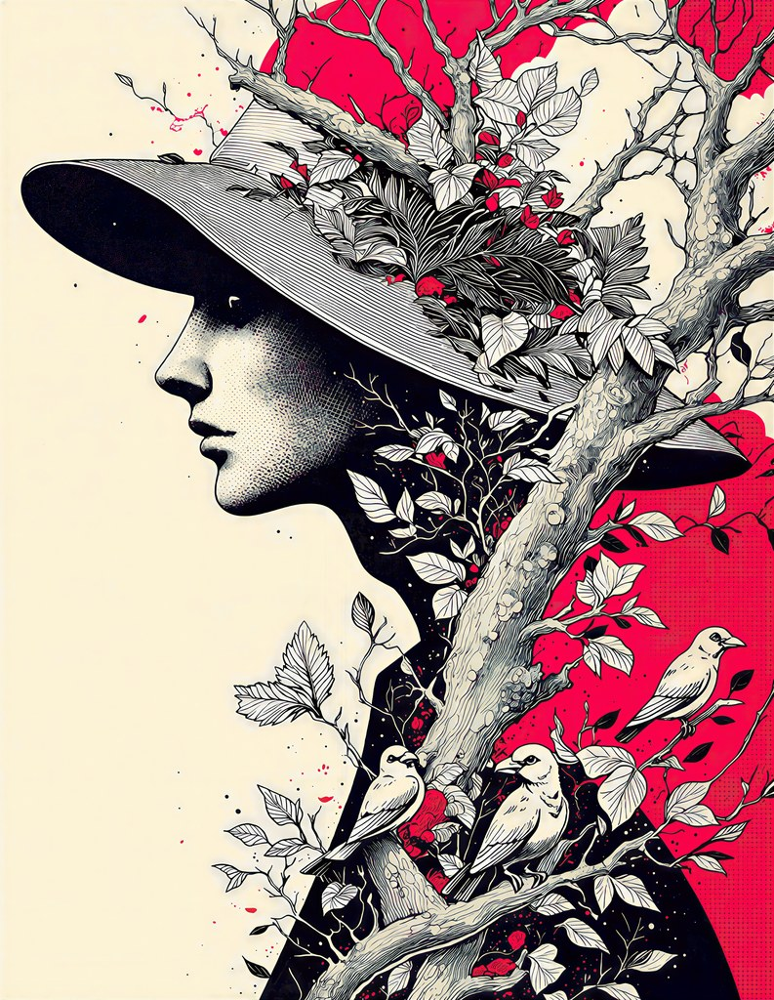

- **画风轴**：linocut/woodcut · 90s 漫画印刷
- **抄什么**：纯 preview3。抄 high-contrast black and white + late 80s early 90s manga print aesthetics + halftone/paper grain。res_2m+bong_tangent、30 步、CFG 4。
- **底模**：`anima-preview3-base`
- **LoRA**：（无）
- **LoRA 链接**：（无）
- **纯底模与否**：是
- **画师 tag**：（无）
- **采样**：res_2m / bong_tangent · steps 30 · CFG 4.0 · 2204x2844
- **热度**：1096 likes / 375 hearts / 3 comments
- **来源**：[civitai:128972239](https://civitai.com/images/128972239)
- **为何收录**：木刻/网点印刷轴：高对比黑白+品红块面，late 80s/early 90s manga print 自然语言，纯 preview3，填补 stained/linocut 缺口。

**prompt**

```
masterpiece, best quality, score_9, score_8, score_7, highres, newest, A surreal vertical illustration of a mysterious figure in profile wearing a wide-brimmed hat, rendered in high-contrast black and white with intricate linework. The figure's head is seamlessly integrated into an organic forest scene featuring gnarled bare trees, delicate leaves, and several realistic birds perched on branches and shoulders. Vibrant red foliage and background accents provide a striking color contrast against the monochromatic foreground elements, creating a dreamlike and slightly ominous atmosphere reminiscent of detailed pen-and-ink art or digital engraving., Stylized retro anime illustration inspired by late 80s and early 90s manga print aesthetics. Strong emphasis on hand-inked linework with slight irregularities and visible contour variation. Flat cel-shaded forms combined with halftone screen tones and subtle crosshatching. Color palette is restrained and print-like, with slightly desaturated tones and bold accent colors. Incorporates physical print artifacts such as paper grain, ink bleed, halftone dot variation, and slight misregistration. Surfaces feel worn and imperfect, with light grime, fading, and texture buildup. Composition is graphic and editorial, using bold shapes, asymmetry, and negative space, evoking a gritty, urban, high-end vintage comic or artbook print aesthetic.
```

**negative**

```
worst quality, low quality, score_1, score_2, score_3, blurry, jpeg artifacts, sepia, artist name, watermark, logo, ugly, signature, bar censor, bad anatomy, artistic error, motion lines,
```

### 低模向日葵田黑肤少女

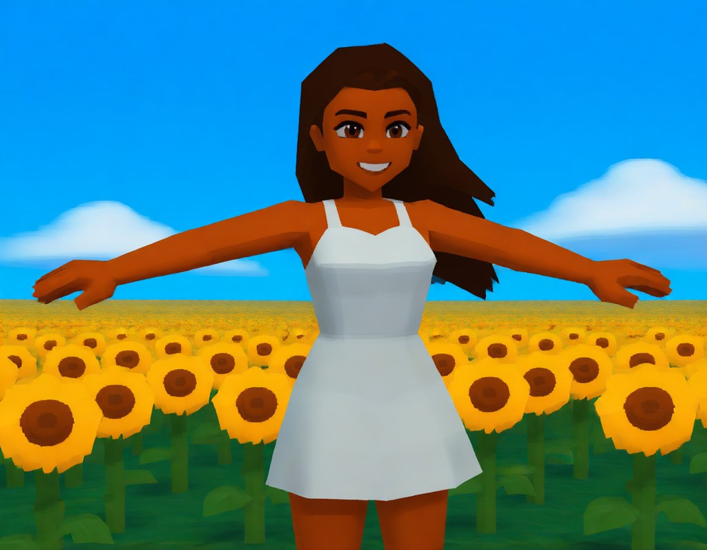

- **画风轴**：low-poly / PS1
- **抄什么**：抄 lowpoly, ps1, psx, low poly, 3d。LoRA LowPolyPSX_AnimaBaseV10_byKonan≈1。ER SDE、30 步、CFG 4。
- **底模**：`anima-base-v1.0`
- **LoRA**：`LowPolyPSX_AnimaBaseV10_byKonan:1`
- **LoRA 链接**：https://civitai.com/models/2485743?modelVersionId=2948208
- **纯底模与否**：否
- **画师 tag**：（无）
- **采样**：ER SDE / Linear Quadratic · steps 30 · CFG 4.0 · 1152x896
- **热度**：0 likes / 0 hearts
- **来源**：[civitai:132731147](https://civitai.com/images/132731147)
- **为何收录**：低模人物轴：扁平面片向日葵田全身，LowPolyPSX LoRA，不是 3D blender 写实也不是体素堆叠。

**prompt**

```
masterpiece, best quality, score_7, safe, 
lowpoly, ps1, psx, low poly, 3d,
1girl, dark-skinned female, solo, standing in a field of tall sunflowers, cowboy shot, golden hour lighting from the left side, wind blowing her long hair to the right, arms outstretched, wearing a white sundress, smiling expression, blue sky with clouds in background
<lora:LowPolyPSX_AnimaBaseV10_byKonan:1>
```

**negative**

```
worst quality, low quality, score_1, score_2, score_3, artist name
```

### 暗色漫画面阳台与烟

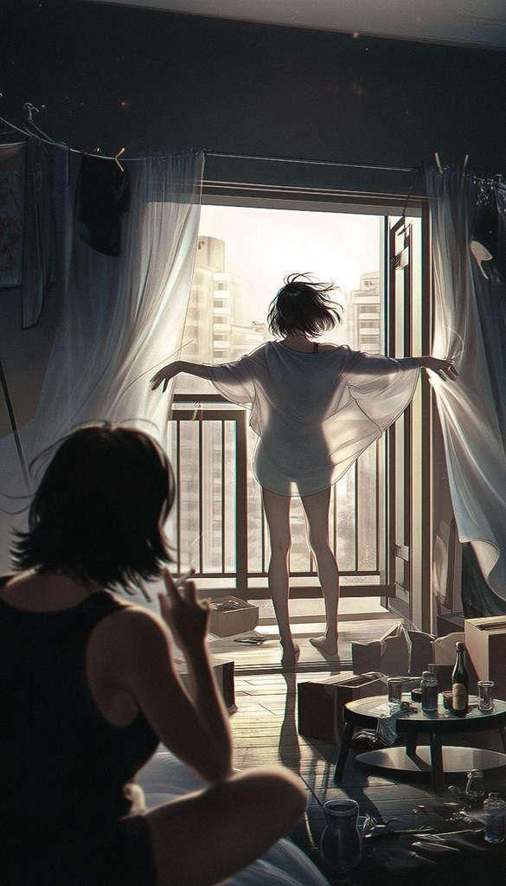

- **画风轴**：manhwa/webtoon 干净暗色
- **抄什么**：抄 @Han-Black + cinematic anime illustration。LoRA Han-Black v1≈0.7 + aesthetic-boost≈0.7。Euler a Normal、40 步、CFG 3.5。
- **底模**：`anima-base-v1.0`
- **LoRA**：`Han-Black v1:0.7; anima-highres-aesthetic-boost:0.7`
- **LoRA 链接**：https://civitai.com/models/2221187?modelVersionId=2957460
- **纯底模与否**：否
- **画师 tag**：`@Han-Black`
- **采样**：Euler a / Normal · steps 40 · CFG 3.5 · 768x1344
- **热度**：18 likes / 12 hearts
- **来源**：[civitai:131157213](https://civitai.com/images/131157213)
- **为何收录**：韩漫/暗色 webtoon 轴：Han-Black 触发，阳台逆光+室内烟，区别于 batch07 会话框鸟人和网点蒸汽波。

**prompt**

```
masterpiece, best quality, amazing quality, very aesthetic,score_7, score_8, score_9,year 2023, year 2024, year 2025, newest, @Han-Black, cinematic anime illustration, semi-realistic anime painting, painterly rendering, soft textured brushwork, modern slice-of-life atmosphere, intimate indoor scene, subtle emotional storytelling, urban apartment interior, morning scene, one young woman standing barefoot in front of an open balcony door, oversized white shirt slipping over thighs, short black bob haircut moving in the breeze, arms spreading open sheer curtains, back view, warm sunlight outlining body silhouette, another woman in foreground sitting blurred and out of focus, messy dark hair, loose tank top, holding a cigarette near her lips, shallow depth of field composition, lived-in apartment details, wooden floor, scattered cardboard boxes, table with bottles and small objects, laundry hanging outside neighboring apartments, realistic city balcony view, candid moment, natural pose, quiet daily life mood

warm morning sunlight, strong backlighting, soft volumetric light through curtains, translucent fabric glow, cinematic rim light, realistic indoor shadow casting, ambient bounce light, golden hour tones mixed with cool gray interior shadows, atmospheric haze, subtle bloom, soft reflections on wooden floor, gentle contrast, film-like lighting

highly detailed environment, refined anatomy, realistic proportions, delicate fabric folds, realistic lighting physics, cinematic framing, depth of field, foreground blur, film grain, chromatic aberration, analog film aesthetic, muted color grading, soft focus edges, ultra detailed, high resolution, absurdres,  <lora:Han-Black v1:0.7> <lora:anima-highres-aesthetic-boost:0.7>
```

**negative**

```
worst quality, low quality, score_1, score_2, score_3, artist name
```

### 霓虹诺尔墨镜精灵屋顶

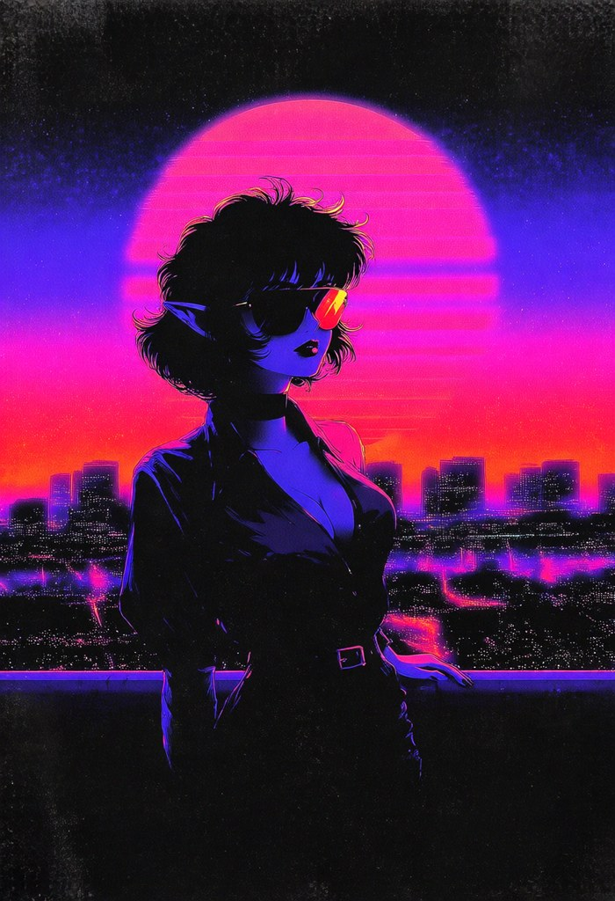

- **画风轴**：neon noir / synthwave 人物
- **抄什么**：抄 neon_noir_synthwave, retro artstyle, sunglasses, rooftop, horizontal striped sun。LoRA neon_noir_synthwave≈1（可叠 dark_art_style）。er_sde+simple、30 步、CFG 5。
- **底模**：`anima-preview3-base`
- **LoRA**：`neon_noir_synthwave_000030_anima; dark_art_style_Anima-step00002750`
- **LoRA 链接**：https://civitai.com/models/2623688?modelVersionId=2945680
- **纯底模与否**：否
- **画师 tag**：（无）
- **采样**：er_sde / simple · steps 30 · CFG 5.0 · 832x1216
- **热度**：259 likes / 91 hearts / 2 comments
- **来源**：[civitai:130712850](https://civitai.com/images/130712850)
- **为何收录**：霓虹诺尔人物轴：条纹落日+墨镜精灵屋顶剪影，neon_noir_synthwave LoRA，不是 cyber 半透明脊柱或 riso 蒸汽波猫。

**prompt**

```
neon_noir_synthwave, retro, retro artstyle, 1girl, solo, alone, elf, pointy ears, looking at the viewer, upper body, tinted eyewear, sunglasses, rooftop, cityscape, (horizontal striped sun:1.8), masterpiece, highres
```

**negative**

```

```

### 西漫粗线蜘蛛格温夜城

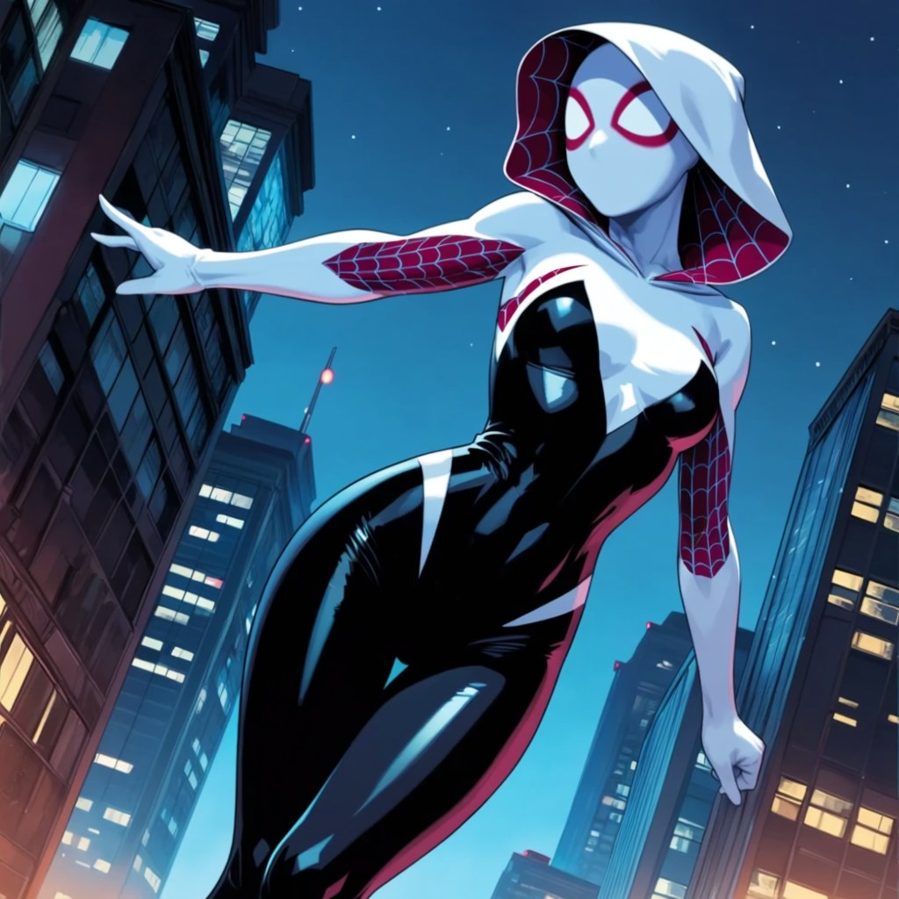

- **画风轴**：thick western comic
- **抄什么**：抄 western comics (style) + gwencomics。LoRA gwencomics≈1。ER SDE Beta、30 步、CFG 4。
- **底模**：`anima-base-v1.0`
- **LoRA**：`gwencomics:1`
- **LoRA 链接**：https://civitai.com/models/2705279?modelVersionId=3038195
- **纯底模与否**：否
- **画师 tag**：（无）
- **采样**：ER SDE / Beta · steps 30 · CFG 4.0 · 1024x1024
- **热度**：18 likes / 8 hearts
- **来源**：[civitai:133927779](https://civitai.com/images/133927779)
- **为何收录**：美漫粗线轴：western comics (style) + gwencomics LoRA，低机位夜城，区别于 ligne claire 但丁与漫画气泡格。

**prompt**

```
masterpiece, best quality,  score_7, western comics (style),   <lora:gwencomics:1> gwencomics, bodysuit, mask, hood, spider-web print, skyscraper, night,
```

**negative**

```
score_1, low quality, worst quality, score_2, score_3, displeasing, score_4, very displeasing, lowres, lowres face, bad eyes, poorly detailed face, bad anatomy, extra fingers, extra digits, too many fingers, too many digits, fused fingers, inverted limbs,  gwenatsv, blonde hair, pink hair, gradient hair, undercut, asymmetrical hair, blue eyes, eyebrow piercing, hooded bodysuit, glovesmixed limbs, oversized limbs, emphasis lines, motion lines, speed lines, censored, bar censor, white bar censor, fisheye, watermark, signature, artist name,
```

### @kaamin 兔法师升级人设表

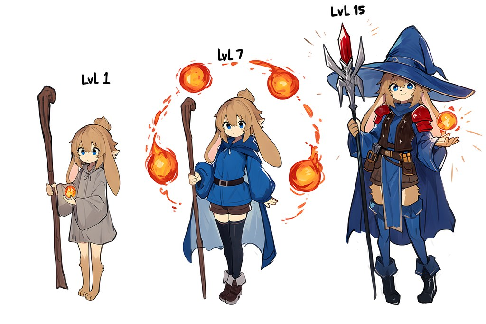

- **画风轴**：@kaamin soft pastel 人设表
- **抄什么**：纯 preview2。抄 character sheet + sketch, pastel colors, soft colors + @kaamin (mariarose753) + 3 views。er_sde+simple、30 步、CFG 5。负向记得排除 pixel art。
- **底模**：`anima-preview2`
- **LoRA**：（无）
- **LoRA 链接**：（无）
- **纯底模与否**：是
- **画师 tag**：`@kaamin`
- **采样**：er_sde / simple · steps 30 · CFG 5.0 · 2880x1920
- **热度**：191 likes / 84 hearts / 2 comments
- **来源**：[civitai:124489376](https://civitai.com/images/124489376)
- **为何收录**：软彩人设表轴：白底三视图 Lvl1/7/15 兔法师，@kaamin 纯 preview2，相对 Wlop 单色与单只 chibi 都是新格式。

**prompt**

```
newest, masterpiece, best quality, 1girl.

kemono girl, semi-anthro rabbit girl, she wears wizard robe and holds small stuff, she is 3ft tall, her fur is brown, she has blue eyes and very long lop rabbit ears.

Fantasy theme, furry, shortstack, puffy sleeves, shorts, cute, very large eyes

[sketch, pastel colors, soft colors, character sheet | @kaamin \(mariarose753\)]

3 views.

On left view she is "Lvl 1" - rookie mage, with very simple wooden stick, nervously trying to cast small fireball, she wears some simple grey robes. She also wears brown shorts and simple shoes. Her hair are short and messy. Wavy mouth. 

On middle view she is "Lvl 7" - slightly taller, in blue mantle, with some wooden staff, with 2 fireballs orbiting her. She now wears some black shoes, and thighhighs. She wears shorts. Her hair now longer, in a short ponytail, with them slightly covering one eye. Serious look, with :< expression.

On right view she is "Lvl 15" - just slightly taller than middle one, in blue mantle with red pauldrons and some protective elements, some leather vest. She holds now sleek metal staff with ruby crystal atop of it, with 4 fireballs orbiting her, much more confident, contrapposto, beckoning viewer, there is a tome on her belt. She also now has cool wizard hat. Her shoes are tall and sleek, she also has some magical trinkets here and there, and overall looks like stylish and advanced mage. Her hair now even longer, and well kept.She is still same slim bunny though, just a little grown up. Her expression is smug now, with :3.
```

**negative**

```

```

### 少女漫软笔红皮鬼娘持巨玫

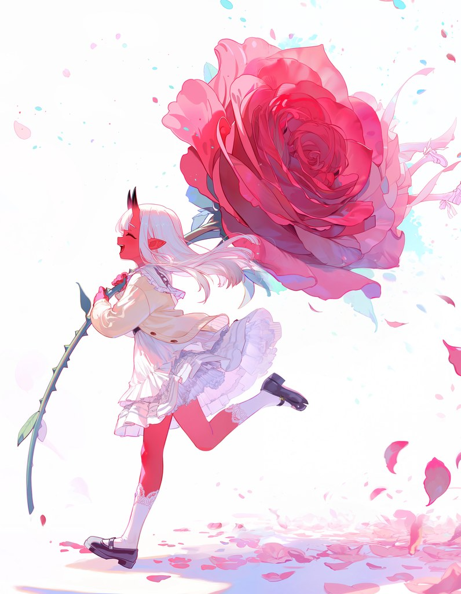

- **画风轴**：shoujo 软笔/网点感
- **抄什么**：抄 @JOhn_kafka Aka-Oni + stylish shoujo anime illustration, flowing brush strokes。LoRA Aesthetic Quality Modifiers≈1。euler+simple、30 步、CFG 4。
- **底模**：`anima-base-v1.0`
- **LoRA**：`Aesthetic Quality Modifiers-anima-preview-3`
- **LoRA 链接**：https://civitai.com/models/929497?modelVersionId=2905490
- **纯底模与否**：否
- **画师 tag**：`@JOhn_kafka Aka-Oni, @nnn yryr`
- **采样**：euler / simple · steps 30 · CFG 4.0 · 1792x2304
- **热度**：694 likes / 214 hearts / 5 comments
- **来源**：[civitai:130799632](https://civitai.com/images/130799632)
- **为何收录**：少女漫软笔轴：白底红皮鬼娘抱巨型玫瑰，prompt 含 stylish shoujo anime illustration，不是哥特洛丽塔网点。

**prompt**

```
(masterpiece, best quality, amazing quality, very aesthetic, extremely detailed, very detailed, absurdres, newest, highres, score_9, score_8), @JOhn_kafka Aka-Oni, oni, (oni horns), colored skin, (red skin:1.3), smooth horns, black horns, straight horns, pointy ear, joyfully while carrying an enormous blooming red rose over their shoulder, girl running joyfully while carrying an enormous blooming red rose over her shoulder, soft pastel aesthetic, long flowing hair, adorable smile, wearing a light cream cardigan over a frilly white dress, pleated skirt fluttering in the wind, ribbon details, lace trim, white stockings, cute mary jane shoes, delicate feminine silhouette, flower petals scattering around her, airy motion, oversized rose with vivid crimson petals, dreamy watercolor splashes, minimal white background, soft pink and pastel blue tones, whimsical atmosphere, expressive sketch lines, elegant movement, youthful and charming vibe, romantic aesthetic, painterly textures, side view, cinematic softness, gentle lighting, stylish shoujo anime illustration, flowing brush strokes, elegant simplicity, 8k
```

**negative**

```
score_1,score_2,score_3,bad anatomy,bad proportions,deformed anatomy,deformed face, deformed eyes,text,multiple fingers,
```

### @sw33t 白底青红点缀单色半机械

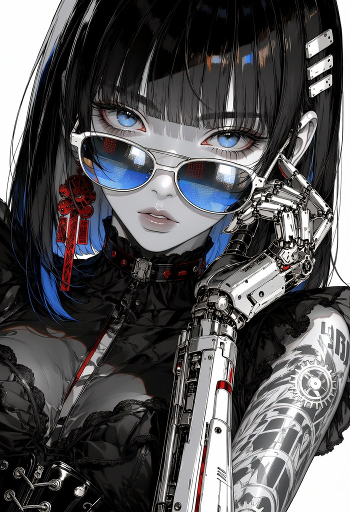

- **画风轴**：软单色人物（白底/@artist，非 Wlop）
- **抄什么**：抄 @sw33t + monochrome palette with red and blue accents。LoRA masterpiece-v51 + gpt-image-2 + AnimaNSS4RE。er_sde+simple、35 步、CFG 4.5。
- **底模**：`anima-base-v1.0`
- **LoRA**：`anima-base-1-masterpiece-v51; gpt-image-2_anima-base1_v1-1; AnimaNSS4RE`
- **LoRA 链接**：https://civitai.com/models/2564225?modelVersionId=2998634
- **纯底模与否**：否
- **画师 tag**：`@sw33t`
- **采样**：er_sde / simple · steps 35 · CFG 4.5 · 832x1216
- **热度**：563 likes / 210 hearts
- **来源**：[civitai:137338267](https://civitai.com/images/137338267)
- **为何收录**：软单色人物轴：白底近单色+青红点缀机械臂少女，@sw33t，相对 batch03 Wlop 月神单色是另一路白底软渲染。

**prompt**

```
score_9, score_8_up, score_7_up, very aesthetic, masterpiece, best quality, absurdres, highres, (extremely detailed:1.2), intricate details,
1girl, solo, @sw33t,
upper body, close-up, dutch angle, looking at viewer, looking over eyewear, head tilt, hand up, adjusting eyewear,
black hair, blunt bangs, hime cut, medium hair,
(blue eyes:1.3), beautiful detailed eyes, expressionless, parted lips, glossy lips, clear skin, detailed skin,
(white-framed sunglasses:1.3), (patterned lenses:1.2), decorated eyewear, tinted eyewear,
(mechanical hands:1.3), (cybernetic arm:1.3), robot joints, mechanical parts, android, cyborg, prosthesis,
(arm tattoo:1.3), full sleeve tattoo, graphic tattoo, lettering tattoo, number tattoo,
red earrings, oversized earrings, mechanical hair ornament, gears, choker, frills, black corset, lace trim,
(monochrome palette with red and blue accents:1.2), spot color, high contrast, bold lineart, thick lineart, ink style, detailed illustration, cyberpunk, techwear,
white background
```

**negative**

```
worst quality, low quality, score_1, score_2, score_3, artist name, (bad hands:1.3), (extra fingers:1.3), (six fingers:1.4), fused fingers, missing fingers, deformed hands, mutated hands, bad anatomy, (fused bodies:1.2), merged faces, conjoined, (3girls:1.3), (1girl:1.3)
```

### 双格猫娘钞票与金枪鱼

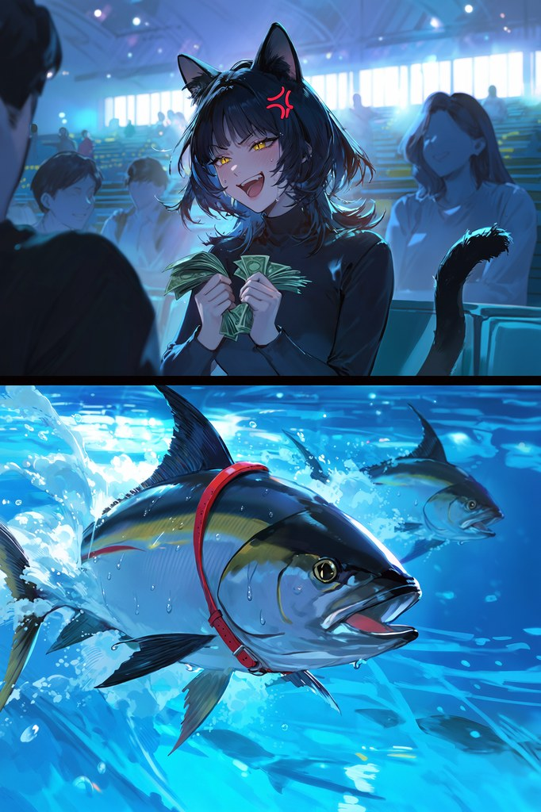

- **画风轴**：真多格/2koma（近四格）
- **抄什么**：抄 2koma comic. First panel: ... Second panel: ...。LoRA Han-Black≈0.5 + Loika≈0.6。ER SDE Beta、40 步、CFG 5。
- **底模**：`anima-base-v1.0`
- **LoRA**：`Loika v1:0.6; Han-Black v1:0.5; shuangbatian v1-000007:0.6; midninght_lighting:0.8`
- **LoRA 链接**：https://civitai.com/models/2221187?modelVersionId=2957460
- **纯底模与否**：否
- **画师 tag**：`@loika, @Han-Black, @shuangbatian`
- **采样**：ER SDE / Beta · steps 40 · CFG 5.0 · 1024x1536
- **热度**：6 likes / 0 hearts
- **来源**：[civitai:133703016](https://civitai.com/images/133703016)
- **为何收录**：真多格轴：prompt 写明 2koma comic 上下两格叙事，Han-Black+Loika，比 batch04 单格白底叉腰更接近四格。

**prompt**

```
masterpiece, very aesthetic, best quality, newest, year 2025, year 2024, absurdres, intricate details,
2koma comic.
First panel: shoulders-up shot of a smug cat girl with medium-length black hair, blunt bangs, black cat ears, black cat tail, and yellow eyes with slit pupils. She is wearing a black turtleneck and is holding handfuls of money as she is shouting angrily (sweating, furrow brow, anger mark, ears pinned back). She is sitting amongst a crowd in the bleachers (the other people are blurry).
Second panel: A realistic salmon wearing a red collar sweating with manpu as it is swimming fast through an indoor pool. There is tuna fish swimming in the background (blurry). Dynamic frontal view of the salmon with water and water drops flying everywhere. 
Setting: indoor pool stadium, gambling,
Depth of field. Cinematic. LED lighting,
dynamic angle, dramatic lighting, narrative storytelling, ultra high resolution, soft lighting, perfect face, high-res illustration, soft brush aesthetic, smooth finish, professional quality, <lora:Loika v1:0.6> @loika <lora:rendering_detailer_base10:0.5> <lora:anima_text_slider_step800:2> <lora:midninght_lighting:0.8> <lora:Han-Black v1:0.5> @Han-Black <lora:shuangbatian v1-000007:0.6> @shuangbatian
```

**negative**

```
worst quality, low quality, score_1, score_2, score_3, bad hands, jpeg artifacts, patreon logo, patreon username, web address, signature, watermark, logo, artist name, censored, facial hair, stubble, blurry eyes, bad face, long neck, short neck, blurry eyes, extra fingers, compression artifacts, uncanny valley, early, old, extra limbs, too many fingers, poorly drawn hands, malformed hands, poorly drawn face, poorly drawn asymmetrical eyes, mutated face, deformed leg, malformed, weibo username, too many watermarks, circle watermark
```

## Batch 12
主题：**正常向新画风轴续（人物）**。紧接 Batch 11，仍放在 NSFW 08–10 之前：LookDaal 软单色、doll 瓷感、3.8B@gpt-image-2、双重曝光、lofi 蒸汽波、1990s style、atmosphere 概念、蓝调单色、Aesthetic v1.1 Smooth Lines、安卓剪影。

来源：同上。prompt 均从 original PNG 抽出。

### LookDaal 选色蓝眼软单色肖像

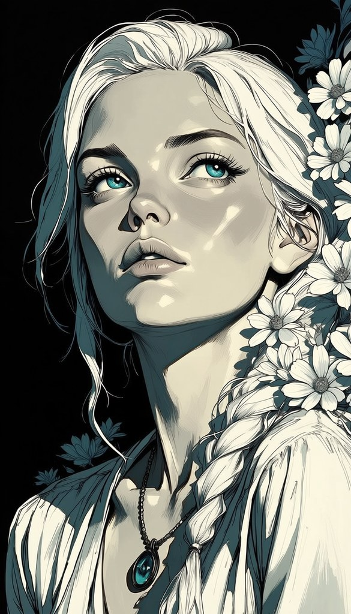

- **画风轴**：@LookDaal / The Look 软单色选色
- **抄什么**：抄 LookDaal + noir_graphic_novel_style + selective blue。LoRA The-Look-Anima3-800≈1。er_sde+simple、30 步、CFG 4。
- **底模**：`anima-preview3-base`
- **LoRA**：`The-Look-Anima3-800:1`
- **LoRA 链接**：https://civitai.com/models/1882546?modelVersionId=2997490
- **纯底模与否**：否
- **画师 tag**：（无）
- **采样**：? / simple · steps 30 · CFG 7.0 · 768x1344
- **热度**：435 likes / 130 hearts / 1 comments
- **来源**：[civitai:132562691](https://civitai.com/images/132562691)
- **为何收录**：软单色选色轴：黑底近灰度+仅蓝眼/吊坠上色，LookDaal + noir_graphic_novel_style，区别于白底 @sw33t 与 Wlop 月神。

**prompt**

```
LookDaal, 
1girl, painting, white hair, blue eyes, white dress, dark background, determined, strong posture
noir_graphic_novel_style , intimate_close_up_portrait , 1girl, young_adult , square , jade_green_eyes, smooth_intensity , narrowed, focused_eyes , thin_eyebrows , rosy_cheeks , lipstick , strawberry_blonde_hair , loose_side_braid , content_relaxation, closed_eyes , longing_look_through_a_window , reclining_on_side, gaze_upward , dramatic_lighting , flowers , long_trench_coat_with_belted_waist , necklace , scrolling_an_old_clickwheel_music_player , monochrome
```

**negative**

```
none
```

### @sw33t 瓷娃娃红玫瑰洛丽塔

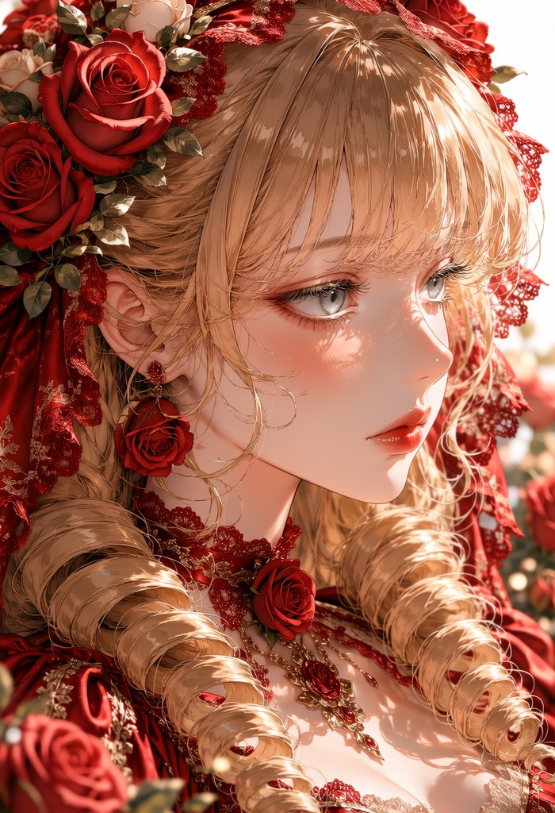

- **画风轴**：doll / BJDoll 瓷感肖像
- **抄什么**：抄 @sw33t + extreme close-up porcelain doll-like face。LoRA masterpiece-v51 + gpt-image-2 + AnimaNSS4RE。er_sde+simple、35 步、CFG 4.5。
- **底模**：`anima-base-v1.0`
- **LoRA**：`anima-base-1-masterpiece-v51; gpt-image-2_anima-base1_v1-1; AnimaNSS4RE`
- **LoRA 链接**：https://civitai.com/models/2564225?modelVersionId=2998634
- **纯底模与否**：否
- **画师 tag**：`@sw33t`
- **采样**：er_sde / simple · steps 35 · CFG 4.5 · 832x1216
- **热度**：533 likes / 235 hearts / 2 comments
- **来源**：[civitai:136554510](https://civitai.com/images/136554510)
- **为何收录**：人偶瓷感轴：玻璃眼+螺旋卷发+红玫瑰头饰的人偶质感近景，@sw33t，填补 BJDoll/doll 缺口（非哥特洛丽塔网点）。

**prompt**

```
score_9, score_8_up, score_7_up, very aesthetic, masterpiece, best quality, absurdres, highres, (extremely detailed:1.4), (intricate details:1.4),
1girl, solo, @sw33t,
(extreme close-up:1.3), face focus, (profile:1.5), from side, facing to the side, looking ahead, distant gaze, expressionless, closed mouth, red lips, glossy lips,
(blonde hair:1.4), (drill hair:1.4), (ringlets:1.4), curly hair, corkscrew curls, long curly hair, voluminous hair, hair over shoulder,
(grey eyes:1.3), pale blue eyes, beautiful detailed eyes, long eyelashes, visible eyelashes, blush, (porcelain skin:1.4), (doll-like:1.3), smooth skin, pale skin,
(red lace veil:1.5), (red lace:1.4), (gold embroidered lace:1.4), (ornate lace:1.3), intricate lace pattern, scalloped lace edge, layered lace veil, lace headdress, sheer red fabric,
(red roses:1.4), (rose on head:1.3), (roses at collar:1.3), sculpted roses, velvet roses, rose corsage, flower arrangement,
(gold lace collar:1.3), high ornate collar, gold filigree, red choker, sheer neckline, embroidered dress, red and cream dress,
(white background:1.3), overexposed background, warm light, (soft glowing light:1.3), backlighting, hazy edges, bokeh,
(red white and gold palette:1.4), (red theme:1.3), rich colors, warm tones, (depth of field:1.3), blurry foreground lace, dreamy, baroque, luxurious, victorian doll, semi-realistic
```

**negative**

```
worst quality, low quality, score_1, score_2, score_3, artist name, (bad hands:1.3), (extra fingers:1.3), (six fingers:1.4), fused fingers, missing fingers, deformed hands, mutated hands, bad anatomy
```

### 3.8B @gpt-image-2 狼耳床上闲坐

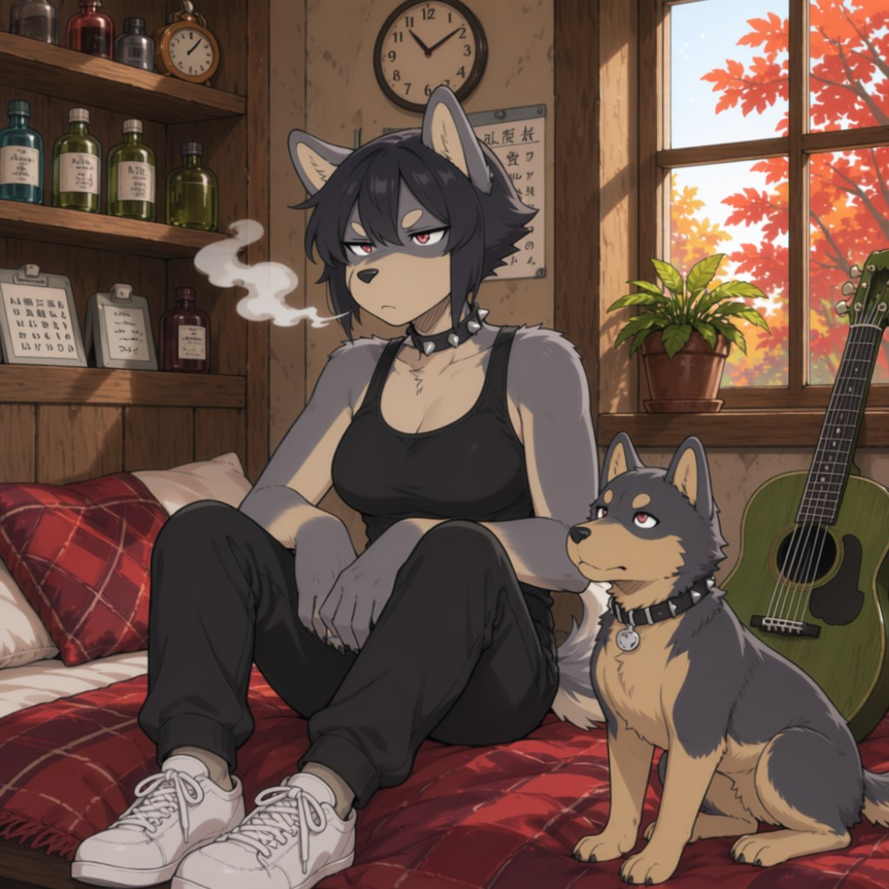

- **画风轴**：Anima-3.8B + @gpt-image-2 异质插画
- **抄什么**：纯 3.8B。抄 @gpt-image-2 + 自然语言场景描述。er_sde+beta、15 步、CFG 1.2。
- **底模**：`anima-3.8b`
- **LoRA**：（无）
- **LoRA 链接**：（无）
- **纯底模与否**：是
- **画师 tag**：`@gpt-image-2`
- **采样**：er_sde / beta · steps 15 · CFG 1.2 · 1024x1024
- **热度**：2 likes / 2 hearts
- **来源**：[civitai:140667536](https://civitai.com/images/140667536)
- **为何收录**：3.8B 异质轴：纯 3.8B + @gpt-image-2 狼耳角色床上闲坐，相对 batch07 Sparkle 自抱 Q 版是另一路写实插画感。

**prompt**

```
masterpiece, best quality, high quality, very aesthetic, newest, year 2025, year 2024, @gpt-image-2
Description:
A wolf-eared character sitting casually on a bed in a rustic, cozy room. The character — dressed in a black tank top, pants, and white sneakers — exhales a visible breath, hinting at the cool air inside. Beside them, a small dog with a collar sits attentively, almost as if keeping watch.

The surroundings add to the homely vibe: a wooden shelf lined with bottles, a green acoustic guitar leaning against the wall, and a potted plant on the windowsill. Through the window, autumn trees with orange leaves glow softly, reinforcing the seasonal chill. Details like the wall clock and calendar give the space a lived-in feel, while the warm lighting contrasts beautifully with the crisp breath, creating a balance of comfort and coolness.
```

**negative**

```
worst quality, low quality, score_1, score_2, score_3,  adversarial noise, jpeg artifacts, deviantart,  (signature, patreon username, artist name, text, english text:1.2)
```

### 双重曝光霓虹瘟疫医生

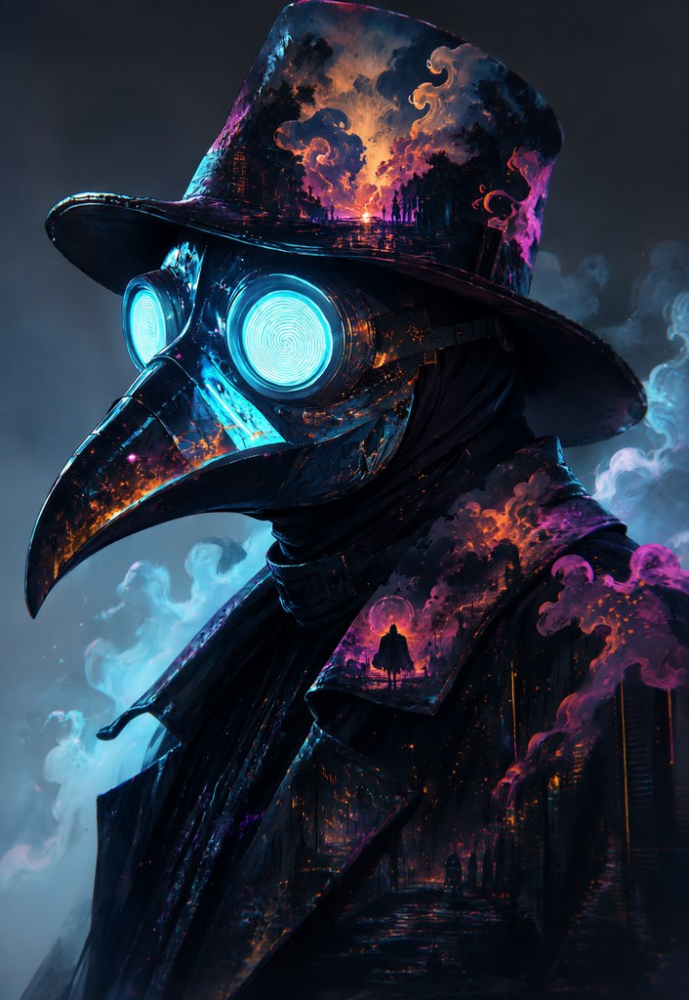

- **画风轴**：双重曝光 / synthwave 肖像
- **抄什么**：抄 double exposure + synthwave neon horror。LoRA Double_Exposure_Anima_3_epoch_8≈1。ER SDE Beta、32 步、CFG 4。
- **底模**：`anima-base-v1.0`
- **LoRA**：`Double_Exposure_Anima_3_epoch_8:1`
- **LoRA 链接**：https://civitai.com/models/2681124?modelVersionId=3012122
- **纯底模与否**：否
- **画师 tag**：（无）
- **采样**：ER SDE / Beta · steps 32 · CFG 4.0 · 1280x1856
- **热度**：804 likes / 253 hearts / 2 comments
- **来源**：[civitai:133095718](https://civitai.com/images/133095718)
- **为何收录**：双重曝光轴：面具/礼帽内嵌日落场景+青光眼，Double Exposure LoRA，区别于屋顶剪影 neon noir。

**prompt**

```
masterpiece, best quality, score_7, 
double exposure,Imagine a plague doctor from the far future, whose mask is made of swirling smoke and LED lights, rendered in dark steampunk style fused with synthwave neon horror vibes, eerie and glowing
 <lora:Double_Exposure_Anima_3_epoch_8:1>
```

**negative**

```
worst quality, low quality, score_1, score_2, score_3, artist name
```

### lofi 蒸汽波窗边黑猫

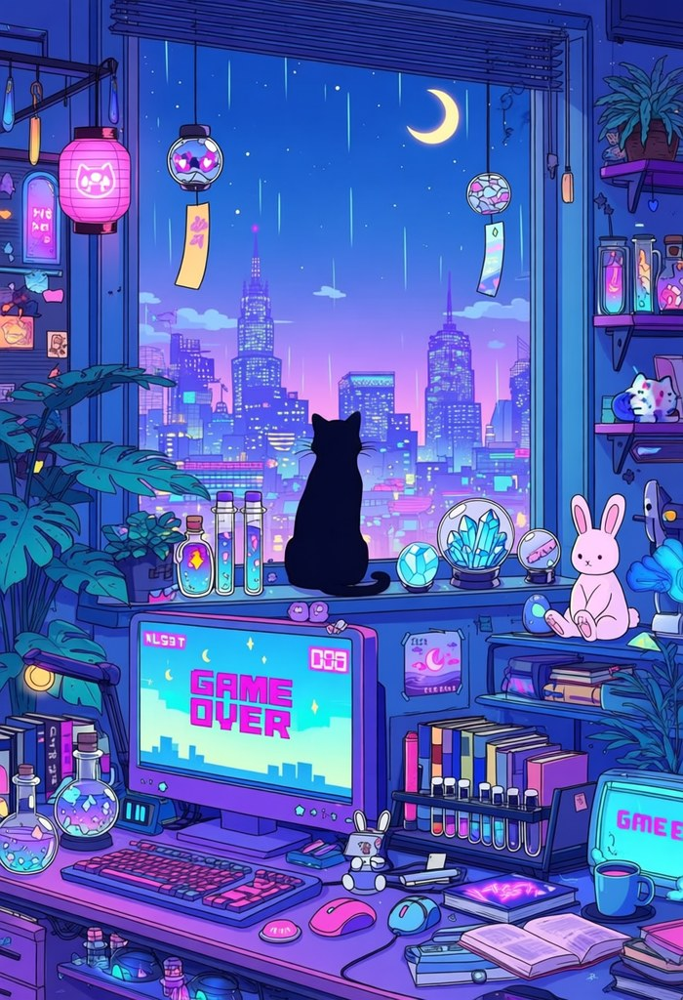

- **画风轴**：lofi vaporwave 室内（非 riso）
- **抄什么**：抄 lofi_vibe + vaporwave + neon lights + pixel aesthetic。LoRA lofi_vibe_anima≈1。er_sde+simple、30 步、CFG 5。
- **底模**：`anima-base-v1.0`
- **LoRA**：`lofi_vibe_anima`
- **LoRA 链接**：https://civitai.com/models/2648766?modelVersionId=2974171
- **纯底模与否**：否
- **画师 tag**：（无）
- **采样**：er_sde / simple · steps 30 · CFG 5.0 · 832x1216
- **热度**：497 likes / 156 hearts / 2 comments
- **来源**：[civitai:131721274](https://civitai.com/images/131721274)
- **为何收录**：lofi 蒸汽波轴：窗边黑猫剪影+霓虹城市夜景，lofi_vibe LoRA，区别于 batch07 riso/halftone 女人与猫。

**prompt**

```
lofi_vibe, no humans, cat, black cat, silhouette, sitting, looking outside, window, bedroom, cozy room, night, cityscape, skyline, skyscrapers, city lights, crescent moon, starry sky, blue theme, purple theme, neon lights, cyberpunk, vaporwave, lofi, pixel aesthetic, desk, shelf, gaming setup, monitor, game over, mug, houseplant, monstera, crystals, glowing crystal, potion bottle, test tube, candles, plush toy, rabbit plush, hanging lantern, wind chime, books, keyboard, mouse, magical atmosphere, dreamy, calm, peaceful, detailed background, soft lighting, glowing lights, indoor scene, rainy window, night view, aesthetic, illustration, anime background
```

**negative**

```
worst quality, low quality, score_1, score_2, score_3, blurry, jpeg artifacts, sepia, low quality, worst quality, blurry, bad anatomy, extra limbs, deformed, watermark, text, signature, bareness, artifacts, hands, copyrights name, jpeg_artifacts, scan_artifacts, bad hands, missing fingers, extra digit, fewer digits, artistic error, ye-pop, deviantart, logo, patreon logo
```

### 1990s style 妮亚花田

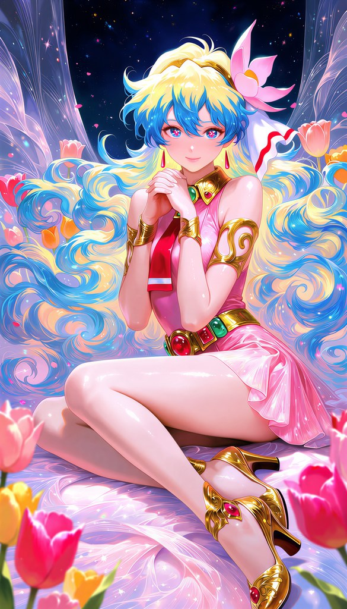

- **画风轴**：90s TV cel / year 199x（无 Illustrious）
- **抄什么**：纯 preview3。抄 1990s (style) + @(yoneyama_mai:0.5, katsura_masakazu:0.5)。参数里 Sampler 记为 DPM++ 2M；工作流另有 er_sde。CFG 5。
- **底模**：`anima-preview3-base`
- **LoRA**：（无）
- **LoRA 链接**：（无）
- **纯底模与否**：是
- **画师 tag**：（无）
- **采样**：dpmpp_2m / beta · steps 20 · CFG 5.0 · 1536x2688
- **热度**：269 likes / 132 hearts / 2 comments
- **来源**：[civitai:127561084](https://civitai.com/images/127561084)
- **为何收录**：90s 作画 tag 轴：纯 preview3 + 1990s (style)，妮亚花田，无 Illustrious 混模；视觉偏现代发光但仍是诚实 year-199x 命中。

**prompt**

```
(masterpiece, best quality, amazing quality, very aesthetic, extremely detailed, very detailed, absurdres, 1990s \(style\), highres, score_9, score_8), alluring, photorealistic, @(yoneyama_mai:0.5, katsura_masakazu:0.5),

1girl, nia_teppelin, solo, armlet, belt, bracelet, symbol-shaped pupils, cross-shaped pupils, jewelry, belt, hair ornament, multicolored hair, necktie, very long hair, shiny skin, stand, pink dress, smile, sky, pink lips, detail eyes, high heels, own hands clasped, sitting on floor, tegaki, surrounded by blooming various colors of tulibs, from slightly above,

delicate and intimate atmosphere, (wispy textures, watercolor, ethereal flowing linework, wispy textures), depth of field,,,
```

**negative**

```
unaestheticXLv13, polydactyl:1.5, score_4, score_5, score_6, crayon, glitch, deformed, mutated, ugly, disfigured, sketch, poorly drawn, lowres, low detail, text, blurry, bad anatomy, bad proportions, deformed anatomy, deformed face, deformed eyes, text, twitter_username, artist_twitter, anatomically incorrect hands, missing fingers, extra digits, fewer digits, bad eye, multiple fingers, blurry eyes, extra legs, conjoined,ai-generated, stubble, ugly face, ugly eyes
```

### @gpt-image-2 大气几何城市与猫

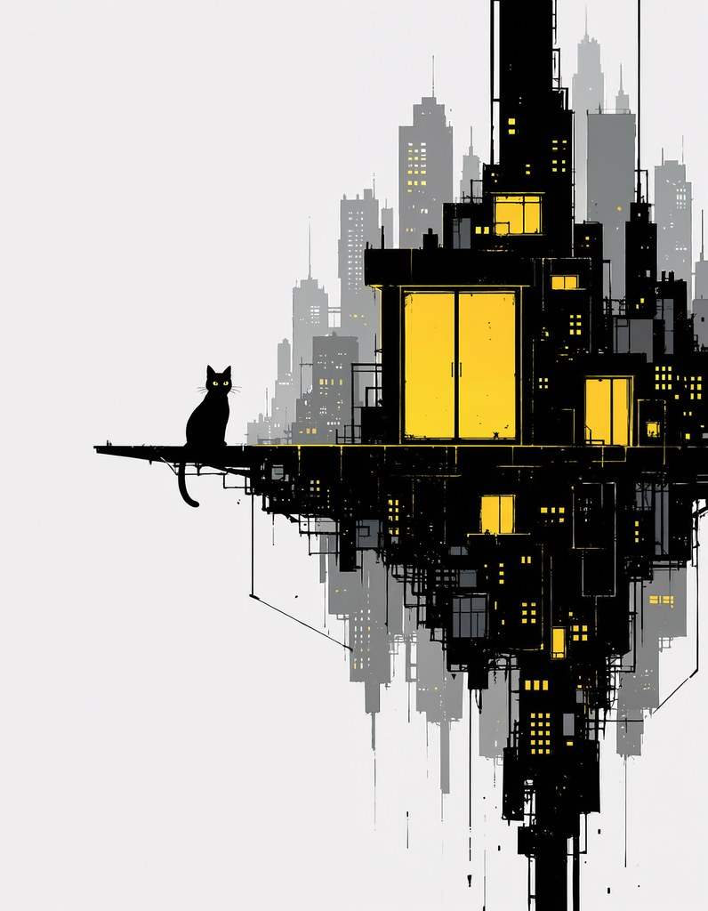

- **画风轴**：@gpt-image-2 + atmosphere 概念插画
- **抄什么**：抄 @gpt-image-2 + conceptual illustration + geometric abstraction city。LoRA gpt-image-2≈1 + atomsphere_style≈1。dpmpp_2m_sde_gpu beta57、26 步、CFG 4。
- **底模**：`anima-base-v1.0`
- **LoRA**：`gpt-image-2_anima-base1_v1-1; atomsphere_style_v1.2-anima-e20`
- **LoRA 链接**：https://civitai.com/models/2564225?modelVersionId=2998634
- **纯底模与否**：否
- **画师 tag**：`@gpt-image-2`
- **采样**：dpmpp_2m_sde_gpu / beta57 · steps 26 · CFG 4.0 · 1792x2304
- **热度**：933 likes / 335 hearts / 5 comments
- **来源**：[civitai:135518845](https://civitai.com/images/135518845)
- **为何收录**：概念大气轴：几何抽象城市天际线+檐上小猫，gpt-image-2 + atomsphere LoRA，Aesthetic 异质感，不是默认美型脸。

**prompt**

```
masterpiece, best quality, score_7, @gpt-image-2, 
conceptual illustration, a tiny black cat sitting on a sharp ledge, background is a massive geometric abstraction of a city skyline constructed from flat intersecting grey and black rectangular blocks, a single glowing neon yellow window block stands out as a vibrant spot color, flat graphic design style, stark negative space, high contrast
```

**negative**

```
worst quality, low quality, score_1, score_2, score_3, artist name, blurry, jpeg artifacts, lowres, censor, fused hand,
```

### 蓝调单色星空荡秋千

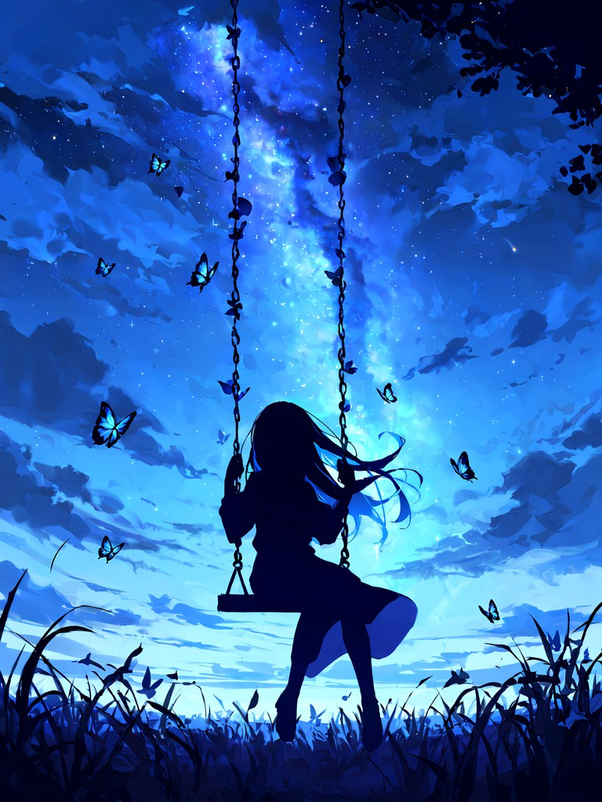

- **画风轴**：单色剪影/油画夜景人物
- **抄什么**：抄 monochrome + blue theme + silhouette + oil painting (medium)。LoRA Beudelb≈1 + 4x1Style≈0.3 + kazutake≈0.5。er_sde Simple、45 步、CFG 4.5。
- **底模**：`anima-preview2`
- **LoRA**：`【Anima】Beudelb_epoch36:1.0; 【Anima】4x1Style_Ayori:0.3; 【Anima】kazutake_epoch70:0.5`
- **LoRA 链接**：https://civitai.com/models/2438038?modelVersionId=2741275
- **纯底模与否**：否
- **画师 tag**：（无）
- **采样**：er_sde / simple · steps 45 · CFG 4.5 · 1920x2560
- **热度**：377 likes / 135 hearts
- **来源**：[civitai:128655261](https://civitai.com/images/128655261)
- **为何收录**：蓝调单色人物轴：星空剪影荡秋千+油画笔触，Beudelb/4x1/kazutake LoRA，区别于白底软单色与版画宽檐帽。

**prompt**

```
year_2025, newest, score_9, score_8, best_quality, masterpiece, highres, absurdres, illustration,

1girl, solo, long hair, sitting, monochrome, outdoors, sky, cloud, night, grass, bug, star \(sky\), butterfly, night sky, scenery, starry sky, blue theme, silhouette, swing, masterpiece, best quality, good quality, very awa, very aesthetic, absurdres, newest, \(perfect details\), usnr, brushstroke, oil painting \(medium\), chiaroscuro, 

@4x1style, @4x0style, 
<lora:【Anima】Beudelb_epoch36:1.0> <lora:【Anima】4x1Style_Ayori:0.3> <lora:【Anima】kazutake_epoch70:0.5>
```

**negative**

```
monochrome, greyscale, censored, chinese_text, korean_text, speech_bubble, dated, logo, signature, watermark, web_address, artist_name, character_name, copyright_name, twitter_username, low_score_rate, worst_quality, low_quality, bad_quality, lowres, low_res, pixelated, blurry, blurred, compression_artifacts, jpeg_artifacts, bad_anatomy, worst_hands, deformed_hands, deformed_fingers, deformed_feet, deformed_toes, extra_limbs, extra_arms, extra_legs, extra_fingers, extra_digits, extra_digit, fused_fingers, missing_limbs, missing_arms, missing_fingers, missing_toes, wrong_hands, ugly_hands, ugly_fingers, twisted_hands, abstract, sequence, lineup, 2koma, 4koma, microsoft_paint_\(medium\), artifacts, adversarial_noise, has_bad_revision, resized, image_sample, low_aesthetic, dated, logo, signature, watermark, web_address, artist_name, character_name, copyright_name, twitter_username,
```

### Aesthetic v1.1 水中黄瞳倒影

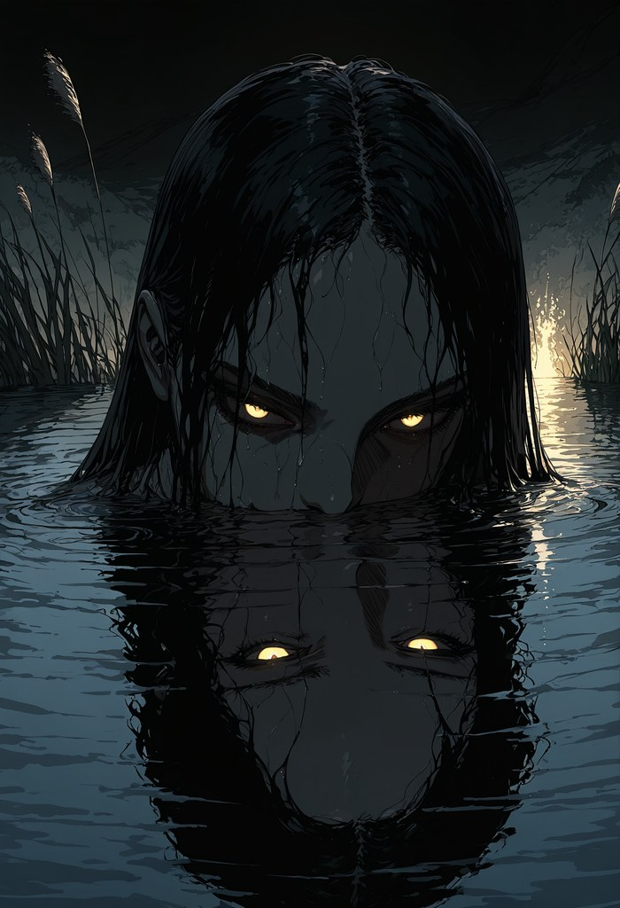

- **画风轴**：Aesthetic v1.1 异质（Myth Smooth Lines）
- **抄什么**：底模 aesthetic-v1.1。抄 Smo0thL1nes + submerged face + glowing yellow eyes + reflection。LoRA AnimaMythSmo0thL1nes≈1。ER SDE Beta、30 步、CFG 5。
- **底模**：`anima-aesthetic-v1.1`
- **LoRA**：`AnimaMythSmo0thL1nes:1`
- **LoRA 链接**：https://civitai.com/models/599757?modelVersionId=3226360
- **纯底模与否**：否
- **画师 tag**：（无）
- **采样**：ER SDE / Beta · steps 30 · CFG 5.0 · 1248x1824
- **热度**：821 likes / 269 hearts / 11 comments
- **来源**：[civitai:139658658](https://civitai.com/images/139658658)
- **为何收录**：Aesthetic v1.1 异质轴：水中半脸黄瞳倒影，Myth Smooth Lines LoRA，不是默认 Aesthetic 美型半身。

**prompt**

```
masterpiece, best quality, Smo0thL1nes, a close-up of a woman's face partially submerged in water. Her skin is pale, and her wet, dark hair clings to her face, adding a dramatic effect. The most striking feature is her glowing yellow eyes, which stand out against the dimly lit background. The water reflects her face, creating a mirror-like effect. The setting appears to be a natural body of water, with reeds and a faint light source visible in the background, suggesting a nighttime scene. The overall mood is mysterious and slightly eerie, enhanced by the dark color palette and the intense gaze of the subject. <lora:AnimaMythSmo0thL1nes:1>
```

**negative**

```
worst quality, low quality, artist name, blurry, jpeg artifacts, chromatic aberration
```

### 锈梁上安卓狙击手剪影

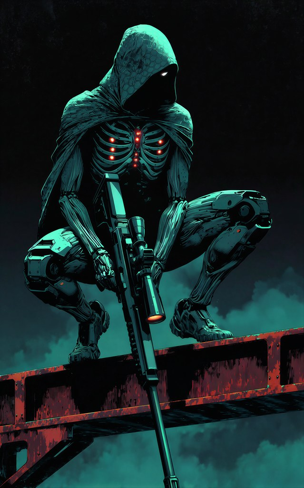

- **画风轴**：neon/机械剪影全身（纯底）
- **抄什么**：纯 base-v1.0。抄 full-body profile crouching android sniper + rusted metal beam 自然语言。res_2m+beta、30 步、CFG 4。
- **底模**：`anima-base-v1.0`
- **LoRA**：（无）
- **LoRA 链接**：（无）
- **纯底模与否**：是
- **画师 tag**：（无）
- **采样**：res_2m / beta · steps 30 · CFG 4.0 · 1982x3172
- **热度**：106 likes / 44 hearts / 6 comments
- **来源**：[civitai:130867846](https://civitai.com/images/130867846)
- **为何收录**：机械剪影轴：纯 base 锈梁蹲姿安卓狙击手全身剪影，补强 neon/noir 人物全身，无 LoRA。

**prompt**

```
masterpiece, best quality, score_9, score_8, score_7, highres, newest, full-body profile view of a crouching android sniper perched on a rusted corroded metal beam, the entire chassis constructed from densely layered organic-mechanical plating — interwoven tendon-like cable bundles and curved skeletal armor plates covering the torso, arms, and legs with no fabric underlay, small amber emissive points glowing between plate gaps across the chest and thigh assemblies, a draped hood and cape made from fine hexagonal chainmail mesh falling loosely over the cranium and shoulders to mid-back, a single dim white eye glow visible deep within the hood shadow, both articulated hands gripping a long-barrel sniper rifle with a mounted telescopic scope, the rifle barrel extending diagonally downward out of frame, knees bent in a compact crouch with mechanical leg assemblies fully detailed — multi-jointed knee housings and segmented shin plating visible, the surface finish of the entire figure in muted gunmetal grey with teal and olive undertones, deep bokeh background of dark grey architectural ruins and fog, diffuse overcast lighting with no hard shadows, shallow depth of field keeping only the figure sharp, retro, neon noir synthwave, retro artstyle, black background,
```

**negative**

```
worst quality, low quality, score_1, score_2, score_3, blurry, jpeg artifacts, sepia, artist name, watermark, logo, ugly, signature, bar censor, bad anatomy, artistic error,
```

## Batch 08

**成人向 / NSFW 试目录。** 01–07 全是正常向；本批单独收「特别好看」的成年 NSFW。动画/插画 only，不含真人。每条 `nsfw: true`，并标 `nsfw_level`。抄的时候正向带上 **explicit / nsfw / sensitive**（按尺度），负向建议保留 `loli, shota, child`。
### 海滩薄纱金饰 Mature

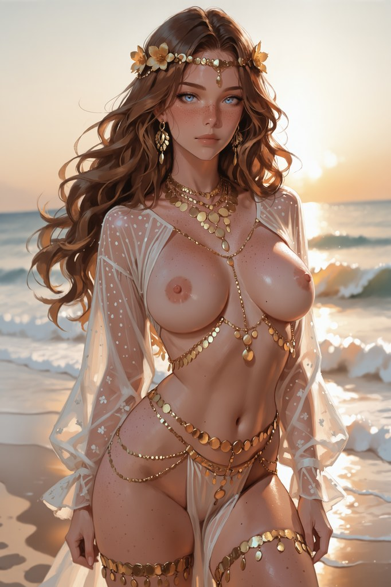

- **画风轴**：Ri-mix 薄纱金饰写实向
- **NSFW**：`nsfw`（成人向）
- **抄什么**：正向写 nsfw 或 sensitive（本条是薄纱露点）。抄自然语言海滩金饰 + (1girl…:0.5) + aged up。LoRA rimixao5050=1。er_sde+sgm_uniform、30 步、CFG 3。负向保留 loli, chibi。
- **底模**：`anima-base-v1.0`
- **LoRA**：[rimixao5050:1](https://civitai.com/models/996220?modelVersionId=3011920)
- **LoRA 链接**：https://civitai.com/models/996220?modelVersionId=3011920
- **纯底模与否**：否
- **画师 tag**：（无）
- **采样**：er_sde / sgm_uniform · steps 30 · CFG 3.0 · 1536x2304
- **热度**：541 likes / 254 hearts
- **来源**：[civitai:133089679](https://civitai.com/images/133089679)
- **为何收录**：高热度 Mature：日落海滩薄纱与金链，成年女性解剖，不是角色梗图。Ri-mix α 叠在 base 上。

**prompt**

```
A stunning young woman stands on a beach, her long, wavy brown hair cascading down her back, adorned with a delicate circlet of gold flowers. She gazes directly at the viewer, her piercing blue eyes captivating. Her skin is lightly freckled, and she has a small mole on her right breast. She wears an intricate gold necklace with large, round pendants that cascade down her chest, each one resting against her bare skin. Her nipples are visible through the sheer fabric of her see-through sleeves, which are embroidered with tiny gold dots. A belly chain and thighlets made of gold coins adorn her lower abdomen and upper thighs, respectively. She wears a sheer, white, long-sleeved garment that clings to her curves, leaving little to the imagination. Her breasts are medium-sized and separated by the gold necklace. She has a small mole on her right thigh. The background is blurred, with the ocean waves crashing in the distance, and the sky is a warm, golden hue, suggesting a sunset. (1girl, solo, long hair, breasts, looking at viewer, brown hair, navel, jewelry, medium breasts, standing, nipples, outdoors, earrings, necklace, water, blurry, see-through, blurry background, ocean, beach, revealing clothes, breasts apart, freckles, mole on breast, circlet, , thighlet, see-through sleeves, mole on thigh, belly chain, body freckles, head chain:0.5), masterwork masterpiece, best quality, high quality, absurdres, highres, detailed, depth of field, , high detail, best quality, very aesthetic, aged up
```

**negative**

```
worst quality, low quality, score_1, score_2, score_3, artist name, (lowres:1.2), (worst quality:1.4), (low quality:1.4), (bad anatomy:1.4), bad hands, multiple views, jpeg artifacts, patreon logo, patreon username, web address, signature, watermark, text, logo, artist name, censored, mosaic censoring, loli, chibi
```
### 草薙素子屋顶瞄准

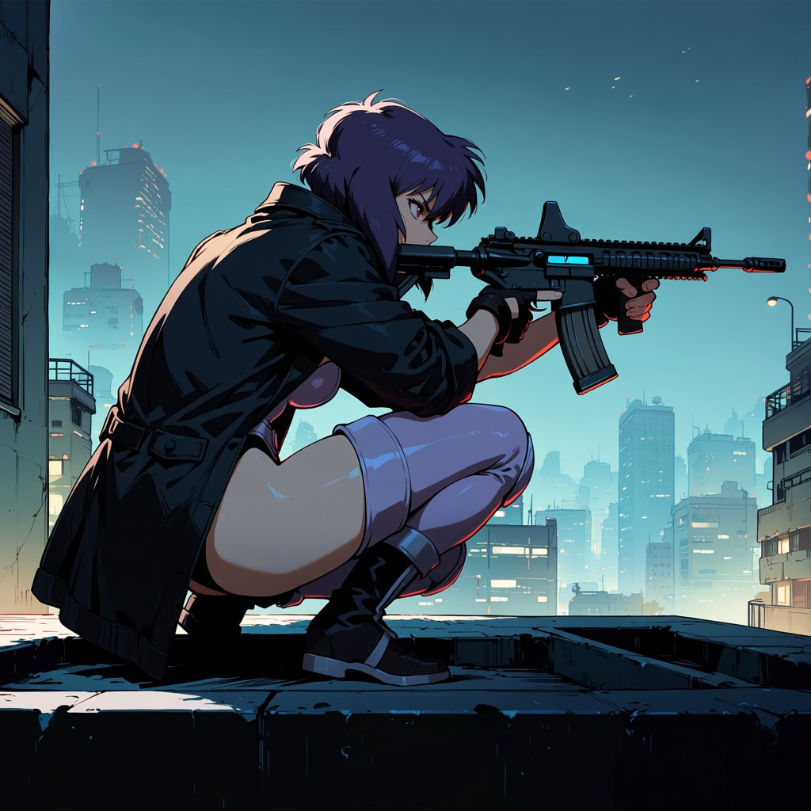

- **画风轴**：preview3 纯底模紧身衣
- **NSFW**：`sensitive`（成人向）
- **抄什么**：纯 preview3。正向可写 sensitive 或官方常用 safe。抄 kusanagi motoko, leotard, crouching, rooftop。er_sde+simple、30 步、CFG 5。
- **底模**：`anima-preview3-base`
- **LoRA**：（无）
- **LoRA 链接**：（无）
- **纯底模与否**：是
- **画师 tag**：（无）
- **采样**：er_sde / simple · steps 30 · CFG 5.0 · 1024x1024
- **热度**：91 likes / 51 hearts
- **来源**：[civitai:126727593](https://civitai.com/images/126727593)
- **为何收录**：官方号 preview3 直出：成年素子连体衣+大衣屋顶瞄准，敏感向体型服装，对照后面的露骨条。

**prompt**

```
masterpiece, best quality, score_7, safe, 1girl, kusanagi motoko, ghost in the shell, solo, short hair, purple hair, crouching, outdoors, rooftop, leotard, coat, thighhighs, holding assault rifle, aiming, from side, city
```

**negative**

```
worst quality, low quality, score_1, score_2, score_3, artist name
```
### 水墨龙纹身武者

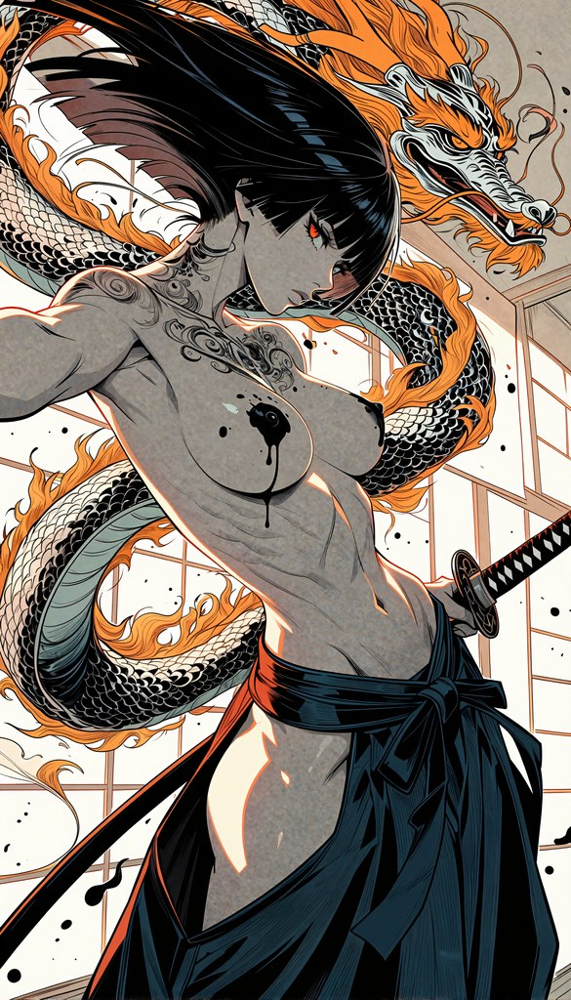

- **画风轴**：preview2 天野风水墨裸体
- **NSFW**：`nsfw`（成人向）
- **抄什么**：纯 preview2。正向写 nsfw。抄 living tattoo / Yoshitaka Amano art style / topless / hakama。Euler a、24 步、CFG 5。
- **底模**：`anima-preview2`
- **LoRA**：（无）
- **LoRA 链接**：（无）
- **纯底模与否**：是
- **画师 tag**：（无）
- **采样**：euler_ancestral / simple · steps 24 · CFG 5.0 · 768x1344
- **热度**：85 likes / 47 hearts
- **来源**：[civitai:125689849](https://civitai.com/images/125689849)
- **为何收录**：preview2 纯底模厚涂/天野：和纸肤+墨龙纹身+袴，上身裸，不是平涂二次元。

**prompt**

```
(masterpiece, best quality, good quality, amazing quality, very aesthetic, (extremely detailed, intricate details:1.2), absurdres, newest, highres, score_9, score_8:1.4), (dynamic angle:1.4), (exaggerated perspective:1.3), looking at viewer,  dynamic digital art, 1girl, solo, living tattoo, ink master, martial artist, dynamic mid-kata pose, her skin has the texture of fine washi paper, her expression is intensely focused, her hair is a sharp black hime cut, topless, her torso is toned and athletic, her breasts are medium size, her breasts are perfectly teardrop shaped, a single flowing sumi-e dragon tattoo covers her back and wraps around her torso, the dragons head rests over her heart, its claws lightly grazing the side of one breast, her nipples are like perfectly placed, dark ink blots, wearing baggy hakama pants tied low on her hips, holding a katana made of solidified ink, stark lighting from a shoji screen window, dramatic shadows, minimalist dojo background, ink splash effects, powerfully precise, elegantly deadly  , (Yoshitaka Amano art style, ethereal flowing linework, wispy textures, ornate jewelry, surreal character design, pale porcelain skin, vibrant watercolor splashes, dreamlike composition, intricate fabric folds:1.1)
```

**negative**

```
lowres, (low quality, worst quality, normal quality:1.2), blurry, score_1, score_2, score_3, score_4, score_5, jpeg artifacts, text, watermark, signature, (bad anatomy, bad hands, deformed hands, extra fingers, mutated hands, missing fingers, malformed limbs, fused fingers:1.2), too many fingers, loli
```
### Ashley 比基尼描线


- **画风轴**：preview2 描线比基尼
- **NSFW**：`sensitive`（成人向）
- **抄什么**：正向写 sensitive。抄 outline, bikini, tropical island。LoRA AshleyGravesPreview2_byKonan=1。er_sde+simple、32 步、CFG 4。
- **底模**：`anima-preview2`
- **LoRA**：[AshleyGravesPreview2_byKonan:1](https://civitai.com/models/2480629?modelVersionId=2788968)
- **LoRA 链接**：https://civitai.com/models/2480629?modelVersionId=2788968
- **纯底模与否**：否
- **画师 tag**：（无）
- **采样**：er_sde / simple · steps 32 · CFG 4.0 · 896x1152
- **热度**：81 likes / 29 hearts
- **来源**：[civitai:124812229](https://civitai.com/images/124812229)
- **为何收录**：outline 海边比基尼，角色 LoRA 但底模仍是 preview2；Ashley Graves 成年。

**prompt**

```
masterpiece, best quality,
outline,
1girl, ashleygr, black hair, ponytail, pink eyes,
bikini, large breasts, hands behind head,
open mouth, smile, happy, solo, looking at viewer, sea, sand, blue sky, tropical island background    <lora:AshleyGravesPreview2_byKonan:1>
```

**negative**

```
score_1, low quality, worst quality, score_2, score_3, displeasing, score_4, very displeasing, lowres, lowres face, bad eyes, poorly detailed face, bad anatomy, extra fingers, extra digits, too many fingers, too many digits, fused fingers, inverted limbs, mixed limbs, oversized limbs, emphasis lines, motion lines, speed lines, censored, bar censor, white bar censor, ass, fisheye, watermark, signature, artist name
```
### Jester 舞娘金绣

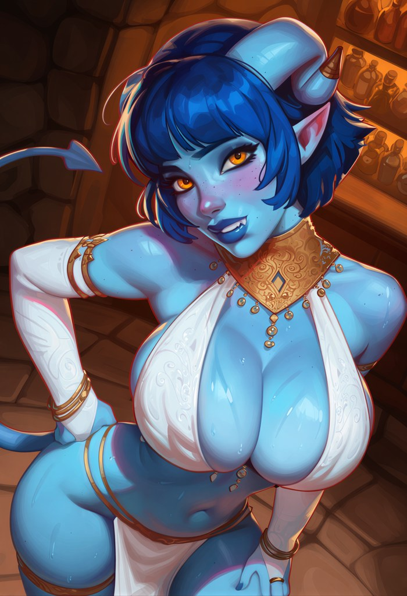

- **画风轴**：@pxpcxrn 舞娘金绣
- **NSFW**：`nsfw`（成人向）
- **抄什么**：正向写 nsfw 或 sensitive。抄 @pxpcxrn + jester lavorre + harem outfit。LoRA @pxpcxrn-v1-animabase1-ty_lee=1。dpmpp_2m+simple、30 步、CFG 5。
- **底模**：`anima-base-v1.0`
- **LoRA**：[@pxpcxrn-v1-animabase1-ty_lee:1.0](https://civitai.com/models/2745659?modelVersionId=3088308)
- **LoRA 链接**：https://civitai.com/models/2745659?modelVersionId=3088308
- **纯底模与否**：否
- **画师 tag**：`@pxpcxrn`
- **采样**：dpmpp_2m / simple · steps 30 · CFG 5.0 · 1800x2630
- **热度**：126 likes / 91 hearts
- **来源**：[civitai:135435796](https://civitai.com/images/135435796)
- **为何收录**：画师 LoRA：蓝肤成年 tiefling 舞娘金绣与内裤，酒馆俯视，不是幼体 Q 版。

**prompt**

```
@pxpcxrn, masterpiece, best quality, score_7, 1girl, solo, jester lavorre, short hair, large breasts, blue hair, blue skin, breasts, colored skin, demon girl, demon tail, freckles, horns, navel, pointy ears, tail, teeth, tiefling, parted lips, harem outfit, white clothing, gold embroidery, thigh strap, panties, dancer, navel, stomach, sweat, thighs, underwear, white panties, bridal gauntlets, pelvic curtain, bracelet, anklet, from above, dutch angle, from side, hand on own hip, contrapposto, tavern, bar, stone wall, head tilt, teeth, thick lips, blue lips,
```

**negative**

```
worst quality, low quality, worst detail, lowres, score_1, score_2, score_3, blurry, jpeg artifacts, bad anatomy, bad hands, sketch, multiple views, 4koma, signature, username, artist name, censor, censored,
```
### 室内冰棍热浪

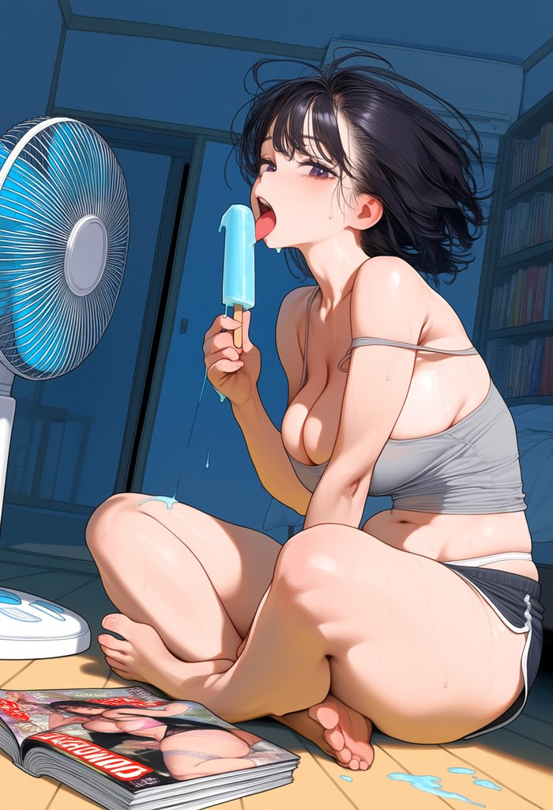

- **画风轴**：@eatsleepstyle 居家暗示
- **NSFW**：`nsfw`（成人向）
- **抄什么**：正向写 nsfw 或 sensitive。抄 @eatsleepstyle, melting popsicle, strap slip。LoRA eatsleepstyle-000014=1。Euler a、30 步、CFG 4。
- **底模**：`anima-base-v1.0`
- **LoRA**：[eatsleepstyle-000014:1](https://civitai.com/models/2687472?modelVersionId=3184829)
- **LoRA 链接**：https://civitai.com/models/2687472?modelVersionId=3184829
- **纯底模与否**：否
- **画师 tag**：`@eatsleepstyle`
- **采样**：euler_ancestral / simple · steps 30 · CFG 4.0 · 832x1216
- **热度**：222 likes / 109 hearts / 1 comments
- **来源**：[civitai:138341117](https://civitai.com/images/138341117)
- **为何收录**：居家热浪：吊带短裤+内裤走光+冰棍，curvy 成年，eatsleep 平涂。

**prompt**

```
masterpiece, best quality, newest, year 2025, 1girl, @eatsleepstyle, looking at viewer, bare legs, bare shoulders, barefoot, bookshelf, manga \(object\), breasts, cleavage, collarbone, panties, electric fan, feet, holding popsicle, melting popsicle, hot, hunched over, indian style, indoors, licking popsicle, midriff, open mouth, short shorts, curvy, thick thighs, solo, strap slip, tank top, bedroom, porn magazine on the floor in front of girl, sexually suggestive,
```

**negative**

```
worst quality, low quality, blurry, jpeg artifacts, sepia, fewer digits, extra digits, bad hands, bad anatomy, watermark
```
### 刷手机无表情做爱

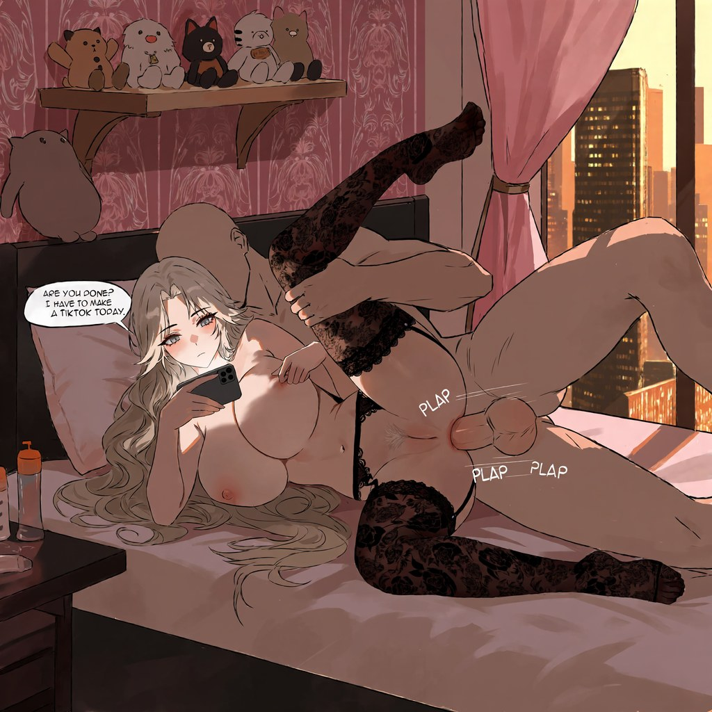

- **画风轴**：纯底模 @dishwasher1910 明示
- **NSFW**：`explicit`（成人向）
- **抄什么**：正向必须写 explicit。抄 @dishwasher1910, [@nixeu:0.6], anime coloring, faceless male, speech bubble。er_sde+beta、40 步、CFG 5。
- **底模**：`anima-base-v1.0`
- **LoRA**：（无）
- **LoRA 链接**：（无）
- **纯底模与否**：是
- **画师 tag**：`@dishwasher1910, @nixeu`
- **采样**：er_sde / beta · steps 40 · CFG 5.0 · 1024x1024
- **热度**：258 likes / 190 hearts / 10 comments
- **来源**：[civitai:130810396](https://civitai.com/images/130810396)
- **为何收录**：高完成度 1boy/1girl 明示：黄金时刻逆光、会话框、现代动漫上色，无风格 LoRA。

**prompt**

```
masterpiece, highres, absurdres, best quality, explicit, @dishwasher1910, [@nixeu:0.6], (anime coloring:0.3), 
Modern anime style with shading, detailed hair and catchy colors.
1boy, 1girl, anal, on side, on bed, motion lines, plap sound effects, sex from behind, leg up, leg grab, emotionless sex, faceless male,  holding phone with both hands,  pulling own nipple, face illuminated by smartphone, looking at phone, head on pillow, lace thighhighs, penis, testicles, huge breasts, cleft of venus, female pubic hair, platinum-blonde hair, grey eyes, long hair, wavy hair, curtained hair, lying, garter belt, lubed anus,

indoors, girl's room designed in pink colors with fancy wallpaper, shelf with various plush animal toys, big city illuminated by sunset visible through window behind curtains, lube on bedside table, golden hour, backlighting, shadow, shade,

 Speech bubble from girl with text "Are you done? I have to make a tiktok today".
```

**negative**

```
lowres, low quality, worst quality, score_1, score_2, blurry, censored, artist name, fisheye, halftone, halftone background, wet,  painterly, shiny skin, twins, 2koma, heart, night, @dragon ball, traditional media, cum, nipple push,
```
### 于贝尔水下 Shexyo

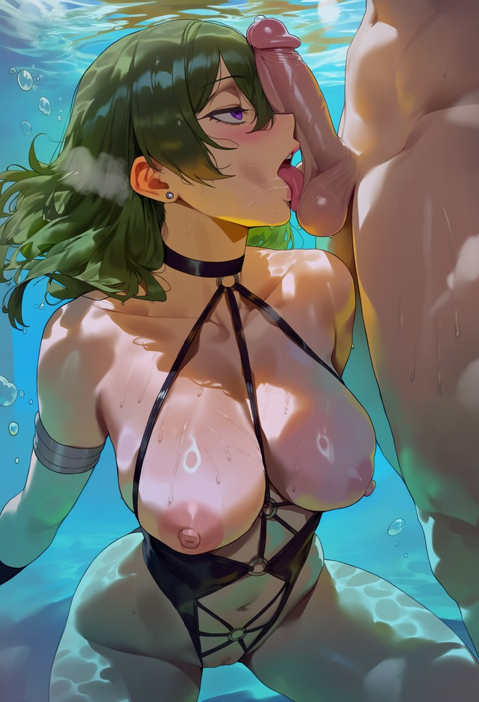

- **画风轴**：preview3 + Shexyo 水下明示
- **NSFW**：`explicit`（成人向）
- **抄什么**：正向写 explicit。抄 ubel, underwater, fellatio + oyxehs。LoRA shexyo-guy90-Anima-Lorav1=1。DPM++ 2M SDE + sgm_uniform、30 步、CFG 4。
- **底模**：`anima-preview3-base`
- **LoRA**：[shexyo-guy90-Anima-Lorav1:1.0](https://civitai.com/models/2690961?modelVersionId=3021452)
- **LoRA 链接**：https://civitai.com/models/2690961?modelVersionId=3021452
- **纯底模与否**：否
- **画师 tag**：（无）
- **采样**：dpmpp_2m_sde / sgm_uniform · steps 30 · CFG 4.0 · 832x1216
- **热度**：161 likes / 125 hearts
- **来源**：[civitai:133405040](https://civitai.com/images/133405040)
- **为何收录**：于贝尔成年体型+水下气泡，Shexyo 画风 LoRA，1boy hetero。

**prompt**

```
masterpiece, best quality, highres, absurdres, ubel \(sousou no frieren\)

1girl, large breasts, 1boy, hetero, underwater, o-ring, nipples, green hair, oral, fellatio, purple eyes, pussy, one-piece swimsuit, tongue out, air bubble, testicles, long hair, swimming, water, licking penis, solo focus, open mouth, navel, nude, erection, collarbone, wet, choker, submerged, thighs, piercing, licking testicle, spread legs, wet hair, messy hair, penis on face


oyxehs
<lora:shexyo-guy90-Anima-Lorav1:1.0>
```

**negative**

```
monochrome, worst quality, low quality, score 1, score 2, score 3, jpeg artifacts, logo, watermark, bad anatomy, bad hands, missing finger, extra digits, fewer digits, disfigured, mutation, 4 fingers, 6 fingers, ponytail, hair bun
```
### 赫萝酒馆烛光

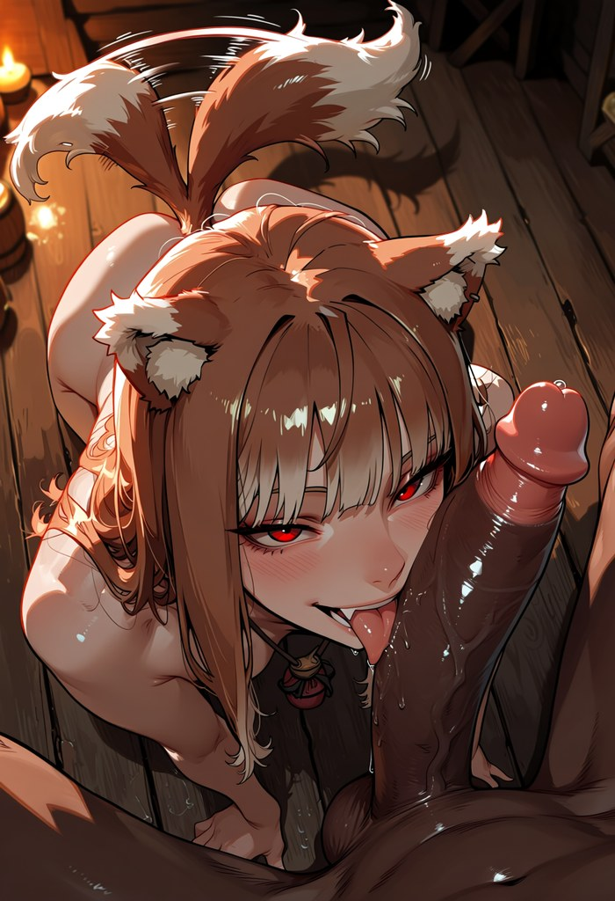

- **画风轴**：Aesthetic v1.1 + Silvana Mix
- **NSFW**：`explicit`（成人向）
- **抄什么**：正向写 explicit。抄 @silvana, @IterL1nes, holo, candlelight。LoRA iterationiskey-silvana-smoll=1。er_sde、30 步、CFG 4.5。
- **底模**：`anima-aesthetic-v1.1`
- **LoRA**：[iterationiskey-silvana-smoll:1.0](https://civitai.com/models/2832675?modelVersionId=3196596)
- **LoRA 链接**：https://civitai.com/models/2832675?modelVersionId=3196596
- **纯底模与否**：否
- **画师 tag**：`@silvana, @IterL1nes`
- **采样**：er_sde / simple · steps 30 · CFG 4.5 · 832x1216
- **热度**：206 likes / 120 hearts / 2 comments
- **来源**：[civitai:138703054](https://civitai.com/images/138703054)
- **为何收录**：赫萝是成年狼神；烛光酒馆 1boy 明示，Silvana/IterL1nes 混风 LoRA。

**prompt**

```
@silvana, @IterL1nes,
1girl, 1boy, interracial, penis worship,
holo, spice and wolf,
dark-skinned male, large penis, thick penis,
brown hair, messy hair, red eyes, fang, wolf ears, wolf tail, animal ears, animal tail,
nude,
kneeling, penis licking, tongue out, licking shaft, tongue on tip, tongue on underside, drool, saliva, wet, large penis,
eyes looking up, eager, aroused, blushing, wolf tail wagging,
wooden floor, tavern room, candlelight, warm lighting, intimate,
Holo kneels on the wooden floor, leaning forward with her tongue extended — tracing a slow, deliberate line from the base of the dark man's shaft all the way up to the tip, red eyes locked on his, wolf tail wagging eagerly behind her. <lora:Lora/anima/iterationiskey-silvana-smoll.safetensors:1.0>
```

**negative**

```
crown,, worst quality, low quality, score_1, score_2, score_3, artist name
```
### 办公室裸背打字

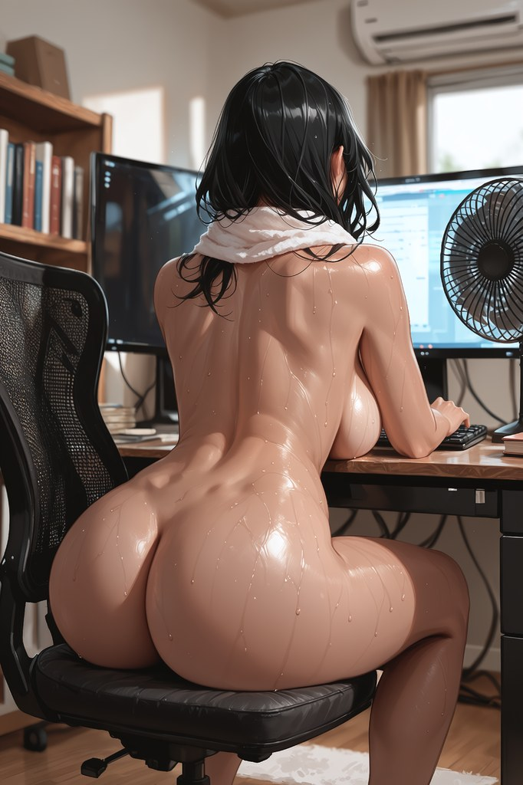

- **画风轴**：Ri-mix 室内裸背
- **NSFW**：`nsfw`（成人向）
- **抄什么**：正向写 nsfw。抄 nude, from behind, office chair, summer, sweat。LoRA rimixao5050=1。er_sde+sgm_uniform、30 步、CFG 3。负向保留 loli, chibi。
- **底模**：`anima-base-v1.0`
- **LoRA**：[rimixao5050:1](https://civitai.com/models/996220?modelVersionId=3011920)
- **LoRA 链接**：https://civitai.com/models/996220?modelVersionId=3011920
- **纯底模与否**：否
- **画师 tag**：（无）
- **采样**：er_sde / sgm_uniform · steps 30 · CFG 3.0 · 1536x2304
- **热度**：698 likes / 490 hearts
- **来源**：[civitai:133090213](https://civitai.com/images/133090213)
- **为何收录**：同作者最高热度：夏日办公室椅背裸、大胸成年解剖，对照海滩金饰条。

**prompt**

```
1girl, nude, ass, breasts, sitting, , towel around neck, towel, solo, from behind, black hair, nudist, indoors, back, chair, backboob, large breasts, book, completely nude, breast rest, on chair, swivel chair, facing away, dimples of venus, bookshelf, breasts on table, office chair, median furrow, monitor, shoulder blades, fan, , sweat, summer, typing, , window, air conditioner, on_computer, masterwork masterpiece, best quality, high quality, absurdres, highres, detailed, depth of field, , high detail, best quality, very aesthetic, aged up
```

**negative**

```
worst quality, low quality, score_1, score_2, score_3, artist name, (lowres:1.2), (worst quality:1.4), (low quality:1.4), (bad anatomy:1.4), bad hands, multiple views, jpeg artifacts, patreon logo, patreon username, web address, signature, watermark, text, logo, artist name, censored, mosaic censoring, loli, chibi
```

## Batch 09

**成人向 / NSFW 试目录续。** 接 Batch 08；仍只要 Anima UNET。动画/插画 only。抄的时候正向带上 **explicit / nsfw / sensitive**，负向建议保留 `loli, shota, child`。

### 逆向吐舌头衣着性交

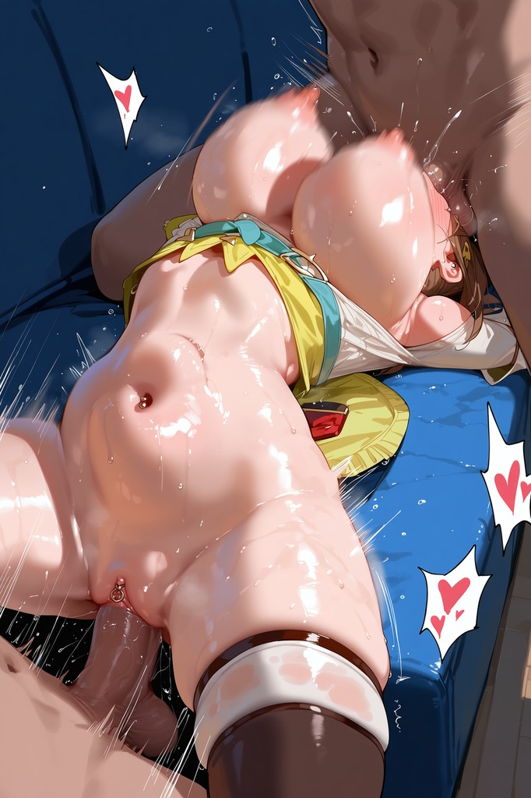

- **画风轴**：纯底模 @411llust0j1s4n 明示
- **NSFW**：`explicit`（成人向）
- **抄什么**：正向写 explicit。纯 anima-base-v1.0。 抄关键片段。dpmpp_2m_sde_gpu+simple、30 步、CFG 5.0。 负向建议保留 loli, shota, child。
- **底模**：`anima-base-v1.0`
- **LoRA**：（无）
- **LoRA 链接**：（无）
- **纯底模与否**：是
- **画师 tag**：（无）
- **采样**：dpmpp_2m_sde_gpu / simple · steps 30 · CFG 5.0 · 1024x1536
- **热度**：291 likes / 192 hearts / 1 comments
- **来源**：[civitai:134016946](https://civitai.com/images/134016946)
- **为何收录**：纯 base：闪亮皮肤、曲线、衣着性交逆向吐舌头构图，成年体型，无 LoRA。

**prompt**

```
sensitive, 1girl, @411llust0j1s4n, shiny skin, curvy, clothed sex, (reverse spitroast:1.25), lying, reisalin stout, (reverse fellatio:1.2), deepthroat, throat bulge, vaginal, solo focus, very sweaty, breasts out, nipple piercing, huge breasts, thick thighs, (skindentation:1.35), shouting spoken heart, bouncing breasts, motion blur, motion lines, 2boys, penis, uncensored,
```

**negative**

```
oversaturated, (monochrome:1.3), harsh contrast, (worst quality:0), (low quality:0), (score_1:0), (score_2:0), (score_3:0), jpeg artifacts, logo, watermark, bad anatomy, (bad hands:1.5), missing finger, extra digits, fewer digits, disfigured, mutation, 4 fingers, 6 fingers, (breasts out:1.2), long neck,
```
### 部落营火上身裸

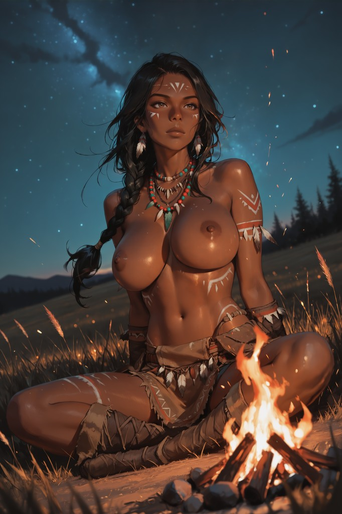

- **画风轴**：Ri-mix 部族营火
- **NSFW**：`nsfw`（成人向）
- **抄什么**：正向写 nsfw。LoRA rimixao5050:1。 抄关键片段。er_sde+sgm_uniform、30 步、CFG 3.0。 负向建议保留 loli, shota, child。
- **底模**：`anima-base-v1.0`
- **LoRA**：[rimixao5050:1](https://civitai.com/models/996220?modelVersionId=3011920)
- **LoRA 链接**：https://civitai.com/models/996220?modelVersionId=3011920
- **纯底模与否**：否
- **画师 tag**：（无）
- **采样**：er_sde / sgm_uniform · steps 30 · CFG 3.0 · 1536x2304
- **热度**：306 likes / 149 hearts
- **来源**：[civitai:133089862](https://civitai.com/images/133089862)
- **为何收录**：Ri-mix 另一场景：暗色营火、深肤成年女性上身裸+腰布，对照批08海滩/办公室。

**prompt**

```
1girl, topless tribal girl, female tribe member, , brown eyes, dark brown skin, black hair, long hair, braided hairstyle, large breasts, sitting by campfire, at night, on grassland plains, tribal jewelry, bead necklaces, loincloth, confident pose, detailed facial features, vibrant tribal colors, high resolution, warm firelight, starlit sky, embers glowing, traditional earthy tones, sensual expression, fantasy setting,, masterwork masterpiece, best quality, high quality, absurdres, highres, detailed, depth of field, , high detail, best quality, very aesthetic, aged up
```

**negative**

```
worst quality, low quality, score_1, score_2, score_3, artist name, (lowres:1.2), (worst quality:1.4), (low quality:1.4), (bad anatomy:1.4), bad hands, multiple views, jpeg artifacts, patreon logo, patreon username, web address, signature, watermark, text, logo, artist name, censored, mosaic censoring, loli, chibi
```
### 偷摸手活 Hintobento

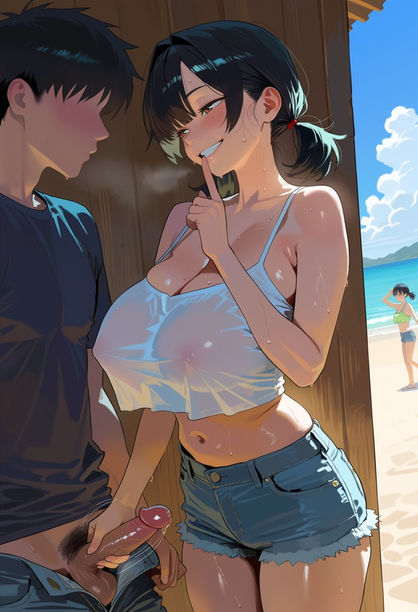

- **画风轴**：Turbo+Hintobento 明示1boy
- **NSFW**：`explicit`（成人向）
- **抄什么**：正向写 explicit。LoRA anima-turbo-lora-v0.2:1; Hintobento_Anima:1。 抄关键片段。Euler a+Beta、12 步、CFG 1.0。 负向建议保留 loli, shota, child。
- **底模**：`anima-base-v1.0`
- **LoRA**：[anima-turbo-lora-v0.2:1; Hintobento_Anima:1](https://civitai.com/models/2560840?modelVersionId=2979642)
- **LoRA 链接**：https://civitai.com/models/2560840?modelVersionId=2979642
- **纯底模与否**：否
- **画师 tag**：（无）
- **采样**：Euler a / Beta · steps 12 · CFG 1.0 · 832x1216
- **热度**：282 likes / 179 hearts
- **来源**：[civitai:133480891](https://civitai.com/images/133480891)
- **为何收录**：高完成度 1boy 明示：夏日室内隐秘手活、指唇坏笑，Hintobento 画风。

**prompt**

```
masterpiece, best quality,  
<lora:anima-turbo-lora-v0.2:1>
 <lora:Hintobento_Anima:1> H1nt0Sknsfw,
1girl, 1boy, faceless male, 
large breasts, short hair, twintails, sweat, 
white crop top, spaghetti strap, crop top overhang, denim shorts, covered nipples, midriff, 
standing, handjob, penis, testicles, precum, stealth handjob, femdom, finger to mouth, 
looking at another, grin,  
indoors, summer,
```

**negative**

```
worst quality, low quality, lowres, jpeg artifacts, bad hands, speech bubble, watermark, logo, bar censor, 3d, censored,
```
### 倒吊深喉 NTRMix

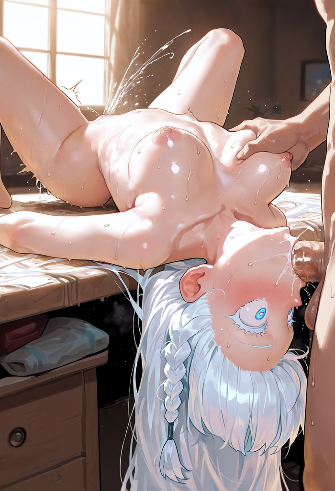

- **画风轴**：NTRMix 明示
- **NSFW**：`explicit`（成人向）
- **抄什么**：正向写 explicit。LoRA ntrmix_style_anima_b1_v1:1。 抄关键片段。ER SDE+Beta、30 步、CFG 4.0。 负向建议保留 loli, shota, child。
- **底模**：`anima-base-v1.0`
- **LoRA**：[ntrmix_style_anima_b1_v1:1](https://civitai.com/models/2393785?modelVersionId=2968967)
- **LoRA 链接**：https://civitai.com/models/2393785?modelVersionId=2968967
- **纯底模与否**：否
- **画师 tag**：`@ntrmixstyle`
- **采样**：ER SDE / Beta · steps 30 · CFG 4.0 · 1248x1824
- **热度**：184 likes / 97 hearts
- **来源**：[civitai:130979319](https://civitai.com/images/130979319)
- **为何收录**：NTRMix 风格：白发心瞳、阳光窗边倒吊口交，成年解剖清楚。

**prompt**

```
masterpiece, best quality, score_9, score_8, score_7, @ntrmixstyle, 1girl, solo focus, white hair, long hair, very long hair, blue eyes, side braids, long bangs, colored eyelashes, wide-eyed, heart-shaped pupils, blush, saliva, sweat, medium breasts, nude, nipples, lying, on back, spread legs, reverse fellatio, oral, irrumatio, upside-down, female ejaculation, 1boy, penis, cum in mouth, grabbing another's breast, indoors, room, window, sunlight, <lora:ntrmix_style_anima_b1_v1:1>,
```

**negative**

```
worst quality, low quality, score_1, score_2, score_3, artist name, blurry, jpeg artifacts, lowres, censor,
```
### 稻荷巫女涉水

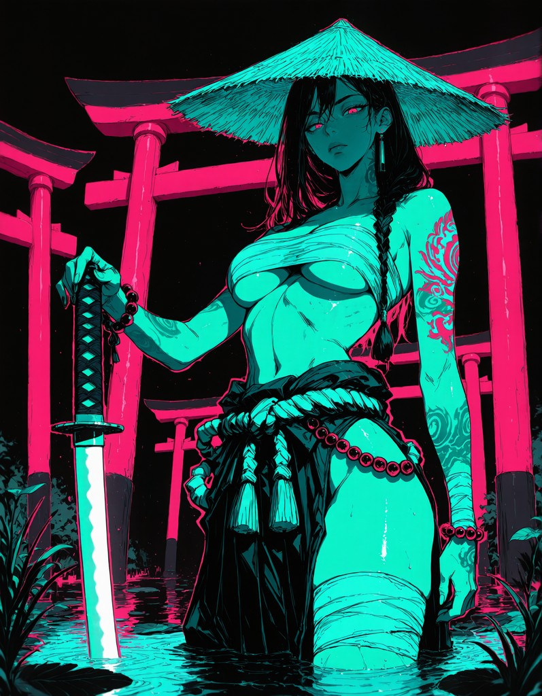

- **画风轴**：Myth Dark Lines 敏感
- **NSFW**：`nsfw`（成人向）
- **抄什么**：正向写 nsfw。LoRA AnimaMythD4rkL1nes:1。 抄关键片段。ER SDE+Beta、32 步、CFG 4.0。 负向建议保留 loli, shota, child。
- **底模**：`anima-preview3-base`
- **LoRA**：[AnimaMythD4rkL1nes:1](https://civitai.com/models/599757?modelVersionId=2918615)
- **LoRA 链接**：https://civitai.com/models/599757?modelVersionId=2918615
- **纯底模与否**：否
- **画师 tag**：（无）
- **采样**：ER SDE / Beta · steps 32 · CFG 4.0 · 1496x1920
- **热度**：160 likes / 81 hearts
- **来源**：[civitai:129621821](https://civitai.com/images/129621821)
- **为何收录**：Velvet Myth Dark Lines：草帽巫女涉水、sarashi 露下乳、限色线描，敏感向。

**prompt**

```
masterpiece, best quality,score_9, score_8, score_7, highres,8K,HDR,absurdres, 1girl, solo, long hair, breasts, black hair, hat, jewelry, braid, weapon, sword, holding weapon, water, bracelet, tattoo, underboob, leaf, holding sword, bandages, katana, rope, wading, beads, sarashi, straw hat, arm tattoo, torii, bandaged leg, shimenawa, planted, planted sword, hand on hilt, samurai, rope belt, rice hat, looking at viewer, limited palette, sketch, glowing, psychedelic, simple background. <lora:AnimaMythD4rkL1nes:1> D4rkL1nes
```

**negative**

```
worst quality, low quality, score_1, score_2, score_3, artist name,blurry, jpeg artifacts, lowres,censor, watermark,simple background, loli,
```
### 草地双人口交 Turbo

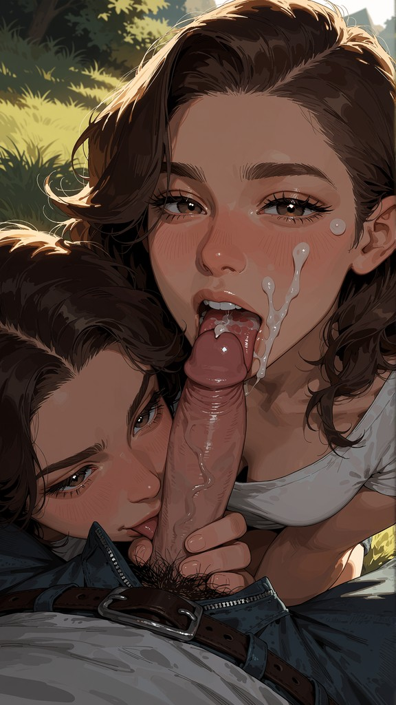

- **画风轴**：NIJI Sweet Spot Turbo
- **NSFW**：`explicit`（成人向）
- **抄什么**：正向写 explicit。LoRA anima-base-1-masterpiece-v51:1; Anima_NIJI_SWEET_SPOT_v5:0.4。 抄关键片段。euler_ancestral+beta、4 步、CFG 1.0。 负向建议保留 loli, shota, child。
- **底模**：`anima-turbo-v1.1`
- **LoRA**：[anima-base-1-masterpiece-v51:1; Anima_NIJI_SWEET_SPOT_v5:0.4](https://civitai.com/models/929497?modelVersionId=2961717)
- **LoRA 链接**：https://civitai.com/models/929497?modelVersionId=2961717
- **纯底模与否**：否
- **画师 tag**：`@NJSW33T`
- **采样**：euler_ancestral / beta · steps 4 · CFG 1.0 · 1080x1920
- **热度**：149 likes / 57 hearts
- **来源**：[civitai:141335807](https://civitai.com/images/141335807)
- **为何收录**：Turbo v1.1 + NIJI Sweet Spot：草地双女一男口交，成人向明示。

**prompt**

```
masterpiece, best quality, score_7, @NJSW33T, Smo0thL1nes, 2girls, 1man, adult, girls sitting on grass, licking cock, cum on cock,
```

**negative**

```
worst quality, low quality, score_1, score_2, score_3, artist name, blurry, jpeg artifacts, chromatic aberration
```
### 芙莉莲池塘叠胸


- **画风轴**：gpt-image-2 + Dark Art
- **NSFW**：`nsfw`（成人向）
- **抄什么**：正向写 nsfw。LoRA gpt-image-2_anima-base1_v1:0.95; dark_art_style_Anima-step00002750:0.55。 抄关键片段。er_sde+simple、16 步、CFG 5.0。 负向建议保留 loli, shota, child。
- **底模**：`anima-base-v1.0`
- **LoRA**：[gpt-image-2_anima-base1_v1:0.95; dark_art_style_Anima-step00002750:0.55](https://civitai.com/models/2564225?modelVersionId=2946878)
- **LoRA 链接**：https://civitai.com/models/2564225?modelVersionId=2946878
- **纯底模与否**：否
- **画师 tag**：（无）
- **采样**：er_sde / simple · steps 16 · CFG 5.0 · 2048x3072
- **热度**：254 likes / 168 hearts / 1 comments
- **来源**：[civitai:135644408](https://civitai.com/images/135644408)
- **为何收录**：芙莉莲/费伦均为成年精灵：池塘叠胸构图，gpt-image-2 线面+Dark Art。

**prompt**

```
2girls, Frieren \(sousou no frieren\), small breasts, nude, she is sitting in knee deep water with (Fern \(sousou no frieren\), Fern purple hair, nude her head out of frame behind her resting her huge breasts sagging on frierens head her hands on her shoulders, elaborate hairstyle, front view, exterior, flowers, pond, pastel eyes, light eye color, light skin, cute, black outline, nipples, looking up,

pos: masterpiece, best quality, score_9, score_8, score_7, year 2025, newest, highres, absurdres, very aesthetic, anime coloring, detailed skin, perfect face, perfect eyes, very awa, dramatic lighting<lora:gpt-image-2_anima-base1_v1:0.95> <lora:dark_art_style_Anima-step00002750:0.55>
```

**negative**

```
worst quality, low quality, score_1, score_2, score_3, blurry, jpeg artifacts, sepia, signature, artist name, bad anatomy, missing fingers, extra fingers,sweat,
```
### MoriiMee 黑丝内衣

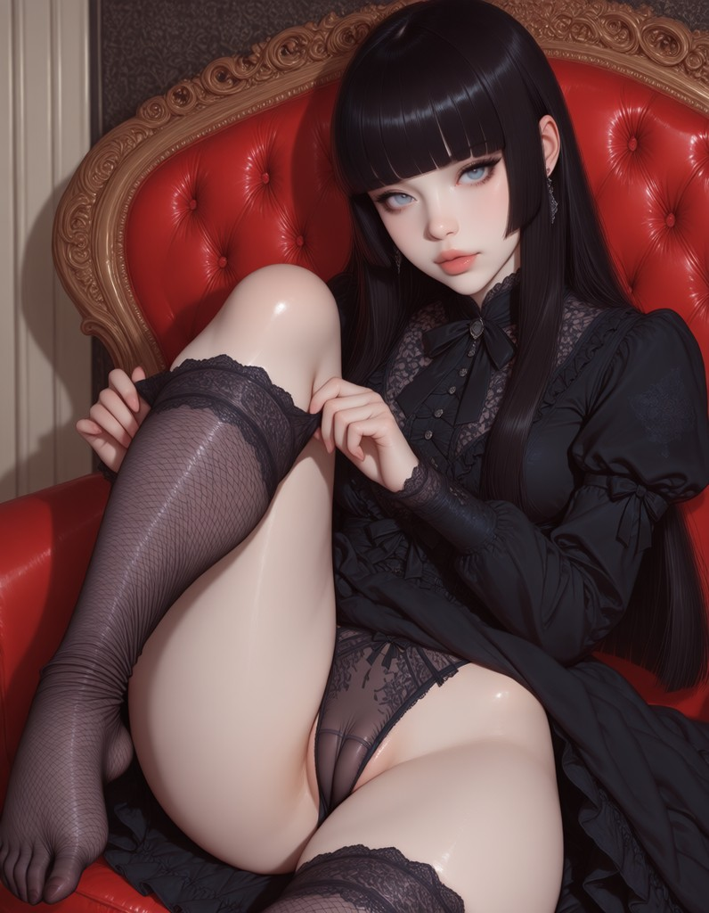

- **画风轴**：MoriiMee 哥特内衣
- **NSFW**：`nsfw`（成人向）
- **抄什么**：正向写 nsfw。LoRA MoriiMee_AnimaPreview2_byKonan:1。 抄关键片段。ER SDE+Simple、32 步、CFG 4.0。 负向建议保留 loli, shota, child。
- **底模**：`anima-preview2`
- **LoRA**：[MoriiMee_AnimaPreview2_byKonan:1](https://civitai.com/models/2485109?modelVersionId=2793997)
- **LoRA 链接**：https://civitai.com/models/2485109?modelVersionId=2793997
- **纯底模与否**：否
- **画师 tag**：（无）
- **采样**：ER SDE / Simple · steps 32 · CFG 4.0 · 896x1152
- **热度**：67 likes / 39 hearts
- **来源**：[civitai:125008493](https://civitai.com/images/125008493)
- **为何收录**：MoriiMee Preview2：黑发黑丝内衣坐姿，哥特写实向，成年。

**prompt**

```
masterpiece, best quality,
realistic,
1girl, solo, thighhighs, black hair, long hair, underwear, blunt bangs,  sitting, looking at viewer, lace, cameltoe, lace trim, black dress, black panties, long sleeves, black thighhighs, lace-trimmed legwear, no shoes, feet, partially visible vulva, earrings, thighs, chair, lips, armchair, fishnets, puffy sleeves, fishnet thighhighs, hime cut, frills, knee up, grey eyes, highleg, toes, legs,  <lora:MoriiMee_AnimaPreview2_byKonan:1>
```

**negative**

```
score_1, low quality, worst quality, score_2, score_3, displeasing, score_4, very displeasing, lowres, lowres face, bad eyes, poorly detailed face, bad anatomy, extra fingers, extra digits, too many fingers, too many digits, fused fingers, inverted limbs, mixed limbs, oversized limbs, emphasis lines, motion lines, speed lines, censored, bar censor, white bar censor, ass, fisheye, watermark, signature, artist name
```
### 血祭魔女举刃

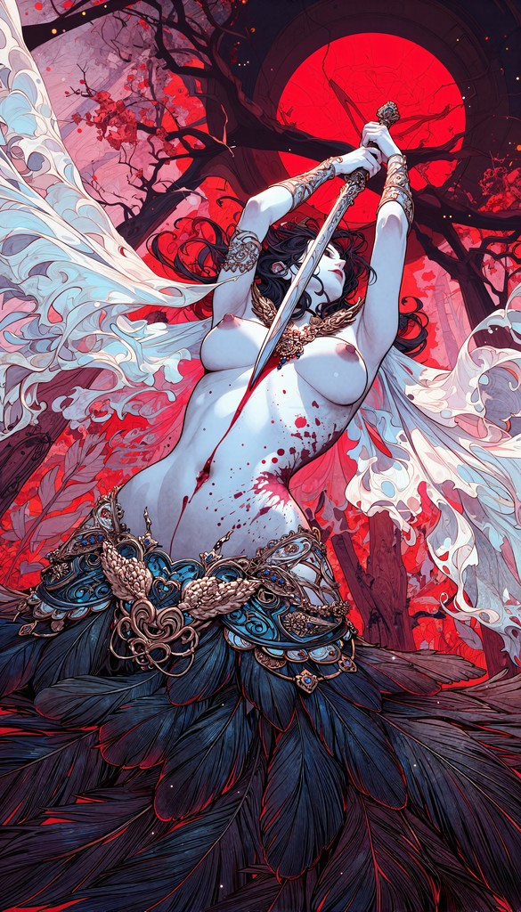

- **画风轴**：preview 纯底模厚涂裸
- **NSFW**：`nsfw`（成人向）
- **抄什么**：正向写 nsfw。纯 anima-preview。 抄关键片段。Euler a+simple、24 步、CFG 5.0。 负向建议保留 loli, shota, child。
- **底模**：`anima-preview`
- **LoRA**：（无）
- **LoRA 链接**：（无）
- **纯底模与否**：是
- **画师 tag**：（无）
- **采样**：Euler a / simple · steps 24 · CFG 5.0 · 2304x4032
- **热度**：57 likes / 27 hearts
- **来源**：[civitai:124684167](https://civitai.com/images/124684167)
- **为何收录**：preview 纯底模：血祭仪式、上身裸举黑曜石刃，厚涂恐怖幻想，对照批08墨龙。

**prompt**

```
(masterpiece, best quality, good quality, amazing quality, very aesthetic, (extremely detailed, intricate details:1.2), absurdres, newest, highres, score_9, score_8:1.4), (dynamic angle:1.4), (exaggerated perspective:1.3), looking at viewer,  (Dark horror fantasy, visceral textures:1.4), 1girl, solo, blood cultist, dynamic ritualistic pose, arms raised to a crimson moon, pale skin splattered with artistic droplets of dark blood, topless, her breasts are medium and perky, a large obsidian dagger held between them, nipples are dark and stark against her pale skin, wearing a skirt made of tattered black feathers, background a ritual stone circle in a dead forest, the air thick with embers and red smoke, harsh crimson lighting, macabre and intensely alluring.  , (Yoshitaka Amano art style, ethereal flowing linework, wispy textures, ornate jewelry, surreal character design, pale porcelain skin, vibrant watercolor splashes, dreamlike composition, intricate fabric folds:1.1)
```

**negative**

```
lowres, (low quality, worst quality, normal quality:1.2), blurry, score_1, score_2, score_3, score_4, score_5, jpeg artifacts, text, watermark, signature, (bad anatomy, bad hands, deformed hands, extra fingers, mutated hands, missing fingers, malformed limbs, fused fingers:1.2), too many fingers, loli
```

## Batch 10

**成人向 / NSFW 试目录续二。** 继续拉开画风：武士裸背、MeMaAni、温泉、异度神剑、Meion 霓虹、水彩、阿努比斯 OC、Chel、SamDoesArts。

### 武士裸背拔刀

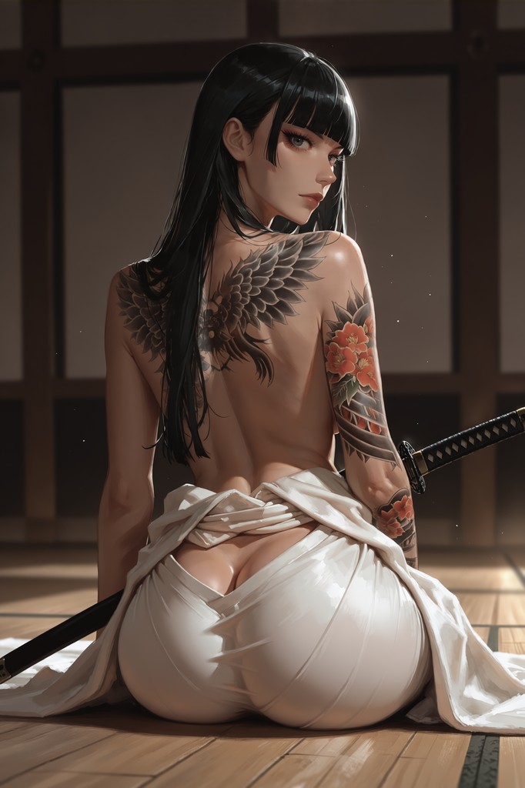

- **画风轴**：Ri-mix 道场裸背
- **NSFW**：`nsfw`（成人向）
- **抄什么**：正向写 nsfw。LoRA rimixao5050:1。 抄关键片段。er_sde+sgm_uniform、30 步、CFG 3.0。 负向建议保留 loli, shota, child。
- **底模**：`anima-base-v1.0`
- **LoRA**：[rimixao5050:1](https://civitai.com/models/996220?modelVersionId=3011920)
- **LoRA 链接**：https://civitai.com/models/996220?modelVersionId=3011920
- **纯底模与否**：否
- **画师 tag**：（无）
- **采样**：er_sde / sgm_uniform · steps 30 · CFG 3.0 · 1536x2304
- **热度**：224 likes / 114 hearts
- **来源**：[civitai:133089941](https://civitai.com/images/133089941)
- **为何收录**：Ri-mix 道场侧光：裸背纹身、拔刀、臀线，成年女性，异于批08办公室裸背。

**prompt**

```
1girl, solo, samurai, long hair, black hair, hair behind ear, blunt bangs, thick eyelashes, looking back, topless, undressed, bare back, back tattoo, arm tattoo, y shaped butt crack, covered ass, blanket on ass, katana, black sheath, unsheathing, dojo, wooden floor, floor mat, dark room, sidelighting, rim light, sheath_between_legs, masterwork masterpiece, best quality, high quality, absurdres, highres, detailed, depth of field, , high detail, best quality, very aesthetic, aged up
```

**negative**

```
worst quality, low quality, score_1, score_2, score_3, artist name, (lowres:1.2), (worst quality:1.4), (low quality:1.4), (bad anatomy:1.4), bad hands, multiple views, jpeg artifacts, patreon logo, patreon username, web address, signature, watermark, text, logo, artist name, censored, mosaic censoring, loli, chibi
```
### 芙莉莲黑丝后倾

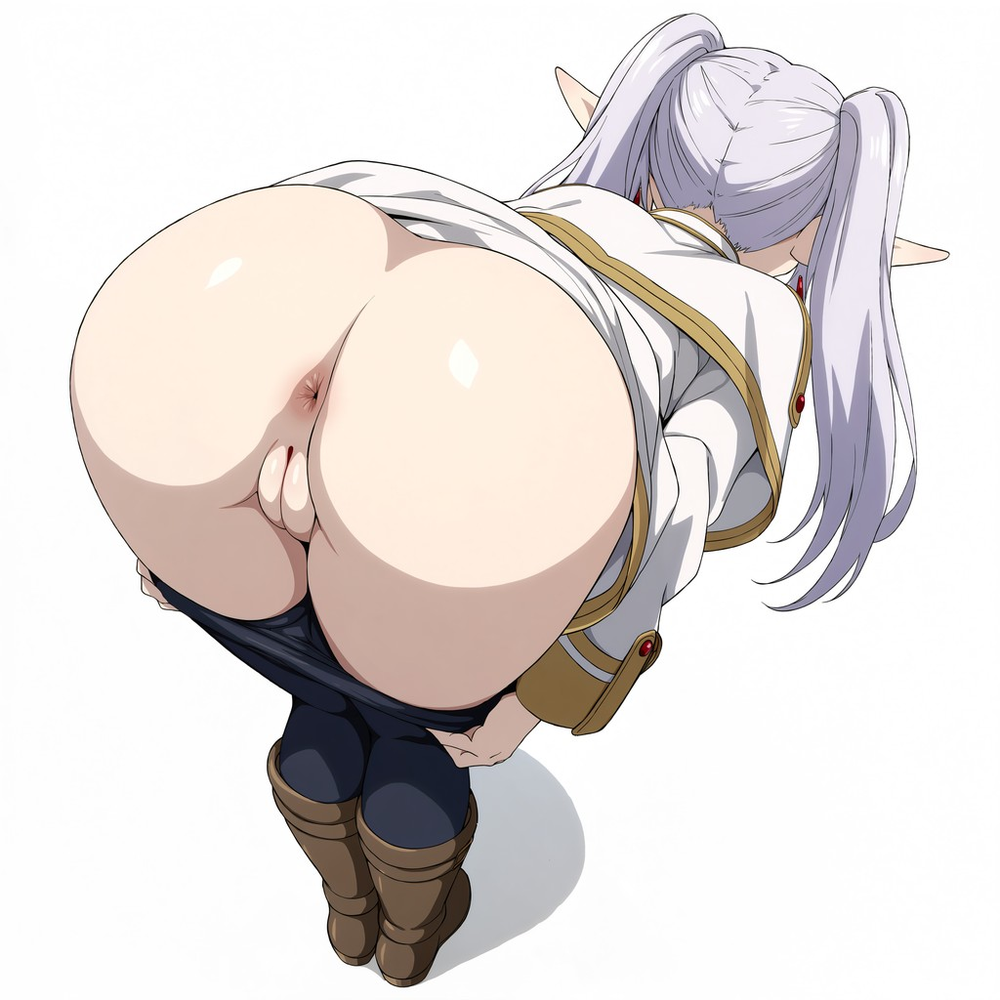

- **画风轴**：MeMaAni 明示
- **NSFW**：`explicit`（成人向）
- **抄什么**：正向写 explicit。LoRA MeMaAni_P2_V1:1。 抄关键片段。DPM2+Beta、25 步、CFG 4.0。 负向建议保留 loli, shota, child。
- **底模**：`anima-preview2`
- **LoRA**：[MeMaAni_P2_V1:1](https://civitai.com/models/2483826?modelVersionId=3142453)
- **LoRA 链接**：https://civitai.com/models/2483826?modelVersionId=3142453
- **纯底模与否**：否
- **画师 tag**：（无）
- **采样**：DPM2 / Beta · steps 25 · CFG 4.0 · 2048x2048
- **热度**：62 likes / 36 hearts
- **来源**：[civitai:124955795](https://civitai.com/images/124955795)
- **为何收录**：MeMaAni 平涂：芙莉莲黑丝后倾露穴，成年精灵，异于批08水下 Shexyo。

**prompt**

```
<lora:MeMaAni_P2_V1:1>, masterpiece, newest, best quality, very aesthetic, (frieren:0.7), 1girl, anus, ass, ass focus, (bent over:1.2), black pantyhose, boots, brown boots, capelet, cleft of venus, clothes pull, elf, from behind, three quarter view, from side, foreshortening, full body, gold trim, grey hair, long hair, long pointy ears, long sleeves, no panties, pantyhose, pantyhose pull, pointy ears, presenting, presenting ass, pussy, simple background, skirt, solo, standing, thighs, twintails, uncensored, white background, white capelet, white skirt, thin, legs together, shadow,
```

**negative**

```
worst quality, low quality, score_1, score_2, score_3, blurry, jpeg artifacts, ye-pop, deviantart, signature, logo, artist logo, bad_hands, too many fingers, bad perspective,
```
### 达克妮丝温泉

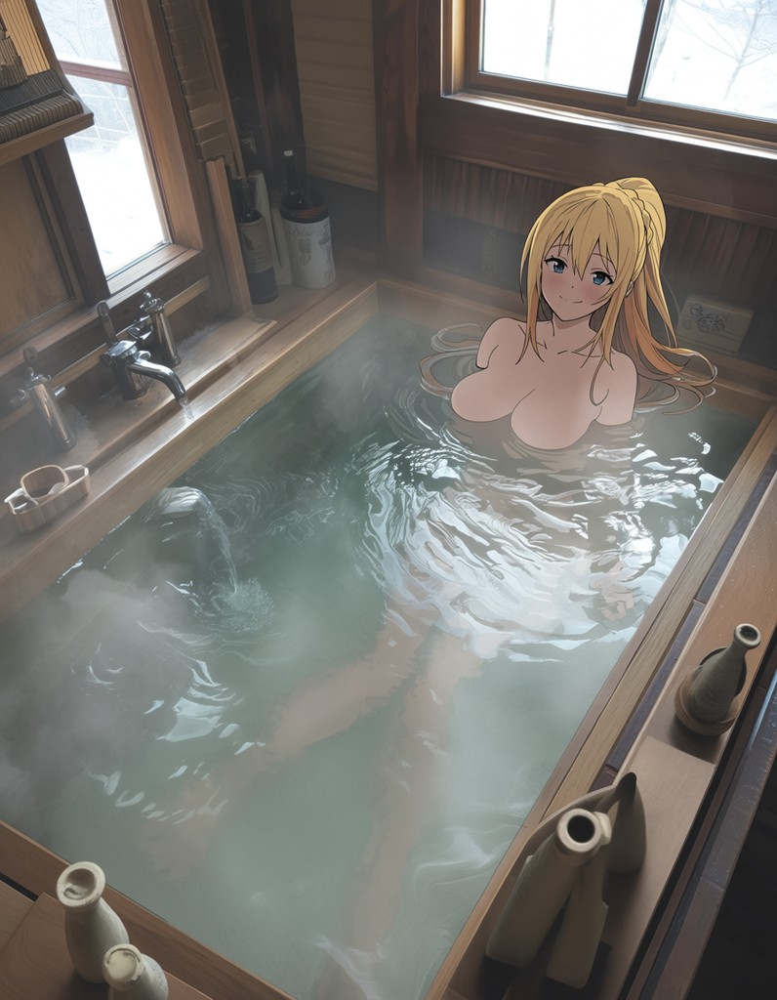

- **画风轴**：Aesthetic 质量词 写真背景
- **NSFW**：`nsfw`（成人向）
- **抄什么**：正向写 nsfw。LoRA Aesthetic Quality Modifiers-anima-preview-3。 抄关键片段。euler+simple、30 步、CFG 4.0。 负向建议保留 loli, shota, child。
- **底模**：`anima-base-v1.0`
- **LoRA**：[Aesthetic Quality Modifiers-anima-preview-3](https://civitai.com/models/929497?modelVersionId=2905490)
- **LoRA 链接**：https://civitai.com/models/929497?modelVersionId=2905490
- **纯底模与否**：否
- **画师 tag**：`@nnn yryr`
- **采样**：euler / simple · steps 30 · CFG 4.0 · 896x1152
- **热度**：169 likes / 78 hearts
- **来源**：[civitai:130803769](https://civitai.com/images/130803769)
- **为何收录**：小林家达克妮丝成年：温泉入浴俯视，写真背景+质量 LoRA，干净构图。

**prompt**

```
(masterpiece, best quality, amazing quality, very aesthetic, extremely detailed, very detailed, absurdres, newest, highres, score_9, score_8), darkness \(konosuba\), @[miyajima reiji|pong \(pong o0\)|gishiki \(gshk\)|matsuoka \(mtok 0\)|mika pikazo|yu \(stdio nameraka\)|lifeline \(a384079959\)], photo background, 1girl, solo, blonde hair, bathing, blue eyes, onsen, completely nude, partially submerged, sake bottle, water, ponytail, long hair, looking at viewer, window, indoors, sitting, sidelocks, steam, hair between eyes, from above, blush, smile, bathroom, collarbone, closed mouth. A high-angle shot of Darkness from Konosuba bathing in an indoor onsen. She has long blonde hair, blue eyes, and a blushing smile while looking up at the viewer. She is completely nude and partially submerged in the clear water, with steam rising around her. The realistic onsen setting includes a wooden faucet, wooen walls, a sake bottle, and a window that lets in soft light. The water's surface shows gentle ripples as she sits in the center of the tub.
```

**negative**

```
score_1,score_2,score_3,bad anatomy,bad proportions,deformed anatomy,deformed face, deformed eyes,text,multiple fingers, | worst quality,low quality,score_1,score_2,score_3,artist name,blurry,jpeg artifacts,sepia,mosaic censoring,bar censor,censored,bad anatomy,bad hands

score_1,score_2,score_3,artist name,blurry,jpeg artifacts,sepia,mosaic censoring,bar censor,censored,bad anatomy,bad hands

score_1,score_2,score_3,bad anatomy,bad proportions,deformed anatomy,deformed face, deformed eyes, 

score_1, score_2, score_3,bad anatomy, bad proportions, deformed anatomy, deformed face, deformed eyes, text, multiple fingers, child, loli, shota
```
### 蜜丝菈超乳微裙

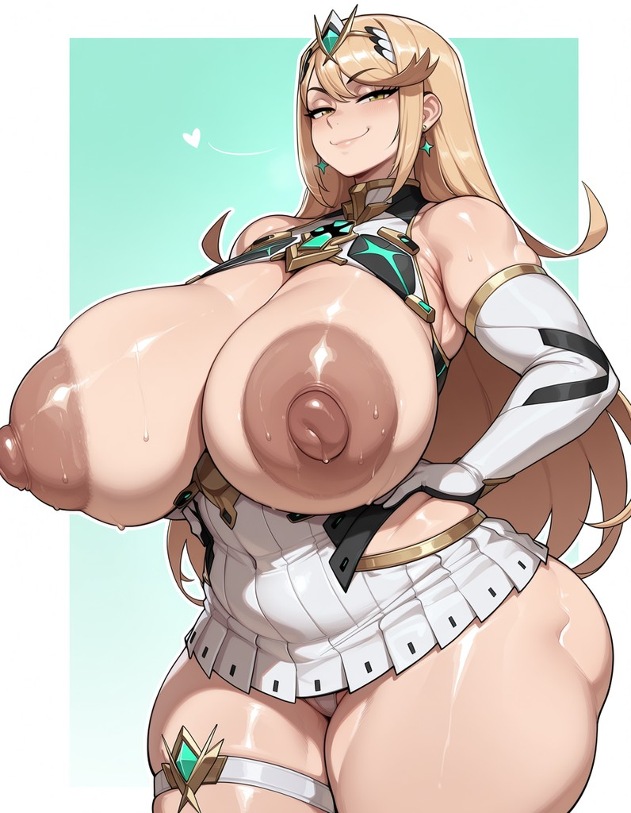

- **画风轴**：preview2 纯底模
- **NSFW**：`nsfw`（成人向）
- **抄什么**：正向写 nsfw。纯 anima-preview2。 抄关键片段。dpmpp_2m_sde_gpu+simple、25 步、CFG 5.0。 负向建议保留 loli, shota, child。
- **底模**：`anima-preview2`
- **LoRA**：（无）
- **LoRA 链接**：（无）
- **纯底模与否**：是
- **画师 tag**：（无）
- **采样**：dpmpp_2m_sde_gpu / simple · steps 25 · CFG 5.0 · 896x1152
- **热度**：29 likes / 21 hearts
- **来源**：[civitai:125115232](https://civitai.com/images/125115232)
- **为何收录**：异度神剑蜜丝菈成年：超乳微裙露点，preview2 纯底模。

**prompt**

```
nsfw, bytmm, 1girl, mythra \(xenoblade\), huge breasts, huge nipples, large areolae, puffy areolae, plump, thick thighs, wide hips, breasts out, microdress, white dress, pleated dress, thigh strap, elbow gloves, blonde hair, seductive smile,
```

**negative**

```
worst quality, low quality, score_1, score_2, score_3, jpeg artifacts, logo, watermark, (bad anatomy:1.2), (bad hands:1.6), missing finger, (extra digits:1.4), fewer digits, disfigured, mutation, 4 fingers, (6 fingers:1.5),
```
### Meion 猫耳泳池霓虹

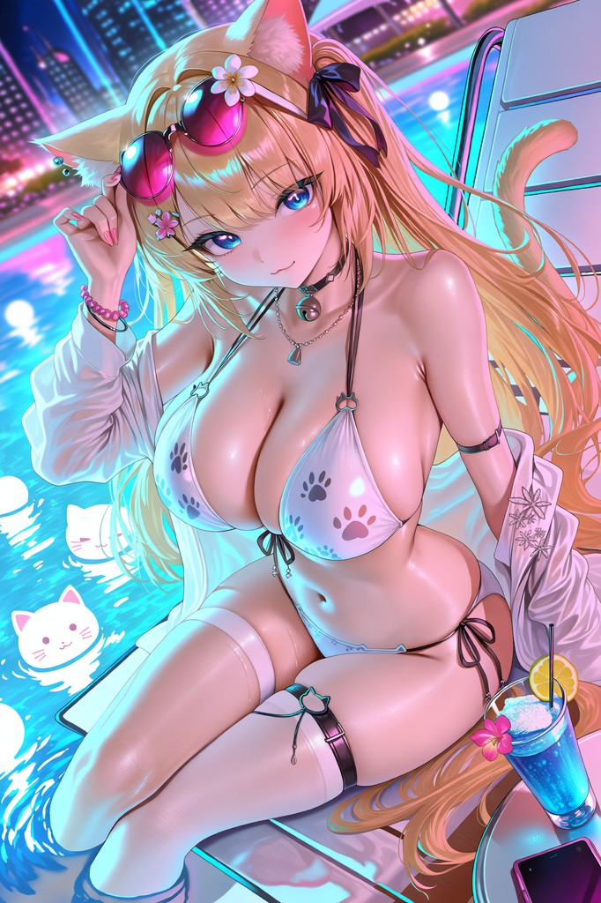

- **画风轴**：Meion 平涂霓虹
- **NSFW**：`sensitive`（成人向）
- **抄什么**：正向写 nsfw。LoRA Meion_anima_style_2-000034:1.0。 抄关键片段。Euler a simple+simple、40 步、CFG 5.5。 负向建议保留 loli, shota, child。
- **底模**：`anima-base-v1.0`
- **LoRA**：[Meion_anima_style_2-000034:1.0](https://civitai.com/models/2533943?modelVersionId=3011314)
- **LoRA 链接**：https://civitai.com/models/2533943?modelVersionId=3011314
- **纯底模与否**：否
- **画师 tag**：`@meionANIMAstyle`
- **采样**：Euler a simple / simple · steps 40 · CFG 5.5 · 2048x3072
- **热度**：138 likes / 52 hearts
- **来源**：[civitai:133065456](https://civitai.com/images/133065456)
- **为何收录**：Meion 画风：猫耳成年女性泳池霓虹比基尼+过膝袜，敏感/薄纱向。

**prompt**

```
masterpiece, best quality, score_9, score_8, score_7
@meionANIMAstyle, A blonde, blue-eyed woman with cat ears and a cat tail sits by a poolside bathed in neon blue light. She wears a white halter-neck bikini top (adorned with paw print patterns), bikini bottoms, white knee-high stockings (with black garters), a bell necklace, and a loose white shirt casually draped over her shimmering shoulders. Bathed in vibrant cyan and magenta lights, she pulls pink sunglasses off her head with one hand. Beside her sits a powder-blue cocktail, garnished with a lemon slice, a small pink flower, and a smartphone. The high-angle shot captures the dazzling city lights in the background and the white cat-shaped swimming rings floating on the water.
<lora:Meion_anima_style_2-000034:1.0>
```

**negative**

```
lowres, text, error, worst quality, watermark, signature, bad hands, bad feet, colored pupils, interlocked fingers, extra fingers, blurry eyes
```
### 水彩非人成熟女

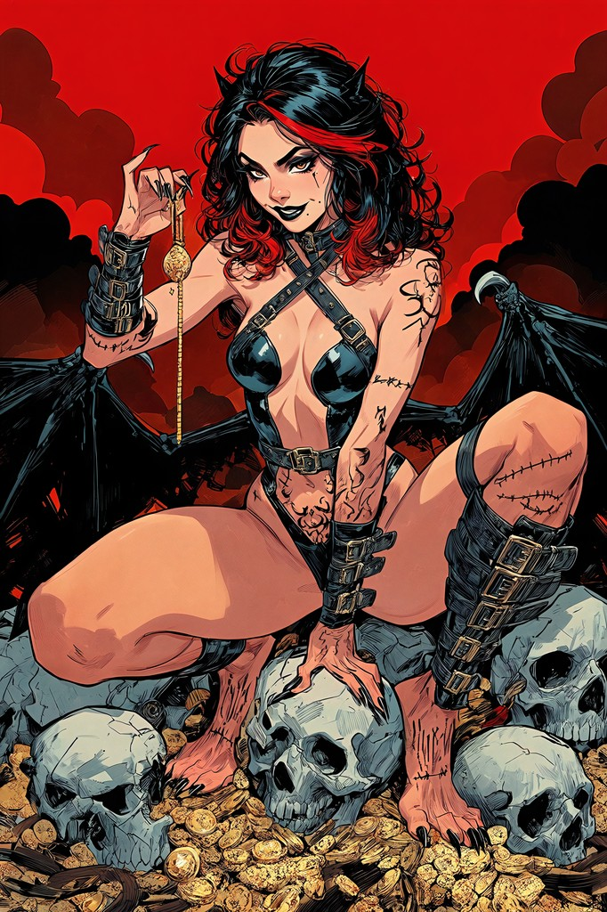

- **画风轴**：Watercolor 成熟
- **NSFW**：`nsfw`（成人向）
- **抄什么**：正向写 nsfw。LoRA watercolor_v1.1_base_step1250:0.5。 抄关键片段。Euler+Simple、25 步、CFG 3.0。 负向建议保留 loli, shota, child。
- **底模**：`anima-base-v1.0`
- **LoRA**：[watercolor_v1.1_base_step1250:0.5](https://civitai.com/models/2724298?modelVersionId=3085514)
- **LoRA 链接**：https://civitai.com/models/2724298?modelVersionId=3085514
- **纯底模与否**：否
- **画师 tag**：（无）
- **采样**：Euler / Simple · steps 25 · CFG 3.0 · 2048x3072
- **热度**：135 likes / 53 hearts
- **来源**：[civitai:140493432](https://civitai.com/images/140493432)
- **为何收录**：Anima 水彩 LoRA：非人成熟女性、小胸窄肩、水彩滴墨，异于二次元平涂。

**prompt**

```
<lora:watercolor_v1.1_base_step1250:0.5>

Watercolor style painting, (Watercolor), (Pastel), (Watercolors), Pencil Lines, Paint Drips, Watercolor Paint, Drawing Lines, High Detail, Detailed, Depth of Field, Masterpiece, Detailed Eyes, , score_9, score_8, score_7,
Woman, mature, non-human, graceful,
narrow shoulders, small breasts, teardrop-shaped breasts, collarbones, sexy, large hips, thin calves, sunken belly, drawn belly, passionate, gloomy,

oval face, pointed chin, high cheekbones, almond-shaped eyes, black upturned eyeliner, pale lips, black lipstick, dark skin, mole on cheek,
hook-nosed, clawed feet, long nails,

black leather wings behind back, bat wings,

black hair, tangled hair, wavy hair, red streaks in hair, shaggy, small bones in hair,

chest bound with leather straps, iron buckles, exposed belly, savage, roughly stitched, asymmetrical, leather loincloth Bandage, tight bandage, legs bound with leather strips, body painted with occult symbols,

sitting on a pile of skulls and gold jewelry, gloomy setting. Red skies, black clouds, squatting,
predatory pose, slightly lowered wings, predatory smile, teeth visible, animal fangs, holding a gold necklace in hand, human hands, long nails, foot on skull, hand resting on skull,

greedy, voluptuous, grinning, seductive, excited, lewd, sexy pose, protruding ass, defined groin folds, angled view.

full body,
```

**negative**

```
score_1, score_2, score_3, score_4, low_quality, worst_quality,normal quality, signature,blurry,anime, manga, 3d, render,text, stamp, watermark,missing fingers, extra fingers, ugly fingers, amputation, more than five fingers, less the 5 fingers,
```
### 阿努比斯女祭司

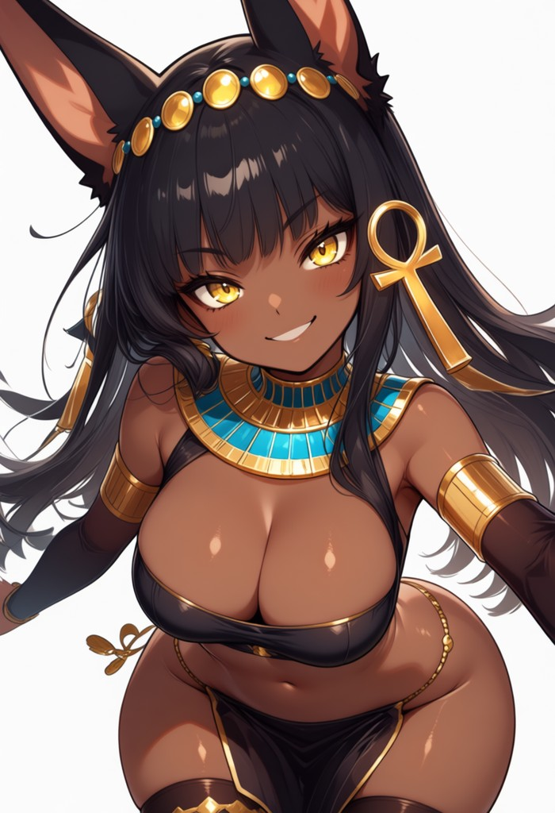

- **画风轴**：AnubisCitron OC
- **NSFW**：`sensitive`（成人向）
- **抄什么**：正向写 nsfw。LoRA AnubisCitronOC_ANIMAv1_v1:1.0。 抄关键片段。er_sde+simple、25 步、CFG 5.0。 负向建议保留 loli, shota, child。
- **底模**：`anima-base-v1.0`
- **LoRA**：[AnubisCitronOC_ANIMAv1_v1:1.0](https://civitai.com/models/162089?modelVersionId=3229852)
- **LoRA 链接**：https://civitai.com/models/162089?modelVersionId=3229852
- **纯底模与否**：否
- **画师 tag**：（无）
- **采样**：er_sde / simple · steps 25 · CFG 5.0 · 832x1216
- **热度**：145 likes / 72 hearts
- **来源**：[civitai:139736000](https://civitai.com/images/139736000)
- **为何收录**：Citron OC 阿努比斯：深肤金饰、骨盆帘+短上衣，curvy 成年，敏感向。

**prompt**

```
masterpiece, best quality, solo, curvy, beautiful eyes, 1girl, smile, looking at viewer,

AnuC1tron, yellow eyes, black hair, dark skin, jackal ears, 
pelvic curtain, crop top, thighhighs, armlet, usekh collar, gold, ankh, detached sleeves, 
<lora:AnubisCitronOC_ANIMAv1_v1:1.0>


, upper body, portrait, smile, looking at viewer, white background, dynamic angle, leaning forward,
```

**negative**

```
(nipples, covered nipples, blurry), (lowres:1.2), (worst quality:1.4), (low quality:1.4), (bad anatomy:1.4), bad hands, multiple views, jpeg artifacts, signature, watermark, text, logo, artist name,
```
### Chel 丛林回眸

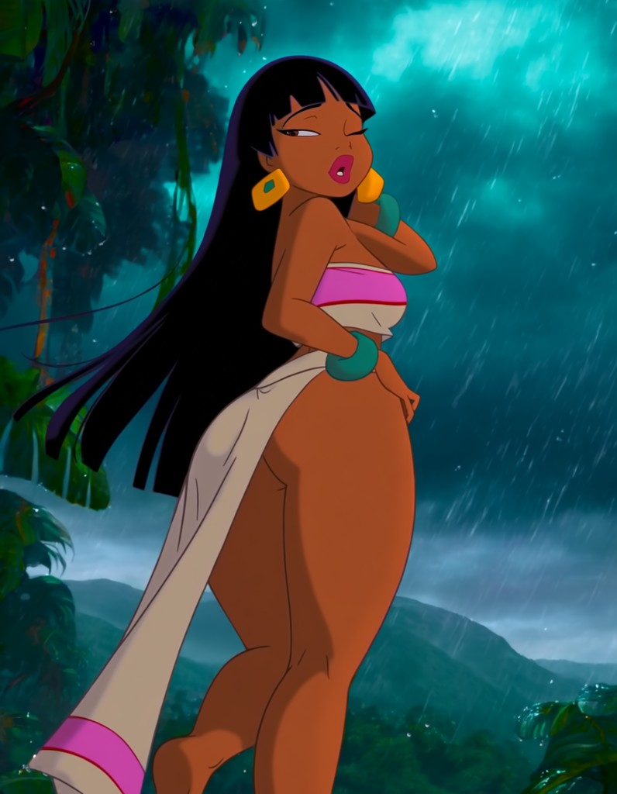

- **画风轴**：Chel 角色 LoRA
- **NSFW**：`sensitive`（成人向）
- **抄什么**：正向写 nsfw。LoRA Chel_AnimaPreview2_byKonan:1。 抄关键片段。ER SDE+Simple、32 步、CFG 4.0。 负向建议保留 loli, shota, child。
- **底模**：`anima-preview2`
- **LoRA**：[Chel_AnimaPreview2_byKonan:1](https://civitai.com/models/2478961?modelVersionId=2787142)
- **LoRA 链接**：https://civitai.com/models/2478961?modelVersionId=2787142
- **纯底模与否**：否
- **画师 tag**：（无）
- **采样**：ER SDE / Simple · steps 32 · CFG 4.0 · 896x1152
- **热度**：51 likes / 22 hearts
- **来源**：[civitai:124740278](https://civitai.com/images/124740278)
- **为何收录**：El Dorado Chel 成年：管顶+骨盆帘丛林回眸，Preview2 角色 LoRA。

**prompt**

```
masterpiece, best quality,
1girl, chel, black hair, long hair, blunt bangs, brown eyes, dark skin, lipstick,
tube top, pelvic curtain, bare shoulders, bracelet, earrings, midriff, narrow waist, thick thighs, wide hips, barefoot,
looking back, large breasts, curvy, solo, jungle, mountainous horizon,
parted lips, half closed eyes, ass, from behind, jungle, light particles, from below, rain, wet, storm, wind,  <lora:Chel_AnimaPreview2_byKonan:1>
```

**negative**

```
score_1, low quality, worst quality, score_2, score_3, displeasing, score_4, very displeasing, lowres, lowres face, bad eyes, poorly detailed face, bad anatomy, extra fingers, extra digits, too many fingers, too many digits, fused fingers, inverted limbs, mixed limbs, oversized limbs, emphasis lines, motion lines, speed lines, censored, bar censor, white bar censor, ass, fisheye
```
### SamDoesArts 羊角睡衣

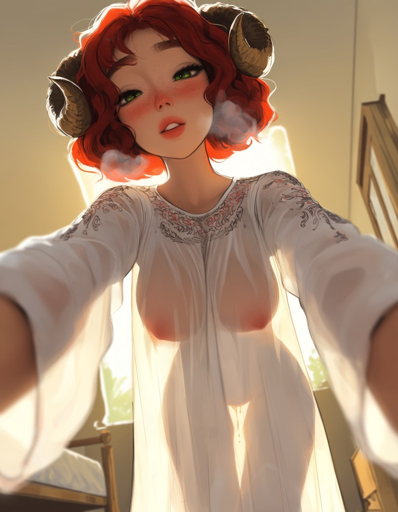

- **画风轴**：SamDoesArts 明示
- **NSFW**：`explicit`（成人向）
- **抄什么**：正向写 explicit。LoRA Samdoesarts_AnimaPreview2_byKonan:1。 抄关键片段。ER SDE+Simple、32 步、CFG 4.0。 负向建议保留 loli, shota, child。
- **底模**：`anima-preview2`
- **LoRA**：[Samdoesarts_AnimaPreview2_byKonan:1](https://civitai.com/models/2490561?modelVersionId=2799892)
- **LoRA 链接**：https://civitai.com/models/2490561?modelVersionId=2799892
- **纯底模与否**：否
- **画师 tag**：（无）
- **采样**：ER SDE / Simple · steps 32 · CFG 4.0 · 896x1152
- **热度**：47 likes / 36 hearts
- **来源**：[civitai:125242086](https://civitai.com/images/125242086)
- **为何收录**：Sam Yang 风：羊角红发 freckles、透视睡衣跪姿，成年体型明示。

**prompt**

```
masterpiece, best quality,
head tilt, heavy breathing, bent over, pov, dutch angle, all fours, blush, from below, (embroidery:1.1), (hanging breasts:0.9),
1girl, sheep horns, green eyes, red hair, short hair, (freckles, body freckles:1.2), large breasts, blush, nude, looking at viewer, parted lips, puffy nipples, white clothes, nightgown, see-through silhouette, long dress, long sleeves, wide sleeves,
pussy juice drip, covered nipples,
indoors, bedroom, depth of field, backlighting, <lora:Samdoesarts_AnimaPreview2_byKonan:1>
```

**negative**

```
score_1, low quality, worst quality, score_2, score_3, displeasing, score_4, very displeasing, lowres, lowres face, bad eyes, poorly detailed face, bad anatomy, extra fingers, extra digits, too many fingers, too many digits, fused fingers, inverted limbs, mixed limbs, oversized limbs, emphasis lines, motion lines, speed lines, censored, bar censor, white bar censor, ass, fisheye, watermark, signature, artist name
```
