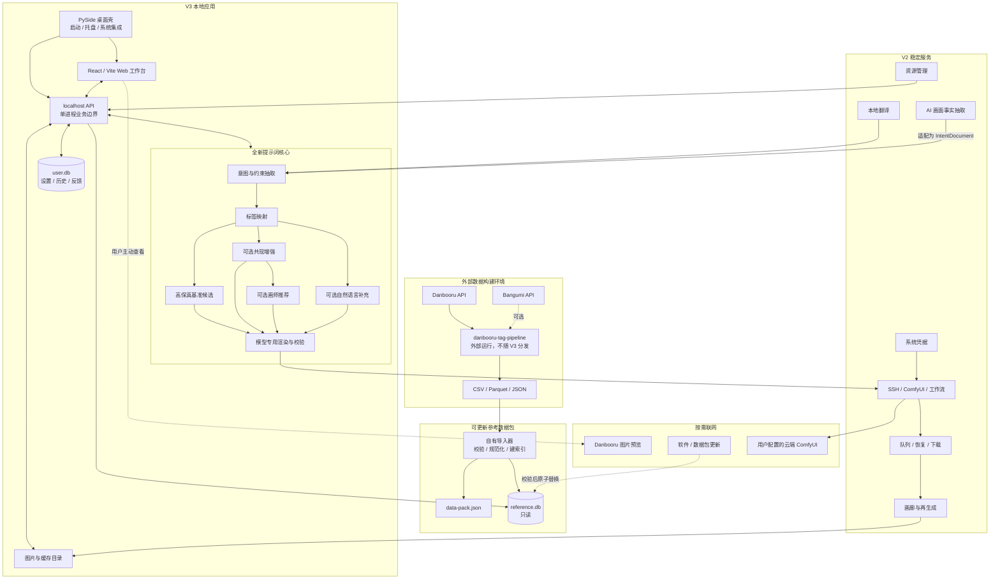

# V3 总体架构

状态：开发前基线

版本：V3.2-prep

## 1. 架构原则

- 本地优先：核心数据和计算在用户设备上完成。
- 单一业务后端：Web 工作台、画廊和桌面壳调用同一个 localhost 服务。
- 数据与用户状态分离：参考数据可替换，用户数据只迁移不覆盖。
- 复用服务，不复用 V2 主窗口编排：已有稳定能力通过适配器接入。
- 候选可解释：每个标签保留来源、约束、分数和版本信息。
- 生图可复现：候选、模型、参数、工作流、数据和模板版本随任务快照保存。

## 2. 系统图



## 3. 运行时进程

首版推荐保持两个本地进程以内：

1. Python 主进程：桌面壳、本地 API、提示词核心、V2 服务和任务管理。
2. 系统浏览器：加载随包分发的 React 静态资源。

不在首版引入 Qt WebEngine。V2 画廊已经采用“localhost 服务 + 系统浏览器”，沿用这一方式可以减少安装体积和双浏览器内核问题。

本地服务只绑定 `127.0.0.1`，使用操作系统分配的随机端口。桌面壳打开带短期启动令牌的 URL，浏览器建立会话后令牌轮换。

## 4. 后端模块边界

```text
app/
  bootstrap          启动、端口、生命周期、日志
  api                HTTP DTO、鉴权和错误映射

core_v3/
  intent             IntentElement 与约束图
  tag_mapping        精确、别名、中文、语义候选
  recommendation     共现与画师推荐适配器
  candidate          候选差异化和分数分解
  rendering          ANIMA 模型专用文本渲染
  validation         冲突、格式、长度和保真检查

data_v3/
  importer           外部文件到 reference.db
  manifest           schema、来源和校验和
  query              只读查询接口
  updater            下载、校验、替换和回滚

services/
  translation        V2 复用
  remote             V2 复用和薄适配
  gallery            V2 Web 画廊迁移到统一 API
  credentials        V2 复用
```

`core_v3` 不得导入 PySide、FastAPI、HTTP handler、SSH 或图库文件系统代码。UI 也不得直接读 Parquet、SQLite 表或调用 SearchOnline 的内部全局对象。

## 5. 候选生成数据流

```text
原始输入
  → 输入保护与本地翻译
  → IntentElement[] + ConstraintGraph
  → canonical tag 候选及置信度
  ├─ Lane 0: literal baseline
  ├─ Lane 1: conservative co-occurrence
  ├─ Lane 2: co-occurrence + optional artist
  └─ Lane 3: tags + natural language relations（按需）
  → ModelProfile renderer
  → fidelity / conflict / format validator
  → PromptCandidate[]
```

每条自动标签至少保存：

- `source`: exact、alias、translation、semantic、cooccurrence、artist、user。
- `source_element_ids`。
- `raw_score` 与归一化后的展示分。
- `reason`。
- `data_pack_version` 和 `algorithm_version`。
- 是否允许用户移除，是否受约束锁定。

总分只用于候选内部排序，不宣称等于审美质量。

## 6. 前端边界

Booru Tag Gallery 主要复用页面结构、卡片、虚拟列表、搜索交互、详情和预览体验；数据访问统一替换为 V3 adapter。

前端状态分三类：

- 服务端权威：工作台、候选、历史、收藏、生成任务。
- URL 状态：搜索词、分类、排序和当前详情。
- 临时视图状态：弹窗、滚动位置和未提交的筛选。

不得同时让浏览器 LocalStorage 和 `user.db` 保存两份互相覆盖的工作台权威状态。LocalStorage 只可保存无害的 UI 偏好或未提交草稿恢复副本。

## 7. 存储边界

### `reference.db`

- 只读打开。
- 存放 tags、aliases、wiki、groups、tag co-occurrence、artist co-occurrence 和数据元信息。
- 整包更新，更新失败可回滚。

### `user.db`

- 存放设置、工作台、候选快照、历史、收藏、反馈、远程配置元数据和生成任务。
- 密码、API Key 和私钥口令仍不得写入数据库。
- 只允许向前迁移，迁移前备份。

### 文件目录

- `images/`：用户生成结果，不能由软件更新器覆盖。
- `preview-cache/`：联网图片预览缓存，可清理、可限额。
- `downloads/`：未验证的数据包临时文件，验证后删除或原子替换。

## 8. 本地 API 安全

- 只监听 `127.0.0.1`，禁止 `0.0.0.0` 默认监听。
- 所有改变状态的请求都必须带会话令牌；不能只保护生图接口。
- 校验 `Origin`/`Host`，拒绝任意网页对 localhost 发起跨站写请求。
- 默认不启用 CORS；若开发环境需要，使用明确的开发源列表。
- `/generate`、删除、回收站、恢复、数据更新、凭据相关接口都要做输入验证和审计日志。
- API 返回路径时使用数据根目录内的相对 ID，不向前端暴露任意文件读取接口。

## 9. 更新与失败降级

参考数据更新流程：

```text
下载 manifest
  → 验证版本与来源
  → 下载到临时文件
  → 校验 SHA-256 和数据库结构
  → 执行只读健康查询
  → 关闭旧连接
  → 原子替换
  → 重新打开
  → 失败则回滚
```

缺少可选数据时的降级：

- 无 embeddings：保留精确、别名、中文和模糊搜索。
- 无 co-occurrence：只输出基准候选和人工标签工作台。
- 无 artist co-occurrence：隐藏推荐分，仍允许手工搜索画师。
- 无网络：隐藏在线预览与更新状态，不影响本地搜索和候选生成。
- 无远程运行时：仍可生成、复制和导出提示词。

## 10. 不允许的依赖方向

- 外部 pipeline 代码进入运行时包。
- React 直接读取用户 SQLite 文件。
- 提示词核心直接提交 ComfyUI。
- 远程执行反向修改提示词候选。
- 参考数据更新修改 `user.db` 中的用户选择。
- 自动反馈日志直接在线学习或静默改变排序权重。
