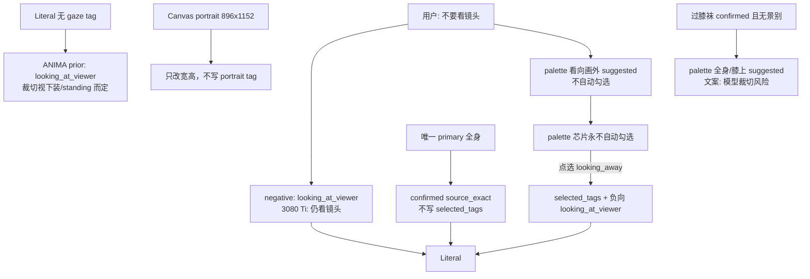
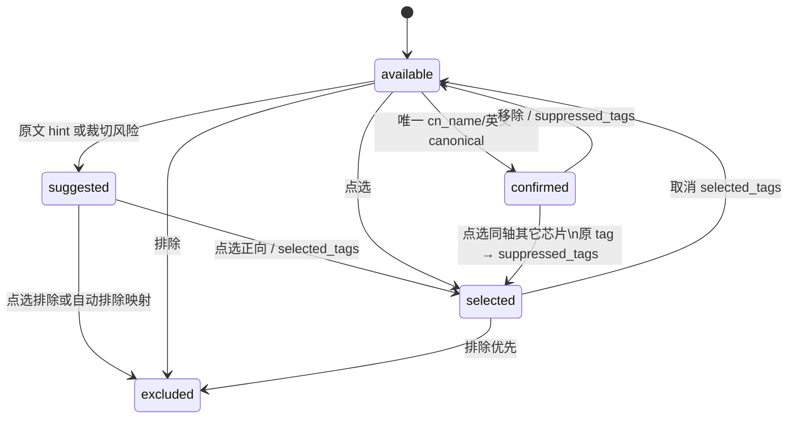

# ANIMA Prompt Studio V3 构图（Composition）工作台设计

| 字段 | 值 |
| --- | --- |
| 文档标题 | V3 Scene Draft 构图镜头：对抗 ANIMA 看镜头先验 |
| 作者 | TBD |
| 日期 | 2026-09-01 |
| 状态 | Draft |
| 范围 | V3 工作台 Scene Draft「构图镜头」主路径；默认本地翻译 + 确定性标签索引 |
| 非范围 | 不复活 V2 `composition_recommender`；不把画幅写成 `portrait`/`landscape` tag；不把模型先验写成用户事实 |

---

## Overview

Danbooru 训练的 ANIMA（Aesthetic v1.1 / Base）**没有中性构图**。`looking_at_viewer` 在真包约 **482 万**帖。3080 Ti / Aesthetic v1.1 / seed `20260901` / 896×1152 教室对照（`reports/v3_3080ti_composition_prior_20260901_151820/`，6/6 completed）表明：**空构图的可靠先验是看镜头**，不是必然半身。empty 与显式 `looking_at_viewer` 的视线几乎一样；过膝袜+乐福鞋+`standing` 时 empty 已能看见腿和鞋。真正改裁切的是正向 `cowboy_shot`（膝上/3/4）；`full_body` 也能撑开全身，但背景容易被拍扁。仅把 `looking_at_viewer` 放进负向（`no_viewer`）**仍看镜头**。能把视线拧开的是正向 `looking_away`。

V2 的错误是把「半身+看镜头」写成用户事实。Codex V3 空构图是另一种不诚实：用户看不见、也无法对抗看镜头先验。本设计让用户**看见并对抗先验**，芯片永不自动勾选，也不复活 `composition_recommender`。

三层控制：

1. **Canvas**：`WorkbenchGenerationSettings.aspect` 只改宽高。禁止注入 `portrait`/`landscape`（包内分别是「肖像」「风景」）。竖图本身不是半身裁切的充分条件。
2. **编译诚实**：只有用户说过的唯一 primary、英文 canonical/render、或点选的芯片，才能作为 `source_exact` / `user_selected` 进入 Literal。永不把 `looking_at_viewer` / `upper_body` 冒充成原文事实。
3. **对抗面**：Scene Draft 必须说明「未指定视线时往往会看镜头」。**「不要看镜头」是承重用例**：自动负向 `looking_at_viewer` **不够**，还要把「看向画外」芯片标成 `suggested`（不自动勾选），风险说明写清仅负向打不破先验。裁切风险只在有下装、无景别时单独提示；`cowboy_shot` 是可靠裁切控制。

默认路径仍是本地翻译 + `reference.db`，无 AI API。不复活 `PromptPipeline` / `composition_recommender.py`。

---

## Background & Motivation

### V2 失败：把模型先验写成用户事实

V2 构图主链：

- `src/anima_prompt_studio/services/composition_recommender.py`（`CompositionRecommendationService`）
- `src/anima_prompt_studio/configs/composition_rules.json`
- `src/anima_prompt_studio/configs/composition_presets.json`（17 个预设）

`composition_rules.json` 的 defaults 是带分数字段的对象，不是平面字符串：

```json
{
  "defaults": {
    "shot": {"value": "半身", "score": 10, "reason": "默认人物肖像兼顾表情和上半身"},
    "camera_height": {"value": "平视", "score": 10, "reason": "平视机位适合一般人物场景"},
    "angle": {"value": "正面", "score": 10, "reason": "正面视角是稳定的默认选择"},
    "gaze": {"value": "看镜头", "score": 10, "reason": "未指定动作目标时使用普通肖像视线"},
    "aspect": {"value": "竖图", "score": 10, "reason": "竖图适合一般单人构图"},
    "subject_position": {"value": "中", "score": 10, "reason": "居中是稳定的默认人物位置"}
  }
}
```

这些值（半身 / 平视 / 正面 / 看镜头 / 竖图 / 中）恰好等于 ANIMA 先验。V2 把它写进正向提示词，出图把对峙变成合影、把背后说话的人画成第三人。36/36 字段审计全绿只说明表单填满。

Codex 文档（`PROMPT_CORE_LESSONS_AND_BOUNDARIES.md`、ADR-016/017、`V2_REUSE_INVENTORY.md` §5 冻结）正确记录了这次失败，但推出了错误产品结论：「空构图 = 诚实」。ANIMA 不会空着构图；空 Literal 把视线交给 482 万帖的 `looking_at_viewer`。裁切是否半身取决于有没有下装/`standing` 等，不能再写成「空 = 必然半身」。本设计把那些文档当**失败证据**，不当教条。3080 Ti 对照见 `reports/v3_3080ti_composition_prior_20260901_151820/` 与 `tools/_probe_3080ti_composition_prior.py`。

### V3 当前状态（2026-09-01 源码 + 真包）

默认入口 `POST /api/v3/local-natural/candidates` → `_local_natural_intent()`（`v3/src/anima_prompt_studio_v3/api/app.py`）。`candidate_response()` 只跑 `LiteralCandidateGenerator` 再 `HybridLaneGenerator.add_hybrid`。`RecommendationLaneGenerator.add_conservative` **不在工作台编译路径**（`docs/v3/SESSION_HANDOFF_2026-08-27.md`：仅供未来显式选择）。Hybrid 的 base 是 Literal。工作台真正的共现入口是 `store.related_tags(...)` → `tag_suggestions`，`SceneDraftReview` 把它们并进「待确认建议」。

排除分流已存在，且会拆掉承重用例的字面：

```python
_LOCAL_EXCLUSION_MARKER = re.compile(r"(?:不要|不需要|无需|避免|排除|禁止|去掉|移除|不含|不带)")
```

`不要看镜头` → `evidence.exclusions` 的 content 是 **`看镜头`**，`positive_text` 里不再有整句。`不看镜头` / `别看镜头` **打不中**该 marker，留在正向。

真包 `v3/.local/packs/anima-v3-dso-0636f762-r1/reference.db`：

| 用户短语 | 索引结果 | 当前行为 |
| --- | --- | --- |
| 全身 | `full_body` 唯一 `cn_name`（1,259,005） | 自动确认 |
| 上半身 | `upper_body` `cn_name`；`bare_shoulders` `cn_term` | 确认 `upper_body`；可能一对多 |
| 半身 | 0 hit | 无。不自动补 upper_body；是否半身视下装 tag 而定 |
| 膝上 / 膝上构图 | `膝上` 0 hit；「构图」一对多含 watermark | 垃圾一对多 |
| 看镜头 / 看向镜头 | 0 unique；「镜头」→ `wet_lens` 等 | **不能对抗先验** |
| 不要看镜头 | 分流成排除「看镜头」；「镜头」噪声 | **承重用例失败** |
| 俯拍 | 0 hit | 无 |
| 仰拍 | 唯一 `under_shot`（`cn_name=仰拍`, **287**） | 错误自动确认 |
| 仰视 | 仅 `looking_up` `cn_term`（`cn_name=抬头`, 99,169）；**不是** `from_below` | 今日不自动确认。不得占用成机位 |
| 背面 / 从背后 | 0 unique `from_behind`（`cn_name` 是「从后方」） | 无 |
| 特写 | `close-up` `cn_name`；剩余 13 项含 `ass_focus`/`pussy_focus`（部分无分组）以及非 focus 的 `headshot`（爆头）、`clear_insertion` | 确认特写，一对多仍含 NSFW focus；ALL-focus 谓词在真包不触发 |
| 俯视 | `from_above` `cn_name` + `looking_down` `cn_term`（137,248） | 确认俯视，**一对多仍应保留** |
| English canonical/render | `looking at viewer` 等 | 自动确认（用户打了英文） |
| 教室「微微侧身看向镜头，全身构图」 | 常只有 `full_body` | 视线对抗失败；下装易被半身裁掉 |

`looking_at_viewer` 分组是 `{eyes_tags, posture, verbs_and_gerunds}` → 现有 `_local_fact_type_from_detail` 跨层得到 `other`。芯片层必须覆盖 `fact_type`。

教室「双手交叠」可能命中 `handjob`。构图验收用短句隔离；本设计不修手势。

---

## Goals & Non-Goals

### Goals

1. **用户能看见并对抗模型默认看镜头。** 空视线必须有先验说明；「不要看镜头」自动负向不够，必须同时建议点选「看向画外」（正向 `looking_away`），芯片永不自动勾选。
2. 用户明确的景别/视线/机位/朝向能进入 Literal，且来源可审阅（唯一 primary、英文 canonical、或芯片点选）。
3. 模糊元语言（「构图」「镜头」）不再产生 watermark / wet_lens 一对多。
4. Scene Draft「构图镜头」是构图的唯一确认面：闭集芯片 + 已确认事实。芯片永不自动勾选。
5. 已确认的下装/鞋靴在无景别时，以**模型裁切风险**提示全身/膝上，不自动勾选、不冒充用户原文。
6. 画幅只存在于生成规格，不靠 `portrait` tag 假装解决裁切。裁切文案只在有下装、无景别时出现；不宣称空构图必然半身。
7. 自然语言与结构化概念模式共用解析器与芯片写路径。
8. 默认路径零 AI API；PR 可独立合入。

### Non-Goals

- 复活 V2 六轴表单、17 预设、人数→远景/横图、`composition_recommender`。
- 把 `looking_at_viewer` / `upper_body` 写成 `source_exact`，除非用户说过或点选。
- 因 canvas=portrait 注入 `portrait`/`landscape` tag。
- 大型中文→tag 词表；服装/人鱼/手势 glossary 扩表。
- 完整空间布局编辑器。窗边/左侧/面对面留在 Hybrid prose。
- 高清细化工作流、画师自动切换。
- 自动改写用户编辑过的英文画面计划。
- 把 Conservative lane 当成当前工作台后门去修——它不在编译路径上。当前后门是 `tag_suggestions`。

---

## Key Decisions

1. **空构图对 ANIMA 不是中性；可靠先验是看镜头，不是必然半身。** 3080 Ti empty 与 `looking_at_viewer` 视线几乎相同；本场过膝袜+乐福鞋+`standing` 已能看见下装。产品必须把**视线先验**摊在 Scene Draft。半身裁切在没有下装 tag 时更明显，不能再写成空构图 = 半身。
2. **高价值控制是对抗看镜头先验，不是克隆它。** 「不要看镜头」比「看镜头」芯片更重要。看镜头芯片未选时标明「模型常见默认」，永不自动勾选。empty ≈ 显式看镜头，所以默认勾选看镜头等于 V2。
3. **编译仍然诚实。** `source_exact` 只来自唯一 primary 或英文 canonical/render。芯片点选才是 `user_selected`。禁止 V2 式 always-on 默认。
4. **「不要看镜头」自动负向 `looking_at_viewer`，但负向不够。** 分流后排除侧 `看镜头` 仍自动 `source_excluded`（用户已说不要，覆盖 span）。3080 Ti `no_viewer` 证明仅负向 **仍看镜头**。因此同时把 palette「看向画外」设为 `suggested` / `side=positive`，**不**写入 `selected_tags`。风险句：「仅负向看镜头打不破先验，请点选看向画外」。`不看镜头`/`别看镜头` 仍由构图模块做局部排除短语。
5. **正向 `looking_away` 才是有效视线控制；点选后同时负向 `looking_at_viewer`。** 同场 `look_away` 眼睛看向一侧。承重用例通过条件是正向含 `looking_away`（或等价），不是负向里有 `looking_at_viewer`。
6. **下装确认且无景别 → 建议全身/膝上，文案是模型裁切风险；跟第一个构图 UI PR（PR4）一起做。** 已决议，不再开放。有 `CROP_RISK_TAGS`（过膝袜/乐福鞋等）且无景别时，全身/膝上芯片 `suggested`，不自动勾选，不写进 `source_exact`。3080 Ti empty 已能看见下装，紧急度低于视线，但 `cowboy_shot` 仍会相对 empty **明显改框**。`full_body` 也能全身，但可能把场景拍扁。
7. **Canvas 不写构图 tag。** 竖图 896×1152 不是半身的充分条件。不注入 `portrait`。可靠裁切控制是正向 `cowboy_shot`（其次 `full_body`）。
8. **芯片写路径复用 `selected_tags` / `suppressed_tags` / `excluded_text`，不新增 `selected_composition`。** extra=forbid 合同不靠新写字段。
9. **构图提示不进 `suggestions[]`。** `SceneDraftReview` 只特殊处理 identity/exclusion_candidate；任何新 source 都会掉进正向「待确认建议」，点一下会 **加上** `looking_at_viewer`，承重用例反转。唯一确认面是 `composition_palette`。因此 **不新增** `composition_candidate` / `composition_exclusion` source。
10. **只读 `composition_palette` 是闭集真相源。** 前端只按 palette 的 `axis`/`canonical_tag`/`state`/`side` 渲染和互斥，禁止第二份 `CHIPS`/`AXIS_OF`。缺 palette = 不画芯片。
11. **`source_exact` 的全身不得写入 `selected_tags`。** palette 用独立 `confirmed` 状态。`全身构图` 测试必须断言 `selected_tags` 不含 `full_body`。
12. **弱元词 `{构图, 镜头, 景别, 机位}` 不是 tag。** 不确认、不进一对多。过滤发生在 occupancy **之前**，正负两侧都做。
13. **一对多：剥掉 focus 剩余项，而不是要求剩余项全是 focus。** 真包「特写」在确认 `close-up` 后仍留下 `pussy_focus`（无分组）以及非 focus 的 `headshot`（爆头, 594）和 `clear_insertion`（138）。「全部剩余都是 `focus_tags`/`*_focus` 才丢掉整组」在真包上**不会触发**，NSFW focus 仍可点。正确规则：有唯一 primary 时 **strip** `focus_tags` 或 `*_focus` 剩余项；若该 primary 是 `close-up`，再丢掉该 span 其余一对多（`headshot`/`clear_insertion` 不是景别读法）。`俯视`+`looking_down`、`上半身`+`bare_shoulders` 仍一对多。禁止对整个 `image_composition` 关一对多。
14. **「仰拍」divert `under_shot`；「仰视」不占用成机位。** 真包「仰视」只打到 `looking_up`（抬头）。芯片「仰视」仍绑定 `from_below`，但原文「仰视」不产生机位 hint。
15. **工作台共现后门是 `tag_suggestions`，不是 Conservative。** 编译路径过滤闭集 tag，待确认建议在有 palette 时不再合并构图闭集。`add_conservative` 跳过闭集只作为单测/未来 lane 防御。
16. **同轴互斥由服务端强制裁剪请求里的闭集成员，客户端从返回的 palette 写回 `selected_tags`。** 禁止「算了但不改数组」。
17. **加 `composition_palette` 的同一 PR 必须把已在运行时出现的 `scene_plan_enabled` 写入 `SceneDraftSnapshot`。** 否则 extra=forbid 会在保存工作台时 422。
18. **新模块 `core/composition.py`。** 闭集常量从 PR 1 就放进去。`app.py` 只编排。

---

## Proposed Design

### 1. 信息架构：先验可见，芯片不自动勾选



Scene Draft「构图镜头」**始终渲染**：

```text
构图镜头
  未指定视线时，ANIMA 往往会看镜头；可在构图镜头里改。
  仅排除看镜头通常不够。点选「看向画外」才会写入正向 looking_away。
  竖图只改变生成尺寸。已确认下装且未指定景别时，膝上芯片可改裁切。
  景别  [全身] [上半身] [膝上] [特写]
  视线  [看镜头] [看向画外]
  机位  [俯视] [仰视]
  朝向  [侧面] [背面]
  已确认：全身 / full body     [移除]
```

| 区域 | 现有 | 之后 |
| --- | --- | --- |
| 构图镜头层 | 有 confirmed composition 才出现 | **始终出现**；芯片 + 已确认列表 |
| 一对多 | 构图/镜头/特写/俯视都进 | 弱元词消失；特写 span 整组丢掉（含 focus 与 `headshot`）；**俯视+looking_down 保留** |
| 待确认建议 | 译文 + `tag_suggestions` 共现 | **不出现构图闭集**；`looking_at_viewer` 不得因共现出现在这里 |
| 未命中 | 「全身构图」可能因「构图」二字整句未命中 | 弱元词当噪声剥掉 |
| 明确排除 | `不要看镜头` → 无 tag 的「看镜头」 | 自动 `source_excluded` `looking_at_viewer` + 「看向画外」`suggested`（不自动勾选） |
| 画面计划 | Hybrid 拼在 Literal 后 | 冲突只警告 |

看镜头芯片未选时副文案：**模型常见默认**（muted），`aria-pressed=false`。不是 suggested（suggested 只用于用户原文或裁切风险）。

### 2. 闭集芯片

| 轴 | 文案 | canonical | 真包备注 |
| --- | --- | --- | --- |
| shot | 全身 | `full_body` | 唯一 `cn_name`，可 `confirmed` |
| shot | 上半身 | `upper_body` | `cn_terms` 含「构图」 |
| shot | 膝上 | `cowboy_shot` | `cn_name` 牛仔镜头；「膝上」0 hit |
| shot | 特写 | `close-up` | hyphen；无 `close_up` |
| gaze | 看镜头 | `looking_at_viewer` | `cn_name` 看向观众；未选时显示模型常见默认 |
| gaze | 看向画外 | `looking_away` | 点选同时负向 `looking_at_viewer` |
| camera_height | 俯视 | `from_above` | 「俯视」unique primary；`looking_down` 一对多保留 |
| camera_height | 仰视 | `from_below` | `cn_name` 仰视视角。原文「仰视」**不** hint 此芯片 |
| angle | 侧面 | `profile` | 兼 face_tags |
| angle | 背面 | `from_behind` | `cn_name` 从后方 |

不设正面/平视/居中芯片。英文 `dutch_angle` 等仍可精确确认。标签浏览组 `image_composition` 仍可手工加入；若加入闭集 tag，受轴互斥。

### 3. 映射管线（occupancy 之前过滤）

弱元词、不信任 `cn_name`、短语占用必须在 `_confirmed_source_matches` **之前或内部**完成，且对 `source_candidates` 与 `excluded_candidates` 两侧都做。短语占用是**额外 occupying spans**，不改变普通标签「更长 primary 获胜」（天使 / 白色过膝袜 / 女仆装测试不得变红）。

```mermaid
sequenceDiagram
    participant User
    participant Split as _split_local_natural_evidence
    participant Idx as _local_index_matches
    participant Comp as core/composition.py
    participant Occ as _confirmed_source_matches
    participant Lit as LiteralCandidateGenerator

    User->>Split: source_text
    Note over Split: 不要看镜头 → exclusions.text=看镜头
    Split->>Idx: positive_text + exclusion spans + original source_text
    Idx->>Comp: raw matches both sides
    Comp->>Comp: drop weak-meta 构图/镜头
    Comp->>Comp: divert under_shot unless canonical/render
    Comp->>Comp: phrase occupiers on source_text AND exclusions
    Comp->>Comp: map exclusion 看镜头 → looking_at_viewer auto-exclude
    Comp->>Occ: filtered matches + extra occupiers
    Occ->>Occ: unique primary / occupancy
    Occ->>Comp: strip focus leftovers; if primary is close-up drop span group
    Comp->>Comp: clothing-crop hints if no shot
    Comp->>Comp: coerce selected_tags one-per-axis
    Comp->>Lit: confirmed + coerced selected; exclusions include looking_at_viewer
    Lit-->>User: Literal
    Comp-->>User: composition_palette + prior risk_note
```

编排函数建议（`core/composition.py`，由 `_local_natural_intent` 调用）：

- `filter_weak_meta_matches(matches) -> matches`
- `divert_untrusted_composition_matches(matches) -> (kept, diverted_spans)`
- `composition_phrase_occupiers(source_text, exclusions) -> list[_LocalIndexMatch]`（只占用，不确认）
- `auto_exclude_gaze_phrases(...) -> list[_LocalIndexMatch]`（`origin` 与 span 落在 exclusion 或构图局部排除短语上）
- `strip_focus_leftovers(groups, store) -> groups`（剥 `focus_tags`/`*_focus`；`close-up` primary 再丢掉该 span 其余选项）
- `clothing_crop_suggestions(confirmed_tags, shot_present) -> list[canonical]`
- `coerce_selected_composition(selected_tags) -> selected_tags`
- `build_composition_palette(...) -> list[CompositionChipSnapshot]`
- `composition_fact_type(tag, detail)`
- `composition_prose_conflicts(translated_text, positive, excluded) -> list[str]`
- `prior_risk_notes(palette, aspect) -> list[str]`

#### 3.1 弱元词

```python
COMPOSITION_WEAK_META_TERMS = frozenset({"构图", "镜头", "景别", "机位"})
COMPOSITION_CHIP_TAGS = frozenset({...10 tags...})  # PR 1 即放入
```

occurrence `text` 属于弱元词：不确认、不进 `_ambiguous_source_groups`（正负两侧）。`_has_uncovered_source_evidence` 把它们与「的/和/与」一起剥掉。

#### 3.2 特写一对多：剥 focus，而不是要求剩余全是 focus

真包 `特写`（2026-09-01，14 条 `tag_search`）在唯一 primary `close-up`（`cn_name=特写`, `image_composition`）之后，剩余不是「全是 focus_tags」：

| leftover | `cn_name` | 分组 | `*_focus` |
| --- | --- | --- | --- |
| `ass_focus` / `food_focus` / `penis_focus` / … | 臀部特写等 | `focus_tags` 或兼 `image_composition` | yes |
| `pussy_focus` / `flower_focus` / `steppee_focus` / `neck_focus` | 阴部特写等 | **空分组** | yes |
| `headshot` (594) | 爆头 | 无 | **no** |
| `clear_insertion` (138) | 清晰插入 | 无 | **no** |

「剩余项全部属于 `focus_tags` 或 `*_focus` 才丢掉整组」因此 **不触发**，`pussy_focus`/`ass_focus` 仍出现在一对多。只测 `ass_focus` 的合成用例是假绿。

`strip_focus_leftovers` 规则（有唯一 primary 的 span）：

1. **Strip**：从该 span 的 ambiguous options 中移除 `focus_tags` 分组成员，或 canonical 以 `_focus` 结尾且不在构图闭集中的项（覆盖无分组的 `pussy_focus`）。
2. **Close-up 收口**：若该 span 的唯一 primary 是 `close-up`，strip 之后若仍有剩余（`headshot`、`clear_insertion`），**丢掉该 span 整组**。它们不是景别读法（爆头 / 清晰插入），留给用户的应是芯片「特写」已 `confirmed`。
3. **其它 span 保留非 focus 剩余**：`俯视` 仍列出 `looking_down`；`上半身` 仍列出 `bare_shoulders`。strip 之后 options < 2 则不建组。

| span | primary | leftover | 之后 |
| --- | --- | --- | --- |
| 特写 | `close-up` | `pussy_focus`（无分组）、`ass_focus`、`headshot`、`clear_insertion` | **无一对多** |
| 俯视 | `from_above` | `looking_down` | **仍一对多**（非 focus，不是 close-up） |
| 上半身 | `upper_body` | `bare_shoulders` | 仍一对多 |
| 天使 | `angel` | halo 等 | 不变 |

禁止：对整个 `image_composition` 关一对多；要求「全部剩余都是 focus」才动作。

测试：`test_close_up_strips_pussy_focus_and_drops_headshot`（leftover 必须同时含 `pussy_focus` 与 `headshot`，不得只塞 `ass_focus`）；`test_from_above_still_ambiguous_with_looking_down`。Fixture 与真包探针都要覆盖这两类 leftover。

#### 3.3 仰拍 / 仰视

- `under_shot` 且 `match_kind not in {canonical, render}`：不确认，span 占用。palette 仰视芯片 `suggested`（用户写了仰拍，建议 `from_below`）。不把 `under_shot` 当芯片。
- 原文「仰视」：**不占用、不 hint 机位**。今日它只是 `looking_up` 的 `cn_term`，保持不自动确认。抬头若以后做视线芯片，那是 `looking_up`，不是 `from_below`。

#### 3.4 短语表（hint 或排除映射，不是开放词典）

匹配必须同时看：

1. 原始 `source_text`
2. `evidence.exclusions[].text`（已经是去掉「不要」后的尾巴）

最长匹配优先。命中 span 加入 occupying spans。

**排除侧（自动负向 `looking_at_viewer`，`source_excluded`）：**

| 出现位置 | 短语 | 行为 |
| --- | --- | --- |
| `exclusions[].text` | 看镜头、看向镜头、看向观众 | 自动排除 `looking_at_viewer` 并覆盖 span；**同时** palette「看向画外」`suggested` / `side=positive`，不写入 `selected_tags` |
| 原始 `source_text`（全局 marker 未切走） | 不看镜头、别看镜头 | 构图局部排除短语，同样自动排除并占用 |

单元测试必须走真实 `_split_local_natural_evidence("不要看镜头")`，断言 `exclusions[0].text == "看镜头"`，再断言映射后 `exclusions` 含 `looking_at_viewer`、无 tag-less unresolved「看镜头」、一对多无 `wet_lens`。

**正向 hint（只改 palette，不进 Literal，不进 suggestions[]）：**

| 短语 | 芯片 | 轴 |
| --- | --- | --- |
| 看镜头、看向镜头、看向观众 | `looking_at_viewer` suggested / side=positive | gaze |
| 看向画外 | `looking_away` suggested / side=positive | gaze |
| 半身 | `upper_body` suggested | shot |
| 膝上、膝上构图 | `cowboy_shot` suggested | shot |
| 俯拍 | `from_above` suggested | camera_height |
| 仰拍 | `from_below` suggested | camera_height |
| 背面、从背后 | `from_behind` suggested | angle |

不收录：「仰视」（会教错机位）、「背后」（`behind_another`）、「正面/平视/居中/竖图」。

若该轴已有 unique primary 确认，不再重复 hint。

「看镜头」若同时出现在排除侧：`looking_at_viewer` 只走排除，不走正向 suggested；改为 suggested「看向画外」。单元测试在真实 splitter 之外，还要断言 `looking_away` 不在 `selected_tags`、palette 为 suggested。

#### 3.5 下装裁切建议

闭集触发（confirmed 或 selected 的服装 tag，不是中文词表）：

```python
CROP_RISK_TAGS = frozenset({
    "thighhighs", "white_thighhighs", "black_thighhighs",
    "kneehighs", "pantyhose", "zettai_ryouiki",
    "boots", "knee_boots", "loafers",
    "skirt", "miniskirt", "pleated_skirt", "long_skirt",
})
```

无 shot（confirmed/selected/未 suppress 的 `full_body|upper_body|cowboy_shot|close-up` 都不在正向）时：全身与膝上芯片 `state=suggested`，reason 固定：

> 模型裁切风险：已确认下装/鞋靴。没有景别标签时它们有时仍会被裁掉；点选膝上（cowboy shot）最能改框，全身也可以。不是因为原文写了全身。

3080 Ti 本场 empty 已能看见过膝袜和乐福鞋，紧急度低于视线对抗，但 `cowboy_shot` 相对 empty 会明显改成膝上/3/4。已有 `full_body`/`cowboy_shot` 则不提示。不自动勾选。此行为是 PR4 范围内必做项，不是可选项。

#### 3.6 `fact_type`

闭集 tag 强制 `IntentElementType.COMPOSITION`。`looking_at_viewer` / `looking_away` / `profile` 进入构图镜头层。

#### 3.7 `tag_suggestions` 与 Conservative

`candidate_response()` 在 `store.related_tags(...)` 之后丢掉 `COMPOSITION_CHIP_TAGS`（以及分组 `image_composition`/`focus_tags` 的命中，避免 `ass_focus` 从特写共现溜进待确认）。

`SceneDraftReview` 在 `composition_palette.length > 0` 时，合并 `relatedSuggestions` 再滤一遍闭集（防御旧快照）。

`RecommendationLaneGenerator.add_conservative` 同样跳过闭集：给 `core/benchmark.py` 和未来显式 Conservative 用。工作台测试**不要**去断言 `/local-natural/candidates` 的 Conservative candidate——响应里没有这条 lane。

### 4. Palette 状态与互斥

```python
class CompositionChipSnapshot(ApiModel):
    axis: Literal["shot", "gaze", "camera_height", "angle"]
    canonical_tag: str
    label_zh: str
    render_name: str
    state: Literal["available", "suggested", "confirmed", "selected", "excluded"]
    side: Literal["positive", "excluded"] = "positive"
    reason: str = Field(default="可选构图芯片，不会自动勾选", min_length=1, max_length=500)
```

无 `conflicted`。

| state | 含义 | 是否在 selected_tags | aria-pressed |
| --- | --- | --- | --- |
| available | 未选。看镜头额外 muted「模型常见默认」 | 否 | false |
| suggested | 原文 hint 或裁切风险 | 否 | false |
| confirmed | Layer-2 `source_exact`（全身） | **否** | true |
| selected | 用户点选 | 是 | true |
| excluded | 在负向 | 否（并从 selected 去掉） | 按排除按钮语义 |

`side=excluded` 只在 `suggested` 时有意义（例如将来未自动映射的排除提示）。`不要看镜头` 之后：看镜头芯片 `excluded`（「已排除看镜头，写入负向」）；看向画外芯片 `suggested` / `side=positive`（「仅负向看镜头打不破先验，请点选看向画外」）。两枚都不自动 `selected`。

`suggested` + `side=positive`：点选 → `onToggle` 互斥写入 `selected_tags`。  
`suggested` + `side=excluded` 或目标是把该 tag 排除：`onToggleExclusion`，**永不** `toggleTagSuggestion`。



服务端 `coerce_selected_composition`：

1. 正向 = `(source_exact ∪ selected_tags) − suppressed − excluded`。
2. 每个轴在 **selected_tags 闭集成员**里最多保留**最后一个**出现的 tag；丢掉的闭集成员不进入 Literal。
3. **禁止**把 `source_exact` 的 `full_body` 填回 `selected_tags`。
4. 同轴芯片替换 `source_exact`：原 tag 进 `suppressed`（响应 `scene_draft.suppressed`），新 tag 进 selected。
5. `looking_away` 被 selected/confirmed 时，把 `looking_at_viewer` 并入本次排除集合（与用户 `excluded_text` 合并计算）。
6. 响应 palette 反映裁剪结果。客户端编译成功后：

```ts
function syncCompositionDraft(palette: CompositionChipSnapshot[], selectedTags: string[], suppressedFromDraft: SceneDraftItem[]): WorkspaceDraftPatch {
  const chipTags = new Set(palette.map((item) => item.canonical_tag));
  const nonChip = selectedTags.filter((tag) => !chipTags.has(tag));
  const chipSelected = palette.filter((item) => item.state === "selected").map((item) => item.canonical_tag);
  const suppressed = suppressedFromDraft.map((item) => item.canonical_tag).filter((tag): tag is string => Boolean(tag));
  return {selected_tags: [...nonChip, ...chipSelected], suppressed_tags: suppressed};
}
```

**禁止**前端硬编码 `AXIS_OF` / `CHIPS`。互斥用 `palette.filter(c => c.axis === chip.axis)`。`palette` 缺失或空 → 不渲染构图芯片，不用本地表兜底。

点选实现：`toggleCompositionChip(chip)` 读 `chip.axis` 与同轴 palette 行，写 `selected_tags`/`suppressed_tags`/`excluded_text`，再 `recompileCurrentDraft`。

### 5. Hybrid、排除、先验说明

工作台 Hybrid 把 `scene_plan_en` 拼到 **Literal** 后面，不是 Conservative。

`composition_prose_conflicts` 针：

- `looking at viewer`, `looking at the camera`, `looks at the camera`, `looks at the viewer`
- 闭集 `render_name`（`full body`, `upper body`, `from behind`, …）

与当前正向/负向矛盾时追加一条 risk_note。不改 `translated_text`。必须有用例：译文含 `looking at the camera`（不只 `looking at viewer`）。

`risk_notes` 上限 24。新笔记优先级（高→低，超出丢低优先级）：

1. 视线先验：「未指定视线时，ANIMA 往往会看镜头；可在构图镜头里改。」（gaze 空且未排除看镜头时 **必出**）
2. 负向不够：「仅负向看镜头打不破先验，请点选看向画外。」（已排除 `looking_at_viewer` 且正向无 `looking_away` 时 **必出**）
3. 裁切风险：「已确认下装但未指定景别；点选膝上可改裁切。」（有 `CROP_RISK_TAGS`、无 shot；**不要**在无下装时宣称竖图=半身）
4. 排除/身份/一对多现有句
5. Hybrid 散文冲突
6. 同轴替换说明
7. 固定尾句（现有「当前仅自动确认…」可缩短，避免挤掉 1–3）

### 6. UI 文案

`CompositionChipReview` 放在 `SceneDraftReview` 内，构图镜头层不再因 items 为空而隐藏。数据源只有 `draft.composition_palette`。

| 元素 | 文案 |
| --- | --- |
| 层标题 | 构图镜头 |
| 先验 | 未指定视线时，ANIMA 往往会看镜头；可在构图镜头里改。 |
| 画幅 | 竖图/横图只改生成尺寸，不会写成提示词。 |
| 看镜头 available | 模型常见默认（muted） |
| 看镜头 suggested | 原文提到看镜头，确认后才会加入 |
| 看向画外 suggested（不要看镜头后） | 仅负向看镜头打不破先验，请点选看向画外 |
| 看向画外 selected | 已选用；同时排除 looking at viewer |
| 不要看镜头后（看镜头芯片） | 已排除看镜头，写入负向 |
| 裁切 suggested | 已确认下装；点选膝上最能改框。不是因为原文写了全身 |
| 空芯片 | 不点选则 Literal 不含构图标签；模型仍可能看镜头 |
| 排除芯片 | `aria-label="排除 看镜头"`，点击 `onToggleExclusion` |

`SceneDraftReview` 循环开头增加：

```ts
if (item.source === "composition_candidate" || item.source === "composition_exclusion") continue;
```

即使约定不发射这些 source，也必须落地这道滤网（与 identity 滤网同一 PR 可维护性）。`relatedSuggestions` 在 palette 存在时跳过 `palette` 里的 canonical。

### 7. 结构化 vs 自然语言

同一 `_local_natural_intent` 与同一 palette。概念模式输入「全身、看镜头」：全身 `confirmed`（不进 selected_tags），看镜头 `suggested`。切模式仍清空 selected/suppressed（现有 `switchInputMode`）。AI parse 仍非默认，不自动勾选芯片。

---

## API / Interface Changes

请求体不新增字段：`selected_tags`、`suppressed_tags`、`excluded_text`。

`SceneDraftItem.source` **不新增** `composition_*`。构图状态只在 palette。

```python
class SceneDraftSnapshot(ApiModel):
    # 现有字段…
    scene_plan_enabled: bool = True  # 运行时已发射；本次必须写入模型
    composition_palette: list[CompositionChipSnapshot] = Field(default_factory=list, max_length=16)
```

`types.ts` 同步 `scene_plan_enabled` 与 `composition_palette`。`workspaceCandidateSnapshot()` 继续原样保存 `scene_draft`；字段对齐后保存不再 422。

下次编译以草稿的 `selected_tags`/`suppressed_tags`/`excluded_text` 重建 palette，不以保存的 palette 为权威。

---

## Data Model Changes

无 SQLite 变更。闭集在代码常量。

Fixture：

- `tags_enhanced.csv`：10 芯片 + `watermark`, `wet_lens`, `under_shot`, `bare_shoulders`, `ass_focus`, `pussy_focus`（无分组）、`headshot`（爆头）、`clear_insertion`、`looking_down`, `looking_up`
- `tag_groups.json`：`image_composition`、`focus_tags`（`ass_focus`；**不要**给 `pussy_focus` 分组，以复现真包）、`eyes_tags`（`looking_down` 若需要）
- **`cooccurrence_clean.csv`**：`maid,looking_at_viewer,<high>`、`maid,full_body,<high>`，供 Conservative **单元测试**和 `tag_suggestions` 过滤的 API 测试

`IntentElement`：自动排除的看镜头是 `EXCLUDED` + `source_excluded`。芯片点选 `USER_SELECTED`。`looking_away` 点选时另有一条 `looking_at_viewer` EXCLUDED。

---

## Alternatives Considered

### A. 复活 V2 recommender

拒绝。它就是把 ANIMA 先验写成用户事实。失败证据有用，控制流无用。

### B. 空构图 + 只靠 Hybrid prose

拒绝。空 Literal 在 ANIMA 上等于看镜头（3080 Ti empty ≈ 显式 looking_at_viewer）。负向-only 仍看镜头。Hybrid 仍承载空间关系。

### C. 开放中文 glossary

拒绝。维护成本回到 V2。只允许弱元词 4 字、短语表 ≤15、裁切触发闭集。

### D. `selected_composition` 新写字段

拒绝。确认语义已在 `selected_tags`/`suppressed_tags`/`excluded_text`。

### E. 前端写死芯片

拒绝。互斥、先验、排除覆盖都在服务端。客户端只读 palette。

### F. 为了「和出图一致」自动勾选看镜头

拒绝。那是 V2。3080 Ti empty 已经看镜头，再自动勾选 `looking_at_viewer` 只是把先验写成用户事实。正确做法是标明「模型常见默认」，让用户决定是否对抗。

### G. 「不要看镜头」也要再点一次芯片才进负向

拒绝把负向本身再藏到一次点击后面：分流已经把「不要」当成排除，`looking_at_viewer` 必须自动进负向。3080 Ti 同时证明**仅负向不够**，所以另给「看向画外」`suggested`；那一次点击写的是正向 `looking_away`，不是把排除再确认一遍。不自动勾选该芯片。

---

## Security & Privacy Considerations

- 无新网络。闭集本地。
- 特写一对多曾泄漏 `pussy_focus`/`penis_focus`：strip `focus_tags`/`*_focus`，`close-up` span 再丢掉 `headshot`/`clear_insertion`。真包 `pussy_focus` 无分组，不能只查 `focus_tags`。
- 闭集无 character/copyright。
- extra=forbid：palette + `scene_plan_enabled` 必须同时进模型。
- `不要看镜头` 自动负向仍是用户原文排除，不是静默加质量词。

| 威胁 | 严重度 | 缓解 |
| --- | --- | --- |
| 空构图被模型画成看镜头，用户不知情 | 高 | 视线先验 risk_note + 看镜头芯片 muted 默认说明 |
| 「不要看镜头」点成正向看镜头 | 高 | 不进 suggestions[]；排除侧自动负向；UI 滤网 |
| 特写 NSFW focus | 高 | strip `*_focus`（含无分组的 `pussy_focus`）；`close-up` 再丢 `headshot` |
| 共现把 looking_at_viewer 送进待确认 | 高 | 过滤 tag_suggestions |
| 竖图裁掉过膝袜 | 中 | 裁切建议；不注入 portrait tag |

---

## Observability

`core/composition.py` 用现有 `LOGGER` 打计数（`app.py` 目前几乎不打这类计数，这是新操作面，不是复用指标）：

- `composition.weak_meta_dropped`
- `composition.untrusted_diverted`
- `composition.gaze_auto_excluded`
- `composition.axis_coerced`
- `composition.prose_conflict`

`risk_notes` 句式稳定，供 `getByText`。构图是否成功以 3080 Ti / Aesthetic v1.1 固定 seed 出图为准。

---

## Rollout Plan

1. PR1 弱元词 + strip focus leftovers（`close-up` 收口）：默认开，纯减噪。
2. PR2 排除映射：`不要看镜头` 开始真正进负向（无 UI 也可工作）。
3. PR3 palette 合同 + `scene_plan_enabled` + `tag_suggestions` 过滤。
4. PR4 UI：先验可见、芯片、裁切建议。
5. PR5 Hybrid 散文冲突（含 `looking at the camera`）。
6. PR6 Conservative 单测防御。
7. PR7 GPU。无 feature flag。回滚 UI 不影响 PR2 的自动负向。

---

## 风险

| 风险 | 严重度 | 缓解 |
| --- | --- | --- |
| 空构图 = 看镜头（裁切视下装而定） | 高 | C0 已记录；文案以视线为主 |
| 仅负向 looking_at_viewer 仍看镜头 | 高 | 建议 looking_away；C2 以正向 looking_away 为通过条件 |
| 不要看镜头被分流后丢失 | 高 | 排除侧映射 + 覆盖 span + 真 splitter 测试 |
| 仰视被教成 from_below | 高 | 不 hint「仰视」 |
| 俯视一对多被误关 | 中 | 只 strip focus，不关整组 `image_composition`；`looking_down` 正向测试 |
| 特写 ALL-focus 谓词假绿 | 高 | leftover 必须含 `headshot`+`pussy_focus`；真包 14 条对照 |
| `full_body` 被写进 selected_tags | 高 | `confirmed` 状态；API 断言 |
| 新 source 掉进待确认建议 | 高 | 不发射；循环 continue |
| tag_suggestions 送回看镜头 | 高 | 编译期过滤 |
| selected_tags 存两个景别 | 中 | 服务端 coerce + 客户端从 palette 写回 |
| risk_notes 超过 24 | 中 | 优先级，先验优先 |
| 双手交叠 → handjob | 中 | GPU 短句 |
| Hybrid 仍含 looking at the camera | 中 | 针列表 + 警告 |

---

## Tests

### 单元 `v3/tests/test_composition.py`

| 测试 | 断言 |
| --- | --- |
| `test_weak_meta_composition_is_not_confirmed_or_ambiguous` | 「构图」无确认、无一对多 |
| `test_weak_meta_lens_is_not_wet_lens` | 「镜头」无 wet_lens |
| `test_full_body_plus_meta_does_not_promote_leftover_composition` | 只确认 full_body |
| `test_close_up_strips_pussy_focus_and_drops_headshot` | close-up 确认；leftover 含 `pussy_focus`（无分组）与 `headshot`（爆头）及 `clear_insertion` 时仍无一对多 |
| `test_from_above_still_ambiguous_with_looking_down` | 俯视确认 from_above，一对多仍含 looking_down |
| `test_under_shot_cn_name_is_diverted` | 仰拍不确认 under_shot |
| `test_looking_up_yangshi_is_not_from_below_hint` | 「仰视」不占用机位、不 hint from_below |
| `test_do_not_look_at_viewer_uses_real_splitter` | splitter 得到「看镜头」；自动排除 looking_at_viewer；无 unresolved「看镜头」；palette 看向画外 suggested 且不在 selected_tags |
| `test_bu_kan_jingtou_without_marker_auto_excludes` | 「不看镜头」打不中 marker，构图层仍排除 |
| `test_axis_coerce_keeps_last_shot_chip` | selected `[full_body, cowboy_shot]` → 只用 cowboy_shot |
| `test_source_exact_full_body_not_copied_to_selected_tags` | 全身构图 selected_tags 不含 full_body |
| `test_clothing_crop_suggests_full_body_not_as_user_fact` | white_thighhighs 无 shot → palette 全身/膝上 suggested，reason 含「模型裁切风险」，confirmed 无 full_body |

保留天使/过膝袜/女仆装 occupancy 测试。

### API

| 测试 | 断言 |
| --- | --- |
| `test_local_natural_full_body_composition_does_not_spawn_watermark` | confirmed source_exact full_body；**selected_tags 不含 full_body**；palette 全身 **confirmed**；无构图一对多 |
| `test_local_natural_looking_at_lens_is_chip_suggestion` | 不进 confirmed；palette 看镜头 suggested；无 wet_lens；suggestions 无 looking_at_viewer |
| `test_local_natural_do_not_look_at_lens_writes_negative` | 负向含 looking at viewer；正向无 looking_away / looking_at_viewer；palette 看向画外 suggested；无 unresolved 看镜头；无 wet_lens |
| `test_local_natural_yangpai_does_not_confirm_under_shot` | 无 under_shot；仰视芯片 suggested |
| `test_tag_suggestions_omit_looking_at_viewer` | fixture 共现 maid→looking_at_viewer；响应 tag_suggestions 不含闭集 |
| `test_workspace_save_accepts_scene_draft_with_palette` | 自然语言编译 → POST `/workspaces` 带返回的 scene_draft → 201；再编译 palette 来自 selected_tags 而非快照权威 |
| `test_looking_away_adds_looking_at_viewer_negative` | selected looking_away → 负向 looking at viewer |

Conservative：`test_add_conservative_skips_looking_at_viewer` 只打 `recommendation.py` + 扩过的 `cooccurrence_clean.csv`，不打 workbench compile。

### 前端

| 测试 | 断言 |
| --- | --- |
| `renders composition chips from palette only` | 无 palette 则无芯片；有则十枚 |
| `does not put looking_at_viewer in 待确认建议` | suggestions 含 composition_* 或 tag_suggestions 含 looking_at_viewer 时，待确认建议仍无该按钮 |
| `confirmed full_body chip is pressed without posting it in selected_tags` | 点膝上才把 cowboy_shot 写入 selected，并 suppress full_body |
| `exclusion gaze chip calls onToggleExclusion` | 不要看镜头后的看镜头芯片 |
| `shows model-prior copy when gaze is empty` | 可见「未指定视线时，ANIMA 往往会看镜头」 |
| `canvas aspect remains generation setting` | 无 portrait 芯片 |

### GPU `v3/tools/run_composition_acceptance.py`

3080 Ti 优云智算（`last_remote_profile_id`），不是 4090。Aesthetic v1.1，portrait **896×1152**，seed `20260901`，quality，默认 dry-run。评 Literal 图；Hybrid 另存。

设计期对照（已跑，6/6 completed）：`reports/v3_3080ti_composition_prior_20260901_151820/`，探针 `tools/_probe_3080ti_composition_prior.py`。原文：「清晨教室窗边，一位黑发女孩穿着校服、白色过膝袜和黑色乐福鞋，安静站着。」base 含 `1girl solo black_hair school_uniform white_thighhighs`（`loafers`/`standing`/`classroom` 也已映射）。

| 已跑 id | 条件 | 视线 | 裁切 |
| --- | --- | --- | --- |
| empty | 无 shot/gaze tag | **看镜头**（先验成立） | 站立全身偏满，过膝袜+乐福鞋可见。**不是**必然半身 |
| look_viewer | 正向 `looking_at_viewer` | 看镜头 | 与 empty 裁切相近。empty ≈ 显式看镜头 |
| look_away | 正向 `looking_away` | **眼睛看向一侧，有效** | 仍较全身 |
| full_body | 正向 `full_body` | 仍看镜头 | 鞋可见；背景偏白、场景被拍扁 |
| cowboy | 正向 `cowboy_shot` | 仍看镜头 | **可靠改框**：膝上、3/4 |
| no_viewer | 仅负向 `looking_at_viewer` | **仍看镜头** | 与 empty 类似。负向不够 |

验收用例必须记录上述目录，并按下表改通过条件：

| id | 原文 / 操作 | Literal | 图像通过条件 |
| --- | --- | --- | --- |
| C0 | 教室短句，不点芯片 | 无 looking_at_viewer、无 cowboy_shot | **记录先验**：看镜头。不要求半身。对照 empty |
| C1 | 点选看镜头 | 正向 `looking_at_viewer` | 看镜头；裁切可与 C0 相近 |
| C2a | 不要看镜头，**只**自动负向、不点看向画外 | 负向 `looking_at_viewer`；正向无 `looking_away` | **已知不足**：允许仍看镜头。必须出现「仅负向…请点选看向画外」 |
| C2 | 不要看镜头 **并点选**看向画外 | 正向 `looking_away` + 负向 `looking_at_viewer` | **承重通过条件**：视线不看镜头。仅负向不算通过 |
| C3 | 点选膝上 | 正向 `cowboy_shot` | 裁切相对 C0 明显变成膝上/3/4；视线仍可能看镜头 |
| C4 | 有过膝袜/乐福鞋，不点景别 | palette 裁切 suggested；无自动 full_body | 对照：下装 tag 已可能撑开全身；不作为失败 |

后续 GPU 必跑 C2（点选 looking_away），不要再用 C2a 当产品通过门禁。短句，无「交叠」。

---

## 延期事项

- 空间布局编辑器
- V2 六轴 / 人数→远景
- hires 工作流
- 自动改 Hybrid 译文
- 开放构图词典；正面/平视/居中芯片
- 双手交叠 → handjob
- 数据包纠正 `under_shot.cn_name`
- AI camera 自动勾芯片
- 把 Conservative 接回工作台（若发生，闭集跳过必须已在）

---

## Open Questions

无。下装裁切建议已决议：与 PR4 一起做（见 Key Decision 6）。

---

## References

- 真包 `looking_at_viewer` post_count 4,829,660；`under_shot` 287；`from_below` 117,777；`looking_up` 99,169；`特写` 14 条含无分组 `pussy_focus` 与非 focus 的 `headshot`/`clear_insertion`
- `v3/src/anima_prompt_studio_v3/api/app.py`：`_split_local_natural_evidence`、`_local_natural_intent`、`candidate_response`（Literal+Hybrid+`related_tags`）
- `v3/src/anima_prompt_studio_v3/api/models.py`：`SceneDraftSnapshot` extra=forbid，现缺 `scene_plan_enabled`
- `v3/web/src/pages/WorkbenchPage.tsx`：`SceneDraftReview` 建议循环；`workspaceCandidateSnapshot`
- `v3/src/anima_prompt_studio_v3/core/hybrid.py`：base 为 Conservative **或否则 Literal**；工作台只有 Literal
- `docs/v3/SESSION_HANDOFF_2026-08-27.md`：add_conservative 默认不调用
- `src/anima_prompt_studio/configs/composition_rules.json` nested `value` objects
- `docs/v3/audits/2026-09-01-anime-illustration-quality/` 教室立绘裁切（较早；本场 3080 Ti 对照已修正「空=必然半身」）
- `reports/v3_3080ti_composition_prior_20260901_151820/` + `tools/_probe_3080ti_composition_prior.py`：empty 看镜头、`looking_away` 有效、负向不够、`cowboy_shot` 改框

---

## PR Plan

每个 PR 可独立审查。**发射新 suggestions source 的 PR 必须同时带 UI 滤网**；本计划选择不发射。

### PR 1 — 弱元词 + 剥 focus leftover；闭集常量

- **标题：** `fix(v3): drop 构图/镜头 weak-meta hits and strip 特写 focus leftovers`
- **文件：** `v3/src/anima_prompt_studio_v3/core/composition.py`（`COMPOSITION_CHIP_TAGS`、`COMPOSITION_WEAK_META_TERMS`、`filter_weak_meta_matches`、`strip_focus_leftovers`）；`api/app.py` occupancy 调用点（**两侧**、occupancy 前/内）；`v3/tests/test_composition.py`
- **依赖：** 无
- **变更：** 弱元词不确认不一对多。有唯一 primary 时 strip `focus_tags`/`*_focus`；primary=`close-up` 再丢掉该 span 其余一对多（`headshot`/`clear_insertion`）。俯视+looking_down 仍一对多。测试 leftover 必须含无分组 `pussy_focus` 与 `headshot`，禁止只测 `ass_focus`。无新 source、无 UI。

### PR 2 — 仰拍 divert + 短语占用 + 不要看镜头自动负向

- **标题：** `fix(v3): map 不要看镜头 onto looking_at_viewer negative without wet_lens`
- **文件：** `core/composition.py`（divert、phrase occupiers、`auto_exclude_gaze_phrases`）；`api/app.py`；`test_composition.py`（**真实 splitter**）
- **依赖：** PR 1
- **变更：** occupancy 前处理。排除侧「看镜头」自动 `source_excluded` `looking_at_viewer` 并覆盖 span。`不看镜头`/`别看镜头` 构图层排除。仰拍不确认 under_shot。**不**发射 `composition_candidate`。此 PR 后无芯片 UI；自动负向先落地，但 3080 Ti 已证明负向不够——palette suggested「看向画外」在 PR 3/4 补上，不得把本 PR 当成承重用例完成。

### PR 3 — palette 合同、scene_plan_enabled、互斥裁剪、tag_suggestions 过滤

- **标题：** `feat(v3): Scene Draft composition_palette and persistable scene_plan_enabled`
- **文件：** `core/composition.py`（palette builder、coerce、fact_type、裁切建议数据）；`api/models.py`；`web/src/lib/types.ts`；`api/app.py`；`docs/v3/API_CONTRACT.md`；fixtures（tags、groups、**cooccurrence_clean.csv**）；`test_api.py`（含 workspace 保存）
- **依赖：** PR 2
- **变更：** 10 芯片状态含 `confirmed`/`side`。`全身构图` 断言 selected_tags 无 full_body。同轴 last-wins 裁剪。`scene_plan_enabled` 入模型。`tag_suggestions` 去掉闭集。`不要看镜头` 时 palette 看向画外为 `suggested`、看镜头为 `excluded`、`looking_away` 不进 selected_tags。`suggestions[]` 仍无 composition_*。前端循环加 continue 防御。

### PR 4 — 构图镜头 UI（先验、芯片、裁切建议）

- **标题：** `feat(workbench): composition chips that surface ANIMA 看镜头 prior`
- **文件：** `WorkbenchPage.tsx` / `.test.tsx` / `styles.css`
- **依赖：** PR 3
- **变更：** 只读 palette。无本地 CHIPS 表。看镜头 muted「模型常见默认」。排除走 `onToggleExclusion`。编译后 `syncCompositionDraft`。先验文案。**范围内必做：** 已确认过膝袜/乐福鞋等下装且无景别时，全身/膝上芯片渲染为 `suggested`，文案「模型裁切风险…不是因为原文写了全身」，不自动勾选。前端测试覆盖该空态。

### PR 5 — 看向画外连带负向 + Hybrid 散文冲突

- **标题：** `feat(v3): looking_away excludes looking_at_viewer and warn Hybrid camera leftovers`
- **文件：** `core/composition.py`；`app.py` risk_notes 优先级；测试含 `looking at the camera`
- **依赖：** PR 4
- **变更：** 点选看向画外写入负向 `looking_at_viewer`。`不要看镜头` 时看向画外为 `suggested`（PR 3 已能给状态，本 PR 把文案和点击跑通）。risk_note：「仅负向看镜头打不破先验，请点选看向画外」。Hybrid 基于 Literal。视线先验优先于 24 条上限。

### PR 6 — Conservative 闭集跳过（未来 lane / benchmark）

- **标题：** `fix(v3): skip composition closed-set in add_conservative`
- **文件：** `core/recommendation.py`；recommendation 单测 + fixture 共现
- **依赖：** PR 1（常量）。可与 PR 4 平行。
- **变更：** 不声称工作台 compile 会跑 Conservative。

### PR 7 — 真包探针与 3080 Ti 验收

- **标题：** `test(v3): composition prior, 不要看镜头, and 3080 Ti acceptance`
- **文件：** `v3/tests/test_composition_real_pack.py`；`v3/tools/run_composition_acceptance.py`
- **依赖：** PR 5、PR 6
- **变更：** 对照目录 `reports/v3_3080ti_composition_prior_20260901_151820/`。C0 记录看镜头先验（不要求半身）。C2 通过条件是正向 `looking_away`；C2a 负向-only 记为已知不足。C3 用 `cowboy_shot` 验收裁切。真包探针仍断言「特写」无 `pussy_focus`/`headshot`，「俯视」仍含 `looking_down`。

最小演示：输入「不要看镜头」→ 负向已有 looking at viewer，看向画外芯片 suggested 且未勾选 → 用户点选后 Literal 含 `looking away` → 图不看镜头。仅自动负向不得标为完成。
