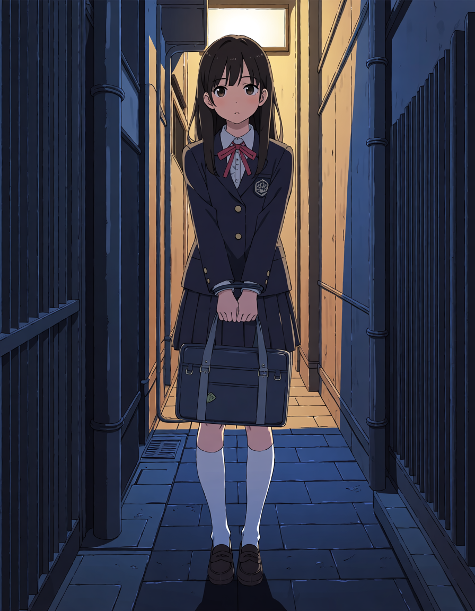

# 全模型生图效果优化：独立基线与旧管线审计

2026-09-11 用户补充授权与下一阶段计划。现已执行第一轮，见 [质量审计与修复](QUALITY_AUDIT_20260911.md)；尚未完成全部阶段，不改判历史质量失败。

## 用户明确的问题和目标

此前开发策略是先打通功能，再优化效果。现在进入效果优化阶段，所有模型管线都要测试，必要时可以重写整个生图管线。用户多次发现美学优化模型不如快速模型，怀疑 V2 本身存在问题，V3 复用后沿用了旧预设或其他隐式影响。不能将这个反馈缩减为“新旧节点不一致”，也不能用软件忠实执行旧图来证明图本身合理。

质量正确性应来自独立参考和实际成图，而非旧程序、旧默认值或复刻旧实现的测试。沿用有证据支持的组件，替换不合适的部分；不要预先决定必须保留或必须重写全部代码。

## 随 Git 保存的用户对照图

这两张为用户明确提供的质量反馈证据，原样复制，无嵌入 PNG 元数据。用户认为快速模型结果更好、美学优化结果更差；视觉上第二张人物面部、服装和冷暖照明更符合其目标。此处保留上传顺序，具体 run、权重和参数关联尚待独立核对，不能把它们伪装为已控制变量的实验。

| 用户对照图 1 | 用户对照图 2 |
| --- | --- |
|  |  |

用户描述的是反复观察到的差距，不只是单张审美偏好。两张图是复现线索，不足以单独断言根因；不能继续把问题简单推给用户提示词。

## 第一阶段：盘点实际输入和所有隐式来源

2026-09-11 用户补充：昨天受时间限制，用户亲自测试仅覆盖 Aesthetic 与 Turbo，不能将历史其他模型的自动测试或视觉复核算作用户验收。用户强调仅个别模型不需要负向提示词，其他大部分模型也需要补充。负向策略列为本阶段逐模型检查项：核验具体模型/版本作者建议、负向条件是否支持或生效、界面输入到实际负向文本节点是否完整传递，以及默认内容的来源。不得将个别模型无需负向的策略普遍化，也不得未经核验统一追加负向模板。既有问题图负向为空只描述实际输入，不证明该默认合理或已定位质量根因；后续对照应按模型适用性检查负向内容的影响。

覆盖 Base、Aesthetic 各实际版本、Turbo 各实际版本、AnimaYume、MiaoMiao，以及用户导入和当前暴露的实验/高清处理工作流。以代码目录与用户实际权重/工作流清单为准，不假定目录名字代表权重身份；未安装或不可用的项目明确标为未测。

每条模型管线建立可追踪清单：

- 实际权重版本/来源及可获得的哈希，编码器、VAE、精度、shift。
- 原始输入、LLM 输出、保存稿、提交 DTO、实际文本节点，核对所有自动追加、过滤、权重或截断。
- 模型默认值、旧 generation_preset_id、V3 recipe、工作区历史值、切换目标时应用值，以及最终采样节点的覆盖优先级。
- LoRA、注意力引导、层重放、其他模型补丁是否启用，有无不显眼的默认参数。
- 首阶段与次阶段采样、denoise、尺寸、潜空间/图像放大、VAE 解码及下载后的处理。
- 主任务和画廊再生成/放大是否走不同解析器或旧默认设置。

输出字段应包含“用户请求值、默认/预设来源、最终值、是否自动变化”。排查点包括 runtime/generation.py、core/runtime_profiles.py、core/generation_recipes.py、core/workflow_compiler.py、runtime/workflow_catalog.py，以及前端 generationSettings 和模型/目标切换逻辑。这里只列入口，不能只查这些文件就宣告排除。

## 第二阶段：独立验证，不以 V2 作为参照答案

1. 从模型作者说明与原始参考工作流确认配套资源和建议设置，记录来源、版本与节点环境；不从旧代码反推“官方默认”。
2. 每个模型先跑直接 ComfyUI 的最小参考基线，保留原始提示词、固定尺寸和明确 seed，以及实际提交图和产物。
3. 对同一模型，用相同参考输入比较当前软件管线；一次只改变一个因素。若图不同，定位新增/覆盖来源；若图一致而结果仍差，继续核验权重、节点实现与参考来源，不把一致性当质量通过。
4. 模型之间用各自适合的配方比较；不能为了看似公平，强制 Turbo 和非 Turbo 共享 CFG 或步数。基线与实验增强分开，不把额外节点当作无影响装饰。
5. 从小规模、固定场景与少量 seed 起步，覆盖人物面部/服装、光线/背景、动作保留；有明确问题再做消融，不盲目扩成大批量模型调用。

需要先处理前端大整数 seed 精度，以免人工重填 seed 的对照条件失真。相同 seed 也不承诺跨不同软硬件环境逐像素一致。

## 第三阶段：按证据调整架构与体验

- 默认呈现可靠基线，实验图显式选择并解释增强项。
- 减少旧预设/多层默认的隐式覆盖，让最终生图参数有单一明确来源。
- 对不适配的旧管线允许整体重写，保留用户数据、密钥保护、主机验证、任务幂等及恢复语义。兼容层不应绑住效果设计。
- 同步解决点击生成后 GPU 空闲的准备延迟：完整阶段计时、提前预检、健康连接与缓存复用。更详细进度不是性能优化的替代品。

## 交接边界

本次提交只记录方向、计划和两张用户证据图，没有执行重写、关闭云主机或发起新生图。完整用户数据库、凭据、安装包和其他本地原图未同步；另一台电脑需要自己的运行环境和连接配置。保持 LLM 非思考模式、读图仅作参考，不要求最强模型或零细节遗漏。
