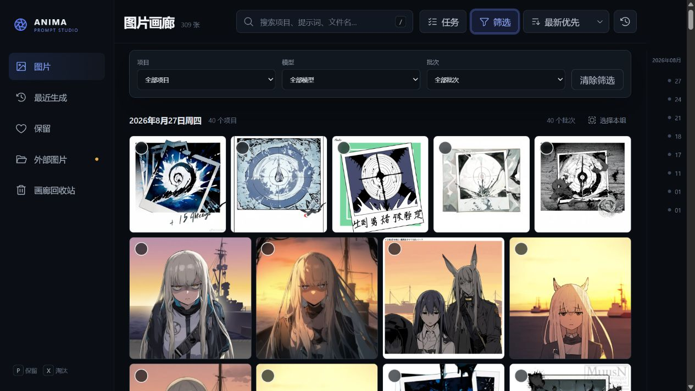
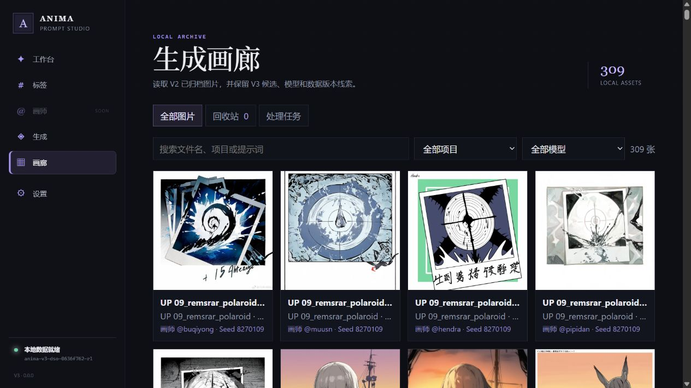
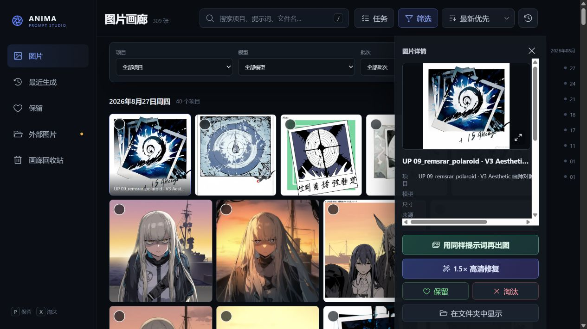
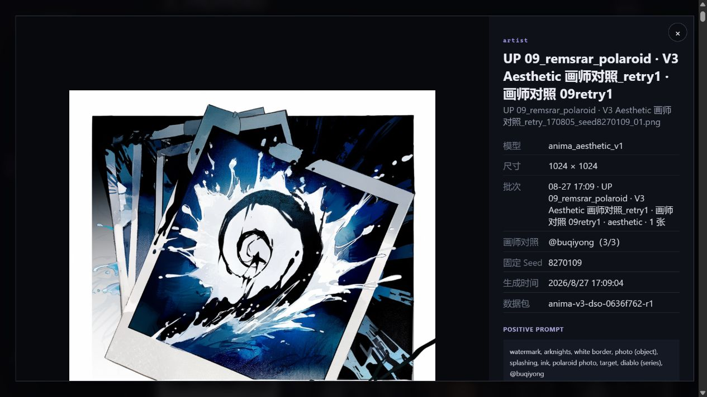

# V2 / V3 高频功能与画廊对等性审计

日期：2026-08-28  
分支：`codex/v3-development`  
基线：`c7ff4be`

## 结论

V3 不是“把 V2 同类功能完整迁移后换了一套界面”，而是保留了 V2 数据和部分服务能力，重新实现了一套更窄的前端。新提示词候选、可追溯数据包和画师对照是有效新增；但画廊、远程生成和设置中的多项日常操作没有接回，因此用户感受到的确实是功能回退。

这次审计不把已经明确放弃的旧质量增强、旧增强内容和旧结构化编译流程算作缺失。需要补的是高频操作外壳，不是恢复 V2 的旧提示词架构。

## 截图步骤

### 1. V2 画廊总览 — 健康

- 有独立的全部、最近生成、保留、外部图片、回收站视图。
- 有搜索、项目/模型/批次筛选、三种排序、日期分组、日期导航和整组选择。
- 缩略图密度高，适合横向比较大量画师结果。

### 2. V3 画廊总览 — 明显回退

- 只剩全部图片、回收站和处理任务；没有最近生成、保留、外部图片视图。
- 只保留搜索、项目和模型筛选；没有批次、排序、日期分组和批量选择。
- 卡片过大且标题严重截断，同屏比较效率比 V2 低。
- V3 已经显示画师与固定 Seed，这是有价值的新增信息，应保留。

### 3. V2 图片详情 — 健康但视觉偏挤

- 展示来源、时间、文件大小、Steps、CFG、Sampler、Scheduler、Seed。
- 有查看原图、复制提示词、同提示词再出图、放大、保留/淘汰、在文件夹中显示。
- 信息密度高但侧栏较窄，长项目名会挤压；迁移功能时不必逐像素照搬。

### 4. V3 图片详情 — 部分健康

- 增加了批次、画师对照位置、固定 Seed、数据包和 Negative Prompt，可追溯性优于 V2。
- 保留再生成、放大、保留/淘汰和可恢复回收站。
- 丢失复制提示词、查看原图、在文件夹中显示、文件大小及完整生成参数。
- 大图占据绝大部分视口，关键操作位于下方，进入详情后仍要滚动才能完成高频动作。

## 功能对等性矩阵

| 区域 | V2 | V3 当前 | 判断 |
|---|---|---|---|
| 画廊视图 | 全部、最近、保留、外部、回收站 | 全部、回收站、处理任务 | 回退 |
| 画廊检索 | 搜索、项目、模型、批次、排序、日期 | 搜索、项目、模型 | 回退 |
| 批量管理 | 选择本组、比较、再出图、放大、保留、淘汰、回收 | 单图操作 | 严重回退 |
| 图片详情 | 完整生成参数、复制、原图、定位文件 | 候选/画师/数据包线索 | 各有优点，但日常操作回退 |
| 远程生成 | 连接/识别、工作流导入、生成、取消、恢复、查看结果 | 工作台提交；生成页主要显示记录 | 操作被拆散且部分缺失 |
| 设置 | 完整连接与工作流管理 | 可编辑 SSH、确认指纹；工作流只读 | 部分回退 |
| 工作台 | 旧编译器、参数面板、直接提示词、复制/导出/历史 | 新候选、自然语言、追踪、画师对照、保存/恢复 | 新核心更好，但高级输出控制不足 |

## 代码层确认

画廊并不是需要从零重做。V3 的 V2 适配层已经返回 `batch_id`、`created_at`、`source`、`state`、`byte_size` 等字段，但 `GalleryPage.tsx` 没有把它们用于批次筛选、日期分组、来源视图或详情展示。现有状态、回收站和处理接口也都接受路径数组，前端目前却只发送单张图片。

因此以下能力主要是前端恢复，风险较低：

- 最近生成、保留、外部图片视图；
- 批次筛选、排序、日期分组和日期导航；
- 批量选择、批量保留/淘汰/回收、批量再生成/放大；
- 图片比较、复制提示词、查看原图；
- 文件大小及完整参数展示。

真正需要补少量后端桥接的是“在文件夹中显示”和回收站永久删除。V2 已有对应实现，可通过受限路径校验后复用。

远程生成也不是底层全无：V3 已能提交任务、列出任务、取消未开始队列并恢复部分远端任务；但页面没有完整连接测试/自动识别、工作流导入、活跃任务取消和结果入口。设置页明确要求继续回 V2 导入工作流，说明迁移尚未闭环。

## 推荐恢复顺序

1. **P0：先恢复 V2 画廊的成熟交互壳。** 复用 `web_gallery/src/main.jsx` 的分组、筛选、批量选择、详情和任务中心逻辑，接到 V3 API；把 V3 的画师、Seed、数据包和 Negative Prompt 加进去。不要继续维护两套功能不对等的画廊。
2. **P0：补齐图片详情高频动作。** 复制正/负提示词、查看原图、定位文件、完整生成参数；操作区固定在视口内。
3. **P1：把远程生成闭环补回 V3。** 生成记录作为次级视图，主流程补连接检测、工作流导入/选择、取消/恢复和打开结果；不要让用户回 V2 完成一半操作。
4. **P1：补工作台输出控制，而不恢复旧增强架构。** 增加可编辑/锁定最终提示词、手动 Artist/LoRA、尺寸/Steps/CFG/Sampler/Seed/Batch、复制全部参数与导出任务；保留新的候选和画师对照逻辑。
5. **不恢复：** 旧质量增强、旧增强内容、以旧结构化标签命中为主路径的编译设计。

## 可访问性与验证边界

- 从截图可见，V3 多处次要文字和禁用导航对比度较低；卡片标题依赖截断，无法只靠视觉辨认相近批次。
- V3 详情使用了带名称的模态对话框和关闭按钮，这是结构上的优点；仍需实测焦点锁定、Esc 关闭和关闭后的焦点恢复。
- V2 的高密度界面和小字号可能影响低视力用户；推荐迁移交互能力，而不是原样复制字号和拥挤布局。
- 本轮没有用屏幕阅读器、仅键盘完整走查或高对比度模式，因此不能据此宣称符合完整无障碍标准。

