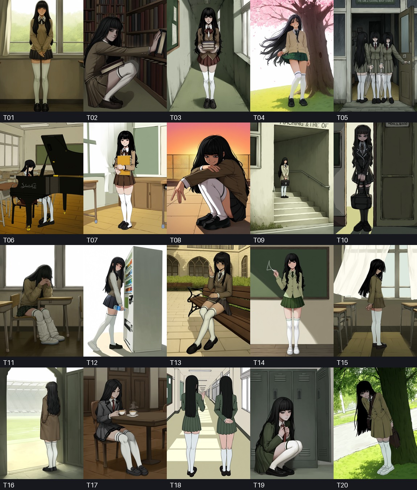
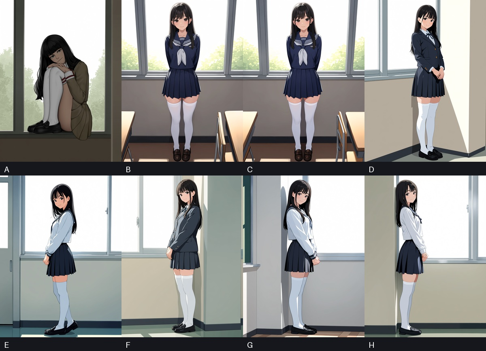

# V3 二次元插画生成质量诊断（2026-09-01）

## 结论摘要

当前“中文自然语言 → 本地翻译 → Hybrid 候选”会把正确的人物描述污染为具体角色标签、错误英译和正负向冲突。这是百张生成中大部分作品不可用的主要上游原因，不是单纯的 Seed 或用户提示词问题。

使用显式 canonical 标签和可视化的性格表达后，5 个不同 Seed 全部稳定生成了单人、黑色长发、校服、白色过膝袜、黑色乐福鞋、站立和温柔浅笑。但画面仍属于干净的通用动画立绘，尚未达到高细节“精美二次元插画”的目标。解决内容编译后，下一个瓶颈是风格锚点、构图丰富度和 Aesthetic v1.1 高清细化工作流。

> 隐私说明：本报告不包含云主机 IP、远程配置 ID、本机图片路径和数据库路径。未上传未脱敏的原始 JSON。

## 实验一：20 组中文提示词

固定条件：

- 模型：`anima_aesthetic_v1`
- 工作流：`22___Aesthetic_v1.1`
- 参数：Quality，768×1024，Seed `20260831`，batch 1
- 输入：20 组不同中文场景，人物核心要求不变
- 候选：Hybrid
- 不使用年龄词

人工严格复核：

- 合格：6/20
- 勉强可用：3/20
- 明显失败：11/20
- 温柔表情较明确：约 5/20
- T05 生成 3 人，T18 生成 2 人
- 常见失败：蜷缩、哭泣、低头、背对镜头、阴森笑容、人物过小、主体被钢琴等前景遮挡、多人复制

### 稳定复现的编译错误

| 中文证据 | 实际自动确认 | 问题 |
|---|---|---|
| 女孩 | `the_girl_(fear_&_hunger)` | 具体作品角色，非通用 `1girl` |
| 膝袜 | `kneesocks_(psg)` | character 分类的具体角色，非腿部服饰 |
| 性格温柔 | `gwen_(league)` | 跨词截取“格温”并误当角色名 |
| 白色过膝袜 | 未确认 `white_thighhighs` | `white_thighhighs` / `white_hiphighs` 同中文主名被判模糊，随后反而接受短词的错误角色标签 |
| 黑色长发 | 只稳定保留 `long_hair` | `black_hair` 0/20，发色仅靠英文 prose 碰运气 |
| 黑色袜子、短袜（排除） | 负向 `socks` | 扩大为排除所有袜子，与正向白色过膝袜冲突 |

20/20 正向候选都含有 `the girl (fear & hunger)` 和 `kneesocks (psg)`。这与画面里重复出现的阴暗、病态、恐怖感风格高度一致。

本地 Marian 翻译还出现了可直接观测的漂移：

- 乐福鞋 → `LeFoo` / `LeFoot` / `Leafle`
- 校服 → `manure uniform`
- 黑色长发与袜子、窗帘错误绑定
- “温柔顺从”没有稳定可视化为温柔眼神、浅笑和放松站姿，并在多张图里变成蜷缩、哭泣或低头

## 实验二：8 张受控 A/B

A–D 使用同一 Seed `20260901`；D–H 使用同一最终提示词、5 个不同 Seed。

| 组别 | 变量 | 结果 |
|---|---|---|
| A | 原始中文自然语言流程 | 蜷缩在窗台，眼神和笑容偏阴森，复现失败族 |
| B | 显式 canonical 标签，移除错误角色标签和坏翻译；保留负向 `socks` | 相同 Seed 立即变为单人站立、正面浅笑，服饰正确 |
| C | 在 B 基础上把 `socks` 改为 `black socks` | 与 B 近似，该冲突在此 Seed 下不是主导因素，但逻辑上仍必须消除 |
| D | 增加精美二次元插画、脸部细节、光影和构图控制 | 人物和手部干净，但背景和质感仍较简单 |
| E–H | D 的提示词，切换 4 个 Seed | 5/5 稳定命中人物、服饰、站姿和温柔表情 |

### 受控结果说明了什么

1. A → B 的巨大差异证明上游编译污染是主因。
2. B → C 说明通用 `socks` 负向不一定在每个 Seed 下造成可见失败，但它是必须由编译器拒绝的明确矛盾。
3. D–H 证明结构正确后稳定性可以显著提高，不需要靠近百次抽卡。
4. `masterpiece` / `best quality` 等词没有把 D–H 提升到高细节插画级别；画质上限需要风格和工作流层改善。
5. 本轮不使用年龄词，也没有出现显著年长化；不应用强制年龄词解决此问题。

## 代码根因入口

主要代码位于 `v3/src/anima_prompt_studio_v3/api/app.py`：

- `_local_lookup_terms`：中文子串切分可以产生跨词短语，例如“性格温柔”中的“格温”。
- `_local_index_matches` / `_local_match_kind`：直接使用参考库的中文主名和别名。
- `_confirmed_source_matches`：“唯一 primary 命中”会自动确认 character/copyright；长语模糊时，还会继续接受重叠的短语错误命中。
- `_merge_glossary_source_matches`：目前受控词典仅有人鱼等极少数条目，未覆盖人物提示的高频核心词。
- `_confirmed_translation_matches`：译文仅对直接英文命中有效；Marian 的拼写漂移会导致核心概念丢失。

## 修复要求与验收条件

### P0：阻止错误角色标签

- 普通中文自然语言不得自动确认 `character` / `copyright` 类别。
- 只有用户显式选择、输入 canonical 名或在明确“角色”交互中确认时才可进入正向提示词。
- 必须新增回归：
  - `女孩` → `1girl`，不得出现 `the_girl_(fear_&_hunger)`
  - `白色过膝袜` → `white_thighhighs`，不得出现 `kneesocks_(psg)`
  - `性格温柔` 不得出现 `gwen_(league)`

### P0：核心概念受控映射

- 至少覆盖：`单人女孩`、`黑发`、`黑色长发`、`白色过膝袜`、`乐福鞋`、`校服`、`全身`、`站立`、`看向镜头`、`浅笑`。
- `黑色长发` 必须可分解为 `black_hair + long_hair`。
- 长语如果有多个同义 canonical，应优先 general 类别、高频且与已知上下文一致的标签，不得回落到重叠短词的 character 标签。

### P0：正负向冲突审计

- `黑色袜子`、`短袜` 应分别编译为 `black_socks`、`ankle_socks`，不得扩大成 `socks`。
- 候选提交前要阻止或高亮如下冲突：正向 `white_thighhighs`，负向 `socks`。

### P1：性格语义可视化

“温柔、安静、顺从”不应仅作为一个抽象 `submissive` prose，而应转换为可视化约束：

- `light_smile`
- `looking_at_viewer`
- 放松站姿
- 双手自然交叠在身前
- 温柔眼神和含蓄浅笑
- 负向排除 `crying, sad, evil smile, closed eyes, looking away, from behind, squatting`

### P1：精美插画生成模式

- 提供可显式选择且持久化的风格方案；不得在多个画师之间随机跳转。
- 新增 Aesthetic v1.1 专用高清修复或二阶段生成：构图生成 → 1.5×/2× 放大 → 脸部/手部细化。
- 将人物约束、画面语义、风格锚点和质量/工作流分层，避免用大量 `masterpiece` 类词混成一段。

## 下一轮 6 张真实图片测试

完成 P0 后再跑，不要在当前污染链路上继续批量抽卡：

1. 同一正确提示词、同一 Seed：无画师 + 3 个显式固定风格/画师，共4 张。
2. 选出最佳风格：基础 Aesthetic v1.1 与高清细化工作流各 1 张，共2 张。
3. 验收指标：核心属性 100%，单人 100%，表情/站姿 100%，风格一致，高清版在眼睛、发丝、服装材质、背景层次上有可见提升。

## 可复用材料

- 脱敏的机器可读实验矩阵：[`cases.json`](cases.json)
- 现有真实远程探索脚本：`v3/tools/run_anime_illustration_exploration.py`
- 固定 Aesthetic v1.1 验收入口：`v3/tools/run_finish_image_smoke.py`

