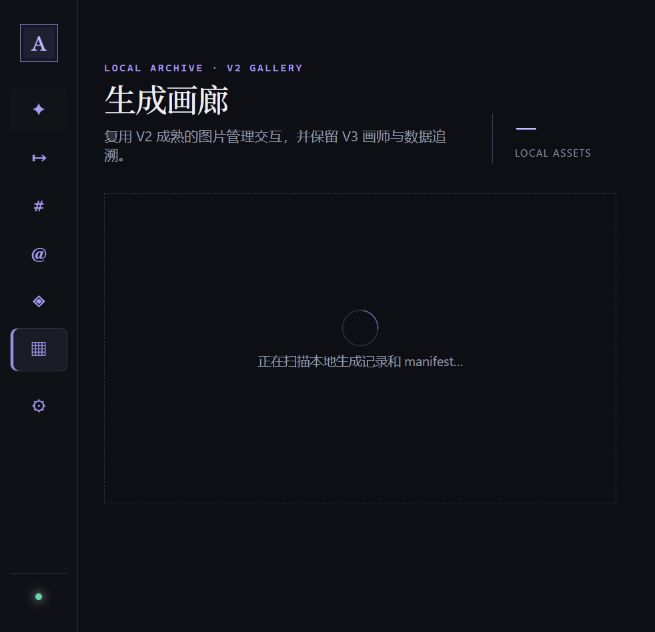
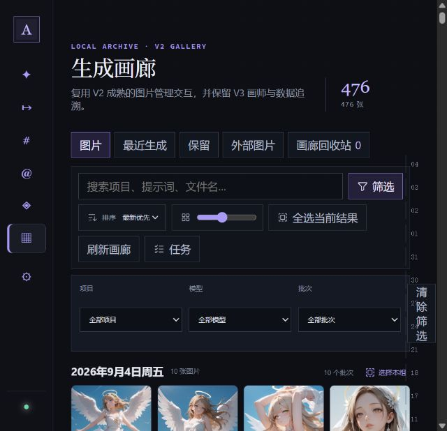
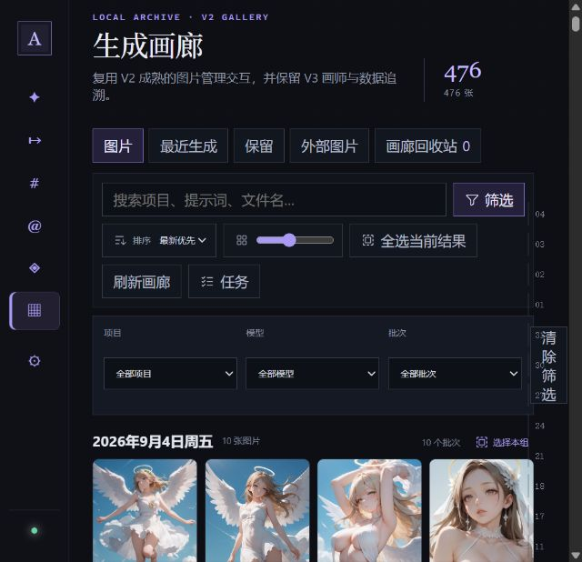
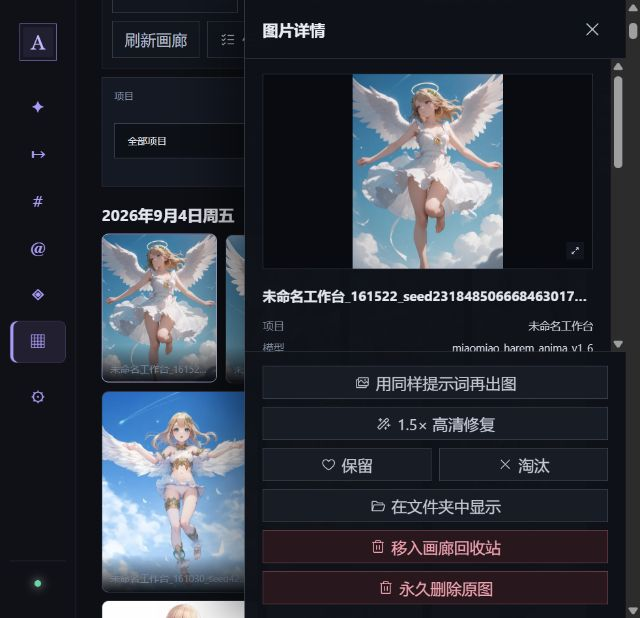

# V3 画廊体验审计与优化方案

日期：2026-09-04

范围：画廊首次进入、手动刷新、生成结果同步、操作反馈、图片详情抽屉与窄窗口适配。

## 总体判断

画廊的功能覆盖已经较完整，但当前实现把“全量索引、全量返回、全量渲染”集中在每次进入页面时执行，同时缺少统一的异步交互状态。这不是单纯的动画或提示语问题：在现有 476 张图片规模下，后端每次列表请求稳定耗时约 3.1～3.2 秒，前端又一次性创建 476 个图片节点与 494 个筛选选项，因此进入慢、刷新无感、新图不出现和详情遮挡其实是同一套页面状态架构的不同表现。

建议先完成一轮 P0 体验修复，让“进入、刷新、生成完成”形成闭环；随后把索引和列表改成增量方式，解决规模继续增长后的性能问题。

## 实施结果（同日）

本轮已完成 P0 闭环，并提前处理了部分 P1 首屏规模问题：

- 后端保存画廊快照及逐文件指纹（路径、大小、图片修改时间、所属 manifest 修改时间）；刷新时只重建发生变化的文件夹，首次升级或显式执行 rebuild 时才进行全量扫描。
- 前端使用应用级共享缓存，离开再进入画廊不丢失数据；远程生成与画廊处理任务完成后会自动刷新缓存。
- 刷新按钮和图片操作具备进行中、禁用、成功与失败反馈。
- 图片详情在宽屏使用 390px 停靠检查器；窄屏使用遮罩、焦点圈定、Esc 关闭和背景 `inert` 的真正模态层。
- 图片网格首批只渲染 80 张，接近底部时按 80 张继续加载。

在当前 497 张真实图片下，一次性索引格式升级/完整重扫为 3.321 秒，无文件变化的增量检查为 0.158 秒，重启后磁盘快照读取为 0.028 秒。实际首屏从约 3595 个 DOM 元素、477 个图片节点和 35,797px 页面高度，降至 1074 个元素、80 个图片节点和 5,522px 高度。批次筛选仍会创建 500 余个 `option`；目前操作仍可接受，因此暂不改变用户熟悉的原生下拉交互，等选项规模或实际检索成本继续增长时再评估搜索式组合框。

## 审计步骤

### 1. 首次进入画廊 — 健康度：差（P0）

- 页面会丢弃旧内容，只显示大块空白区域和“正在扫描本地生成记录和 manifest…”。用户无法先浏览上一次结果。
- 页面路由切走后组件卸载，数据只保存在 `GalleryPage` 的局部 state；再次进入时重新请求 `/api/v3/gallery/assets?limit=1000`。
- 后端每次请求都重新遍历输出目录、读取 manifest、解析图片尺寸和执行大量 Windows 路径解析。实际连续三次读取 476 张图片分别耗时 3.192 秒、3.196 秒和 3.128 秒，热请求没有明显变快。
- 性能采样中一次请求约执行 156 万次函数调用；`Path.resolve()` 被调用 6079 次，Windows `_getfinalpathname` 累计约 1.97 秒，是最明显的热点。
- 建议：应用启动空闲后预取画廊“首屏元数据”，用全局缓存保存；进入画廊先显示缓存，再在后台校验变化。后端增加持久化增量索引，避免每次全目录扫描。

### 2. 列表加载完成 — 健康度：一般（P1）

- 首屏信息层级基本清楚，图片、最近生成、保留、外部图片和回收站的入口也容易找到。
- 但前端一次性把全部 476 张图片放进 DOM；当前实测页面有 3595 个元素、477 个图片元素、494 个 `option`，总页面高度约 35,797px。图片本身用了懒加载，但卡片、日期组和筛选项仍全部创建。
- 右侧日期导航使用固定定位，在窄窗口下已经压到筛选区和画廊内容上。
- 建议：API 改成游标分页（首屏 48～60 张），日期分组按页增量合并；长列表使用窗口化渲染。批次筛选改成可搜索组合框，不要预先创建数百个选项。

### 3. 点击“刷新画廊” — 健康度：差（P0）

- 点击后按钮仍显示“刷新画廊”，没有旋转图标、禁用态、进度文字或成功结果；视觉上与点击前完全相同。
- 代码中刷新没有独立的 `refreshing` 状态，也不会告知新增了多少张、是否没有变化或刷新失败。当前内容会保留，这一点是正确方向，但没有把“后台刷新”表达出来。
- 建议统一异步按钮状态：`刷新画廊 → 正在同步… → 新增 3 张 / 已是最新`，并用 `aria-busy` 与 `aria-live="polite"` 向辅助技术播报。刷新期间保留滚动位置、筛选和选择状态。

### 4. 打开图片详情 — 健康度：差（P1）

- 详情抽屉固定在窗口右侧，宽度最大 390px；在 655px 宽的实际窗口中占据大半屏幕，只剩一列半图片可见。桌面宽屏下也会直接盖住若干列，妨碍连续挑图。
- 抽屉声明了 `aria-modal="true"`，但底层 476 张图片仍在可访问树中，焦点也仍停在被点击的图片上；这既不是可继续浏览的停靠面板，也不是行为完整的模态框。
- 推荐设计：
  - 宽屏（约 1180px 以上）使用“停靠式检查器”：画廊与 360～400px 详情栏共同参与布局，画廊自动重排，不发生遮挡；点击其他图片时只替换详情内容并保留滚动位置。
  - 中窄屏使用真正的模态详情：带遮罩、焦点移入、Esc 关闭、焦点圈定，关闭后返回原图片；移动端可用全屏页或底部面板。
  - 宽屏停靠模式不应使用 `aria-modal`，可标为命名区域；只有窄屏模态模式才使用 `role="dialog" aria-modal="true"`。

### 5. 其他操作按钮 — 健康度：偏弱（P1）

- 保留、淘汰、复制、在文件夹中显示等操作多数只有完成后的顶部通知；执行中缺少按钮级反馈，且顶部通知可能在长页面或详情抽屉后方不可见。
- 当前只有“加入队列”的确认按钮会把文案改成“正在加入…”。画廊其他按钮没有采用同一套状态规则，`busy` 还是页面级布尔值，容易导致相关按钮没有禁用或不相关按钮一起受影响。
- 建议建立共享的异步操作规范：按 `action + assetId` 记录状态，按钮立即显示按下/加载态；成功时卡片上乐观更新并显示短提示，失败时回滚并就地给出重试。破坏性操作继续确认，并为“移入回收站”提供短时撤销。

## 新图自动出现的推荐机制

1. 生成队列保存图片时发布 `gallery.changed` 事件，并携带运行 ID、图片路径和画廊 revision。
2. 画廊数据缓存订阅该事件；如果用户位于“最新优先”且接近顶部，就直接把新图插入首组。
3. 如果用户正在筛选、查看旧日期或已向下滚动，不强行跳动页面，而是在顶部显示“有 3 张新图片 · 查看”。
4. 对 ComfyUI 手动生成或外部拷入的图片，用输出目录监听器做 0.5～1 秒防抖后更新索引。
5. 页面未打开时只更新缓存和未读数量，避免加载图片字节；进入画廊时直接显示已准备好的元数据。

## 实施顺序

### P0：先修交互闭环

- 把画廊数据提升到应用级缓存，应用空闲时静默预取，并采用 stale-while-revalidate。
- 为刷新及每类异步按钮补齐独立的进行中、成功和失败反馈。
- 生成任务完成后使画廊缓存失效并增量加入新图片。
- 详情在宽屏改为停靠布局，在窄屏改为真正模态，并修复焦点与 Esc 行为。

### P1：再解决增长后的性能

- 后端增加 SQLite 画廊索引，以路径、`mtime_ns`、大小和 manifest 修改时间判断增量变化。
- API 增加游标分页、revision 与 `since` 增量查询；不再用 `limit=1000` 全量传输。
- 图片网格窗口化；批次筛选改为搜索式选择器。
- 把固定日期导航收进画廊布局，在窄屏隐藏或折叠。

## 证据边界

- 本次检查覆盖了当前本地 V3 页面、真实 476 张图片数据、首次加载、手动刷新和详情打开状态。
- 未执行会修改或删除图片的操作，因此“保留、淘汰、回收站、永久删除”等按钮的完成/错误状态结论主要来自当前界面与实现代码。
- 截图和可访问树只能指出明显的焦点与模态风险，不能等同于完整的键盘、读屏器和对比度合规测试。
