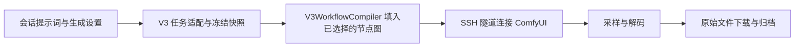

# 工作流与云连接分析

2026-09-11，用户人工测试反馈连接/工作流操作别扭、成图质量低于预期。本轮只读检查代码、用户运行时数据库和现有图片，没有新增生成、改变连接配置或修改应用行为。

## 核心结论

已确认产品层的复杂性与信息缺口；没有证据证明 V2 兼容 DTO 或 SSH 传输本身导致画质下降。应先把工作流选择、参数来源与实验节点透明化，再做同图同参对照，避免依据工作流名称重写传输管线。

## 原始图片定位

用户上传的 `codex-clipboard-a43131ff-de91-4f6e-8ab3-8029a38ac12b.png` 与 run `9c5122ba-03bd-4372-ba31-ec908521f2bc` 的下载图片 RGB 像素一致，尺寸 896×1152。

| 项目 | 实际发送值 |
| --- | --- |
| 工作流 | `22___Aesthetic_v1.1` |
| 模型 | `anima-aesthetic-v1.1.safetensors` |
| 文本编码器 | `qwen_3_06b_base.safetensors`，type=stable_diffusion |
| VAE | `qwen_image_vae.safetensors` |
| 采样 | 35 steps，CFG 4.5，euler / normal，denoise 1 |
| shift | 3 |
| seed | 8798399215689017476 |
| 提示词 | 与用户提供的原英文完全一致；负向为空 |
| 后处理 | 有效输出路径为单次采样→VAE 解码→SaveImage，无高清修复节点 |

工作流还包含一个未接入输出链的 ResolutionSelector，实际宽高直接绑定到 EmptyLatentImage；该孤立节点不解释本图效果。

run `8e262c6e-6546-4a49-8761-f60c64cd3639`（旧 22 Aesthetic）与 `cea99a34-a8fa-4a91-85b0-7ffd9842032b`（新 v3_aesthetic_v1_1）使用相同修改后提示词。从 SaveImage 递归提取上游节点，去除 UI 元数据、seed 和 filename_prefix 后，两个有效图完全一致，均为 10 个节点。它们不是“旧算法 vs 新算法”的有效比较，也未固定 seed。

## 实验工作流进入日常使用

最近七条任务均为 `26_Turbo_v1.1`，属于 catalog 中的 experimental 模板。最新 run `989963c3-aff1-4b6b-9094-7706b92a3208` 使用 Turbo v1.1、12 步、CFG 1、er_sde/simple，并且有效模型路径包含：

- AnimaNormalizedAttentionGuidance：scale 2、tau 2.5、alpha 0.5，作用区间 0～0.5。
- AnimaLayerReplayPatcher：启用 replay，block_indices 3,4,5，作用区间 0.5～1；spectrum 关闭。

这些节点改变采样所用模型行为，不能将其等同于无增强的基础 ANIMA。尚未进行消融对照，不能宣称这些节点必然使质量变差。10/12 步的最近几次任务同时使用不同随机 seed，不能隔离步数影响。

后端 generation-targets 已返回 experimental、workflow_notes、template_revision 等字段；ConversationWorkbenchPage 的执行目标下拉只展示服务器名/工作流名，未展示实验级别及额外节点。旧导入项与新基线并列，名字接近但缺少用途说明。这是明确的信息呈现缺陷。

## 实际执行架构

runtime/generation.py 保留 V2 PromptJob/GenerationParams 数据结构，但会话/直出路径没有重新走 V2 翻译或提示词编译器；正负文本直接交给 V3WorkflowCompiler。remote/execution_coordinator.py 实际使用 V3 编译器，将 actual_workflow 保存后提交。result_organizer.py 使用 write_bytes 保存下载内容，没有在这里做有损重编码或缩图。

“继承 V2”主要体现在数据类型、配置数据库、兼容服务与操作结构，不足以单独解释画质。模型文件名和节点合法性也不能证明权重真实身份或配方质量，本轮没有远端文件哈希/作者参考工作流核验。

## 云连接的交互负担

现有流程分为保存 SSH 配置、确认指纹、完整连接测试、工作流能力检测/文件映射、回到工作台选目标。设置页还保留“复用 V2 数据库”“去 V2 导入”等旧说明，已有 V3 管理能力与文案不一致。

连接测试创建自己的临时 SshTunnel；工作流能力检测另建隧道，缓存 900 秒；ManagedComfyAccess 使用本机 18188 维护隧道；每次执行任务再创建独立隧道。各自有合理职责，但没有一个面向用户的统一“当前服务器是否可生成、缺哪一步”的视图。可能产生重复握手与重复检查，本轮未测各阶段耗时，不能量化性能损失。连接问题主要影响可用性、等待和状态理解，不应直接推断它改变已成功下载图片的风格。

## 复现风险

编译器随机 seed 范围到 2^63-1，而会话界面的 seed 输入通过 JavaScript Number 处理。当前任务已有超过 2^53-1 的 seed：人工复制这些 seed 到前端再提交有整数精度丢失风险。服务端冻结快照重放与手动填写 seed 不是同一条路径，需单独修正和回归；这是可复现性问题，不是已有随机图画质差的证据。

## 建议顺序

1. 默认突出已验证基线；实验图折叠到显式高级选择，展示实验节点摘要；旧导入项标明来源，不直接删除。
2. 模型选择后给出明确的基线工作流，服务器单独选择；显示最终模型/编码器/VAE、有效采样参数及增强节点，说明切换目标会应用默认配方。
3. 修复大 seed 的精确保留，提供原始实际图与参数导出；先比同一冻结图由软件提交和直接 ComfyUI 提交，再单独比较基线/实验增强。相同 seed 不承诺跨软硬件版本逐像素相同。
4. 统一连接状态与一次“连接并检查”流程，保留首次指纹确认；测量耗时后再决定共享连接或缓存，避免先做大型重构。

建议先做第 1～3 项，它们能让用户知道实际使用的管线，并建立可信比较。不能根据当前证据承诺调整后必然更精致，也不建议再单纯靠堆提示词掩盖配置问题。
